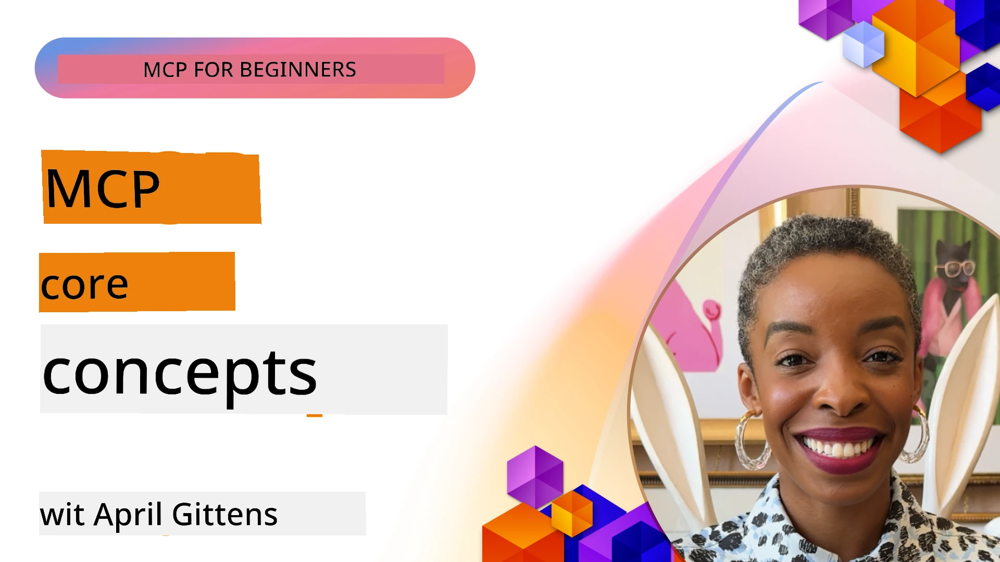
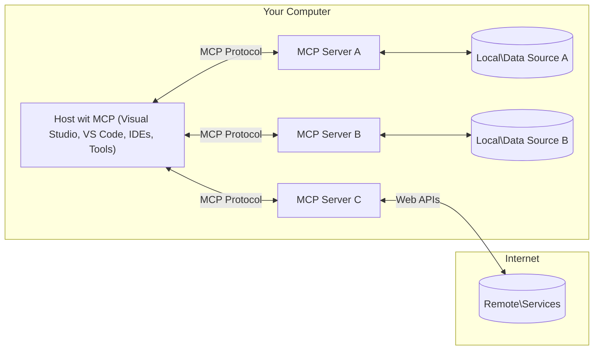

# MCP Core Concepts: Mastering di Model Context Protocol for AI Integration

[](https://youtu.be/earDzWGtE84)

_(Click di picture wey dey above to watch video for dis lesson)_

Di [Model Context Protocol (MCP)](https://github.com/modelcontextprotocol) na strong, standardized framework wey dey optimize how Large Language Models (LLMs) and outside tools, applications, and data sources dey communicate.  
Dis guide go carry you waka through di core concepts of MCP. You go learn about im client-server architecture, important components, communication mechanics, and how to implement am well.

- **Explicit User Consent**: Every data access and operation need make user clear give approval before e run. Users gats sabi well well wetin data dem go access and wetin dem go do, plus dem go get fine control over permissions and authorizations.

- **Data Privacy Protection**: User data no go show unless user gree, and dem gats protect am well with strong access controls during the whole interaction. Implementation must block anybody wey no suppose send data and keep privacy boundary tight tight.

- **Tool Execution Safety**: Any tool wey dem wan run gats get user explicit consent with clear understanding of how di tool work, parameters, and wetin e fit cause. Strong security boundary gats block tool wey no suppose run or wey fit cause wahala.

- **Transport Layer Security**: All communication channel dem gats use correct encryption and authentication methods. Remote connection gats implement secure transport protocol and proper credential management.

#### Implementation Guidelines:

- **Permission Management**: Implement fine-grained permission system wey fit allow users control which servers, tools, and resources dem fit access
- **Authentication & Authorization**: Use secure authentication methods (OAuth, API keys) with proper token management and expiration  
- **Input Validation**: Check all parameters and data inputs based on schema wey dem define to stop injection attack
- **Audit Logging**: Keep full log of all operations to fit monitor security and compliance

## Overview

Dis lesson go explore di main architecture and components wey form di Model Context Protocol (MCP) system. You go sabi di client-server architecture, important components and communication way dem dey use for MCP interactions.

## Key Learning Objectives

By di end of dis lesson, you go:

- Understand di MCP client-server architecture.
- Identify roles and responsibilities of Hosts, Clients, and Servers.
- Analyze di core features wey make MCP flexible as integration layer.
- Learn how information dey flow inside di MCP system.
- Get practical ideas with code examples for .NET, Java, Python, and JavaScript.

## MCP Architecture: A Deeper Look

Di MCP system dey based on client-server model. Dis kind structure allow AI applications dey interact with tools, databases, APIs, and contextual resources quick and well. Make we break di architecture down to the main parts.

For di core, MCP follow client-server architecture where host application fit connect to many servers:


- **MCP Hosts**: Programs like VSCode, Claude Desktop, IDEs, or AI tools wey wan access data through MCP
- **MCP Clients**: Protocol clients wey hold 1:1 connections with servers
- **MCP Servers**: Lightweight programs wey each one dey expose specific capabilities through di standardized Model Context Protocol
- **Local Data Sources**: Your computer files, databases, and services wey MCP servers fit access safely
- **Remote Services**: External systems wey dey online wey MCP servers fit connect through APIs.

Di MCP Protocol na growing standard wey dey use date-based versioning (YYYY-MM-DD format). Di current protocol version na **2025-11-25**. You fit see di latest update for di [protocol specification](https://modelcontextprotocol.io/specification/2025-11-25/)

### 1. Hosts

For Model Context Protocol (MCP), **Hosts** na AI applications wey serve as main interface wey users dey use interact with di protocol. Hosts dey coordinate and manage connection to many MCP servers by creating special MCP clients for each connection. Examples of Hosts na:

- **AI Applications**: Claude Desktop, Visual Studio Code, Claude Code  
- **Development Environments**: IDEs and code editors wey get MCP integration  
- **Custom Applications**: AI agents and tools wey dem build specially

**Hosts** na applications wey dey coordinate AI model interactions. Dem dey:

- **Orchestrate AI Models**: Dem fit run or interact with LLMs to generate response and organize AI workflows
- **Manage Client Connections**: Create and maintain one MCP client each time for every MCP server connection
- **Control User Interface**: Manage conversation flow, user interaction, and how to show response  
- **Enforce Security**: Manage permissions, security rules, and authentication
- **Handle User Consent**: Manage user approval for sharing data and running tools


### 2. Clients

**Clients** na important parts wey keep one-to-one connection between Hosts and MCP servers. MCP client na which host create to connect to particular MCP server to keep communication organized and safe. Many clients mean hosts fit connect many servers at di same time.

**Clients** na connector parts inside di host application. Dem dey:

- **Protocol Communication**: Send JSON-RPC 2.0 requests to servers with prompts and instructions
- **Capability Negotiation**: Discuss and agree on features and protocol versions with servers when dem start connection
- **Tool Execution**: Manage tool execution request from models and handle response
- **Real-time Updates**: Manage notifications and live updates from servers
- **Response Processing**: Process and format server answers to show users

### 3. Servers

**Servers** na programs wey give context, tools, and capabilities to MCP clients. Dem fit run for the same machine as di Host or from outside, and dem dey handle client requests and give structured responses. Servers dey expose specific functionality through Model Context Protocol.

**Servers** na services wey provide context and capabilities. Dem dey:

- **Feature Registration**: Register and show available primitives (resources, prompts, tools) to clients
- **Request Processing**: Receive and run tool calls, resource and prompt requests from clients  
- **Context Provision**: Give contextual info and data to make model response better
- **State Management**: Keep session state and handle stateful interaction if e need  
- **Real-time Notifications**: Send notification about capability changes and updates to connected clients

Servers fit be built by anybody to extend model capabilities with special features, and dem fit support local and remote deployment.

### 4. Server Primitives

Servers for Model Context Protocol (MCP) dey provide three main **primitives** wey define how rich interaction between clients, hosts, and language models go be. These primitives tell di kind contextual info and action wey protocol fit handle.

MCP servers fit give any combination of the three core primitives below:

#### Resources 

**Resources** na data sources wey provide context to AI applications. Dem fit be static or dynamic content wey fit make model understand and decide better:

- **Contextual Data**: Structured info and context for AI model use  
- **Knowledge Bases**: Document stores, article, manuals, and research paper  
- **Local Data Sources**: Files, databases, and local system info  
- **External Data**: API responses, web services, and remote system data  
- **Dynamic Content**: Real-time data wey dey update based on outside conditions

Resources dey identified by URIs and dem fit show through `resources/list` and access through `resources/read` methods:

```text
file://documents/project-spec.md
database://production/users/schema
api://weather/current
```

#### Prompts

**Prompts** na reusable templates wey help structure interaction with language models. Dem give standard interaction pattern and prepared workflows:

- **Template-based Interactions**: Pre-structured messages and conversation starters  
- **Workflow Templates**: Standard pattern for common tasks and interactions  
- **Few-shot Examples**: Example-based templates for model instruction  
- **System Prompts**: Basic prompts wey define model behavior and context  
- **Dynamic Templates**: Parameterized prompts wey change according to specific context

Prompts fit use variable substitution and fit show through `prompts/list` and get with `prompts/get`:

```markdown
Generate a {{task_type}} for {{product}} targeting {{audience}} with the following requirements: {{requirements}}
```

#### Tools

**Tools** na executable functions wey AI models fit call to do specific work. Dem be like "verbs" for di MCP ecosystem, wey make models fit interact with outside systems:

- **Executable Functions**: Specific operations wey models fit call with specific parameters
- **External System Integration**: API calls, database queries, file operations, calculations
- **Unique Identity**: Each tool get unique name, description, and parameter schema
- **Structured I/O**: Tools accept validated parameters and give structured, typed responses
- **Action Capabilities**: Enable models to do real-world actions and get live data

Tools dey defined with JSON Schema for parameter checking and dem fit show through `tools/list` and run with `tools/call`. Tools fit also carry **icons** as extra information for better UI look.

**Tool Annotations**: Tools support behavioral annotation (example: `readOnlyHint`, `destructiveHint`) wey talk if tool read-only or destructive, so clients fit sabi well before dem run am.

Example tool definition:

```typescript
server.tool(
  "search_products", 
  {
    query: z.string().describe("Search query for products"),
    category: z.string().optional().describe("Product category filter"),
    max_results: z.number().default(10).describe("Maximum results to return")
  }, 
  async (params) => {
    // Run di search den return di structured result dem
    return await productService.search(params);
  }
);
```

## Client Primitives

For Model Context Protocol (MCP), **clients** fit show primitives wey allow servers to request extra features from di host application. These client-side primitives make server implementation rich and interactive, and dem fit access AI model capabilities and user interaction.

### Sampling

**Sampling** dey allow servers request language model completions from client AI application. Dis primitive allow servers to use LLM capability without carrying their own model:

- **Model-Independent Access**: Servers fit request completions without carrying LLM SDK or managing model access
- **Server-Initiated AI**: Enable servers to generate content by themselves using client AI model
- **Recursive LLM Interactions**: Support complex scenario where server need help from AI to process things
- **Dynamic Content Generation**: Allow servers to create context based responses using host model
- **Tool Calling Support**: Servers fit add `tools` and `toolChoice` parameters to enable client model call tools during sampling

Sampling dey start with `sampling/complete` method, where server send completion request to clients.

### Roots

**Roots** provide standardized way for clients to show filesystem boundaries to servers, to help servers sabi which directories and files dem fit access:

- **Filesystem Boundaries**: Define limits where servers fit work for filesystem  
- **Access Control**: Help servers know which directories and files dem fit access  
- **Dynamic Updates**: Clients fit notify servers when roots change  
- **URI-Based Identification**: Roots dey use `file://` URIs to name directories and files dem fit access

Roots fit be discovered through `roots/list` method, with clients sending `notifications/roots/list_changed` when roots change.

### Elicitation  

**Elicitation** allow servers ask for extra information or confirmation from users through client interface:

- **User Input Requests**: Server fit ask for more info when e need am for tool execution
- **Confirmation Dialogs**: Ask user approval for sensitive or big action
- **Interactive Workflows**: Enable server to create step-by-step interaction with user
- **Dynamic Parameter Collection**: Collect missing or optional parameters during tool run

Elicitation requests dem dey done through `elicitation/request` method to collect user input from client interface.

**URL Mode Elicitation**: Servers fit also ask for URL-based user interaction, so that dem fit direct user go outside web pages for authentication, confirmation, or data entry.

### Logging

**Logging** allow servers send structured log message to clients for debugging, monitoring, and operational clarity:

- **Debugging Support**: Enable servers to give detailed execution logs for troubleshooting
- **Operational Monitoring**: Send status update and performance data to clients
- **Error Reporting**: Give detailed error info and diagnostic context
- **Audit Trails**: Make full log of server operations and decisions

Logging message dem dey sent to clients to give transparency for server action and help for debugging.

## Information Flow for MCP

Model Context Protocol (MCP) define structured way how information dey flow between hosts, clients, servers, and models. To understand this flow go help make clear how user request go processed and how outside tools and data dey join model response.

- **Host Initiates Connection**  
  Di host application (like IDE or chat interface) go establish connection to MCP server, usually by STDIO, WebSocket, or another supported transport.

- **Capability Negotiation**  
  Client (wey dey inside host) and server go exchange information about features, tools, resources, and protocol versions wey dem support. This one dey make sure say both sides sabi the kind capabilities wey dey available for di session.

- **User Request**  
  User go interact with host (e.g., enter prompt or command). Host go collect am then send am go client to process.

- **Resource or Tool Use**  
  - Client fit request extra context or resources from server (like files, database entries, or knowledge base articles) to help model understand better.
  - If model see say tool dey needed (for example to fetch data, do calculation, or call API), client go send tool call request to server, with tool name and parameters.

- **Server Execution**  

  Di server dey receive di resource or tool request, e dey run wetin e suppose do (like run function, check database, or find file), den e go give di results back to di client inside one structured format.

- **Response Generation**  
  Di client go join di server's responses (resource data, tool outputs, etc.) inside di model interaction wey dey go on. Di model go use dis info take create beta and context correct response.

- **Result Presentation**  
  Di host go receive di final output from di client den show am give di user, usually e go include both di model generated text and any results from tool runs or resource finds.

Dis flow dey make MCP fit support advanced, interactive, and context-aware AI applications by smoothly join models with external tools and data sources.

## Protocol Architecture & Layers

MCP get two separate architectural layers wey dey work together to provide complete communication framework:

### Data Layer

Di **Data Layer** dey run di core MCP protocol using **JSON-RPC 2.0** as im base. Dis layer dey define message structure, semantics, and interaction patterns:

#### Core Components:

- **JSON-RPC 2.0 Protocol**: All communication dey use standard JSON-RPC 2.0 message format for method calls, responses, and notifications
- **Lifecycle Management**: E dey handle connection start, capability negotiation, and session end between clients and servers
- **Server Primitives**: E dey allow servers provide core work through tools, resources, and prompts
- **Client Primitives**: E dey allow servers request sampling from LLMs, ask for user input, and send log messages
- **Real-time Notifications**: E dey support asynchronous notifications for dynamic updates without polling

#### Key Features:

- **Protocol Version Negotiation**: E dey use date-based versioning (YYYY-MM-DD) to make sure say e fit work well together
- **Capability Discovery**: Clients and servers dey share information on supported features during start up
- **Stateful Sessions**: E dey keep connection status across many interactions so context no lost

### Transport Layer

Di **Transport Layer** dey handle communication channels, message framing, and authentication between MCP participants:

#### Supported Transport Mechanisms:

1. **STDIO Transport**:
   - E dey use standard input/output streams for direct process talk
   - E best for local processes for one machine wey no network wahala
   - Dem dey usually use am for local MCP server implementations

2. **Streamable HTTP Transport**:
   - E dey use HTTP POST for client-to-server messages  
   - Optional Server-Sent Events (SSE) for server-to-client streaming
   - E make remote server communication possible across networks
   - E support standard HTTP authentication (bearer tokens, API keys, custom headers)
   - MCP recommend OAuth for secure token-based authentication

#### Transport Abstraction:

Di transport layer dey separate communication details from di data layer, e allow make same JSON-RPC 2.0 message format fit run across all transport mechanisms. Dis abstraction fit make apps fit switch between local and remote servers easily.

### Security Considerations

MCP implementations gatz follow plenty important security principles to make sure say everything safe, trustworthy, and protected for all protocol operations:

- **User Consent and Control**: Users gatz give clear consent before any data dem fit access or operations dem fit run. Dem suppose get clear control of which data dem dey share and which actions dem allow, plus simple user interfaces for dem to check and approve activities.

- **Data Privacy**: User data suppose only show if dem give explicit permission and dem gatz protect am well with right access controls. MCP implementations gatz stop unauthorized data movement and make privacy dey safe for all interactions.

- **Tool Safety**: Before tool run, users gatz explicitly agree. Dem suppose understand how each tool work well, and dem gatz put strong security limits dey to stop any wrong or unsafe tool running.

If all these security rules dey follow, MCP fit make sure say users trust, privacy, and safety dey protected for all protocol interactions while e still allow powerful AI integration.

## Code Examples: Key Components

Below na code samples for some popular programming languages wey show how to implement key MCP server components and tools.

### .NET Example: Creating a Simple MCP Server with Tools

Here na practical .NET code example to show how you fit create simple MCP server with your own tools. Dis example dey show how you fit define and register tools, handle requests, and connect server using Model Context Protocol.

```csharp
using System;
using System.Threading.Tasks;
using ModelContextProtocol.Server;
using ModelContextProtocol.Server.Transport;
using ModelContextProtocol.Server.Tools;

public class WeatherServer
{
    public static async Task Main(string[] args)
    {
        // Create an MCP server
        var server = new McpServer(
            name: "Weather MCP Server",
            version: "1.0.0"
        );
        
        // Register our custom weather tool
        server.AddTool<string, WeatherData>("weatherTool", 
            description: "Gets current weather for a location",
            execute: async (location) => {
                // Call weather API (simplified)
                var weatherData = await GetWeatherDataAsync(location);
                return weatherData;
            });
        
        // Connect the server using stdio transport
        var transport = new StdioServerTransport();
        await server.ConnectAsync(transport);
        
        Console.WriteLine("Weather MCP Server started");
        
        // Keep the server running until process is terminated
        await Task.Delay(-1);
    }
    
    private static async Task<WeatherData> GetWeatherDataAsync(string location)
    {
        // This would normally call a weather API
        // Simplified for demonstration
        await Task.Delay(100); // Simulate API call
        return new WeatherData { 
            Temperature = 72.5,
            Conditions = "Sunny",
            Location = location
        };
    }
}

public class WeatherData
{
    public double Temperature { get; set; }
    public string Conditions { get; set; }
    public string Location { get; set; }
}
```

### Java Example: MCP Server Components

Dis example dey do di same MCP server and tool registration like di .NET example above, but e dey done for Java.

```java
import io.modelcontextprotocol.server.McpServer;
import io.modelcontextprotocol.server.McpToolDefinition;
import io.modelcontextprotocol.server.transport.StdioServerTransport;
import io.modelcontextprotocol.server.tool.ToolExecutionContext;
import io.modelcontextprotocol.server.tool.ToolResponse;

public class WeatherMcpServer {
    public static void main(String[] args) throws Exception {
        // Make one MCP server
        McpServer server = McpServer.builder()
            .name("Weather MCP Server")
            .version("1.0.0")
            .build();
            
        // Register one weather tool
        server.registerTool(McpToolDefinition.builder("weatherTool")
            .description("Gets current weather for a location")
            .parameter("location", String.class)
            .execute((ToolExecutionContext ctx) -> {
                String location = ctx.getParameter("location", String.class);
                
                // Collect weather data (simple)
                WeatherData data = getWeatherData(location);
                
                // Return formatted response
                return ToolResponse.content(
                    String.format("Temperature: %.1f°F, Conditions: %s, Location: %s", 
                    data.getTemperature(), 
                    data.getConditions(), 
                    data.getLocation())
                );
            })
            .build());
        
        // Connect the server with stdio transport
        try (StdioServerTransport transport = new StdioServerTransport()) {
            server.connect(transport);
            System.out.println("Weather MCP Server started");
            // Make sure server dey run till process stop
            Thread.currentThread().join();
        }
    }
    
    private static WeatherData getWeatherData(String location) {
        // Implementation go call weather API
        // Simplified for example reasons
        return new WeatherData(72.5, "Sunny", location);
    }
}

class WeatherData {
    private double temperature;
    private String conditions;
    private String location;
    
    public WeatherData(double temperature, String conditions, String location) {
        this.temperature = temperature;
        this.conditions = conditions;
        this.location = location;
    }
    
    public double getTemperature() {
        return temperature;
    }
    
    public String getConditions() {
        return conditions;
    }
    
    public String getLocation() {
        return location;
    }
}
```

### Python Example: Building an MCP Server

Dis example dey use fastmcp, so abeg make sure say you install am first:

```python
pip install fastmcp
```
Code Sample:

```python
#!/usr/bin/env python3
import asyncio
from fastmcp import FastMCP
from fastmcp.transports.stdio import serve_stdio

# Make FastMCP server
mcp = FastMCP(
    name="Weather MCP Server",
    version="1.0.0"
)

@mcp.tool()
def get_weather(location: str) -> dict:
    """Gets current weather for a location."""
    return {
        "temperature": 72.5,
        "conditions": "Sunny",
        "location": location
    }

# Another way wey use class
class WeatherTools:
    @mcp.tool()
    def forecast(self, location: str, days: int = 1) -> dict:
        """Gets weather forecast for a location for the specified number of days."""
        return {
            "location": location,
            "forecast": [
                {"day": i+1, "temperature": 70 + i, "conditions": "Partly Cloudy"}
                for i in range(days)
            ]
        }

# Register class tools dem
weather_tools = WeatherTools()

# Start di server
if __name__ == "__main__":
    asyncio.run(serve_stdio(mcp))
```

### JavaScript Example: Creating an MCP Server

Dis example dey show how to create MCP server for JavaScript and register two weather-related tools.

```javascript
// Deh use di official Model Context Protocol SDK
import { McpServer } from "@modelcontextprotocol/sdk/server/mcp.js";
import { StdioServerTransport } from "@modelcontextprotocol/sdk/server/stdio.js";
import { z } from "zod"; // For check parameters

// Make one MCP server
const server = new McpServer({
  name: "Weather MCP Server",
  version: "1.0.0"
});

// Define one weather tool
server.tool(
  "weatherTool",
  {
    location: z.string().describe("The location to get weather for")
  },
  async ({ location }) => {
    // Normally, dis go dey call weather API
    // Simplify am for show
    const weatherData = await getWeatherData(location);
    
    return {
      content: [
        { 
          type: "text", 
          text: `Temperature: ${weatherData.temperature}°F, Conditions: ${weatherData.conditions}, Location: ${weatherData.location}` 
        }
      ]
    };
  }
);

// Define one forecast tool
server.tool(
  "forecastTool",
  {
    location: z.string(),
    days: z.number().default(3).describe("Number of days for forecast")
  },
  async ({ location, days }) => {
    // Normally, dis go dey call weather API
    // Simplify am for show
    const forecast = await getForecastData(location, days);
    
    return {
      content: [
        { 
          type: "text", 
          text: `${days}-day forecast for ${location}: ${JSON.stringify(forecast)}` 
        }
      ]
    };
  }
);

// Helper functions dem
async function getWeatherData(location) {
  // Make like say you dey call API
  return {
    temperature: 72.5,
    conditions: "Sunny",
    location: location
  };
}

async function getForecastData(location, days) {
  // Make like say you dey call API
  return Array.from({ length: days }, (_, i) => ({
    day: i + 1,
    temperature: 70 + Math.floor(Math.random() * 10),
    conditions: i % 2 === 0 ? "Sunny" : "Partly Cloudy"
  }));
}

// Join the server with stdio transport
const transport = new StdioServerTransport();
server.connect(transport).catch(console.error);

console.log("Weather MCP Server started");
```

Dis JavaScript example demontrate how to create MCP client wey go connect to server, send prompt, and process di response including any tool calls wey dem make.

## Security and Authorization

MCP get some built-in ideas and mechanisms wey dem use manage security and authorization all through di protocol:

1. **Tool Permission Control**:  
  Clients fit talk which tools di model fit use during session. Dis na to make sure say only tools wey dem allow fit dey used, so e go reduce chance of anything wrong or unsafe. Dem fit change permissions anytime dey based on user preference, company policies, or interaction context.

2. **Authentication**:  
  Servers fit require authentication before dem allow access to tools, resources, or sensitive operations. Dis fit be API keys, OAuth tokens, or other schemes. Proper authentication go make sure only trusted clients and users fit use server abilities.

3. **Validation**:  
  Parameter validation dey mandatory for all tool calls. Each tool define wetin kind type, format, and limits e parameters suppose get, and server go check requests based on dat. Dis fit stop bad or dangerous input from reach tool and maintain operation integrity.

4. **Rate Limiting**:  
  To stop misuse and make sure server resources dey used fairly, MCP servers fit set rate limits for tool calls and resource access. Rate limits fit apply per user, per session, or all over, and e help protect against denial-of-service attacks or overuse.

By joining all these methods, MCP dey provide secure foundation to join language models with external tools and data sources while e still give users and developers fine control over access and usage.

## Protocol Messages & Communication Flow

MCP communication dey use structured **JSON-RPC 2.0** messages to make interactions clear and reliable between hosts, clients, and servers. Di protocol get specific message patterns for different types of operations:

### Core Message Types:

#### **Initialization Messages**
- **`initialize` Request**: Start connection and negotiate protocol version and abilities
- **`initialize` Response**: Confirm supported features and server info  
- **`notifications/initialized`**: Show say initialization done and session ready

#### **Discovery Messages**
- **`tools/list` Request**: Find available tools from di server
- **`resources/list` Request**: Show available resources (data sources)
- **`prompts/list` Request**: Get available prompt templates

#### **Execution Messages**  
- **`tools/call` Request**: Run specific tool with parameters wey dem provide
- **`resources/read` Request**: Get content from specific resource
- **`prompts/get` Request**: Fetch prompt template with optional parameters

#### **Client-side Messages**
- **`sampling/complete` Request**: Server ask client for LLM completion
- **`elicitation/request`**: Server ask for user input through client interface
- **Logging Messages**: Server dey send structured log messages to client

#### **Notification Messages**
- **`notifications/tools/list_changed`**: Server dey tell client say tool list don change
- **`notifications/resources/list_changed`**: Server dey tell client say resource list don change  
- **`notifications/prompts/list_changed`**: Server dey tell client say prompt list don change

### Message Structure:

All MCP messages dey follow JSON-RPC 2.0 format with:
- **Request Messages**: Get `id`, `method`, and optional `params`
- **Response Messages**: Get `id` and either `result` or `error`  
- **Notification Messages**: Get `method` and optional `params` (no `id` or response expected)

Dis structured communication dey make interactions reliable, easy to trace, and extensible, supporting advanced things like real-time updates, tool chaining, and strong error handling.

### Tasks (Experimental)

**Tasks** na experimental feature wey provide durable execution wrappers wey fit hold results and track status for MCP requests:

- **Long-Running Operations**: Track expensive computations, workflow automation, and batch jobs
- **Deferred Results**: Poll to check task status and collect results when operations done
- **Status Tracking**: Follow task progress through lifecycle states wey dem define
- **Multi-Step Operations**: Support complex workflows wey span many interactions

Tasks dey wrap standard MCP requests to allow asynchronous execution patterns for operations wey no fit finish straight away.

## Key Takeaways

- **Architecture**: MCP dey use client-server architecture weh hosts dey manage multiple client connections to servers
- **Participants**: Ecosystem get hosts (AI apps), clients (protocol connectors), and servers (capability providers)
- **Transport Mechanisms**: Communication support STDIO (local) and Streamable HTTP with optional SSE (remote)
- **Core Primitives**: Servers expose tools (executable functions), resources (data sources), and prompts (templates)
- **Client Primitives**: Servers fit request sampling (LLM completions with tool calling support), elicitation (user input including URL mode), roots (filesystem boundaries), and logging from clients
- **Experimental Features**: Tasks provide durable execution wrappers for long running operations
- **Protocol Foundation**: E built on JSON-RPC 2.0 with date-based versioning (current: 2025-11-25)
- **Real-time Capabilities**: E support notifications for dynamic updates and real-time sync
- **Security First**: Explicit user consent, data privacy protection, and secure transport na core requirements

## Exercise

Design simple MCP tool wey go useful for your business area. Define:
1. Wetin you go name di tool
2. Which parameters e go accept
3. Which output e go return
4. How model fit take use dis tool solve user problems


---

## What's next

Next: [Chapter 2: Security](../02-Security/README.md)

---

<!-- CO-OP TRANSLATOR DISCLAIMER START -->
**Disclaimer**:
Dis dokument don translate by AI translation service wey dem dey call [Co-op Translator](https://github.com/Azure/co-op-translator). Even though we dey try make everything correct, abeg sabi say automated translation fit get some mistakes or errors. Di original dokument wey dem write for im own language na di main correct source. If na important information, e better make human professional translate am. We no dey responsible for any wrong understanding or wahala wey fit happen because of dis translation.
<!-- CO-OP TRANSLATOR DISCLAIMER END -->