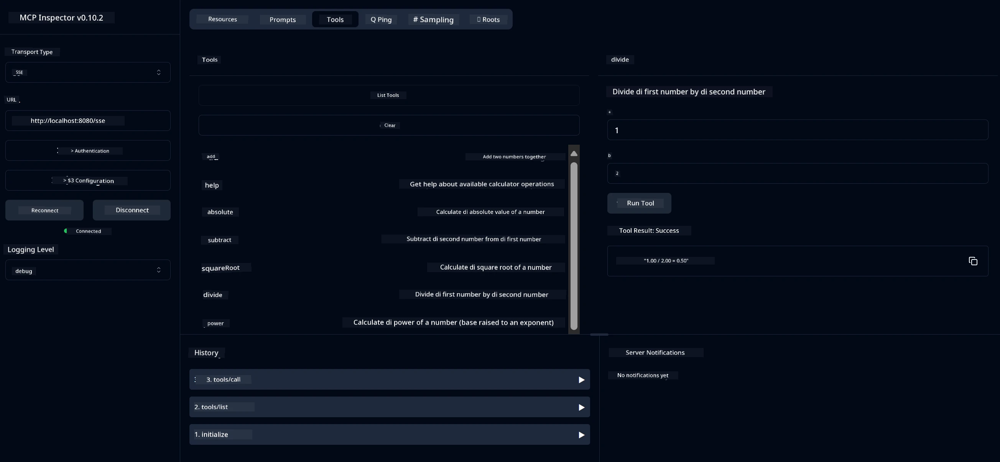

# Basic Calculator MCP Service

Dis service dey provide basic calculator operations wit Model Context Protocol (MCP) wey dey use Spring Boot wit WebFlux transport. E dey designed as simple example for people wey dey learn MCP implementations.

For more info, check [MCP Server Boot Starter](https://docs.spring.io/spring-ai/reference/api/mcp/mcp-server-boot-starter-docs.html) reference documentation.

## How to Use Dis Service

Dis service dey show dis API endpoints through MCP protocol:

- `add(a, b)`: Add two numbers together
- `subtract(a, b)`: Remove di second number from di first one
- `multiply(a, b)`: Multiply two numbers
- `divide(a, b)`: Divide di first number by di second one (wit zero check)
- `power(base, exponent)`: Calculate di power of one number
- `squareRoot(number)`: Calculate di square root (wit negative number check)
- `modulus(a, b)`: Calculate di remainder when you divide
- `absolute(number)`: Calculate di absolute value

## Dependencies

Di project need dis key dependencies:

```xml
<dependency>
    <groupId>org.springframework.ai</groupId>
    <artifactId>spring-ai-starter-mcp-server-webflux</artifactId>
</dependency>
```

## How to Build Di Project

Use Maven to build di project:
```bash
./mvnw clean install -DskipTests
```

## How to Run Di Server

### Use Java

```bash
java -jar target/calculator-server-0.0.1-SNAPSHOT.jar
```

### Use MCP Inspector

MCP Inspector na good tool to interact wit MCP services. To use am wit dis calculator service:

1. **Install and run MCP Inspector** for new terminal window:
   ```bash
   npx @modelcontextprotocol/inspector
   ```

2. **Open di web UI** by clicking di URL wey di app show (normally http://localhost:6274)

3. **Set di connection**:
   - Choose transport type as "SSE"
   - Put di URL of di server wey dey run SSE endpoint: `http://localhost:8080/sse`
   - Click "Connect"

4. **Use di tools**:
   - Click "List Tools" to see di calculator operations wey dey available
   - Choose one tool and click "Run Tool" to do di operation



---

<!-- CO-OP TRANSLATOR DISCLAIMER START -->
**Disclaimer**:  
Dis dokyument don use AI translation service [Co-op Translator](https://github.com/Azure/co-op-translator) do di translation. Even as we dey try make am correct, abeg make you sabi say machine translation fit get mistake or no dey accurate well. Di original dokyument wey dey for im native language na di main source wey you go trust. For important information, e good make professional human translation dey use. We no go fit take blame for any misunderstanding or wrong interpretation wey fit happen because you use dis translation.
<!-- CO-OP TRANSLATOR DISCLAIMER END -->