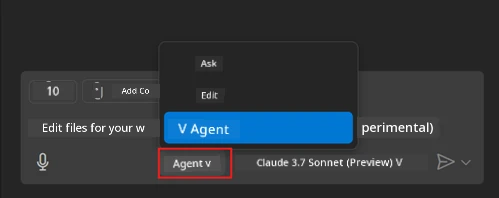
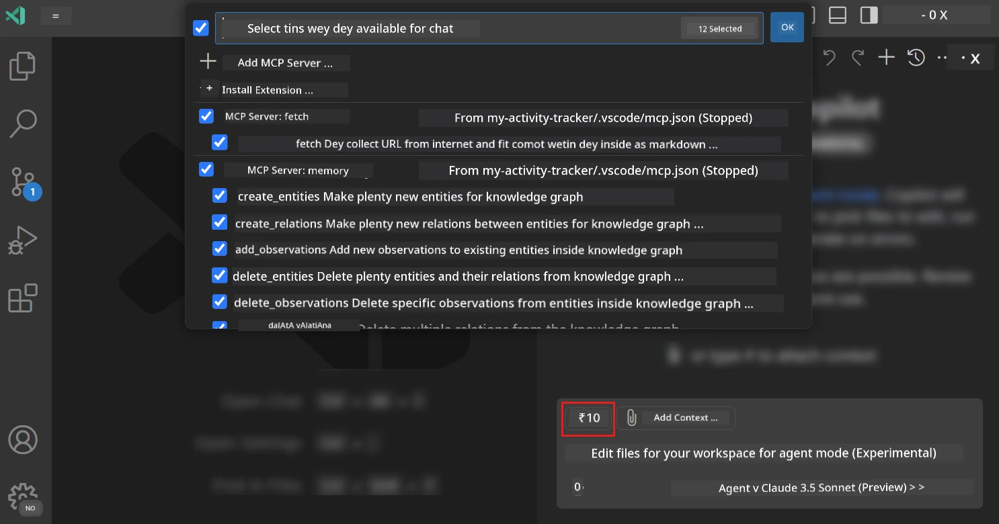
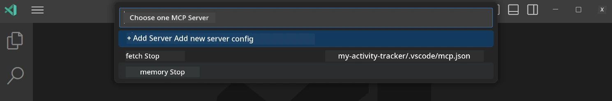
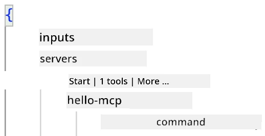
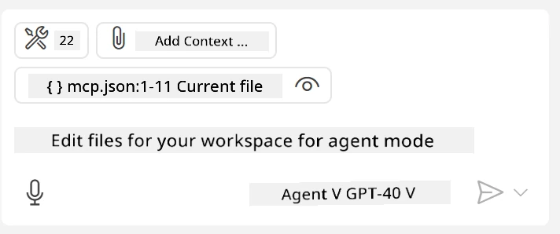
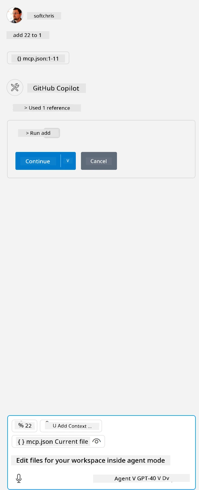

# How to use server from GitHub Copilot Agent mode

Visual Studio Code and GitHub Copilot fit act like client wey go use MCP Server. You fit dey wonder why person go wan do am abi? Well, e mean say any feature wey MCP Server get, you fit use am inside your IDE. Imagine say you add GitHub MCP server, e go allow you control GitHub with prompts instead of typing commands for terminal. Or imagine anything wey go make your developer work easy, all controlled by natural language. You don dey see the benefit abi?

## Overview

This lesson go show you how to use Visual Studio Code and GitHub Copilot Agent mode as client for your MCP Server.

## Learning Objectives

By the time you finish this lesson, you go sabi:

- Use MCP Server through Visual Studio Code.
- Run tools and other features through GitHub Copilot.
- Set up Visual Studio Code to locate and manage your MCP Server.

## Usage

You fit control your MCP server in two ways:

- User interface, we go show you how to do am later for this chapter.
- Terminal, you fit control things from terminal using `code` executable:

  To add MCP server to your user profile, use --add-mcp command line option, and provide JSON server configuration like this {\"name\":\"server-name\",\"command\":...}.

  ```
  code --add-mcp "{\"name\":\"my-server\",\"command\": \"uvx\",\"args\": [\"mcp-server-fetch\"]}"
  ```

### Screenshots





We go talk more about how to use the visual interface for the next sections.

## Approach

This na the high-level approach we go use:

- Set up file to locate MCP Server.
- Start or connect to the server to see wetin e fit do.
- Use the features through GitHub Copilot Chat interface.

Okay, now we don understand the flow, make we try use MCP Server through Visual Studio Code with exercise.

## Exercise: How to use server

For this exercise, we go set up Visual Studio Code to locate your MCP server so you fit use am through GitHub Copilot Chat interface.

### -0- Prestep, enable MCP Server discovery

You fit need to enable discovery for MCP Servers.

1. Go `File -> Preferences -> Settings` for Visual Studio Code.

1. Search "MCP" and enable `chat.mcp.discovery.enabled` for settings.json file.

### -1- Create config file

Start by creating config file for your project root, you go need file wey dem call MCP.json and put am inside folder wey dem call .vscode. E go look like this:

```text
.vscode
|-- mcp.json
```

Next, make we see how to add server entry.

### -2- Configure server

Add this content to *mcp.json*:

```json
{
    "inputs": [],
    "servers": {
       "hello-mcp": {
           "command": "node",
           "args": [
               "build/index.js"
           ]
       }
    }
}
```

The example above na simple way to start server wey dem write for Node.js. For other runtimes, make sure you use correct command to start server with `command` and `args`.

### -3- Start server

Now wey you don add entry, make we start server:

1. Find your entry for *mcp.json* and look for "play" icon:

    

1. Click "play" icon, you go see tools icon for GitHub Copilot Chat go increase the number of tools wey dey available. If you click the tools icon, you go see list of tools wey don register. You fit check/uncheck each tool if you wan GitHub Copilot use am as context:

  

1. To run tool, type prompt wey match description of one of your tools, example prompt like "add 22 to 1":

  

  You go see response wey go show 23.

## Assignment

Try add server entry to your *mcp.json* file and make sure you fit start/stop server. Make sure you fit communicate with tools for your server through GitHub Copilot Chat interface.

## Solution

[Solution](./solution/README.md)

## Key Takeaways

The main things wey you go learn for this chapter na:

- Visual Studio Code na good client wey fit use plenty MCP Servers and their tools.
- GitHub Copilot Chat interface na how you go interact with the servers.
- You fit ask user for inputs like API keys wey you fit pass to MCP Server when you dey set up server entry for *mcp.json* file.

## Samples

- [Java Calculator](../samples/java/calculator/README.md)
- [.Net Calculator](../../../../03-GettingStarted/samples/csharp)
- [JavaScript Calculator](../samples/javascript/README.md)
- [TypeScript Calculator](../samples/typescript/README.md)
- [Python Calculator](../../../../03-GettingStarted/samples/python)

## Additional Resources

- [Visual Studio docs](https://code.visualstudio.com/docs/copilot/chat/mcp-servers)

## What's Next

- Next: [How to create stdio Server](../05-stdio-server/README.md)

---

<!-- CO-OP TRANSLATOR DISCLAIMER START -->
**Disclaimer**:  
Dis dokyument don use AI translation service [Co-op Translator](https://github.com/Azure/co-op-translator) do di translation. Even as we dey try make am correct, abeg sabi say machine translation fit get mistake or no dey accurate well. Di original dokyument for im native language na di main source wey you go fit trust. For important information, e good make professional human translation dey use. We no go fit take blame for any misunderstanding or wrong interpretation wey fit happen because you use dis translation.
<!-- CO-OP TRANSLATOR DISCLAIMER END -->