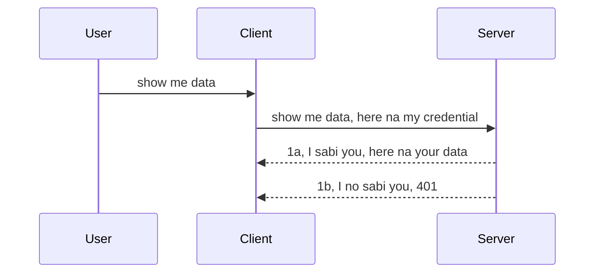

# Simple auth

MCP SDKs dey support di use of OAuth 2.1 wey to be fair na one kain serious process wey get concepts like auth server, resource server, posting credentials, getting code, exchanging di code for bearer token till you fit finally get your resource data. If you no too sabi OAuth wey beta to implement, e go good make you start with some basic level of auth and then build am up to beta beta security. Na why dis chapter dey, to build you up to more advanced auth.

## Auth, wetin we mean?

Auth mean authentication and authorization. Di idea na say we need do two tins:

- **Authentication**, na di process wey we dey find out if pesin fit enter our house, if dem get di right to dey "here" dat be say to get access to our resource server wey MCP Server features dey.
- **Authorization**, na di process wey we dey find out if user suppose get access to di tins wey dem dey ask for, for example dis orders or dis products or if dem allowed to read di content but no delete as example.

## Credentials: how we take tell system who we be

Well, most web developers dey think say to give di server credential, usually one secret wey talk if dem fit dey here "Authentication". Dis credential na usually base64 encoded version of username and password or API key wey uniquely identify di particular user. 

Dis one involve to send am through header wey dem call "Authorization" like dis:

```json
{ "Authorization": "secret123" }
```

Dis na basic authentication dem dey call am. How di whole thing dey flow be say:


Now we don understand how e dey flow, how we go take implement am? Well, most web servers get something wey dem dey call middleware, na piece of code wey dey run as part of di request wey fit check credentials, if credentials valid e fit allow di request to pass. If request no get valid credentials, you go get auth error. Make we see how we fit implement am:

**Python**

```python
class AuthMiddleware(BaseHTTPMiddleware):
    async def dispatch(self, request, call_next):

        has_header = request.headers.get("Authorization")
        if not has_header:
            print("-> Missing Authorization header!")
            return Response(status_code=401, content="Unauthorized")

        if not valid_token(has_header):
            print("-> Invalid token!")
            return Response(status_code=403, content="Forbidden")

        print("Valid token, proceeding...")
       
        response = await call_next(request)
        # add any customer headers or change for di response somehow
        return response


starlette_app.add_middleware(CustomHeaderMiddleware)
```

Here we get: 

- Middleware wey dem call `AuthMiddleware` wey di `dispatch` method dey run by di web server. 
- Added middleware to di web server:

    ```python
    starlette_app.add_middleware(AuthMiddleware)
    ```

- Write validation logic wey check if Authorization header dey and if di secret wey dem send valid:

    ```python
    has_header = request.headers.get("Authorization")
    if not has_header:
        print("-> Missing Authorization header!")
        return Response(status_code=401, content="Unauthorized")

    if not valid_token(has_header):
        print("-> Invalid token!")
        return Response(status_code=403, content="Forbidden")
    ```

    if di secret dey and e valid, we go allow di request pass by to call `call_next` and return di response.

    ```python
    response = await call_next(request)
    # add any customer headers or change for di response for any way
    return response
    ```

E dey work like this: if web request come server middleware go run and based on di implementation e go either allow di request to continue or reply error wey talk say client no get permission to continue.

**TypeScript**

Here we go create middleware with di popular framework Express and intercept di request before e reach MCP Server. Dis na di code for dat:

```typescript
function isValid(secret) {
    return secret === "secret123";
}

app.use((req, res, next) => {
    // 1. De Authorization header dey?
    if(!req.headers["Authorization"]) {
        res.status(401).send('Unauthorized');
    }
    
    let token = req.headers["Authorization"];

    // 2. Check say e valid.
    if(!isValid(token)) {
        res.status(403).send('Forbidden');
    }

   
    console.log('Middleware executed');
    // 3. Pass di request go next step for di request pipeline.
    next();
});
```

For dis code we:

1. Check if di Authorization header dey at di first place, if no dey, we send 401 error.
2. Make sure say di credential/token valid, if no, we send 403 error.
3. Finally pass di request go inside di request pipeline and return di resource wey dem ask for.

## Exercise: Implement authentication

Make we take our sabi come try implement am. Na dis be di plan:

Server

- Create web server and MCP instance.
- Implement middleware for di server.

Client 

- Send web request with credential via header.

### -1- Create web server and MCP instance

For our first step, we need create di web server instance and MCP Server.

**Python**

Here we create MCP server instance, create starlette web app and host am with uvicorn.

```python
# di MCP Server na im we dem dey create

app = FastMCP(
    name="MCP Resource Server",
    instructions="Resource Server that validates tokens via Authorization Server introspection",
    host=settings["host"],
    port=settings["port"],
    debug=True
)

# di starlette web app na im we dem dey create
starlette_app = app.streamable_http_app()

# app dey serve through uvicorn
async def run(starlette_app):
    import uvicorn
    config = uvicorn.Config(
            starlette_app,
            host=app.settings.host,
            port=app.settings.port,
            log_level=app.settings.log_level.lower(),
        )
    server = uvicorn.Server(config)
    await server.serve()

run(starlette_app)
```

For dis code we:

- Create MCP Server.
- Construct di starlette web app from MCP Server, `app.streamable_http_app()`.
- Host and serve di web app with uvicorn `server.serve()`.

**TypeScript**

Here we create MCP Server instance.

```typescript
const server = new McpServer({
      name: "example-server",
      version: "1.0.0"
    });

    // ... arrange server resources, tools, and prompts ...
```

Dis MCP Server creation go happen inside our POST /mcp route definition, so make we carry di code up go inside like dis:

```typescript
import express from "express";
import { randomUUID } from "node:crypto";
import { McpServer } from "@modelcontextprotocol/sdk/server/mcp.js";
import { StreamableHTTPServerTransport } from "@modelcontextprotocol/sdk/server/streamableHttp.js";
import { isInitializeRequest } from "@modelcontextprotocol/sdk/types.js"

const app = express();
app.use(express.json());

// Map wey store transports by session ID
const transports: { [sessionId: string]: StreamableHTTPServerTransport } = {};

// Handle POST requests for client-to-server communication
app.post('/mcp', async (req, res) => {
  // Check if session ID don dey
  const sessionId = req.headers['mcp-session-id'] as string | undefined;
  let transport: StreamableHTTPServerTransport;

  if (sessionId && transports[sessionId]) {
    // Use transport wey don dey before
    transport = transports[sessionId];
  } else if (!sessionId && isInitializeRequest(req.body)) {
    // New initialization request
    transport = new StreamableHTTPServerTransport({
      sessionIdGenerator: () => randomUUID(),
      onsessioninitialized: (sessionId) => {
        // Store the transport by session ID
        transports[sessionId] = transport;
      },
      // DNS rebinding protection no active by default for backwards compatibility. If you dey run dis server
      // for your own machine, make sure say you set:
      // enableDnsRebindingProtection: true,
      // allowedHosts: ['127.0.0.1'],
    });

    // Clean up transport when e close
    transport.onclose = () => {
      if (transport.sessionId) {
        delete transports[transport.sessionId];
      }
    };
    const server = new McpServer({
      name: "example-server",
      version: "1.0.0"
    });

    // ... arrange server resources, tools, and prompts ...

    // Connect to the MCP server
    await server.connect(transport);
  } else {
    // Invalid request
    res.status(400).json({
      jsonrpc: '2.0',
      error: {
        code: -32000,
        message: 'Bad Request: No valid session ID provided',
      },
      id: null,
    });
    return;
  }

  // Handle the request
  await transport.handleRequest(req, res, req.body);
});

// Reusable handler for GET and DELETE requests
const handleSessionRequest = async (req: express.Request, res: express.Response) => {
  const sessionId = req.headers['mcp-session-id'] as string | undefined;
  if (!sessionId || !transports[sessionId]) {
    res.status(400).send('Invalid or missing session ID');
    return;
  }
  
  const transport = transports[sessionId];
  await transport.handleRequest(req, res);
};

// Handle GET requests for server-to-client notifications via SSE
app.get('/mcp', handleSessionRequest);

// Handle DELETE requests for session termination
app.delete('/mcp', handleSessionRequest);

app.listen(3000);
```

Now you see how dem move MCP Server creation inside `app.post("/mcp")`.

Make we go next step to create middleware to fit validate di credential wey dey come.

### -2- Implement middleware for di server

Make we do middleware next. Here we go create middleware wey go look for credential for `Authorization` header and check am. If e valid then request go continue do wetin e suppose (like list tools, read resource or any MCP function wey client dey ask).

**Python**

To create middleware, we need create class wey inherit from `BaseHTTPMiddleware`. Two tins important:

- Di request `request` wey we go read header info from.
- `call_next` wey be callback we go call if client carry credential we like.

First, make we handle case if `Authorization` header no dey:

```python
has_header = request.headers.get("Authorization")

# no header dey, fail wit 401, if no be so continue.
if not has_header:
    print("-> Missing Authorization header!")
    return Response(status_code=401, content="Unauthorized")
```

Here we send 401 unauthorized message because client fail authentication.

Next, if credential show, we go check if e valid like dis:

```python
 if not valid_token(has_header):
    print("-> Invalid token!")
    return Response(status_code=403, content="Forbidden")
```

Note say we send 403 forbidden message. Make we see full middleware implementing everything we talk:

```python
class AuthMiddleware(BaseHTTPMiddleware):
    async def dispatch(self, request, call_next):

        has_header = request.headers.get("Authorization")
        if not has_header:
            print("-> Missing Authorization header!")
            return Response(status_code=401, content="Unauthorized")

        if not valid_token(has_header):
            print("-> Invalid token!")
            return Response(status_code=403, content="Forbidden")

        print("Valid token, proceeding...")
        print(f"-> Received {request.method} {request.url}")
        response = await call_next(request)
        response.headers['Custom'] = 'Example'
        return response

```

Good, but how about `valid_token` function? Here e be below:
:

```python
# NO use for production - make am beta !!
def valid_token(token: str) -> bool:
    # comot di "Bearer " prefix
    if token.startswith("Bearer "):
        token = token[7:]
        return token == "secret-token"
    return False
```

Dis one fit beta.

IMPORTANT: You no suppose ever get secrets like dis for code. You suppose get am ideally from data source or IDP (identity service provider) or better make IDP do di validation.

**TypeScript**

To do dis with Express, we need call `use` method wey carry middleware functions.

We need:

- Work with request variable to check di credential for `Authorization`.
- Validate di credential, if e valid, allow request to continue and let client MCP request do wetin e suppose (like list tools, read resource, or anything MCP related).

Here, we check if `Authorization` header dey for request, if no, we stop di request:

```typescript
if(!req.headers["authorization"]) {
    res.status(401).send('Unauthorized');
    return;
}
```

If header no come, you go get 401.

Next, we check if credential valid, if no, we stop di request with different message:

```typescript
if(!isValid(token)) {
    res.status(403).send('Forbidden');
    return;
} 
```

Note say you go get 403 error now.

Here full code:

```typescript
app.use((req, res, next) => {
    console.log('Request received:', req.method, req.url, req.headers);
    console.log('Headers:', req.headers["authorization"]);
    if(!req.headers["authorization"]) {
        res.status(401).send('Unauthorized');
        return;
    }
    
    let token = req.headers["authorization"];

    if(!isValid(token)) {
        res.status(403).send('Forbidden');
        return;
    }  

    console.log('Middleware executed');
    next();
});
```

We don setup web server to accept middleware to check credential wey client suppose dey send. How about di client?

### -3- Send web request with credential via header

We need make sure say client dey send credential for header. Since we go use MCP client, we need figure how to do am.

**Python**

For client, make we pass header with our credential like dis:

```python
# NO hardcode di value, make e dey for minimum inside environment variable or beta secure storage
token = "secret-token"

async with streamablehttp_client(
        url = f"http://localhost:{port}/mcp",
        headers = {"Authorization": f"Bearer {token}"}
    ) as (
        read_stream,
        write_stream,
        session_callback,
    ):
        async with ClientSession(
            read_stream,
            write_stream
        ) as session:
            await session.initialize()
      
            # TODO, wetin you want make e do for di client, like list tools, call tools and oda tins.
```

Note how we put `headers` like dis ` headers = {"Authorization": f"Bearer {token}"}`.

**TypeScript**

We fit do am two step:

1. Put configuration object with our credential.
2. Pass di configuration object to di transport.

```typescript

// NO hardcode the value like dis wey dem show here. At least make am be env variable and use sometin like dotenv (for dev mode).
let token = "secret123"

// define one client transport option object
let options: StreamableHTTPClientTransportOptions = {
  sessionId: sessionId,
  requestInit: {
    headers: {
      "Authorization": "secret123"
    }
  }
};

// pass the options object go the transport
async function main() {
   const transport = new StreamableHTTPClientTransport(
      new URL(serverUrl),
      options
   );
```

Here you see say we create `options` object and put headers under `requestInit` property.

IMPORTANT: How we fit beta am? Well di current way get wahala. First, to pass credential like dis high risk unless you get HTTPS for minimum. Even then, credential fit get thief so you need system where you fit revoke token quick quick and add more checks like where from for world e come, if request too frequent (bot-lik behavior), in short, plenty tins to consider.

But e good make I talk say, for very simple APIs weh you no want anybody call your API without authentication, wetin we get here good start.

With dat said, make we try make security beta small by to use standardized format like JSON Web Token, also known as JWT or "JOT" tokens.

## JSON Web Tokens, JWT

So, we dey try beta tins from sending simple credentials. Wetin immediate beta we go get from adopting JWT?

- **Security beta**. For basic auth, you dey send username and password as base64 encoded token (or send API key) many times, wey increase risk. With JWT, you send username and password and get token in return and e get expiration time. JWT let you easy to use fine-grained access control using roles, scopes and permissions.
- **Statelessness and scalability**. JWTs contain all user info and e no need store session for server side. Token fit also be validated locally.
- **Interoperability and federation**. JWT na central for Open ID Connect and e dey used with known identity providers like Entra ID, Google Identity and Auth0. E also enable single sign on and more to make am enterprise-grade.
- **Modularity and flexibility**. JWTs fit also work with API Gateways like Azure API Management, NGINX and others. E support user authentication and server-to-service communication including impersonation and delegation.
- **Performance and caching**. JWTs fit be cached after decoding to reduce parsing. Dis help especially with high-traffic apps as e improve throughput and reduce load on your infrastructure.
- **Advanced features**. E also support introspection (checking validity on server) and revocation (make token invalid).

With all dis benefits, make we see how to take our implementation next level.

## Turning basic auth into JWT

So, wetin we need high-level be say:

- **Learn how to construct JWT token** and prepare am to send from client to server.
- **Validate JWT token**, if valid let client get our resources.
- **Secure token storage**. How we store dis token.
- **Protect routes**. We need protect routes, for us that be protect routes and specific MCP features.
- **Add refresh tokens**. Create short-lived tokens but also refresh tokens wey long-lived wey fit get new tokens if the old one expire. Also add refresh endpoint and rotation strategy.

### -1- Construct JWT token

First, JWT token get parts like dis:

- **header**, algorithm and token type.
- **payload**, claims, like sub (user or entity token represent, usually userid), exp (expiration), role (role).
- **signature**, signed with secret or private key.

We go create header, payload and encoded token.

**Python**

```python

import jwt
import jwt
from jwt.exceptions import ExpiredSignatureError, InvalidTokenError
import datetime

# Secret key wey dem dey use sign the JWT
secret_key = 'your-secret-key'

header = {
    "alg": "HS256",
    "typ": "JWT"
}

# the user info plus im claims and expiry time
payload = {
    "sub": "1234567890",               # Subject (user ID)
    "name": "User Userson",                # Custom claim
    "admin": True,                     # Custom claim
    "iat": datetime.datetime.utcnow(),# Issued at
    "exp": datetime.datetime.utcnow() + datetime.timedelta(hours=1)  # Expiry
}

# encode am
encoded_jwt = jwt.encode(payload, secret_key, algorithm="HS256", headers=header)
```

For dis code we:

- Define header using HS256 algorithm and type JWT.
- Construct payload wey get subject or user id, username, role, e issue time and expiration time to implement di time bound aspect.

**TypeScript**

Here we need dependencies to help create JWT token.

Dependencies

```sh

npm install jsonwebtoken
npm install --save-dev @types/jsonwebtoken
```

Now we get everything, make we create header, payload then create encoded token.

```typescript
import jwt from 'jsonwebtoken';

const secretKey = 'your-secret-key'; // Use env vars for production

// Define di payload
const payload = {
  sub: '1234567890',
  name: 'User usersson',
  admin: true,
  iat: Math.floor(Date.now() / 1000), // Issued at
  exp: Math.floor(Date.now() / 1000) + 60 * 60 // Go spoil after 1 hour
};

// Define di header (optional, jsonwebtoken dey set defaults)
const header = {
  alg: 'HS256',
  typ: 'JWT'
};

// Create di token
const token = jwt.sign(payload, secretKey, {
  algorithm: 'HS256',
  header: header
});

console.log('JWT:', token);
```

Dis token:

Signed using HS256
Valid for 1 hour
Includes claims like sub, name, admin, iat, exp.

### -2- Validate token

We must validate token on server to make sure wetin client send valid. Plenty checks to do like validate structure and validity. You suppose add more checks to see if user dey your system and if dey get correct rights.

To validate token, decode am to read, then check validity:

**Python**

```python

# Decode an confirm di JWT
try:
    decoded = jwt.decode(token, secret_key, algorithms=["HS256"])
    print("✅ Token is valid.")
    print("Decoded claims:")
    for key, value in decoded.items():
        print(f"  {key}: {value}")
except ExpiredSignatureError:
    print("❌ Token has expired.")
except InvalidTokenError as e:
    print(f"❌ Invalid token: {e}")

```

In dis code, we call `jwt.decode` with token, secret key and algorithm as input. We use try-catch because failed validation go raise error.

**TypeScript**

Here we call `jwt.verify` to get decoded token wey we fit analyze. If dis fail, token structure wrong or e no valid again.

```typescript

try {
  const decoded = jwt.verify(token, secretKey);
  console.log('Decoded Payload:', decoded);
} catch (err) {
  console.error('Token verification failed:', err);
}
```

NOTE: as e talk before, we suppose do more checks to ensure token show user wey dey inside our system and say user get di rights e claim.


Next, make we look into role based access control, wey dem dey also call RBAC.

## Adding role based access control

The idea be say we wan talk say different roles get different permissions. For example, we assume say admin fit do anything and normal users fit do read/write and guest fit only read. So, here be some possible permission levels:

- Admin.Write 
- User.Read
- Guest.Read

Make we see how we fit implement this kind control with middleware. Middleware fit dey add for each route and also for all routes.

**Python**

```python
from starlette.middleware.base import BaseHTTPMiddleware
from starlette.responses import JSONResponse
import jwt

# NO keep di secret for di code like dis, dis na only for demonstration purposes. Read am from one safe place.
SECRET_KEY = "your-secret-key" # put dis for env variable
REQUIRED_PERMISSION = "User.Read"

class JWTPermissionMiddleware(BaseHTTPMiddleware):
    async def dispatch(self, request, call_next):
        auth_header = request.headers.get("Authorization")
        if not auth_header or not auth_header.startswith("Bearer "):
            return JSONResponse({"error": "Missing or invalid Authorization header"}, status_code=401)

        token = auth_header.split(" ")[1]
        try:
            decoded = jwt.decode(token, SECRET_KEY, algorithms=["HS256"])
        except jwt.ExpiredSignatureError:
            return JSONResponse({"error": "Token expired"}, status_code=401)
        except jwt.InvalidTokenError:
            return JSONResponse({"error": "Invalid token"}, status_code=401)

        permissions = decoded.get("permissions", [])
        if REQUIRED_PERMISSION not in permissions:
            return JSONResponse({"error": "Permission denied"}, status_code=403)

        request.state.user = decoded
        return await call_next(request)


```

E get different ways to add middleware like this below:

```python

# Alt 1: put middleware when you dey build starlette app
middleware = [
    Middleware(JWTPermissionMiddleware)
]

app = Starlette(routes=routes, middleware=middleware)

# Alt 2: put middleware after starlette app don already build
starlette_app.add_middleware(JWTPermissionMiddleware)

# Alt 3: put middleware for each route
routes = [
    Route(
        "/mcp",
        endpoint=..., # handler
        middleware=[Middleware(JWTPermissionMiddleware)]
    )
]
```

**TypeScript**

We fit use `app.use` plus a middleware wey go run for all requests.

```typescript
app.use((req, res, next) => {
    console.log('Request received:', req.method, req.url, req.headers);
    console.log('Headers:', req.headers["authorization"]);

    // 1. Check if dem don send authorization header

    if(!req.headers["authorization"]) {
        res.status(401).send('Unauthorized');
        return;
    }
    
    let token = req.headers["authorization"];

    // 2. Check if token correct
    if(!isValid(token)) {
        res.status(403).send('Forbidden');
        return;
    }  

    // 3. Check if token user dey for our system
    if(!isExistingUser(token)) {
        res.status(403).send('Forbidden');
        console.log("User does not exist");
        return;
    }
    console.log("User exists");

    // 4. Confirm say token get di correct permissions
    if(!hasScopes(token, ["User.Read"])){
        res.status(403).send('Forbidden - insufficient scopes');
    }

    console.log("User has required scopes");

    console.log('Middleware executed');
    next();
});

```

E get plenti tins we fit allow our middleware do and tins wey middleware suppose do, dem be:

1. Check if authorization header dey
2. Check if token dey valid, we dey call `isValid` wey be method we write wey go check JWT token integrity and validity.
3. Verify say user dey for our system, we suppose check this.

   ```typescript
    // pipul wey dey for DB
   const users = [
     "user1",
     "User usersson",
   ]

   function isExistingUser(token) {
     let decodedToken = verifyToken(token);

     // TODO, make sure user dey for DB or no
     return users.includes(decodedToken?.name || "");
   }
   ```

   For top, we create one simple `users` list, we suppose keep am for database.

4. Moreover, we suppose check say token get correct permissions.

   ```typescript
   if(!hasScopes(token, ["User.Read"])){
        res.status(403).send('Forbidden - insufficient scopes');
   }
   ```

   For the code wey dey middleware up there, we check say token get User.Read permission, if no get, we go send 403 error. Below na the `hasScopes` helper method.

   ```typescript
   function hasScopes(scope: string, requiredScopes: string[]) {
     let decodedToken = verifyToken(scope);
    return requiredScopes.every(scope => decodedToken?.scopes.includes(scope));
  }
   ```

Have a think which additional checks you should be doing, but these are the absolute minimum of checks you should be doing.

Using Express as a web framework is a common choice. There are helpers library when you use JWT so you can write less code.

- `express-jwt`, helper library that provides a middleware that helps decode your token.
- `express-jwt-permissions`, this provides a middleware `guard` that helps check if a certain permission is on the token.

Here's what these libraries can look like when used:

```typescript
const express = require('express');
const jwt = require('express-jwt');
const guard = require('express-jwt-permissions')();

const app = express();
const secretKey = 'your-secret-key'; // put this in env variable

// Decode JWT and attach to req.user
app.use(jwt({ secret: secretKey, algorithms: ['HS256'] }));

// Check for User.Read permission
app.use(guard.check('User.Read'));

// multiple permissions
// app.use(guard.check(['User.Read', 'Admin.Access']));

app.get('/protected', (req, res) => {
  res.json({ message: `Welcome ${req.user.name}` });
});

// Error handler
app.use((err, req, res, next) => {
  if (err.code === 'permission_denied') {
    return res.status(403).send('Forbidden');
  }
  next(err);
});

```

Now you don see how middleware fit use for both authentication and authorization, but how about MCP, e dey change how we dey do auth? Make we find out for next section.

### -3- Add RBAC to MCP

You don see so far how you fit add RBAC through middleware, but for MCP, no easy way dey to add RBAC per MCP feature, so wetin we go do? We go just add code wey go check if client get right to call specific tool:

You get some ways wey you fit do per feature RBAC, here dem be:

- Add one check for each tool, resource, prompt wey you need check permission level.

   **python**

   ```python
   @tool()
   def delete_product(id: int):
      try:
          check_permissions(role="Admin.Write", request)
      catch:
        pass # client no fit authorize, raise authorization error
   ```

   **typescript**

   ```typescript
   server.registerTool(
    "delete-product",
    {
      title: Delete a product",
      description: "Deletes a product",
      inputSchema: { id: z.number() }
    },
    async ({ id }) => {
      
      try {
        checkPermissions("Admin.Write", request);
        // todo, send id go productService and remote entry
      } catch(Exception e) {
        console.log("Authorization error, you're not allowed");  
      }

      return {
        content: [{ type: "text", text: `Deletected product with id ${id}` }]
      };
    }
   );
   ```


- Use advanced server approach and request handlers so you no go need check for plenty places.

   **Python**

   ```python
   
   tool_permission = {
      "create_product": ["User.Write", "Admin.Write"],
      "delete_product": ["Admin.Write"]
   }

   def has_permission(user_permissions, required_permissions) -> bool:
      # user_permissions: list of permissions wey di user get
      # required_permissions: list of permissions wey di tool need
      return any(perm in user_permissions for perm in required_permissions)

   @server.call_tool()
   async def handle_call_tool(
     name: str, arguments: dict[str, str] | None
   ) -> list[types.TextContent]:
    # Assume say request.user.permissions na list of permissions for di user
     user_permissions = request.user.permissions
     required_permissions = tool_permission.get(name, [])
     if not has_permission(user_permissions, required_permissions):
        # Raise error "You no get permission to call tool {name}"
        raise Exception(f"You don't have permission to call tool {name}")
     # carry on and call tool
     # ...
   ```   
   

   **TypeScript**

   ```typescript
   function hasPermission(userPermissions: string[], requiredPermissions: string[]): boolean {
       if (!Array.isArray(userPermissions) || !Array.isArray(requiredPermissions)) return false;
       // Return true if user get at least one required permission
       
       return requiredPermissions.some(perm => userPermissions.includes(perm));
   }
  
   server.setRequestHandler(CallToolRequestSchema, async (request) => {
      const { params: { name } } = request;
  
      let permissions = request.user.permissions;
  
      if (!hasPermission(permissions, toolPermissions[name])) {
         return new Error(`You don't have permission to call ${name}`);
      }
  
      // carry on..
   });
   ```

   Note, you suppose make sure say your middleware assign decoded token to request's user property so code wey dey above go easy.

### Summing up

Now we don talk how to add support for RBAC generally and for MCP especially, na now time to try implement security by yourself to make sure say you understand the concepts wey we talk.

## Assignment 1: Build an mcp server and mcp client using basic authentication

Here you go use wetin you learn about sending credentials through headers.

## Solution 1

[Solution 1](./code/basic/README.md)

## Assignment 2: Upgrade the solution from Assignment 1 to use JWT

Make you take the first solution but this time, make we improve am.

Instead of using Basic Auth, make we use JWT.

## Solution 2

[Solution 2](./solution/jwt-solution/README.md)

## Challenge

Add the RBAC per tool wey we talk for section "Add RBAC to MCP".

## Summary

You suppose don learn plenti for this chapter, from no security at all, to basic security, to JWT and how we fit add am to MCP.

We build solid foundation with custom JWTs, but as we dey scale, we dey move toward standards-based identity model. To adopt IdP like Entra or Keycloak dey make us fit offload token issuance, validation, plus lifecycle management to trusted platform — so we fit focus on app logic and user experience.

For that one, we get more [advanced chapter on Entra](../../05-AdvancedTopics/mcp-security-entra/README.md)

## What's Next

- Next: [Setting Up MCP Hosts](../12-mcp-hosts/README.md)

---

<!-- CO-OP TRANSLATOR DISCLAIMER START -->
**Notice**:
Dis document na AI translation service [Co-op Translator](https://github.com/Azure/co-op-translator) use translate am. Even though we dey try make am correct, abeg sabi say automated translation fit get some wahala or mistakes. The original document wey dem write for im own correct language na the real koko. If na serious matter, make person use professional human translation. We no go responsible if pesin no understand or get wrong meaning from this translation.
<!-- CO-OP TRANSLATOR DISCLAIMER END -->