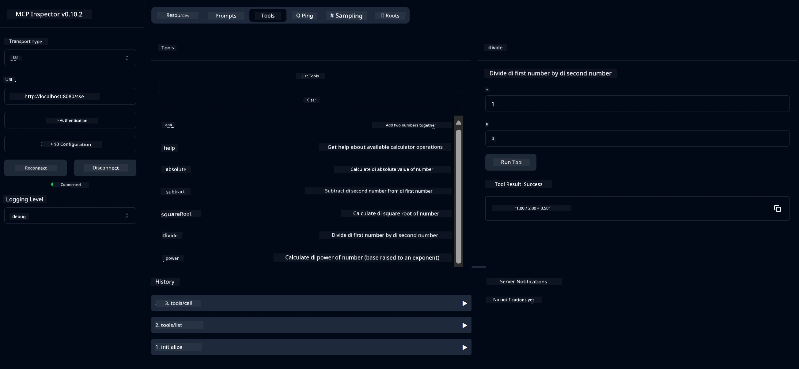

# Basic Calculator MCP Service

Dis service dey provide basic calculator operations wit Model Context Protocol (MCP) wey dey use Spring Boot wit WebFlux transport. E dey designed as simple example for beginners wey wan learn about MCP implementations.

For more info, check [MCP Server Boot Starter](https://docs.spring.io/spring-ai/reference/api/mcp/mcp-server-boot-starter-docs.html) reference documentation.

## Overview

Dis service dey show:
- Support for SSE (Server-Sent Events)
- Automatic tool registration wit Spring AI `@Tool` annotation
- Basic calculator functions:
  - Addition, subtraction, multiplication, division
  - Power calculation and square root
  - Modulus (remainder) and absolute value
  - Help function wey dey explain operations

## Features

Dis calculator service get dis kind features:

1. **Basic Arithmetic Operations**:
   - Add two numbers
   - Subtract one number from another
   - Multiply two numbers
   - Divide one number by another (wit zero division check)

2. **Advanced Operations**:
   - Power calculation (raise base to exponent)
   - Square root calculation (wit negative number check)
   - Modulus (remainder) calculation
   - Absolute value calculation

3. **Help System**:
   - Built-in help function wey dey explain all available operations

## Using the Service

Dis service dey expose dis API endpoints wit MCP protocol:

- `add(a, b)`: Add two numbers together
- `subtract(a, b)`: Subtract second number from first
- `multiply(a, b)`: Multiply two numbers
- `divide(a, b)`: Divide first number by second (wit zero check)
- `power(base, exponent)`: Calculate power of number
- `squareRoot(number)`: Calculate square root (wit negative number check)
- `modulus(a, b)`: Calculate remainder when dividing
- `absolute(number)`: Calculate absolute value
- `help()`: Get info about available operations

## Test Client

Simple test client dey inside `com.microsoft.mcp.sample.client` package. `SampleCalculatorClient` class dey show available operations for calculator service.

## Using the LangChain4j Client

Dis project get LangChain4j example client inside `com.microsoft.mcp.sample.client.LangChain4jClient` wey dey show how to connect calculator service wit LangChain4j and GitHub models:

### Prerequisites

1. **GitHub Token Setup**:
   
   To use GitHub AI models (like phi-4), you go need GitHub personal access token:

   a. Go GitHub account settings: https://github.com/settings/tokens
   
   b. Click "Generate new token" → "Generate new token (classic)"
   
   c. Give your token better name
   
   d. Select dis scopes:
      - `repo` (Full control of private repositories)
      - `read:org` (Read org and team membership, read org projects)
      - `gist` (Create gists)
      - `user:email` (Access user email addresses (read-only))
   
   e. Click "Generate token" and copy your new token
   
   f. Set am as environment variable:
      
      For Windows:
      ```
      set GITHUB_TOKEN=your-github-token
      ```
      
      For macOS/Linux:
      ```bash
      export GITHUB_TOKEN=your-github-token
      ```

   g. To make am permanent, add am to your environment variables through system settings

2. Add LangChain4j GitHub dependency to your project (e don already dey inside pom.xml):
   ```xml
   <dependency>
       <groupId>dev.langchain4j</groupId>
       <artifactId>langchain4j-github</artifactId>
       <version>${langchain4j.version}</version>
   </dependency>
   ```

3. Make sure calculator server dey run for `localhost:8080`

### Running the LangChain4j Client

Dis example dey show:
- How to connect calculator MCP server wit SSE transport
- How LangChain4j dey create chat bot wey dey use calculator operations
- How e dey connect wit GitHub AI models (now dey use phi-4 model)

The client dey send dis sample queries to show functionality:
1. Calculate sum of two numbers
2. Find square root of number
3. Get help info about available calculator operations

Run the example and check console output to see how AI model dey use calculator tools to answer queries.

### GitHub Model Configuration

LangChain4j client dey configured to use GitHub phi-4 model wit dis settings:

```java
ChatLanguageModel model = GitHubChatModel.builder()
    .apiKey(System.getenv("GITHUB_TOKEN"))
    .timeout(Duration.ofSeconds(60))
    .modelName("phi-4")
    .logRequests(true)
    .logResponses(true)
    .build();
```

To use different GitHub models, just change `modelName` parameter to another supported model (e.g., "claude-3-haiku-20240307", "llama-3-70b-8192", etc.).

## Dependencies

Dis project need dis key dependencies:

```xml
<!-- For MCP Server -->
<dependency>
    <groupId>org.springframework.ai</groupId>
    <artifactId>spring-ai-starter-mcp-server-webflux</artifactId>
</dependency>

<!-- For LangChain4j integration -->
<dependency>
    <groupId>dev.langchain4j</groupId>
    <artifactId>langchain4j-mcp</artifactId>
    <version>${langchain4j.version}</version>
</dependency>

<!-- For GitHub models support -->
<dependency>
    <groupId>dev.langchain4j</groupId>
    <artifactId>langchain4j-github</artifactId>
    <version>${langchain4j.version}</version>
</dependency>
```

## Building the Project

Build the project wit Maven:
```bash
./mvnw clean install -DskipTests
```

## Running the Server

### Using Java

```bash
java -jar target/calculator-server-0.0.1-SNAPSHOT.jar
```

### Using MCP Inspector

MCP Inspector na helpful tool to interact wit MCP services. To use am wit dis calculator service:

1. **Install and run MCP Inspector** for new terminal window:
   ```bash
   npx @modelcontextprotocol/inspector
   ```

2. **Access web UI** by clicking URL wey app show (normally http://localhost:6274)

3. **Configure connection**:
   - Set transport type to "SSE"
   - Set URL to your running server SSE endpoint: `http://localhost:8080/sse`
   - Click "Connect"

4. **Use tools**:
   - Click "List Tools" to see available calculator operations
   - Select tool and click "Run Tool" to do operation



### Using Docker

Dis project get Dockerfile for containerized deployment:

1. **Build Docker image**:
   ```bash
   docker build -t calculator-mcp-service .
   ```

2. **Run Docker container**:
   ```bash
   docker run -p 8080:8080 calculator-mcp-service
   ```

Dis go:
- Build multi-stage Docker image wit Maven 3.9.9 and Eclipse Temurin 24 JDK
- Create optimized container image
- Expose service for port 8080
- Start MCP calculator service inside container

You fit access service for `http://localhost:8080` once container dey run.

## Troubleshooting

### Common Issues wit GitHub Token

1. **Token Permission Issues**: If you see 403 Forbidden error, check say your token get correct permissions as e dey outlined for prerequisites.

2. **Token Not Found**: If you see "No API key found" error, make sure say GITHUB_TOKEN environment variable dey set well.

3. **Rate Limiting**: GitHub API get rate limits. If you see rate limit error (status code 429), wait small before you try again.

4. **Token Expiration**: GitHub tokens fit expire. If you see authentication errors after some time, generate new token and update your environment variable.

If you need more help, check [LangChain4j documentation](https://github.com/langchain4j/langchain4j) or [GitHub API documentation](https://docs.github.com/en/rest).

---

<!-- CO-OP TRANSLATOR DISCLAIMER START -->
**Disclaimer**:  
Dis dokyument don use AI transle-shon service [Co-op Translator](https://github.com/Azure/co-op-translator) do di transle-shon. Even as we dey try make am accurate, abeg make you sabi say transle-shon wey machine do fit get mistake or no correct well. Di original dokyument for di language wey dem take write am first na di one wey you go take as di correct source. For any important mata, e good make you use professional human transle-shon. We no go fit take blame for any misunderstanding or wrong interpretation wey fit happen because you use dis transle-shon.
<!-- CO-OP TRANSLATOR DISCLAIMER END -->