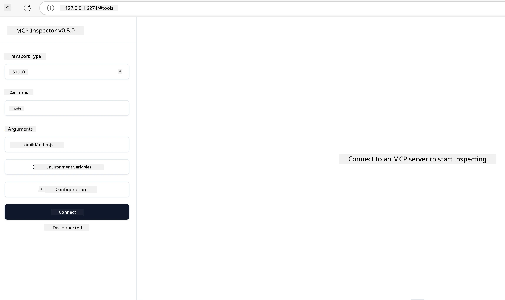

# Practical Implementation

[](https://youtu.be/vCN9-mKBDfQ)

_(Click di image wey dey above make you see video for this lesson)_

Practical implementation na di place wey di power wey Model Context Protocol (MCP) get, dey clear. Even though understanding di theory and architecture wey dey behind MCP important, di real value dey show when you use dis concepts take build, test, and deploy solutions wey fit solve real-world wahala dem. Dis chapter dey join di gap between conceptual knowledge and actual development, e dey guide you how to bring MCP-based applications to life.

Whether you dey develop intelligent assistants, dey join AI inside business workflows, or dey build your own tools for data processing, MCP dey provide flexible foundation. E language-agnostic design and official SDKs for popular programming languages make am easy for plenty developers to use. If you use these SDKs, you fit quickly prototype, try am, and scale your solutions for different platforms and environments.

For the next sections, you go see practical examples, sample code, and deployment strategies wey go show how to implement MCP for C#, Java with Spring, TypeScript, JavaScript, and Python. You go also learn how to debug and test your MCP servers, manage APIs, and deploy solutions go cloud using Azure. These hands-on resources dem design to quicken your learning and help you build strong, production-ready MCP applications with confidence.

## Overview

This lesson dey focus on practical aspects of MCP implementation across many programming languages. We go explore how to use MCP SDKs for C#, Java with Spring, TypeScript, JavaScript, and Python to build strong applications, debug and test MCP servers, and create reusable resources, prompts, and tools.

## Learning Objectives

By the time you finish dis lesson, you go fit:

- Implement MCP solutions using official SDKs for different programming languages
- Debug and test MCP servers in systematic way
- Create and use server features (Resources, Prompts, and Tools)
- Design effective MCP workflows for complex tasks
- Optimize MCP implementations for better performance and reliability

## Official SDK Resources

Model Context Protocol get official SDKs for different languages (wey align with [MCP Specification 2025-11-25](https://spec.modelcontextprotocol.io/specification/2025-11-25/)):

- [C# SDK](https://github.com/modelcontextprotocol/csharp-sdk)
- [Java with Spring SDK](https://github.com/modelcontextprotocol/java-sdk) **Note:** e require dependency on [Project Reactor](https://projectreactor.io). (See [discussion issue 246](https://github.com/orgs/modelcontextprotocol/discussions/246).)
- [TypeScript SDK](https://github.com/modelcontextprotocol/typescript-sdk)
- [Python SDK](https://github.com/modelcontextprotocol/python-sdk)
- [Kotlin SDK](https://github.com/modelcontextprotocol/kotlin-sdk)
- [Go SDK](https://github.com/modelcontextprotocol/go-sdk)

## Working with MCP SDKs

This section dey show practical examples of how to implement MCP for different programming languages. You fit find sample code frontin di `samples` directory wey dem arrange according to language.

### Available Samples

The repository get [sample implementations](../../../04-PracticalImplementation/samples) for these languages:

- [C#](./samples/csharp/README.md)
- [Java with Spring](./samples/java/containerapp/README.md)
- [TypeScript](./samples/typescript/README.md)
- [JavaScript](./samples/javascript/README.md)
- [Python](./samples/python/README.md)

Each sample dey show main MCP concepts and implementation patterns wey dey important for that particular language and ecosystem.

### Practical Guides

Extra guides for practical MCP implementation:

- [Pagination and Large Result Sets](./pagination/README.md) - How to handle cursor-based pagination for tools, resources, and big datasets

## Core Server Features

MCP servers fit implement any combination of these features:

### Resources

Resources dey provide context and data for user or AI model to use:

- Document repositories
- Knowledge bases
- Structured data sources
- File systems

### Prompts

Prompts na messages and workflows wey use template for users:

- Pre-defined conversation templates
- Guided interaction patterns
- Specialized dialogue structures

### Tools

Tools na functions wey AI model fit run:

- Data processing utilities
- External API integrations
- Computational capabilities
- Search functionality

## Sample Implementations: C# Implementation

The official C# SDK repository get plenty sample implementations wey dey show different parts of MCP:

- **Basic MCP Client**: Simple example wey show how to create MCP client and call tools
- **Basic MCP Server**: Minimal server implementation with basic tool registration
- **Advanced MCP Server**: Full-featured server wey get tool registration, authentication, and error handling
- **ASP.NET Integration**: Examples wey show integration with ASP.NET Core
- **Tool Implementation Patterns**: Different patterns for implementing tools with different levels of complexity

The MCP C# SDK dey preview and APIs fit change. We go dey update this blog as SDK dey evolve.

### Key Features

- [C# MCP Nuget ModelContextProtocol](https://www.nuget.org/packages/ModelContextProtocol)
- Building your [first MCP Server](https://devblogs.microsoft.com/dotnet/build-a-model-context-protocol-mcp-server-in-csharp/).

For complete C# implementation samples, visit di [official C# SDK samples repository](https://github.com/modelcontextprotocol/csharp-sdk)

## Sample implementation: Java with Spring Implementation

The Java with Spring SDK dey offer strong MCP implementation options with enterprise-grade features.

### Key Features

- Spring Framework integration
- Strong type safety
- Reactive programming support
- Full error handling

For a complete Java with Spring implementation sample, check [Java with Spring sample](samples/java/containerapp/README.md) inside the samples directory.

## Sample implementation: JavaScript Implementation

The JavaScript SDK dey provide lightweight and flexible way to do MCP implementation.

### Key Features

- Node.js and browser support
- Promise-based API
- Easy integration with Express and other frameworks
- WebSocket support for streaming

For full JavaScript implementation sample, see [JavaScript sample](samples/javascript/README.md) in the samples directory.

## Sample implementation: Python Implementation

The Python SDK provide Pythonic approach to MCP implementation with beta ML framework integrations.

### Key Features

- Async/await support with asyncio
- FastAPI integration``
- Simple tool registration
- Native integration with popular ML libraries

For full Python implementation sample, see [Python sample](samples/python/README.md) in the samples directory.

## API management

Azure API Management na correct answer to how we fit secure MCP Servers. Di idea na to put Azure API Management instance front di MCP Server and make e handle features wey you likely go want like:

- rate limiting
- token management
- monitoring
- load balancing
- security

### Azure Sample

Here get Azure Sample wey dey do exactly dat, i.e [creating MCP Server and securing am with Azure API Management](https://github.com/Azure-Samples/remote-mcp-apim-functions-python).

See how di authorization flow dey happen for di image below:


For di image wey dey above, dis na wetin dey happen:

- Authentication/Authorization dey happen using Microsoft Entra.
- Azure API Management dey serve as gateway and e dey use policies to direct and manage traffic.
- Azure Monitor dey log all requests for further analysis.

#### Authorization flow

Make we look di authorization flow well well:


#### MCP authorization specification

Learn more about di [MCP Authorization specification](https://spec.modelcontextprotocol.io/specification/2025-11-25/basic/authorization/)

## Deploy Remote MCP Server to Azure

Make we see if we fit deploy the sample we mention before:

1. Clone di repo

    ```bash
    git clone https://github.com/Azure-Samples/remote-mcp-apim-functions-python.git
    cd remote-mcp-apim-functions-python
    ```

1. Register `Microsoft.App` resource provider.

   - If you dey use Azure CLI, run `az provider register --namespace Microsoft.App --wait`.
   - If you dey use Azure PowerShell, run `Register-AzResourceProvider -ProviderNamespace Microsoft.App`. Then run `(Get-AzResourceProvider -ProviderNamespace Microsoft.App).RegistrationState` after some time to check if registration done finish.

1. Run dis [azd](https://aka.ms/azd) command to provision the api management service, function app(with code) and all other required Azure resources

    ```shell
    azd up
    ```

    Dis commands go deploy all the cloud resources for Azure

### Testing your server with MCP Inspector

1. For **new terminal window**, install and run MCP Inspector

    ```shell
    npx @modelcontextprotocol/inspector
    ```

    You go see interface like this one:

    

1. CTRL click to load the MCP Inspector web app from di URL wey di app show (e.g. [http://127.0.0.1:6274/#resources](http://127.0.0.1:6274/#resources))
1. Set di transport type to `SSE`
1. Set di URL to your running API Management SSE endpoint wey show after you run `azd up` and **Connect**:

    ```shell
    https://<apim-servicename-from-azd-output>.azure-api.net/mcp/sse
    ```

1. **List Tools**.  Click any tool and **Run Tool**.

If all dis steps work, you go connect to di MCP server and you don fit call tool already.

## MCP servers for Azure

[Remote-mcp-functions](https://github.com/Azure-Samples/remote-mcp-functions-dotnet): Dis set of repositories na quickstart template for building and deploying custom remote MCP (Model Context Protocol) servers using Azure Functions with Python, C# .NET or Node/TypeScript.

The Samples provide complete solution wey allow developers to:

- Build and run locally: Develop and debug MCP server for local machine
- Deploy to Azure: Easy deploy to cloud with simple azd up command
- Connect from clients: Connect MCP server from different clients including VS Code Copilot agent mode and MCP Inspector tool

### Key Features

- Security by design: MCP server dey secure using keys and HTTPS
- Authentication options: Supports OAuth using built-in auth and/or API Management
- Network isolation: Allow network isolation using Azure Virtual Networks (VNET)
- Serverless architecture: Use Azure Functions for scalable, event-driven execution
- Local development: Full local development and debugging support
- Simple deployment: Straightforward deployment process go Azure

The repo get all necessary configuration files, source code, and infrastructure definitions to quickly start with production-ready MCP server implementation.

- [Azure Remote MCP Functions Python](https://github.com/Azure-Samples/remote-mcp-functions-python) - Sample implementation of MCP using Azure Functions with Python

- [Azure Remote MCP Functions .NET](https://github.com/Azure-Samples/remote-mcp-functions-dotnet) - Sample implementation of MCP using Azure Functions with C# .NET

- [Azure Remote MCP Functions Node/Typescript](https://github.com/Azure-Samples/remote-mcp-functions-typescript) - Sample implementation of MCP using Azure Functions with Node/TypeScript.

## Key Takeaways

- MCP SDKs provide language-specific tools for implementing strong MCP solutions
- Debugging and testing process dey important for reliable MCP applications
- Reusable prompt templates allow consistent AI interactions
- Well-designed workflows fit handle complex tasks with multiple tools
- To implement MCP solutions well, you gats consider security, performance, and error handling

## Exercise

Design one practical MCP workflow wey go solve real-world problem for your area:

1. Identify 3-4 tools wey go useful for solving this problem
2. Create workflow diagram to show how these tools go interact
3. Implement basic version of one of di tools using your preferred language
4. Create prompt template wey go help model use your tool well well

## Additional Resources

---

## What's Next

Next: [Advanced Topics](../05-AdvancedTopics/README.md)

---

<!-- CO-OP TRANSLATOR DISCLAIMER START -->
**Disclaimer**:
Dis document don translate wit AI translation service wey dem dey call [Co-op Translator](https://github.com/Azure/co-op-translator). Even though we try make am correct, abeg sabi say automatic translation fit get mistakes or no too correct. Di original document wey e dey for im oga language na di correct one. If na serious tin, better make person wey sabi human translation do am. We no go take responsabiliti for any wrong understanding or wrong meaning wey fit happen because you use dis translation.
<!-- CO-OP TRANSLATOR DISCLAIMER END -->