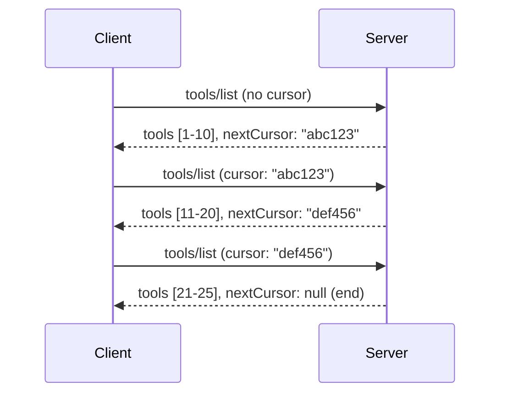

# Pagination and Large Result Sets for MCP

When your MCP server dey handle big big data sets - whether na to list thousands files, database records, or search results - you need pagination to manage memory well well and give beta user experience. Dis guide go show how you fit implement and use pagination for MCP.

## Why Pagination Dey Important

Without pagination, big responses fit cause:

- **Memory finish** - Loading millions records for one time
- **Slow response time** - Users dey wait as data dey load
- **Timeout errors** - Requests pass timeout limit
- **Bad AI performance** - LLMs no fit handle plenty context

MCP dey use **cursor-based pagination** to make sure say paging through results set dey sure and steady.

---

## How MCP Pagination Dey Work

### The Cursor Idea

**Cursor** na opaque string wey mark where you dey inside result set. E be like bookmark for long book.


### Pagination for MCP Methods

These MCP methods dey support pagination:

| Method | Returns | Cursor Support |
|--------|---------|----------------|
| `tools/list` | Tool definitions | ✅ |
| `resources/list` | Resource definitions | ✅ |
| `prompts/list` | Prompt definitions | ✅ |
| `resources/templates/list` | Resource templates | ✅ |

---

## Server Implementation

### Python (FastMCP)

```python
from mcp.server import Server
from mcp.types import Tool, ListToolsResult
import math

app = Server("paginated-server")

# Simulated big set of data
ALL_TOOLS = [
    Tool(name=f"tool_{i}", description=f"Tool number {i}", inputSchema={})
    for i in range(100)
]

PAGE_SIZE = 10

@app.list_tools()
async def list_tools(cursor: str | None = None) -> ListToolsResult:
    """List tools with pagination support."""
    
    # Decode cursor make e show where e go start
    start_index = 0
    if cursor:
        try:
            start_index = int(cursor)
        except ValueError:
            start_index = 0
    
    # Collect page of results
    end_index = min(start_index + PAGE_SIZE, len(ALL_TOOLS))
    page_tools = ALL_TOOLS[start_index:end_index]
    
    # Calculate next cursor position
    next_cursor = None
    if end_index < len(ALL_TOOLS):
        next_cursor = str(end_index)
    
    return ListToolsResult(
        tools=page_tools,
        nextCursor=next_cursor
    )
```

### TypeScript

```typescript
import { Server } from "@modelcontextprotocol/sdk/server/index.js";
import { ListToolsResultSchema } from "@modelcontextprotocol/sdk/types.js";

const server = new Server({
  name: "paginated-server",
  version: "1.0.0"
});

// Simuleit plenty data
const ALL_TOOLS = Array.from({ length: 100 }, (_, i) => ({
  name: `tool_${i}`,
  description: `Tool number ${i}`,
  inputSchema: { type: "object", properties: {} }
}));

const PAGE_SIZE = 10;

server.setRequestHandler(ListToolsResultSchema, async (request) => {
  // Decode di cursor
  let startIndex = 0;
  if (request.params?.cursor) {
    startIndex = parseInt(request.params.cursor, 10) || 0;
  }
  
  // Make dem show page of results
  const endIndex = Math.min(startIndex + PAGE_SIZE, ALL_TOOLS.length);
  const pageTools = ALL_TOOLS.slice(startIndex, endIndex);
  
  // Calculate di next cursor
  const nextCursor = endIndex < ALL_TOOLS.length ? String(endIndex) : undefined;
  
  return {
    tools: pageTools,
    nextCursor
  };
});
```

### Java (Spring MCP)

```java
@Service
public class PaginatedToolService {
    
    private static final int PAGE_SIZE = 10;
    private final List<Tool> allTools;
    
    public PaginatedToolService() {
        // Start big dataset
        this.allTools = IntStream.range(0, 100)
            .mapToObj(i -> new Tool("tool_" + i, "Tool number " + i, Map.of()))
            .collect(Collectors.toList());
    }
    
    @McpMethod("tools/list")
    public ListToolsResult listTools(@Param("cursor") String cursor) {
        // Decode di cursor
        int startIndex = 0;
        if (cursor != null && !cursor.isEmpty()) {
            try {
                startIndex = Integer.parseInt(cursor);
            } catch (NumberFormatException e) {
                startIndex = 0;
            }
        }
        
        // Fetch page of results
        int endIndex = Math.min(startIndex + PAGE_SIZE, allTools.size());
        List<Tool> pageTools = allTools.subList(startIndex, endIndex);
        
        // Calculate di next cursor
        String nextCursor = endIndex < allTools.size() ? String.valueOf(endIndex) : null;
        
        return new ListToolsResult(pageTools, nextCursor);
    }
}
```

---

## Client Implementation

### Python Client

```python
from mcp import ClientSession

async def get_all_tools(session: ClientSession) -> list:
    """Fetch all tools using pagination."""
    all_tools = []
    cursor = None
    
    while True:
        result = await session.list_tools(cursor=cursor)
        all_tools.extend(result.tools)
        
        if result.nextCursor is None:
            break
        cursor = result.nextCursor
    
    return all_tools

# How to take am use
async with client_session as session:
    tools = await get_all_tools(session)
    print(f"Found {len(tools)} tools")
```

### TypeScript Client

```typescript
import { Client } from "@modelcontextprotocol/sdk/client/index.js";

async function getAllTools(client: Client): Promise<Tool[]> {
  const allTools: Tool[] = [];
  let cursor: string | undefined = undefined;
  
  do {
    const result = await client.listTools({ cursor });
    allTools.push(...result.tools);
    cursor = result.nextCursor;
  } while (cursor);
  
  return allTools;
}

// How to use am
const tools = await getAllTools(client);
console.log(`Found ${tools.length} tools`);
```

### Lazy Loading Pattern

For very big datasets, make you load pages when dem ask you:

```python
class PaginatedToolIterator:
    """Lazily iterate through paginated tools."""
    
    def __init__(self, session: ClientSession):
        self.session = session
        self.cursor = None
        self.buffer = []
        self.exhausted = False
    
    async def __anext__(self):
        # Comot from buffer if e dey
        if self.buffer:
            return self.buffer.pop(0)
        
        # Check if we don finish all di pages
        if self.exhausted:
            raise StopAsyncIteration
        
        # Collect next page
        result = await self.session.list_tools(cursor=self.cursor)
        self.buffer = list(result.tools)
        self.cursor = result.nextCursor
        
        if self.cursor is None:
            self.exhausted = True
        
        if not self.buffer:
            raise StopAsyncIteration
        
        return self.buffer.pop(0)
    
    def __aiter__(self):
        return self

# How to use am - e dey save memory for big data sets
async for tool in PaginatedToolIterator(session):
    process_tool(tool)
```

---

## Pagination for Resources

Resources need pagination well well for directories or big datasets:

```python
from mcp.server import Server
from mcp.types import Resource, ListResourcesResult
import os

app = Server("file-server")

@app.list_resources()
async def list_resources(cursor: str | None = None) -> ListResourcesResult:
    """List files in directory with pagination."""
    
    directory = "/data/files"
    all_files = sorted(os.listdir(directory))
    
    # Unpack di cursor (file index)
    start_index = int(cursor) if cursor else 0
    page_size = 20
    end_index = min(start_index + page_size, len(all_files))
    
    # Make list of resource dem for dis page
    resources = []
    for filename in all_files[start_index:end_index]:
        filepath = os.path.join(directory, filename)
        resources.append(Resource(
            uri=f"file://{filepath}",
            name=filename,
            mimeType="application/octet-stream"
        ))
    
    # Calculate di next cursor
    next_cursor = str(end_index) if end_index < len(all_files) else None
    
    return ListResourcesResult(
        resources=resources,
        nextCursor=next_cursor
    )
```

---

## Cursor Design Strategies

### Strategy 1: Index-Based (Simple)

```python
# Cursor na just di index
cursor = "50"  # Start for item 50
```

**Pros:** Simple, no need state
**Cons:** Results fit change if dem add or remove items

### Strategy 2: ID-Based (Stable)

```python
# Cursor na di last ID wey dem see
cursor = "item_abc123"  # Start after dis item
```

**Pros:** E dey stable even if items change
**Cons:** You need ordered IDs

### Strategy 3: Encoded State (Complex)

```python
import base64
import json

def encode_cursor(state: dict) -> str:
    return base64.b64encode(json.dumps(state).encode()).decode()

def decode_cursor(cursor: str) -> dict:
    return json.loads(base64.b64decode(cursor).decode())

# Cursor get plenti state fields inside am
cursor = encode_cursor({
    "offset": 50,
    "filter": "active",
    "sort": "name"
})
```

**Pros:** Fit encode complex state
**Cons:** E complex well well, cursor strings go big

---

## Best Practices

### 1. Choose Correct Page Sizes

```python
# Think bout di size of di data
PAGE_SIZE_SMALL_ITEMS = 100   # Simple metadata
PAGE_SIZE_MEDIUM_ITEMS = 20   # Beta objects get more tori
PAGE_SIZE_LARGE_ITEMS = 5     # Complex content get yawa yawa
```

### 2. Handle Invalid Cursors Well

```python
@app.list_tools()
async def list_tools(cursor: str | None = None) -> ListToolsResult:
    try:
        start_index = int(cursor) if cursor else 0
        if start_index < 0 or start_index >= len(ALL_TOOLS):
            start_index = 0  # Reset go di very beginning
    except (ValueError, TypeError):
        start_index = 0  # Cursor no correct, begin again fresh
    # ...
```

### 3. Add Total Count (If You Want)

```python
return ListToolsResult(
    tools=page_tools,
    nextCursor=next_cursor,
    # Som implementation dem get total for UI progress
    _meta={"total": len(ALL_TOOLS)}
)
```

### 4. Test Edge Cases

```python
async def test_pagination():
    # No get any result
    result = await session.list_tools()
    assert result.tools == []
    assert result.nextCursor is None
    
    # One page only
    result = await session.list_tools()
    assert len(result.tools) <= PAGE_SIZE
    
    # Cursor no correct
    result = await session.list_tools(cursor="invalid")
    assert result.tools  # E suppose return first page
```

---

## Common Mistakes

### ❌ Return All Results Then Paginate For Client-Side

```python
# BAD: Dem dey load everytin inside memory
@app.list_tools()
async def list_tools() -> ListToolsResult:
    all_tools = load_all_tools()  # 1 million tools dem!
    return ListToolsResult(tools=all_tools)
```

### ✅ Make Pagination Happen for Data Source

```python
# GOOD: E only dey load wetin e need
@app.list_tools()
async def list_tools(cursor: str | None = None) -> ListToolsResult:
    offset = int(cursor) if cursor else 0
    tools = await db.query_tools(offset=offset, limit=PAGE_SIZE)
    return ListToolsResult(tools=tools, nextCursor=...)
```

---

## Wetin Dey Follow

- [Module 5.14 - Context Engineering](../../05-AdvancedTopics/mcp-contextengineering/README.md)
- [Module 8 - Best Practices](../../08-BestPractices/README.md)
- [3.8 - Testing Your MCP Server](../../03-GettingStarted/08-testing/README.md)

---

## Extra Resources

- [MCP Specification - Pagination](https://spec.modelcontextprotocol.io/specification/2025-11-25/)
- [Cursor-Based Pagination Explanation](https://slack.engineering/evolving-api-pagination-at-slack/)
- [Python SDK pagination tests](https://github.com/modelcontextprotocol/python-sdk/blob/main/tests/client/test_list_methods_cursor.py)

---

<!-- CO-OP TRANSLATOR DISCLAIMER START -->
**Disclaimer**:
Dis document na wetin AI translation service [Co-op Translator](https://github.com/Azure/co-op-translator) help translate. Even though we dey try make am correct, abeg sabi say automated translation fit get some mistake or no clear. Di original document wey dem write for im own language na di main tori. If na serious matter, better make human translator wey sabi do am professionally help. We no go take responsibility if person fail understand or interpret dis translation well.
<!-- CO-OP TRANSLATOR DISCLAIMER END -->