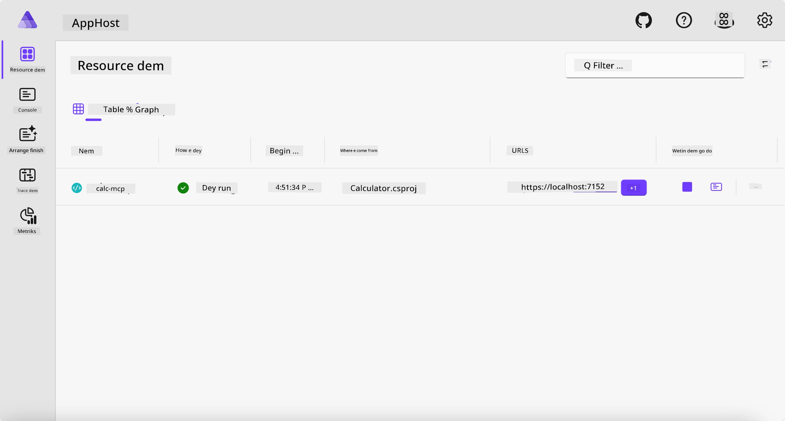
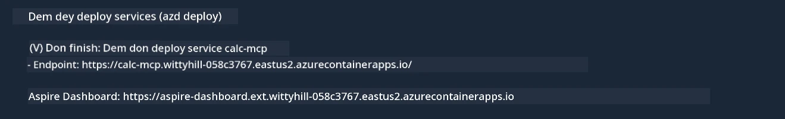

# Sample

Di example wey we show before don explain how you fit use local .NET project wit di `stdio` type. E also show how you fit run di server for container for your local machine. Dis na better solution for many situations. But sometimes, e go make sense to run di server for remote place, like for cloud environment. Na here di `http` type go help.

If you check di solution for di `04-PracticalImplementation` folder, e fit look like say e complex pass di one wey we do before. But truth be say, e no too different. If you look di project `src/Calculator` well, you go see say na almost di same code as di one wey we do before. Di only difference be say we dey use another library `ModelContextProtocol.AspNetCore` to handle di HTTP requests. We also change di method `IsPrime` to make am private, just to show say you fit get private methods for your code. Di rest of di code na di same as before.

Di other projects dey come from [.NET Aspire](https://learn.microsoft.com/dotnet/aspire/get-started/aspire-overview). If you get .NET Aspire for di solution, e go make di developer experience better when dem dey develop and test, and e go help for observability. E no dey compulsory to run di server, but e good make you put am for your solution.

## Start di server for your local machine

1. From VS Code (wey get di C# DevKit extension), go down to di `04-PracticalImplementation/samples/csharp` directory.
1. Run dis command to start di server:

   ```bash
    dotnet watch run --project ./src/AppHost
   ```

1. When web browser open di .NET Aspire dashboard, note di `http` URL. E go look like `http://localhost:5058/`.

   

## Test Streamable HTTP wit di MCP Inspector

If you get Node.js 22.7.5 or higher, you fit use di MCP Inspector to test your server.

Start di server and run dis command for terminal:

```bash
npx @modelcontextprotocol/inspector http://localhost:5058
```


- Select `Streamable HTTP` as di Transport type.
- For di Url field, put di server URL wey you note before, and add `/mcp`. E suppose be `http` (no be `https`) like dis `http://localhost:5058/mcp`.
- Select di Connect button.

One better thing about di Inspector be say e dey show wetin dey happen well well.

- Try list di tools wey dey available.
- Try some of dem, e suppose work like before.

## Test MCP Server wit GitHub Copilot Chat for VS Code

To use di Streamable HTTP transport wit GitHub Copilot Chat, change di configuration of di `calc-mcp` server wey you create before to look like dis:

```jsonc
// .vscode/mcp.json
{
  "servers": {
    "calc-mcp": {
      "type": "http",
      "url": "http://localhost:5058/mcp"
    }
  }
}
```

Do some tests:

- Ask for "3 prime numbers after 6780". See as Copilot go use di new tools `NextFivePrimeNumbers` and e go only return di first 3 prime numbers.
- Ask for "7 prime numbers after 111", to see wetin go happen.
- Ask for "John get 24 lollies and e wan share dem give e 3 pikin. How many lollies each pikin go get?", to see wetin go happen.

## Deploy di server go Azure

Make we deploy di server go Azure so say more people fit use am.

From terminal, go di folder `04-PracticalImplementation/samples/csharp` and run dis command:

```bash
azd up
```

When di deployment finish, you suppose see message like dis:



Collect di URL and use am for di MCP Inspector and for di GitHub Copilot Chat.

```jsonc
// .vscode/mcp.json
{
  "servers": {
    "calc-mcp": {
      "type": "http",
      "url": "https://calc-mcp.gentleriver-3977fbcf.australiaeast.azurecontainerapps.io/mcp"
    }
  }
}
```

## Wetin next?

We don try different transport types and testing tools. We also deploy your MCP server go Azure. But wetin if our server need access to private resources? For example, database or private API? For di next chapter, we go see how we fit improve di security of our server.

---

<!-- CO-OP TRANSLATOR DISCLAIMER START -->
**Disclaimer**:  
Dis dokyument don use AI transleshion service [Co-op Translator](https://github.com/Azure/co-op-translator) do di transleshion. Even though we dey try make am accurate, abeg make you sabi say automatik transleshion fit get mistake or no dey correct well. Di original dokyument wey dey for im native language na di one wey you go take as di correct source. For important informashon, e good make you use professional human transleshion. We no go fit take blame for any misunderstanding or wrong meaning wey fit happen because you use dis transleshion.
<!-- CO-OP TRANSLATOR DISCLAIMER END -->