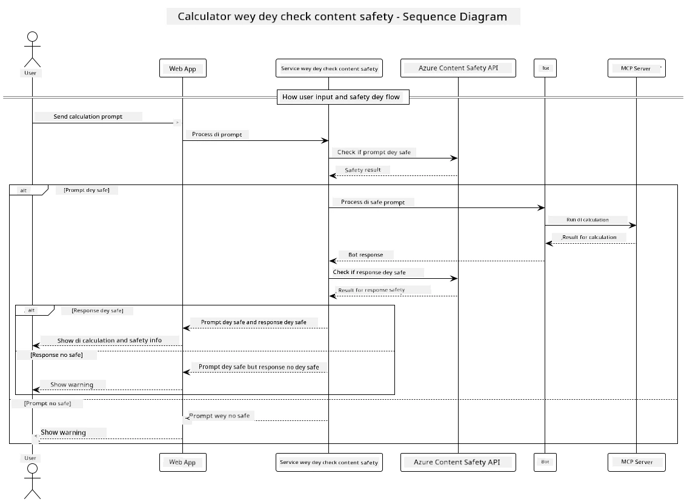

## System Architecture

Dis project dey show how web application dey use content safety check before e go pass user prompt go calculator service through Model Context Protocol (MCP).



### How E Dey Work

1. **User Input**: User go type calculation prompt for di web interface
2. **Content Safety Screening (Input)**: Di prompt go dey check by Azure Content Safety API
3. **Safety Decision (Input)**:
   - If di content safe (severity < 2 for all category), e go continue go di calculator
   - If di content get wahala or e fit dey harmful, di process go stop and e go show warning
4. **Calculator Integration**: Safe content go pass through LangChain4j wey dey talk to MCP calculator server
5. **Content Safety Screening (Output)**: Di bot response go dey check by Azure Content Safety API
6. **Safety Decision (Output)**:
   - If di bot response safe, e go show am to di user
   - If di bot response get wahala or e fit dey harmful, e go replace am with warning
7. **Response**: Result (if e safe) go show to di user with di two safety analysis

## Using Model Context Protocol (MCP) with Calculator Services

Dis project dey show how to use Model Context Protocol (MCP) to call calculator MCP services from LangChain4j. Di implementation dey use local MCP server wey dey run for port 8080 to provide calculator operations.

### How to Set Up Azure Content Safety Service

Before you go fit use di content safety features, you go need create Azure Content Safety service resource:

1. Log in for [Azure Portal](https://portal.azure.com)
2. Click "Create a resource" and search for "Content Safety"
3. Select "Content Safety" and click "Create"
4. Enter unique name for your resource
5. Select your subscription and resource group (or create new one)
6. Choose supported region (check [Region availability](https://azure.microsoft.com/en-us/global-infrastructure/services/?products=cognitive-services) for details)
7. Select di pricing tier wey go work for you
8. Click "Create" to deploy di resource
9. When deployment don complete, click "Go to resource"
10. For di left side, under "Resource Management", select "Keys and Endpoint"
11. Copy any of di keys and di endpoint URL to use for di next step

### Configuring Environment Variables

Set di `GITHUB_TOKEN` environment variable for GitHub models authentication:
```sh
export GITHUB_TOKEN=<your_github_token>
```

For content safety features, set:
```sh
export CONTENT_SAFETY_ENDPOINT=<your_content_safety_endpoint>
export CONTENT_SAFETY_KEY=<your_content_safety_key>
```

Dis environment variables na wetin di application dey use to authenticate with Azure Content Safety service. If you no set di variables, di application go use placeholder values for demo, but di content safety features no go work well.

### How to Start di Calculator MCP Server

Before you go run di client, you go need start di calculator MCP server for SSE mode for localhost:8080.

## Project Description

Dis project dey show how Model Context Protocol (MCP) dey work with LangChain4j to call calculator services. Di main features include:

- Using MCP to connect to calculator service for basic math operations
- Two-layer content safety check for both user prompts and bot responses
- Integration with GitHub's gpt-4.1-nano model through LangChain4j
- Using Server-Sent Events (SSE) for MCP transport

## Content Safety Integration

Di project get full content safety features to make sure say both user inputs and system responses no get harmful content:

1. **Input Screening**: All user prompts go dey check for harmful content like hate speech, violence, self-harm, and sexual content before e go process am.

2. **Output Screening**: Even if di system dey use uncensored models, e go still check all generated responses through di same content safety filters before e go show am to di user.

Dis two-layer approach dey make sure say di system dey safe no matter di AI model wey e dey use, e dey protect users from harmful inputs and AI-generated outputs wey fit get wahala.

## Web Client

Di application get user-friendly web interface wey allow users interact with di Content Safety Calculator system:

### Web Interface Features

- Simple, easy-to-use form to enter calculation prompts
- Two-layer content safety validation (input and output)
- Real-time feedback on prompt and response safety
- Color-coded safety indicators wey dey easy to understand
- Clean, responsive design wey dey work for different devices
- Example safe prompts to guide users

### How to Use di Web Client

1. Start di application:
   ```sh
   mvn spring-boot:run
   ```

2. Open your browser and go `http://localhost:8087`

3. Enter calculation prompt for di text area wey dem provide (e.g., "Calculate di sum of 24.5 and 17.3")

4. Click "Submit" to process your request

5. Check di results, wey go include:
   - Content safety analysis of your prompt
   - Di calculated result (if prompt safe)
   - Content safety analysis of di bot response
   - Any safety warning if di input or output get flagged

Di web client dey automatically handle di two content safety verification processes, e dey make sure say all interactions dey safe and correct no matter di AI model wey e dey use.

---

<!-- CO-OP TRANSLATOR DISCLAIMER START -->
**Disclaimer**:  
Dis dokyument don use AI transleshun service [Co-op Translator](https://github.com/Azure/co-op-translator) do di transleshun. Even as we dey try make am accurate, abeg make you sabi say automatik transleshun fit get mistake or no dey correct well. Di original dokyument for im native language na di one wey you go take as di main source. For important informashun, e good make you use professional human transleshun. We no go fit take blame for any misunderstanding or wrong interpretation wey fit happen because you use dis transleshun.
<!-- CO-OP TRANSLATOR DISCLAIMER END -->