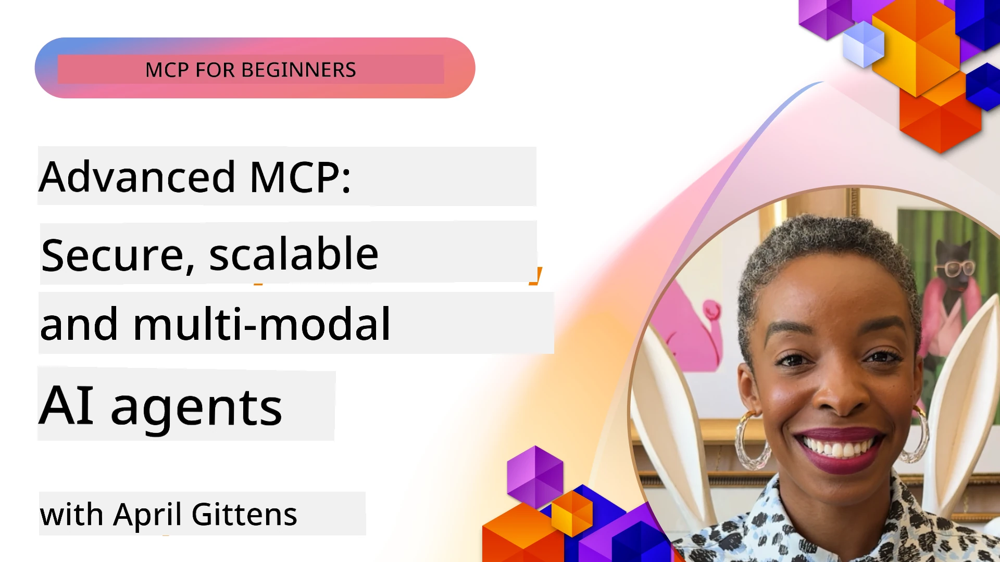

# Advanced Topics in MCP

_(Click di picha wey dey up to watch video of dis lesson)_

Dis chapter cover series of advanced topics inside Model Context Protocol (MCP) implementation, including multi-modal integration, scalability, security best practices, and enterprise integration. Dem topics important to build strong and production-ready MCP applications we fit meet the demands of modern AI systems.

## Overview

Dis lesson explore advanced concepts for Model Context Protocol implementation, e dey focus on multi-modal integration, scalability, security best practices, and enterprise integration. Dem topics dey essential to build production-grade MCP applications we fit handle complex requirements for enterprise environments.

## Learning Objectives

By di end of dis lesson, you go fit:

- Implement multi-modal capabilities inside MCP frameworks
- Design scalable MCP architectures for high-demand scenarios
- Apply security best practices wey align with MCP security principles
- Integrate MCP wit enterprise AI systems and frameworks
- Optimize performance and reliability inside production environments

## Lessons and sample Projects

| Link | Title | Description |
|------|-------|-------------|
| [5.1 Integration with Azure](./mcp-integration/README.md) | Integrate with Azure | Learn how to integrate your MCP Server for Azure |
| [5.2 Multi modal sample](./mcp-multi-modality/README.md) | MCP Multi modal samples  | Samples for audio, image and multi modal response |
| [5.3 MCP OAuth2 sample](../../../05-AdvancedTopics/mcp-oauth2-demo) | MCP OAuth2 Demo | Minimal Spring Boot app wey show OAuth2 wit MCP, as Authorization and Resource Server. E show secure token issuance, protected endpoints, Azure Container Apps deployment, and API Management integration. |
| [5.4 Root Contexts](./mcp-root-contexts/README.md) | Root contexts  | Learn more about root context and how to implement dem |
| [5.5 Routing](./mcp-routing/README.md) | Routing | Learn different types of routing |
| [5.6 Sampling](./mcp-sampling/README.md) | Sampling | Learn how to work wit sampling |
| [5.7 Scaling](./mcp-scaling/README.md) | Scaling  | Learn about scaling |
| [5.8 Security](./mcp-security/README.md) | Security  | Secure your MCP Server |
| [5.9 Web Search sample](./web-search-mcp/README.md) | Web Search MCP | Python MCP server and client wey integrate wit SerpAPI for real-time web, news, product search, and Q&A. E show multi-tool orchestration, external API integration, and strong error handling. |
| [5.10 Realtime Streaming](./mcp-realtimestreaming/README.md) | Streaming  | Real-time data streaming don become important for today data-driven world, where businesses and applications need immediate access to information to make timely decisions.|
| [5.11 Realtime Web Search](./mcp-realtimesearch/README.md) | Web Search | Real-time web search how MCP transform real-time web search by providing standardized approach to context management across AI models, search engines, and applications.| 
| [5.12  Entra ID Authentication for Model Context Protocol Servers](./mcp-security-entra/README.md) | Entra ID Authentication | Microsoft Entra ID provide strong cloud-based identity and access management solution, wey help make sure say only authorized users and applications fit interact wit your MCP server.|
| [5.13 Azure AI Foundry Agent Integration](./mcp-foundry-agent-integration/README.md) | Azure AI Foundry Integration | Learn how to integrate Model Context Protocol servers wit Azure AI Foundry agents, wey enable powerful tool orchestration and enterprise AI capabilities wit standardized external data source connections.|
| [5.14 Context Engineering](./mcp-contextengineering/README.md) | Context Engineering | Future opportunity of context engineering techniques for MCP servers, including context optimization, dynamic context management, and strategies for effective prompt engineering inside MCP frameworks.|
| [5.15 MCP Custom Transport](./mcp-transport/README.md) | Custom Transport | Learn how to implement custom transport mechanisms for specialized MCP communication scenarios.|
| [5.16 Protocol Features Deep Dive](./mcp-protocol-features/README.md) | Protocol Features | Master advanced protocol features including progress notifications, request cancellation, resource templates, and error handling patterns.|

> **New for MCP Specification 2025-11-25**: Di specification now get experimental support for **Tasks** (long-running operations with progress tracking), **Tool Annotations** (metadata about tool behavior for safety), **URL Mode Elicitation** (request specific URL content from clients), and better **Roots** (for workspace context management). Check the [MCP Specification changelog](https://spec.modelcontextprotocol.io/) for full details.

## Additional References

For the most up-to-date info on advanced MCP topics, refer to:
- [MCP Documentation](https://modelcontextprotocol.io/)
- [MCP Specification (2025-11-25)](https://spec.modelcontextprotocol.io/specification/2025-11-25/)
- [GitHub Repository](https://github.com/modelcontextprotocol)
- [OWASP MCP Top 10](https://microsoft.github.io/mcp-azure-security-guide/mcp/) - Security risks and how to reduce dem
- [MCP Security Summit Workshop (Sherpa)](https://azure-samples.github.io/sherpa/) - Hands-on security training

## Key Takeaways

- Multi-modal MCP implementations extend AI powers beyond text processing
- Scalability na important thing for enterprise deployments and fit handled through horizontal and vertical scaling
- Strong security measures dey protect data and make sure say good access control dey
- Enterprise integration wit platforms like Azure OpenAI and Microsoft AI Foundry dey increase MCP capabilities
- Advanced MCP implementations benefit from optimized architectures and careful resource management

## Exercise

Design enterprise-grade MCP implementation for one specific use case:

1. Identify multi-modal requirements for your use case
2. Outline di security controls wey you need to protect sensitive data
3. Design scalable architecture wey fit handle different load
4. Plan integration points wit enterprise AI systems
5. Write down potential performance bottlenecks and how to fix dem

## Additional Resources

- [Azure OpenAI Documentation](https://learn.microsoft.com/en-us/azure/ai-services/openai/)
- [Microsoft AI Foundry Documentation](https://learn.microsoft.com/en-us/ai-services/)

---

## Wetin Next

Explore di lessons for dis module starting wit: [5.1 MCP Integration](./mcp-integration/README.md)

Once you don finish dis module, continue to: [Module 6: Community Contributions](../06-CommunityContributions/README.md)

---

<!-- CO-OP TRANSLATOR DISCLAIMER START -->
**Disclaimer**:  
Dis document na for translate wit di help of AI translation service wey dem call [Co-op Translator](https://github.com/Azure/co-op-translator). Even though we dey try make am correct, abeg make you sabi say automated translations fit get some mistakes or no too correct. Di original document wey dey di original language na di main correct one. For important tori, e good make person wey sabi translate am well do am for you. We no go dey responsible for any wahala or wrong understanding wey fit happen because of how dis translation be.
<!-- CO-OP TRANSLATOR DISCLAIMER END -->