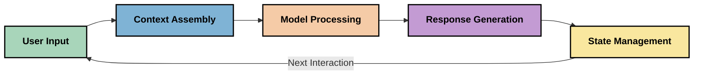
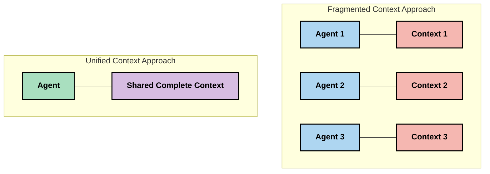
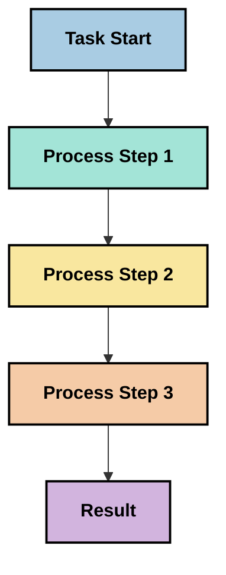
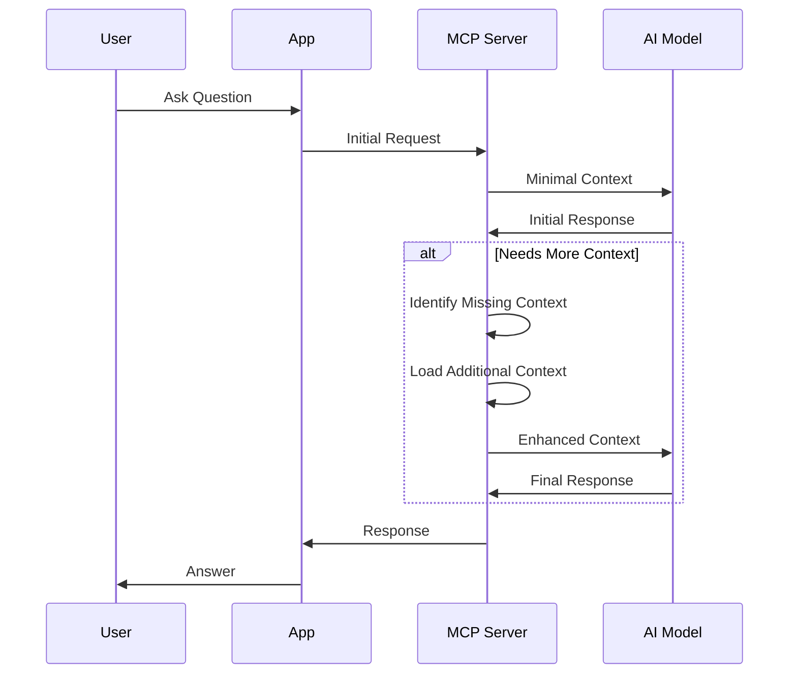
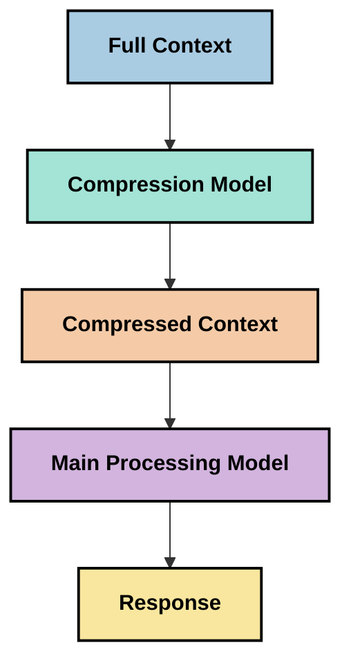
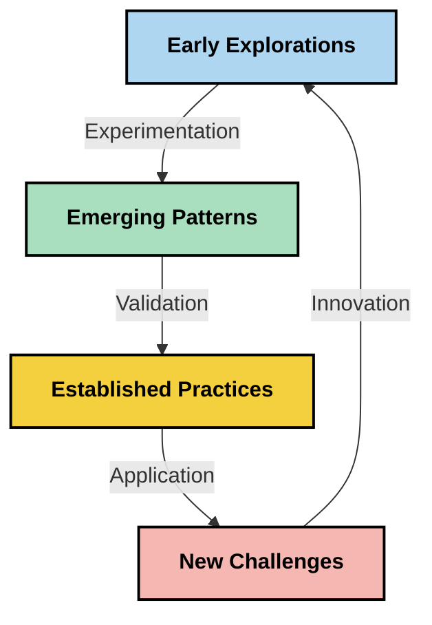

# Context Engineering: Wetin E Mean for MCP Ecosystem

## Overview

Context engineering na new idea wey dey come up for AI space. E dey look how we go fit arrange, deliver, and maintain information wey dey happen between clients and AI services. As Model Context Protocol (MCP) ecosystem dey grow, e dey important make we sabi how to manage context well. This module go introduce wetin context engineering mean and how e fit work for MCP.

## Wetin You Go Learn

By the time you finish this module, you go fit:

- Sabi wetin context engineering mean and how e fit work for MCP
- See the wahala wey dey for context management wey MCP protocol wan solve
- Learn techniques wey go help model perform better with good context handling
- Think about how to measure and check how context dey work
- Use these new ideas to make AI experience better with MCP framework

## Wetin Be Context Engineering

Context engineering na new idea wey dey focus on how we go design and manage information flow between users, apps, and AI models. E no be like prompt engineering wey don already get ground; this one still dey grow as people dey try solve the wahala of giving AI models the correct information at the correct time.

As large language models (LLMs) dey improve, e don clear say context dey very important. The quality, relevance, and how we arrange the context wey we give models dey affect wetin dem go produce. Context engineering dey look this matter and wan create better ways to manage context.

> "By 2025, the models wey dey go dey very smart. But even the smartest person no go fit do work well if dem no get the context of wetin dem suppose do... 'Context engineering' na the next level of prompt engineering. E dey about how to do am automatically for dynamic system." — Walden Yan, Cognition AI

Context engineering fit include:

1. **Context Selection**: To know which information dey important for the task
2. **Context Structuring**: To arrange information so model go understand am well
3. **Context Delivery**: To make sure the information reach the model at the right time
4. **Context Maintenance**: To manage how context dey change over time
5. **Context Evaluation**: To measure and improve how context dey work

These things dey very important for MCP ecosystem wey dey provide standard way for apps to give context to LLMs.

## The Context Journey Perspective

One way to see context engineering na to follow how information dey waka through MCP system:



### Key Stages for Context Journey:

1. **User Input**: Raw information wey user provide (text, images, documents)
2. **Context Assembly**: Join user input with system context, conversation history, and other information
3. **Model Processing**: AI model go process the context wey dem gather
4. **Response Generation**: Model go produce output based on the context
5. **State Management**: System go update its state based on the interaction

This journey dey show how context dey change for AI systems and dey raise questions on how to manage information well for each stage.

## New Principles for Context Engineering

As context engineering dey grow, some early principles don dey show wey fit help MCP:

### Principle 1: Share Context Completely

Make sure say all parts of the system dey share context well, no be to scatter am everywhere. If context dey scattered, decisions wey one part make fit no match wetin another part dey do.



For MCP, this mean say make systems dey designed so context go flow well through the pipeline, no be to divide am.

### Principle 2: Actions Get Hidden Decisions

Every action wey model take dey carry hidden decisions about how e see the context. If different parts dey act on different contexts, e fit cause wahala.

For MCP:
- Make complex tasks dey processed one after the other, no be to scatter am
- Make sure all decision points dey see the same context
- Design system wey later steps fit see wetin earlier steps don do

### Principle 3: Balance Context Depth with Window Limitations

As conversations dey long, context window go full. Context engineering dey try find balance between full context and technical limits.

Some ways wey dem dey try include:
- Compress context but keep the important information
- Load context small small based on wetin dey needed
- Summarize past interactions but keep key points

## Context Wahala and MCP Protocol Design

MCP dey aware of the wahala wey dey for context management. To understand these wahala go help us see why MCP dey the way e be:

### Wahala 1: Context Window Limitations
Most AI models get fixed context window size, so dem no fit process too much information at once.

**MCP Response:** 
- Protocol dey support structured, resource-based context wey fit load small small
- Resources fit dey paginated

### Wahala 2: Relevance Determination
To know which information dey important fit hard.

**MCP Response:**
- Tools dey to retrieve information dynamically
- Structured prompts dey help organize context

### Wahala 3: Context Persistence
To manage state across interactions dey require careful tracking.

**MCP Response:**
- Standardized session management
- Clear interaction patterns for context evolution

### Wahala 4: Multi-Modal Context
Different data types (text, images, structured data) need different handling.

**MCP Response:**
- Protocol fit handle different content types
- Standard way to represent multi-modal information

### Wahala 5: Security and Privacy
Context fit get sensitive information wey need protection.

**MCP Response:**
- Clear boundary between client and server responsibilities
- Local processing options to reduce data exposure

To sabi these wahala and how MCP dey handle dem go help us explore better context engineering techniques.

## New Context Engineering Approaches

As context engineering dey grow, some new ways don dey show. These na ideas wey people dey try, e never be final solution.

### 1. Single-Threaded Linear Processing

Instead of multi-agent systems wey dey scatter context, some people dey see say single-threaded processing dey give better results. E dey follow the principle of unified context.



Even though e fit look slow, e dey give better and more consistent results because each step dey build on wetin don happen before.

### 2. Context Chunking and Prioritization

To break big context into small pieces and focus on the important ones.

```python
# Conceptual Example: Context Chunking and Prioritization
def process_with_chunked_context(documents, query):
    # 1. Break documents into smaller chunks
    chunks = chunk_documents(documents)
    
    # 2. Calculate relevance scores for each chunk
    scored_chunks = [(chunk, calculate_relevance(chunk, query)) for chunk in chunks]
    
    # 3. Sort chunks by relevance score
    sorted_chunks = sorted(scored_chunks, key=lambda x: x[1], reverse=True)
    
    # 4. Use the most relevant chunks as context
    context = create_context_from_chunks([chunk for chunk, score in sorted_chunks[:5]])
    
    # 5. Process with the prioritized context
    return generate_response(context, query)
```

This idea dey help manage context window limits while still using big knowledge bases.

### 3. Progressive Context Loading

To load context small small as e dey needed.



This method dey start with small context and go add more only when e dey necessary. E dey save tokens for simple queries.

### 4. Context Compression and Summarization

To reduce context size but keep the important information.



This method dey focus on:
- Removing things wey no dey important
- Summarizing long content
- Keeping key facts
- Reducing token usage

E dey useful for long conversations or big documents.

## Things to Think About for Context Engineering

As we dey explore context engineering, some things dey important to think about for MCP:

### Know Your Context Goals

Before you start, ask yourself:
- Wetin the model need to work well?
- Which information dey important and which one no too matter?
- Wetin be your performance limits (speed, token size, cost)?

### Try Layered Context

Some people dey arrange context in layers:
- **Core Layer**: Important information wey model always need
- **Situational Layer**: Context for the current interaction
- **Supporting Layer**: Extra information wey fit help
- **Fallback Layer**: Information wey go only show when needed

### Check Retrieval Strategies

How you dey find information fit affect your context:
- Semantic search for relevant information
- Keyword search for specific details
- Hybrid methods wey join different ways
- Metadata filtering to narrow down information

### Work on Context Coherence

How you arrange your context fit affect how model go understand am:
- Group related information together
- Use consistent format
- Arrange things logically or by time
- Avoid conflicting information

### Think About Multi-Agent Wahala

Multi-agent systems fit scatter context:
- Fragmented context fit cause inconsistent decisions
- Parallel processing fit bring conflicts
- Communication between agents fit slow things down
- Managing state go hard

Sometimes, single-agent systems with good context management dey work better.

### Develop Ways to Measure

To improve context engineering, you need to measure:
- Test different context structures
- Check token usage and response time
- Look at user satisfaction and task success
- Study why context strategies fail

These ideas dey help us explore context engineering better.

## How to Measure Context Effectiveness

Context engineering still dey grow, but people don dey think of ways to measure am. No standard way dey yet, but these metrics fit help:

### Possible Metrics

#### 1. Input Efficiency
- **Context-to-Response Ratio**: How much context you need for the response?
- **Token Utilization**: How many context tokens dey affect the response?
- **Context Reduction**: How well you fit compress information?

#### 2. Performance
- **Latency Impact**: How context management dey affect response time?
- **Token Economy**: Are we using tokens well?
- **Retrieval Precision**: How relevant the information be?
- **Resource Use**: How much resources e dey take?

#### 3. Quality
- **Response Relevance**: How well the response fit the query?
- **Factual Accuracy**: E dey improve correctness?
- **Consistency**: Responses dey consistent?
- **Hallucination Rate**: E dey reduce model hallucinations?

#### 4. User Experience
- **Follow-up Rate**: How often users dey ask for clarification?
- **Task Completion**: Users dey achieve their goals?
- **Satisfaction**: How users dey rate the experience?

### How to Measure

1. **Baseline Comparisons**: Start with simple context before trying advanced methods
2. **Incremental Changes**: Change one thing at a time
3. **User Feedback**: Combine numbers with user opinions
4. **Failure Analysis**: Study why context fail
5. **Multi-Dimensional Check**: Balance efficiency, quality, and user experience

This way of measuring go help us understand context engineering better.

## Final Thoughts

Context engineering na new area wey fit help MCP work better. If we manage information well, we fit make AI more efficient, accurate, and useful.

The ideas wey dey here na early thoughts, no be final solution. As AI dey improve, context engineering go grow. For now, make we dey experiment and measure well.

## Wetin Fit Happen for Future

Context engineering still dey start, but some things fit happen:

- E fit improve model performance, efficiency, and user experience
- Single-threaded systems with good context fit work better than multi-agent systems
- Models for context compression fit become normal
- The problem of context size and token limits go bring new ideas
- As models dey improve, multi-agent collaboration fit work better
- MCP fit grow to standardize context management patterns



## Resources

### Official MCP Resources
- [Model Context Protocol Website](https://modelcontextprotocol.io/)
- [Model Context Protocol Specification](https://github.com/modelcontextprotocol/modelcontextprotocol)
- [MCP Documentation](https://modelcontextprotocol.io/docs)
- [MCP C# SDK](https://github.com/modelcontextprotocol/csharp-sdk)
- [MCP Python SDK](https://github.com/modelcontextprotocol/python-sdk)
- [MCP TypeScript SDK](https://github.com/modelcontextprotocol/typescript-sdk)
- [MCP Inspector](https://github.com/modelcontextprotocol/inspector) - Tool wey dem dey use test MCP servers visually

### Context Engineering Articles
- [No Build Multi-Agents: Principles of Context Engineering](https://cognition.ai/blog/dont-build-multi-agents) - Walden Yan talk about di principles for context engineering
- [A Practical Guide to Building Agents](https://cdn.openai.com/business-guides-and-resources/a-practical-guide-to-building-agents.pdf) - OpenAI guide on how to design agents wey go work well
- [Building Effective Agents](https://www.anthropic.com/engineering/building-effective-agents) - Anthropic way for agent development

### Related Research
- [Dynamic Retrieval Augmentation for Large Language Models](https://arxiv.org/abs/2310.01487) - Research wey talk about dynamic retrieval methods
- [Lost in the Middle: How Language Models Use Long Contexts](https://arxiv.org/abs/2307.03172) - Important research wey explain how models dey process long context
- [Hierarchical Text-Conditioned Image Generation with CLIP Latents](https://arxiv.org/abs/2204.06125) - DALL-E 2 paper wey share insight on how to structure context
- [Exploring the Role of Context in Large Language Model Architectures](https://aclanthology.org/2023.findings-emnlp.124/) - New research wey focus on how models dey handle context
- [Multi-Agent Collaboration: A Survey](https://arxiv.org/abs/2304.03442) - Research wey dey talk about multi-agent systems and di challenges dem dey face

### Additional Resources
- [Context Window Optimization Techniques](https://learn.microsoft.com/en-us/azure/ai-services/openai/concepts/context-window)
- [Advanced RAG Techniques](https://www.microsoft.com/en-us/research/blog/retrieval-augmented-generation-rag-and-frontier-models/)
- [Semantic Kernel Documentation](https://github.com/microsoft/semantic-kernel)
- [AI Toolkit for Context Management](https://github.com/microsoft/aitoolkit)

## Wetin dey next 

- [5.15 MCP Custom Transport](../mcp-transport/README.md)

---

<!-- CO-OP TRANSLATOR DISCLAIMER START -->
**Disclaimer**:  
Dis dokyument don use AI transle-shon service [Co-op Translator](https://github.com/Azure/co-op-translator) do di transle-shon. Even as we dey try make am correct, abeg make you sabi say AI transle-shon fit get mistake or no dey accurate well. Di original dokyument wey dey for im native language na di one wey you go take as di correct source. For important mata, e good make you use professional human transle-shon. We no go fit take blame for any misunderstanding or wrong interpretation wey fit happen because you use dis transle-shon.
<!-- CO-OP TRANSLATOR DISCLAIMER END -->