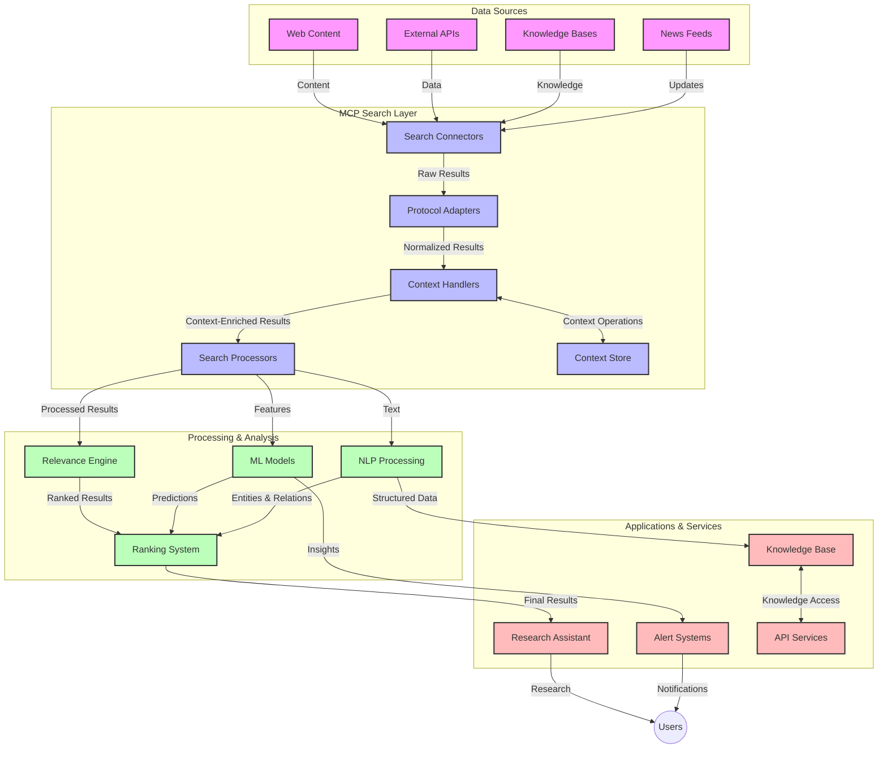
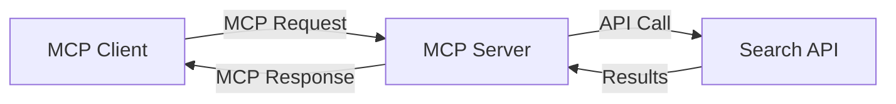
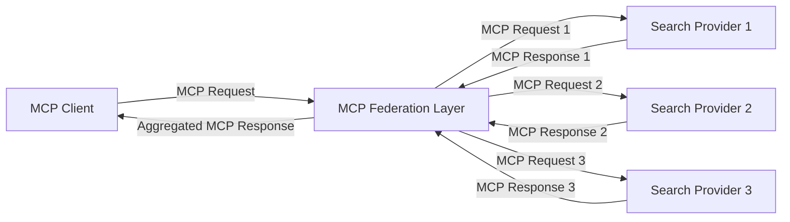
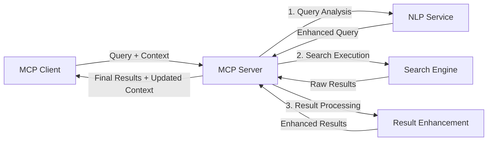

# Model Context Protocol for Real-Time Web Search

## Overview

Real-time web search don turn important for today world wey dey run on information, where apps need quick access to fresh gist wey dey internet to fit give correct and timely answers. The Model Context Protocol (MCP) na big step forward to make these real-time search processes better, make search dey sharp, keep context intact, and improve how the system dey perform.

This module go show how MCP dey change real-time web search by giving one standard way to manage context between AI models, search engines, and apps.

### Wetin You Go Learn

For this guide wey full ground, you go sabi:

- How MCP dey connect AI models and real-time web search well well
- How to build search systems wey go work sharp and fit grow big with MCP
- How to keep search context steady across plenty queries and interactions
- Code examples for Python and JavaScript wey go show different search situations
- How to balance relevance, freshness, and performance for MCP-powered search systems

## Introduction to Real-Time Web Search

Real-time web search na tech wey dey allow systems dey query, process, and analyze web gist as e dey drop or update, so systems fit give fresh and correct gist with small delay. E no be like old search systems wey dey work on indexed data wey fit don old for hours or days. Real-time search dey work with live data from the web, dey give insight and gist wey dey reflect wetin dey happen now for online content.

### Main Ideas for Real-Time Web Search:

- **Continuous Query Processing**: Search dey process queries with data wey dey update steady
- **Recency Prioritization**: Systems dey focus on fresh gist
- **Relevance Balancing**: E dey balance relevance and freshness
- **Scalable Architecture**: Systems fit handle plenty query load and data size
- **Contextual Understanding**: E dey keep user context steady across search rounds to give better results
- **Dynamic Query Reformulation**: E dey change queries based on context and past results
- **Multi-Source Integration**: E dey join results from different search providers and web sources
- **Semantic Understanding**: E dey process queries and content based on meaning, no be just keywords
- **Real-Time Ranking**: E dey adjust result ranking steady as new gist dey drop

### The Model Context Protocol and Real-Time Web Search

The Model Context Protocol (MCP) dey solve some big wahala for real-time web search:

1. **Search Context Preservation**: MCP dey make sure context dey steady across different search parts, so AI models and processing nodes go get access to query history and user preferences.
2. **Efficient Query Management**: MCP dey reduce the stress of repeating context for every search round.
3. **Interoperability**: MCP dey create one common way for context sharing between different search tech and AI models, so systems go dey flexible and fit grow.
4. **Search-Optimized Context**: MCP dey focus on the context wey go help search work better, make am fast and correct.
5. **Adaptive Search Processing**: MCP dey help search systems adjust how dem dey process based on user needs and the kind gist wey dey ground.

For modern apps like news aggregation and research assistants, MCP dey help web search tech work smarter, dey understand context, and dey give better results as users dey interact.

## Learning Objectives

By the time you finish this lesson, you go fit:

- Sabi the basics of real-time web search and the wahala wey dey for modern apps
- Explain how Model Context Protocol (MCP) dey make real-time web search better
- Use MCP to build search solutions with popular frameworks and APIs
- Design and deploy search systems wey go work fast and fit grow big with MCP
- Use MCP ideas for different things like semantic search, research assistance, and AI browsing
- Check new trends and future ideas for MCP-based search tech
- Build search systems wey dey learn from user interactions
- Add web search to AI assistants with MCP protocols
- Create search pipelines wey dey refine results step by step based on context
- Make search work sharp while keeping context steady

### Definition and Significance

Real-time web search na way to dey query, collect, and deliver web gist with small delay. E no be like old search engines wey dey crawl and index web gist once in a while. Real-time search dey bring gist as e dey drop, so people fit get fresh content quick.

Main things for real-time web search include:

- **Freshness**: E dey focus on new gist and updates
- **Continuous Processing**: E dey monitor steady for new gist
- **Query Adaptation**: E dey refine search queries based on context and feedback
- **Immediate Delivery**: E dey give search results quick quick
- **Context Retention**: E dey build on past queries to make results better

### Wahala for Old Web Search

Old web search get some problems when e come to real-time search:

1. **Context Fragmentation**: E dey hard to keep search context steady across plenty queries
2. **Information Freshness**: E dey hard to get and focus on the latest gist
3. **Integration Complexity**: E dey hard to make search systems and apps work together
4. **Latency Issues**: E dey hard to balance full search with quick response time
5. **Relevance Tuning**: E dey hard to make search correct and relevant while focusing on freshness

## Understanding Model Context Protocol (MCP) for Search

### Wetin Be MCP for Search Context?

The Model Context Protocol (MCP) na standard way wey dey help AI models and apps work together well. For real-time web search, MCP dey give framework for:

- Keeping search context steady across query rounds
- Standardizing search query and result formats
- Making search parameters and results transmission sharp
- Making model-to-search engine communication better

### Main Parts and Architecture

MCP architecture for real-time web search get some important parts:

1. **Query Context Handlers**: Dem dey manage and keep search context steady across plenty queries
2. **Search Processors**: Dem dey process search requests with context-aware methods
3. **Protocol Adapters**: Dem dey change between different search APIs while keeping context
4. **Context Store**: Dem dey store and bring back search history and preferences well
5. **Search Connectors**: Dem dey connect to different search engines and web APIs



### How MCP Dey Make Real-Time Web Search Better

MCP dey solve old web search wahala by:

- **Contextual Continuity**: E dey keep relationship between queries steady for the whole search session
- **Optimized Transmission**: E dey reduce repeating search parameters with smart context management
- **Standardized Interfaces**: E dey give consistent APIs for search parts
- **Reduced Latency**: E dey make processing fast with good context handling
- **Enhanced Relevance**: E dey make search results better by keeping user intent steady across queries

## Integration and Implementation

Real-time web search systems need good design and implementation to keep performance and context steady. The Model Context Protocol dey give one standard way to join AI models and search tech, so systems go fit work smarter and understand context well.

### Overview of MCP Integration for Search Systems

To use MCP for real-time web search, you need to think about:

1. **Search Context Serialization**: MCP dey give sharp way to encode context info inside search requests, so context go follow query through the processing pipeline. E dey use standard serialization formats wey fit search metadata well.

2. **Stateful Search Processing**: MCP dey make stateful processing smarter by keeping context representation steady across search rounds. E dey help multi-stage search pipelines where context dey improve results.

3. **Query Expansion and Refinement**: MCP dey help search systems expand and refine queries based on context wey don gather, so results go dey better as search session dey go.

4. **Result Caching and Prioritization**: MCP dey help manage result caching and prioritization by standardizing context handling, so components fit adjust based on search context wey dey change.

5. **Search Federation and Aggregation**: MCP dey make search federation across different backends better by giving structured ways to represent search context, so results from different sources go make sense together.

Using MCP for different search tech dey create one unified way to manage context, reduce the need for custom integration code, and make systems fit keep meaningful context as search queries dey change.

### MCP for Different Web Search Implementations

These examples dey follow MCP specification wey dey use JSON-RPC protocol with different transport methods. The code go show how you fit create custom search integrations while keeping MCP protocol steady.


<details>
<summary>Python Implementation with Generic Search API</summary>

```python
import asyncio
import json
import aiohttp
from typing import Dict, Any, Optional, List
from contextlib import asynccontextmanager
from collections.abc import AsyncIterator

# Import standard MCP libraries
from mcp.client.session import ClientSession
from mcp.client.streamable_http import streamablehttp_client
from mcp.types import TextContent, CreateMessageRequestParams, CreateMessageResult
from mcp.server.fastmcp import FastMCP

# Create a FastMCP server for web search
search_server = FastMCP("WebSearch")

# Class to handle web search operations
class WebSearchHandler:
    def __init__(self, api_endpoint: str, api_key: str):
        self.api_endpoint = api_endpoint
        self.api_key = api_key
        self.session = None
        
    async def initialize(self):
        """Initialize the HTTP session"""
        self.session = aiohttp.ClientSession(
            headers={"Authorization": f"Bearer {self.api_key}"}
        )
    
    async def close(self):
        """Close the HTTP session"""
        if self.session:
            await self.session.close()
            
    async def perform_search(self, query: str, max_results: int = 5, 
                           include_domains: List[str] = None, 
                           exclude_domains: List[str] = None,
                           time_period: str = "any") -> Dict[str, Any]:
        """Perform web search using the search API"""
        # Construct search parameters
        search_params = {
            "q": query,
            "limit": max_results,
            "time": time_period
        }
        
        if include_domains:
            search_params["site"] = ",".join(include_domains)
            
        if exclude_domains:
            search_params["exclude_site"] = ",".join(exclude_domains)
        
        # Perform the search request
        try:
            async with self.session.get(
                self.api_endpoint,
                params=search_params
            ) as response:
                if response.status != 200:
                    error_text = await response.text()
                    raise Exception(f"Search API error: {response.status} - {error_text}")
                
                search_data = await response.json()
                
                # Transform API-specific response to a standard format
                results = []
                for item in search_data.get("results", []):
                    results.append({
                        "title": item.get("title", ""),
                        "url": item.get("url", ""),
                        "snippet": item.get("snippet", ""),
                        "date": item.get("published_date", ""),
                        "source": item.get("source", "")
                    })
                
                return {
                    "query": query,
                    "totalResults": len(results),
                    "results": results
                }
        except Exception as e:
            print(f"Search API request error: {e}")
            raise

# Initialize the search handler
search_handler = WebSearchHandler(
    api_endpoint="https://api.search-service.example/search",
    api_key="your-api-key-here"
)

# Setup lifespan to manage the search handler
@asyncio.asynccontextmanager
async def app_lifespan(server: FastMCP):
    """Manage application lifecycle"""
    await search_handler.initialize()
    try:
        yield {"search_handler": search_handler}
    finally:
        await search_handler.close()

# Set lifespan for the server
search_server = FastMCP("WebSearch", lifespan=app_lifespan)

# Register a web search tool
@search_server.tool()
async def web_search(query: str, max_results: int = 5, 
                   include_domains: List[str] = None,
                   exclude_domains: List[str] = None,
                   time_period: str = "any") -> Dict[str, Any]:
    """
    Search the web for information
    
    Args:
        query: The search query
        max_results: Maximum number of results to return (default: 5)
        include_domains: List of domains to include in search results
        exclude_domains: List of domains to exclude from search results
        time_period: Time period for results ("day", "week", "month", "any")
        
    Returns:
        Dictionary containing search results
    """
    ctx = search_server.get_context()
    search_handler = ctx.request_context.lifespan_context["search_handler"]
    
    results = await search_handler.perform_search(
        query=query,
        max_results=max_results,
        include_domains=include_domains,
        exclude_domains=exclude_domains,
        time_period=time_period
    )
    
    return results

# Example client usage
async def client_example():
    # Connect to the search server using Streamable HTTP transport
    async with streamablehttp_client("http://localhost:8000/mcp") as (read, write, _):
        async with ClientSession(read, write) as session:
            # Initialize the connection
            await session.initialize()
            
            # Call the web_search tool
            search_results = await session.call_tool(
                "web_search", 
                {
                    "query": "latest developments in AI and Model Context Protocol",
                    "max_results": 5,
                    "time_period": "day",
                    "include_domains": ["github.com", "microsoft.com"]
                }
            )
            
            print(f"Search results: {search_results}")

# Server execution example
if __name__ == "__main__":
    # Run the server with Streamable HTTP transport
    search_server.run(transport="streamable-http")
```
</details> 

<details>
<summary>JavaScript Implementation with Browser-Based Search</summary>


```javascript
// MCP server implementation for web search
import { McpServer, ResourceTemplate } from '@modelcontextprotocol/sdk/server/mcp.js';
import { StreamableHTTPServerTransport } from '@modelcontextprotocol/sdk/server/streamableHttp.js';
import { z } from 'zod';

// Create an MCP server for web search
const searchServer = new McpServer({
    name: "BrowserSearch",
    description: "A server that provides web search capabilities"
});

// Search service class
class SearchService {
    constructor(searchApiUrl, apiKey) {
        this.searchApiUrl = searchApiUrl;
        this.apiKey = apiKey;
    }

    async performSearch(parameters) {
        const {
            query = '',
            maxResults = 5,
            includeDomains = [],
            excludeDomains = [],
            timePeriod = 'any'
        } = parameters;
        
        // Construct search URL with parameters
        const url = new URL(this.searchApiUrl);
        url.searchParams.append('q', query);
        url.searchParams.append('limit', maxResults);
        url.searchParams.append('time', timePeriod);
        
        if (includeDomains.length > 0) {
            url.searchParams.append('site', includeDomains.join(','));
        }
        
        if (excludeDomains.length > 0) {
            url.searchParams.append('exclude_site', excludeDomains.join(','));
        }
        
        try {
            const response = await fetch(url.toString(), {
                method: 'GET',
                headers: {
                    'Authorization': `Bearer ${this.apiKey}`,
                    'Content-Type': 'application/json'
                }
            });
            
            if (!response.ok) {
                const errorText = await response.text();
                throw new Error(`Search API error: ${response.status} - ${errorText}`);
            }
            
            const searchData = await response.json();
            
            // Transform API-specific response to a standard format
            const results = searchData.results?.map(item => ({
                title: item.title || '',
                url: item.url || '',
                snippet: item.snippet || '',
                date: item.published_date || '',
                source: item.source || ''
            })) || [];
            
            return {
                query,
                totalResults: results.length,
                results
            };
        } catch (error) {
            console.error('Search API request error:', error);
            throw error;
        }
    }
}

// Initialize the search service
const searchService = new SearchService(
    'https://api.search-service.example/search',
    'your-api-key-here'
);

// Setup the context provider for the server
searchServer.setContextProvider(() => {
    return {
        searchService
    };
});

// Register web search tool
searchServer.tool({
    name: 'web_search',
    description: 'Search the web for information',
    parameters: {
        type: 'object',
        properties: {
            query: {
                type: 'string',
                description: 'The search query'
            },
            maxResults: {
                type: 'integer',
                description: 'Maximum number of results to return',
                default: 5
            },
            includeDomains: {
                type: 'array',
                items: { type: 'string' },
                description: 'List of domains to include in search results'
            },
            excludeDomains: {
                type: 'array',
                items: { type: 'string' },
                description: 'List of domains to exclude from search results'
            },
            timePeriod: {
                type: 'string',
                description: 'Time period for results',
                enum: ['day', 'week', 'month', 'any'],
                default: 'any'
            }
        },
        required: ['query']
    },
    handler: async (params, context) => {
        const { searchService } = context;
        return await searchService.performSearch(params);
    }
});

// Example client code to connect to the search server
import { Client } from '@modelcontextprotocol/sdk/client/index.js';
import { StreamableHTTPClientTransport } from '@modelcontextprotocol/sdk/client/streamableHttp.js';

async function connectToSearchServer() {
    // Connect to the search server
    const transport = new StreamableHTTPClientTransport(
        new URL('http://localhost:8000/mcp')
    );
    
    const client = new Client({
        name: 'search-client',
        version: '1.0.0'
    });
    
    await client.connect(transport);
    
    // Execute the search tool
    const searchResults = await client.callTool({
        name: 'web_search',
        arguments: {
            query: 'Model Context Protocol implementation examples',
            maxResults: 10,
            timePeriod: 'week',
            includeDomains: ['github.com', 'docs.microsoft.com']
        }
    });
    
    console.log('Search results:', searchResults);
    
    // Cleanup
    await client.disconnect();
}

// Start the server
const transport = new StreamableHTTPServerTransport();
await searchServer.connect(transport);
console.log('Search server running at http://localhost:8000/mcp');

// In a separate process or after server is started
// connectToSearchServer().catch(console.error);
```
</details> 


## Code Examples Disclaimer

> **Important Note**: The code examples below dey show how MCP dey work with web search functionality. Even though dem dey follow the official MCP SDK patterns, dem don simplify am for learning purposes.
> 
> These examples dey show:
> 
> 1. **Python Implementation**: One FastMCP server wey dey provide web search tool and dey connect to external search API. E dey show how to manage lifespan, handle context, and use tools well based on the [official MCP Python SDK](https://github.com/modelcontextprotocol/python-sdk). The server dey use Streamable HTTP transport wey don replace the old SSE transport for production.
> 
> 2. **JavaScript Implementation**: One TypeScript/JavaScript implementation wey dey use FastMCP pattern from the [official MCP TypeScript SDK](https://github.com/modelcontextprotocol/typescript-sdk) to create search server with correct tool definitions and client connections. E dey follow the latest way for session management and context preservation.
> 
> These examples go need extra error handling, authentication, and specific API integration code for production. The search API endpoints wey dey show (`https://api.search-service.example/search`) na placeholders, you go need replace am with real search service endpoints.
> 
> For full implementation details and the latest ways, check the [official MCP specification](https://spec.modelcontextprotocol.io/) and SDK documentation.

## Core Concepts

### The Model Context Protocol (MCP) Framework

MCP dey give one standard way for AI models, apps, and services to share context. For real-time web search, this framework dey help create smooth, multi-turn search experience. Main parts include:

1. **Client-Server Architecture**: MCP dey separate search clients (requesters) and search servers (providers), so deployment go dey flexible.
2. **JSON-RPC Communication**: MCP dey use JSON-RPC for message exchange, e dey work well with web tech and easy to use for different platforms.
3. **Context Management**: MCP dey define structured ways to keep, update, and use search context across interactions.
4. **Tool Definitions**: Search features dey show as standard tools with clear parameters and return values.
5. **Streaming Support**: MCP dey support streaming results, wey dey important for real-time search where results fit dey drop small small.

### Web Search Integration Patterns

When MCP dey join web search, some patterns dey show:

#### 1. Direct Search Provider Integration



For this pattern, MCP server dey connect direct to one or more search APIs, dey change MCP requests to API-specific calls and format results as MCP responses.

#### 2. Federated Search with Context Preservation



This pattern dey share search queries across different MCP-compatible search providers, each one fit dey specialize for different content or search features, while keeping one steady context.

#### 3. Context-Enhanced Search Chain



For this pattern, search process dey divide into different stages, with context dey improve for each step, so results go dey better.

### Search Context Components

For MCP-based web search, context fit include:

- **Query History**: Past search queries for the session
- **User Preferences**: Language, region, safe search settings
- **Interaction History**: Results wey user click, time wey dem spend on results
- **Search Parameters**: Filters, sort orders, and other search settings
- **Domain Knowledge**: Subject-specific context wey relate to the search
- **Temporal Context**: Time-based relevance factors
- **Source Preferences**: Trusted or preferred information sources

## Use Cases and Applications

### Research and Information Gathering

MCP dey make research work better by:

- Keeping research context steady across search sessions
- Allowing smarter and more relevant queries
- Supporting search federation across different sources
- Helping extract knowledge from search results

### Real-Time News and Trend Monitoring

MCP-powered search dey help for news monitoring:

- Near-real-time discovery of new news stories
- Filtering relevant gist based on context
- Tracking topics and entities across different sources
- Personalized news alerts based on user context

### AI-Augmented Browsing and Research

MCP dey open new ways for AI-augmented browsing:

- Contextual search suggestions based on browser activity
- Smooth connection of web search with LLM-powered assistants
- Multi-turn search refinement with steady context
- Better fact-checking and information verification

## Future Trends and Innovations

### How MCP Go Evolve for Web Search
As we dey look forward, we dey expect say MCP go change to fit handle:

- **Multimodal Search**: Join text, image, audio, and video search wey go still keep context
- **Decentralized Search**: Support distributed and federated search systems
- **Search Privacy**: Context-aware search wey go protect privacy
- **Query Understanding**: Deep semantic parsing of natural language search queries

### Possible Technology Improvements

New technology wey go shape MCP search future:

1. **Neural Search Architectures**: Embedding-based search systems wey dem optimize for MCP
2. **Personalized Search Context**: Learn how each user dey search over time
3. **Knowledge Graph Integration**: Contextual search wey dey use domain-specific knowledge graphs
4. **Cross-Modal Context**: Keep context across different search types

## Practical Exercises

### Exercise 1: Set Up Basic MCP Search Pipeline

For this exercise, you go learn how to:
- Arrange basic MCP search environment
- Put context handlers for web search
- Test and confirm say context dey stay same across search rounds

### Exercise 2: Build Research Assistant with MCP Search

Make full application wey go:
- Process natural language research questions
- Do context-aware web searches
- Gather info from different sources
- Show research findings wey dey organized

### Exercise 3: Do Multi-Source Search Federation with MCP

Advanced exercise wey cover:
- Context-aware query dispatching to different search engines
- Rank and join results
- Remove duplicate search results based on context
- Manage metadata wey dey specific to source

## Extra Resources

- [Model Context Protocol Specification](https://spec.modelcontextprotocol.io/) - Official MCP specification and detailed protocol documentation
- [Model Context Protocol Documentation](https://modelcontextprotocol.io/) - Detailed tutorials and implementation guides
- [MCP Python SDK](https://github.com/modelcontextprotocol/python-sdk) - Official Python implementation of the MCP protocol
- [MCP TypeScript SDK](https://github.com/modelcontextprotocol/typescript-sdk) - Official TypeScript implementation of the MCP protocol
- [MCP Reference Servers](https://github.com/modelcontextprotocol/servers) - Reference implementations of MCP servers
- [Bing Web Search API Documentation](https://learn.microsoft.com/en-us/bing/search-apis/bing-web-search/overview) - Microsoft's web search API
- [Google Custom Search JSON API](https://developers.google.com/custom-search/v1/overview) - Google's programmable search engine
- [SerpAPI Documentation](https://serpapi.com/search-api) - Search engine results page API
- [Meilisearch Documentation](https://www.meilisearch.com/docs) - Open-source search engine
- [Elasticsearch Documentation](https://www.elastic.co/guide/index.html) - Distributed search and analytics engine
- [LangChain Documentation](https://python.langchain.com/docs/get_started/introduction) - Build apps with LLMs

## Wetin You Go Learn

After you finish this module, you go fit:

- Understand basics of real-time web search and the wahala wey dey inside
- Explain how Model Context Protocol (MCP) dey make real-time web search better
- Use MCP to build search solutions with popular frameworks and APIs
- Design and deploy scalable, high-performance search systems with MCP
- Use MCP ideas for different things like semantic search, research assistant, and AI-augmented browsing
- Check new trends and future innovations for MCP-based search technology

### Trust and Safety Things

When you dey use MCP-based web search solutions, make sure say you follow these important rules from MCP specification:

1. **User Consent and Control**: Users gatz agree and understand how data go dey used. This one dey very important for web search wey fit access external data.

2. **Data Privacy**: Make sure say you handle search queries and results well, especially if e get sensitive info. Put access controls to protect user data.

3. **Tool Safety**: Make sure say search tools get proper authorization and validation, because dem fit be security risk if dem dey run any code anyhow. No trust tool description unless e come from trusted server.

4. **Clear Documentation**: Give clear explanation about wetin your MCP-based search fit do, wetin e no fit do, and security things wey dey involved. Follow MCP implementation guidelines.

5. **Strong Consent Flows**: Make sure say consent and authorization flows dey strong, and explain wetin each tool go do before user go allow am, especially tools wey dey interact with external web resources.

For full details about MCP security and trust things, check [official documentation](https://modelcontextprotocol.io/specification/2025-03-26#security-and-trust-%26-safety).

## Wetin Go Happen Next

- [5.12 Entra ID Authentication for Model Context Protocol Servers](../mcp-security-entra/README.md)

---

<!-- CO-OP TRANSLATOR DISCLAIMER START -->
**Disclaimer**:  
Dis dokyument don use AI translation service [Co-op Translator](https://github.com/Azure/co-op-translator) do di translation. Even as we dey try make am accurate, abeg sabi say machine translation fit get mistake or no dey correct well. Di original dokyument wey dey for im native language na di main source wey you go fit trust. For important information, e better make professional human translation dey use. We no go fit take blame for any misunderstanding or wrong interpretation wey fit happen because you use dis translation.
<!-- CO-OP TRANSLATOR DISCLAIMER END -->