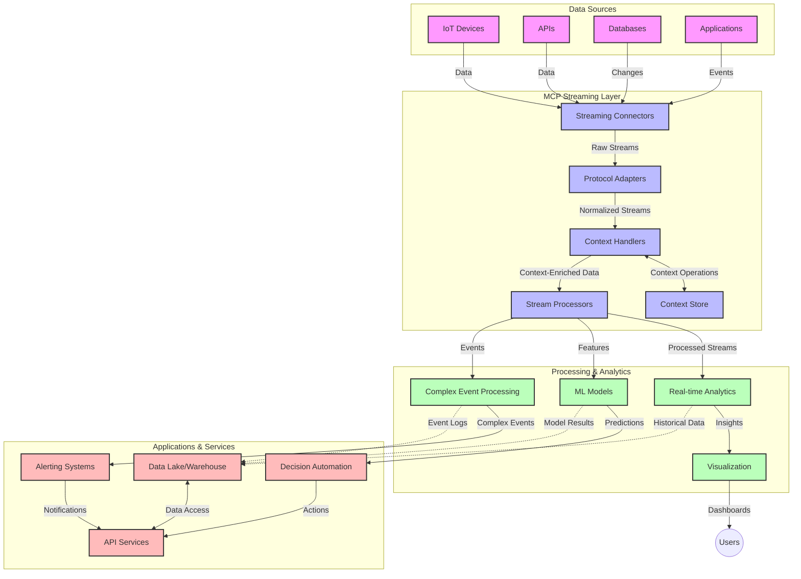

# Model Context Protocol for Real-Time Data Streaming

## Overview

Real-time data streaming don become very important for today world wey dey depend on data, where businesses and apps need quick access to info to fit make fast decisions. The Model Context Protocol (MCP) na big improvement wey dey help make these real-time streaming processes better, e dey make data processing more efficient, keep context intact, and improve system performance.

This module go show how MCP dey change real-time data streaming by giving one standard way to manage context for AI models, streaming platforms, and apps.

## Introduction to Real-Time Data Streaming

Real-time data streaming na technology wey dey allow data to dey move, process, and analyze as e dey happen, so systems fit react fast to new info. E different from batch processing wey dey work on static datasets, streaming dey process data as e dey move, giving insights and actions with small delay.

### Core Concepts of Real-Time Data Streaming:

- **Continuous Data Flow**: Data dey process as e dey come like one never-ending stream of events or records.
- **Low Latency Processing**: Systems dey design to make sure say time between data generation and processing dey very small.
- **Scalability**: Streaming systems suppose fit handle different data volumes and speed.
- **Fault Tolerance**: Systems suppose strong well to make sure data flow no stop even if something go wrong.
- **Stateful Processing**: E dey important to keep context across events for better analysis.

### The Model Context Protocol and Real-Time Streaming

The Model Context Protocol (MCP) dey solve some big problems for real-time streaming environments:

1. **Contextual Continuity**: MCP dey make sure say context dey intact across different streaming components, so AI models and processing nodes go get access to important historical and environmental context.

2. **Efficient State Management**: MCP dey provide structured ways to manage context, e dey reduce the stress of state management for streaming pipelines.

3. **Interoperability**: MCP dey create one common language for sharing context between different streaming technologies and AI models, making architectures more flexible.

4. **Streaming-Optimized Context**: MCP dey focus on the context wey dey important for real-time decision making, e dey help performance and accuracy.

5. **Adaptive Processing**: With MCP, streaming systems fit adjust processing based on how data dey change.

For modern apps like IoT sensor networks and financial trading platforms, MCP dey help streaming technologies to process data smarter and respond well to complex situations as e dey happen.

## Learning Objectives

By the end of this lesson, you go fit:

- Understand the basics of real-time data streaming and the wahala wey dey follow am
- Explain how the Model Context Protocol (MCP) dey make real-time data streaming better
- Use MCP to build streaming solutions with frameworks like Kafka and Pulsar
- Design and deploy streaming systems wey strong and perform well with MCP
- Use MCP for IoT, financial trading, and AI-driven analytics
- Check new trends and future innovations for MCP-based streaming technologies

### Definition and Significance

Real-time data streaming na the process wey dey involve continuous generation, processing, and delivery of data with small delay. E different from batch processing wey dey collect and process data in groups, streaming dey process data as e dey come, giving quick insights and actions.

Key things about real-time data streaming:

- **Low Latency**: Processing and analyzing data fast, within milliseconds or seconds
- **Continuous Flow**: Data dey flow non-stop from different sources
- **Immediate Processing**: Analyzing data as e dey come instead of waiting to batch am
- **Event-Driven Architecture**: Reacting to events as e dey happen

### Challenges in Traditional Data Streaming

Traditional data streaming get some problems:

1. **Context Loss**: E hard to keep context across different systems
2. **Scalability Issues**: E dey hard to handle plenty data wey dey come fast
3. **Integration Complexity**: E dey hard to make different systems work together
4. **Latency Management**: Balancing speed and processing time dey hard
5. **Data Consistency**: Making sure data dey accurate and complete dey challenging

## Understanding Model Context Protocol (MCP)

### What is MCP?

The Model Context Protocol (MCP) na one standard communication protocol wey dey help AI models and apps work well together. For real-time data streaming, MCP dey provide framework for:

- Keeping context intact throughout the data pipeline
- Standardizing how data dey exchange
- Making transmission of big datasets better
- Improving communication between models and apps

### Core Components and Architecture

MCP architecture for real-time streaming get some important parts:

1. **Context Handlers**: E dey manage and keep context info across the streaming pipeline
2. **Stream Processors**: E dey process data streams with context-aware methods
3. **Protocol Adapters**: E dey convert between different streaming protocols while keeping context
4. **Context Store**: E dey store and retrieve context info well
5. **Streaming Connectors**: E dey connect to different streaming platforms like Kafka, Pulsar, Kinesis, etc.



### How MCP Improves Real-Time Data Handling

MCP dey solve traditional streaming problems by:

- **Contextual Integrity**: E dey keep relationships between data points across the pipeline
- **Optimized Transmission**: E dey reduce unnecessary data exchange with smart context management
- **Standardized Interfaces**: E dey provide consistent APIs for streaming components
- **Reduced Latency**: E dey make processing faster with efficient context handling
- **Enhanced Scalability**: E dey support scaling while keeping context intact

## Integration and Implementation

Real-time data streaming systems need good design and implementation to keep performance and context intact. MCP dey provide one standard way to connect AI models and streaming technologies, making processing pipelines smarter.

### Overview of MCP Integration in Streaming Architectures

To use MCP for real-time streaming, you need to think about:

1. **Context Serialization and Transport**: MCP dey provide ways to encode context info inside streaming data packets, so context go follow data throughout the pipeline. E dey use standard serialization formats wey fit streaming transport.

2. **Stateful Stream Processing**: MCP dey make stateful processing smarter by keeping consistent context across processing nodes. This na big help for distributed streaming systems wey dey struggle with state management.

3. **Event-Time vs. Processing-Time**: MCP dey help streaming systems handle the difference between when events happen and when dem process am. E dey keep temporal context wey fit preserve event time.

4. **Backpressure Management**: MCP dey help manage backpressure for streaming systems by standardizing context handling, so components fit communicate their processing capacity and adjust flow.

5. **Context Windowing and Aggregation**: MCP dey make windowing operations better by providing structured ways to represent temporal and relational contexts, so aggregations across event streams go make sense.

6. **Exactly-Once Processing**: For streaming systems wey need exactly-once semantics, MCP dey add processing metadata to track and confirm processing status across distributed components.

Using MCP for different streaming technologies dey create one unified way to manage context, e dey reduce the need for custom integration code and make sure system fit keep meaningful context as data dey flow.

### MCP in Various Data Streaming Frameworks

These examples dey follow the MCP specification wey dey use JSON-RPC based protocol with different transport methods. The code dey show how you fit create custom transports wey go work with streaming platforms like Kafka and Pulsar while still following MCP protocol.

The examples dey show how streaming platforms fit work with MCP to process data in real-time while keeping the context wey MCP dey focus on. This approach dey make sure say the code samples dey match the MCP specification as of June 2025.

MCP fit work with popular streaming frameworks like:

#### Apache Kafka Integration

```python
import asyncio
import json
from typing import Dict, Any, Optional
from confluent_kafka import Consumer, Producer, KafkaError
from mcp.client import Client, ClientCapabilities
from mcp.core.message import JsonRpcMessage
from mcp.core.transports import Transport

# Custom transport class to bridge MCP with Kafka
class KafkaMCPTransport(Transport):
    def __init__(self, bootstrap_servers: str, input_topic: str, output_topic: str):
        self.bootstrap_servers = bootstrap_servers
        self.input_topic = input_topic
        self.output_topic = output_topic
        self.producer = Producer({'bootstrap.servers': bootstrap_servers})
        self.consumer = Consumer({
            'bootstrap.servers': bootstrap_servers,
            'group.id': 'mcp-client-group',
            'auto.offset.reset': 'earliest'
        })
        self.message_queue = asyncio.Queue()
        self.running = False
        self.consumer_task = None
        
    async def connect(self):
        """Connect to Kafka and start consuming messages"""
        self.consumer.subscribe([self.input_topic])
        self.running = True
        self.consumer_task = asyncio.create_task(self._consume_messages())
        return self
        
    async def _consume_messages(self):
        """Background task to consume messages from Kafka and queue them for processing"""
        while self.running:
            try:
                msg = self.consumer.poll(1.0)
                if msg is None:
                    await asyncio.sleep(0.1)
                    continue
                
                if msg.error():
                    if msg.error().code() == KafkaError._PARTITION_EOF:
                        continue
                    print(f"Consumer error: {msg.error()}")
                    continue
                
                # Parse the message value as JSON-RPC
                try:
                    message_str = msg.value().decode('utf-8')
                    message_data = json.loads(message_str)
                    mcp_message = JsonRpcMessage.from_dict(message_data)
                    await self.message_queue.put(mcp_message)
                except Exception as e:
                    print(f"Error parsing message: {e}")
            except Exception as e:
                print(f"Error in consumer loop: {e}")
                await asyncio.sleep(1)
    
    async def read(self) -> Optional[JsonRpcMessage]:
        """Read the next message from the queue"""
        try:
            message = await self.message_queue.get()
            return message
        except Exception as e:
            print(f"Error reading message: {e}")
            return None
    
    async def write(self, message: JsonRpcMessage) -> None:
        """Write a message to the Kafka output topic"""
        try:
            message_json = json.dumps(message.to_dict())
            self.producer.produce(
                self.output_topic,
                message_json.encode('utf-8'),
                callback=self._delivery_report
            )
            self.producer.poll(0)  # Trigger callbacks
        except Exception as e:
            print(f"Error writing message: {e}")
    
    def _delivery_report(self, err, msg):
        """Kafka producer delivery callback"""
        if err is not None:
            print(f'Message delivery failed: {err}')
        else:
            print(f'Message delivered to {msg.topic()} [{msg.partition()}]')
    
    async def close(self) -> None:
        """Close the transport"""
        self.running = False
        if self.consumer_task:
            self.consumer_task.cancel()
            try:
                await self.consumer_task
            except asyncio.CancelledError:
                pass
        self.consumer.close()
        self.producer.flush()

# Example usage of the Kafka MCP transport
async def kafka_mcp_example():
    # Create MCP client with Kafka transport
    client = Client(
        {"name": "kafka-mcp-client", "version": "1.0.0"},
        ClientCapabilities({})
    )
    
    # Create and connect the Kafka transport
    transport = KafkaMCPTransport(
        bootstrap_servers="localhost:9092",
        input_topic="mcp-responses",
        output_topic="mcp-requests"
    )
    
    await client.connect(transport)
    
    try:
        # Initialize the MCP session
        await client.initialize()
        
        # Example of executing a tool via MCP
        response = await client.execute_tool(
            "process_data",
            {
                "data": "sample data",
                "metadata": {
                    "source": "sensor-1",
                    "timestamp": "2025-06-12T10:30:00Z"
                }
            }
        )
        
        print(f"Tool execution response: {response}")
        
        # Clean shutdown
        await client.shutdown()
    finally:
        await transport.close()

# Run the example
if __name__ == "__main__":
    asyncio.run(kafka_mcp_example())
```

#### Apache Pulsar Implementation

```python
import asyncio
import json
import pulsar
from typing import Dict, Any, Optional
from mcp.core.message import JsonRpcMessage
from mcp.core.transports import Transport
from mcp.server import Server, ServerOptions
from mcp.server.tools import Tool, ToolExecutionContext, ToolMetadata

# Create a custom MCP transport that uses Pulsar
class PulsarMCPTransport(Transport):
    def __init__(self, service_url: str, request_topic: str, response_topic: str):
        self.service_url = service_url
        self.request_topic = request_topic
        self.response_topic = response_topic
        self.client = pulsar.Client(service_url)
        self.producer = self.client.create_producer(response_topic)
        self.consumer = self.client.subscribe(
            request_topic,
            "mcp-server-subscription",
            consumer_type=pulsar.ConsumerType.Shared
        )
        self.message_queue = asyncio.Queue()
        self.running = False
        self.consumer_task = None
    
    async def connect(self):
        """Connect to Pulsar and start consuming messages"""
        self.running = True
        self.consumer_task = asyncio.create_task(self._consume_messages())
        return self
    
    async def _consume_messages(self):
        """Background task to consume messages from Pulsar and queue them for processing"""
        while self.running:
            try:
                # Non-blocking receive with timeout
                msg = self.consumer.receive(timeout_millis=500)
                
                # Process the message
                try:
                    message_str = msg.data().decode('utf-8')
                    message_data = json.loads(message_str)
                    mcp_message = JsonRpcMessage.from_dict(message_data)
                    await self.message_queue.put(mcp_message)
                    
                    # Acknowledge the message
                    self.consumer.acknowledge(msg)
                except Exception as e:
                    print(f"Error processing message: {e}")
                    # Negative acknowledge if there was an error
                    self.consumer.negative_acknowledge(msg)
            except Exception as e:
                # Handle timeout or other exceptions
                await asyncio.sleep(0.1)
    
    async def read(self) -> Optional[JsonRpcMessage]:
        """Read the next message from the queue"""
        try:
            message = await self.message_queue.get()
            return message
        except Exception as e:
            print(f"Error reading message: {e}")
            return None
    
    async def write(self, message: JsonRpcMessage) -> None:
        """Write a message to the Pulsar output topic"""
        try:
            message_json = json.dumps(message.to_dict())
            self.producer.send(message_json.encode('utf-8'))
        except Exception as e:
            print(f"Error writing message: {e}")
    
    async def close(self) -> None:
        """Close the transport"""
        self.running = False
        if self.consumer_task:
            self.consumer_task.cancel()
            try:
                await self.consumer_task
            except asyncio.CancelledError:
                pass
        self.consumer.close()
        self.producer.close()
        self.client.close()

# Define a sample MCP tool that processes streaming data
@Tool(
    name="process_streaming_data",
    description="Process streaming data with context preservation",
    metadata=ToolMetadata(
        required_capabilities=["streaming"]
    )
)
async def process_streaming_data(
    ctx: ToolExecutionContext,
    data: str,
    source: str,
    priority: str = "medium"
) -> Dict[str, Any]:
    """
    Process streaming data while preserving context
    
    Args:
        ctx: Tool execution context
        data: The data to process
        source: The source of the data
        priority: Priority level (low, medium, high)
        
    Returns:
        Dict containing processed results and context information
    """
    # Example processing that leverages MCP context
    print(f"Processing data from {source} with priority {priority}")
    
    # Access conversation context from MCP
    conversation_id = ctx.conversation_id if hasattr(ctx, 'conversation_id') else "unknown"
    
    # Return results with enhanced context
    return {
        "processed_data": f"Processed: {data}",
        "context": {
            "conversation_id": conversation_id,
            "source": source,
            "priority": priority,
            "processing_timestamp": ctx.get_current_time_iso()
        }
    }

# Example MCP server implementation using Pulsar transport
async def run_mcp_server_with_pulsar():
    # Create MCP server
    server = Server(
        {"name": "pulsar-mcp-server", "version": "1.0.0"},
        ServerOptions(
            capabilities={"streaming": True}
        )
    )
    
    # Register our tool
    server.register_tool(process_streaming_data)
    
    # Create and connect Pulsar transport
    transport = PulsarMCPTransport(
        service_url="pulsar://localhost:6650",
        request_topic="mcp-requests",
        response_topic="mcp-responses"
    )
    
    try:
        # Start the server with the Pulsar transport
        await server.run(transport)
    finally:
        await transport.close()

# Run the server
if __name__ == "__main__":
    asyncio.run(run_mcp_server_with_pulsar())
```

### Best Practices for Deployment

When you dey use MCP for real-time streaming:

1. **Design for Fault Tolerance**:
   - Add proper error handling
   - Use dead-letter queues for failed messages
   - Design processors wey no go repeat actions unnecessarily

2. **Optimize for Performance**:
   - Set buffer sizes well
   - Use batching when e dey make sense
   - Add backpressure mechanisms

3. **Monitor and Observe**:
   - Check stream processing metrics
   - Monitor how context dey move
   - Set alerts for any problem

4. **Secure Your Streams**:
   - Encrypt sensitive data
   - Use authentication and authorization
   - Add proper access controls

### MCP in IoT and Edge Computing

MCP dey make IoT streaming better by:

- Keeping device context intact across the pipeline
- Making edge-to-cloud data streaming efficient
- Supporting real-time analytics for IoT data streams
- Helping device-to-device communication with context

Example: Smart City Sensor Networks
```
Sensors → Edge Gateways → MCP Stream Processors → Real-time Analytics → Automated Responses
```

### Role in Financial Transactions and High-Frequency Trading

MCP dey help financial data streaming by:

- Processing data very fast for trading decisions
- Keeping transaction context intact during processing
- Supporting complex event processing with context awareness
- Making sure data dey consistent across distributed trading systems

### Enhancing AI-Driven Data Analytics

MCP dey open new ways for streaming analytics:

- Real-time model training and inference
- Continuous learning from streaming data
- Context-aware feature extraction
- Multi-model inference pipelines wey dey keep context intact

## Future Trends and Innovations

### Evolution of MCP in Real-Time Environments

For future, MCP go dey improve to handle:

- **Quantum Computing Integration**: Getting ready for quantum-based streaming systems
- **Edge-Native Processing**: Moving more context-aware processing to edge devices
- **Autonomous Stream Management**: Streaming pipelines wey fit optimize themselves
- **Federated Streaming**: Distributed processing wey dey keep privacy intact

### Potential Advancements in Technology

New technologies wey go shape MCP streaming future:

1. **AI-Optimized Streaming Protocols**: Protocols wey dey design specially for AI workloads
2. **Neuromorphic Computing Integration**: Brain-inspired computing for stream processing
3. **Serverless Streaming**: Scalable streaming wey no need infrastructure management
4. **Distributed Context Stores**: Context management wey dey consistent globally

## Hands-On Exercises

### Exercise 1: Setting Up a Basic MCP Streaming Pipeline

For this exercise, you go learn how to:
- Set up one MCP streaming environment
- Add context handlers for stream processing
- Test and confirm say context dey intact

### Exercise 2: Building a Real-Time Analytics Dashboard

Create one app wey go:
- Collect streaming data with MCP
- Process the stream while keeping context
- Show results in real-time

### Exercise 3: Implementing Complex Event Processing with MCP

Advanced exercise wey go cover:
- Detecting patterns in streams
- Connecting context across multiple streams
- Creating complex events wey keep context intact

## Additional Resources

- [Model Context Protocol Specification](https://github.com/modelcontextprotocol) - Official MCP specification and documentation
- [Apache Kafka Documentation](https://kafka.apache.org/documentation/) - Learn about Kafka for stream processing
- [Apache Pulsar](https://pulsar.apache.org/) - Unified messaging and streaming platform
- [Streaming Systems: The What, Where, When, and How of Large-Scale Data Processing](https://www.oreilly.com/library/view/streaming-systems/9781491983867/) - Comprehensive book on streaming architectures
- [Microsoft Azure Event Hubs](https://learn.microsoft.com/azure/event-hubs/event-hubs-about) - Managed event streaming service
- [MLflow Documentation](https://mlflow.org/docs/latest/index.html) - For ML model tracking and deployment
- [Real-Time Analytics with Apache Storm](https://storm.apache.org/releases/current/index.html) - Processing framework for real-time computation
- [Flink ML](https://nightlies.apache.org/flink/flink-ml-docs-master/) - Machine learning library for Apache Flink
- [LangChain Documentation](https://python.langchain.com/docs/get_started/introduction) - Building applications with LLMs

## Learning Outcomes

By the time you finish this module, you go fit:

- Understand the basics of real-time data streaming and the wahala wey dey follow am
- Explain how the Model Context Protocol (MCP) dey make real-time data streaming better
- Use MCP to build streaming solutions with frameworks like Kafka and Pulsar
- Design and deploy streaming systems wey strong and perform well with MCP
- Use MCP for IoT, financial trading, and AI-driven analytics
- Check new trends and future innovations for MCP-based streaming technologies

## What's next 

- [5.11 Realtime Search](../mcp-realtimesearch/README.md)

---

<!-- CO-OP TRANSLATOR DISCLAIMER START -->
**Disclaimer**:  
Dis dokyument don translate wit AI translation service [Co-op Translator](https://github.com/Azure/co-op-translator). Even as we dey try make sure say e correct, abeg make you sabi say machine translation fit get mistake or no dey accurate well. Di original dokyument for im native language na di main source wey you go trust. For important mata, e good make professional human translator check am. We no go fit take blame for any misunderstanding or wrong interpretation wey fit happen because you use dis translation.
<!-- CO-OP TRANSLATOR DISCLAIMER END -->