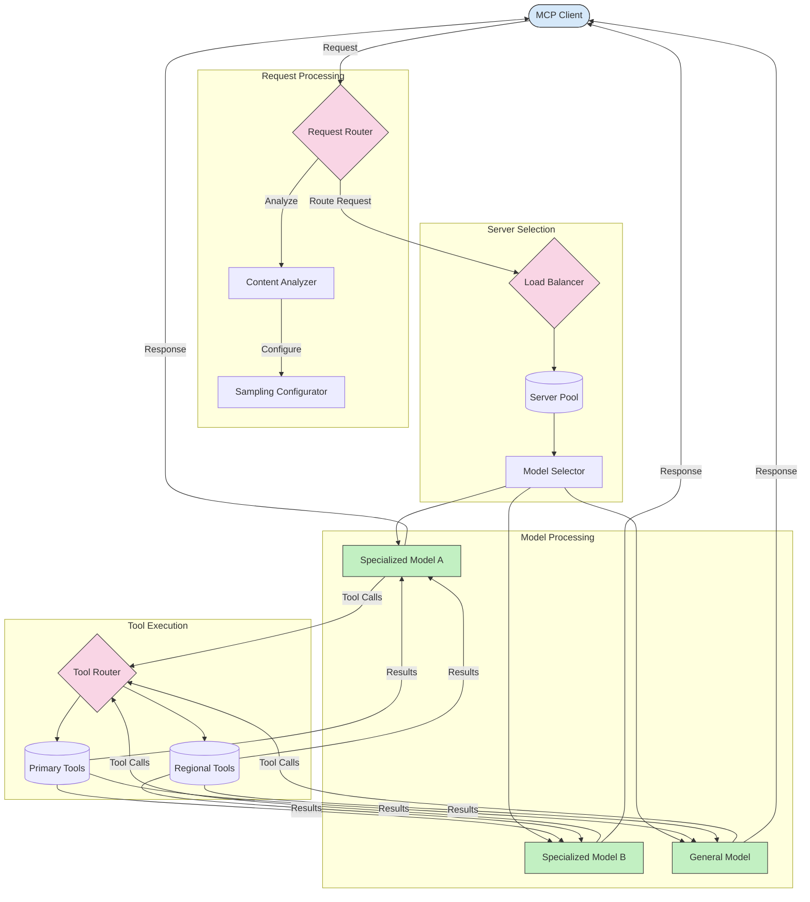

# Routing for Model Context Protocol

Routing na di way wey dem dey take direct requests go di correct models, tools, or services inside MCP ecosystem.

## Introduction

Routing for Model Context Protocol (MCP) na di process wey dem dey use direct requests go di best models or services based on different criteria like di kind content, user context, and system load. E dey help make sure say processing dey sharp and resources no go waste.

## Wetin You Go Learn

By di end of dis lesson, you go fit:

- Sabi di principles of routing for MCP.
- Fit use content-based routing to direct requests go di correct services.
- Apply better load balancing strategies to manage resources well.
- Fit use dynamic tool routing based on di request context.

## Content-Based Routing

Content-based routing dey direct requests go di correct services based on di kind content wey dey di request. For example, if na code generation request, e go go one special code model, but if na creative writing, e go go creative writing model.

Make we see example implementation for different programming languages.

<details>
<summary>.NET</summary>

```csharp
// .NET Example: Content-based routing in MCP
public class ContentBasedRouter
{
    private readonly Dictionary<string, McpClient> _specializedClients;
    private readonly RoutingClassifier _classifier;
    
    public ContentBasedRouter()
    {
        // Initialize specialized clients for different domains
        _specializedClients = new Dictionary<string, McpClient>
        {
            ["code"] = new McpClient("https://code-specialized-mcp.com"),
            ["creative"] = new McpClient("https://creative-specialized-mcp.com"),
            ["scientific"] = new McpClient("https://scientific-specialized-mcp.com"),
            ["general"] = new McpClient("https://general-mcp.com")
        };
        
        // Initialize content classifier
        _classifier = new RoutingClassifier();
    }
    
    public async Task<McpResponse> RouteAndProcessAsync(string prompt, IDictionary<string, object> parameters = null)
    {
        // Classify the prompt to determine the best specialized service
        string category = await _classifier.ClassifyPromptAsync(prompt);
        
        // Get the appropriate client or fall back to general
        var client = _specializedClients.ContainsKey(category) 
            ? _specializedClients[category] 
            : _specializedClients["general"];
            
        Console.WriteLine($"Routing request to {category} specialized service");
        
        // Send request to the selected service
        return await client.SendPromptAsync(prompt, parameters);
    }
    
    // Simple classifier for routing decisions
    private class RoutingClassifier
    {
        public Task<string> ClassifyPromptAsync(string prompt)
        {
            prompt = prompt.ToLowerInvariant();
            
            if (prompt.Contains("code") || prompt.Contains("function") || 
                prompt.Contains("program") || prompt.Contains("algorithm"))
            {
                return Task.FromResult("code");
            }
            
            if (prompt.Contains("story") || prompt.Contains("creative") || 
                prompt.Contains("imagine") || prompt.Contains("design"))
            {
                return Task.FromResult("creative");
            }
            
            if (prompt.Contains("science") || prompt.Contains("research") || 
                prompt.Contains("analyze") || prompt.Contains("study"))
            {
                return Task.FromResult("scientific");
            }
            
            return Task.FromResult("general");
        }
    }
}
```

For di code wey dey up, we don:

- Create `ContentBasedRouter` class wey dey route requests based on di content of di prompt.
- Initialize special clients for different areas (code, creative, scientific, general).
- Put simple classifier wey dey check di category of di prompt and route am go di correct service.
- Add fallback mechanism to send requests go general service if no special service dey.
- Use asynchronous processing to handle requests well.
- Use dictionary to match content categories with special MCP clients.
- Put simple classifier wey dey analyze di prompt and return di correct category.
- Use di special client to send di request and collect response.
- Handle cases wey di prompt no match any special category by sending am go general service.

</details>

## Intelligent Load Balancing

Load balancing dey help manage resources well and make sure say MCP services dey always available. E get different ways to do load balancing, like round-robin, weighted response time, or content-aware strategies.

Make we see example implementation wey dey use di following strategies:

- **Round Robin**: E dey share requests equally among di servers wey dey available.
- **Weighted Response Time**: E dey send requests go servers based on di average time wey dem dey take respond.
- **Content-Aware**: E dey send requests go special servers based on di content of di request.

<details>
<summary>Java</summary>

```java
// Java Example: Intelligent load balancing for MCP servers
public class McpLoadBalancer {
    private final List<McpServerNode> serverNodes;
    private final LoadBalancingStrategy strategy;
    
    public McpLoadBalancer(List<McpServerNode> nodes, LoadBalancingStrategy strategy) {
        this.serverNodes = new ArrayList<>(nodes);
        this.strategy = strategy;
    }
    
    public McpResponse processRequest(McpRequest request) {
        // Select the best server based on strategy
        McpServerNode selectedNode = strategy.selectNode(serverNodes, request);
        
        try {
            // Route the request to the selected node
            return selectedNode.processRequest(request);
        } catch (Exception e) {
            // Handle failure - implement retry or fallback logic
            System.err.println("Error processing request on node " + selectedNode.getId() + ": " + e.getMessage());
            
            // Mark node as potentially unhealthy
            selectedNode.recordFailure();
            
            // Try next best node as fallback
            List<McpServerNode> remainingNodes = new ArrayList<>(serverNodes);
            remainingNodes.remove(selectedNode);
            
            if (!remainingNodes.isEmpty()) {
                McpServerNode fallbackNode = strategy.selectNode(remainingNodes, request);
                return fallbackNode.processRequest(request);
            } else {
                throw new RuntimeException("All MCP server nodes failed to process the request");
            }
        }
    }
    
    // Node health check task
    public void startHealthChecks(Duration interval) {
        ScheduledExecutorService scheduler = Executors.newScheduledThreadPool(1);
        scheduler.scheduleAtFixedRate(() -> {
            for (McpServerNode node : serverNodes) {
                try {
                    boolean isHealthy = node.checkHealth();
                    System.out.println("Node " + node.getId() + " health status: " + 
                                      (isHealthy ? "HEALTHY" : "UNHEALTHY"));
                } catch (Exception e) {
                    System.err.println("Health check failed for node " + node.getId());
                    node.setHealthy(false);
                }
            }
        }, 0, interval.toMillis(), TimeUnit.MILLISECONDS);
    }
    
    // Interface for load balancing strategies
    public interface LoadBalancingStrategy {
        McpServerNode selectNode(List<McpServerNode> nodes, McpRequest request);
    }
    
    // Round-robin strategy
    public static class RoundRobinStrategy implements LoadBalancingStrategy {
        private AtomicInteger counter = new AtomicInteger(0);
        
        @Override
        public McpServerNode selectNode(List<McpServerNode> nodes, McpRequest request) {
            List<McpServerNode> healthyNodes = nodes.stream()
                .filter(McpServerNode::isHealthy)
                .collect(Collectors.toList());
            
            if (healthyNodes.isEmpty()) {
                throw new RuntimeException("No healthy nodes available");
            }
            
            int index = counter.getAndIncrement() % healthyNodes.size();
            return healthyNodes.get(index);
        }
    }
    
    // Weighted response time strategy
    public static class ResponseTimeStrategy implements LoadBalancingStrategy {
        @Override
        public McpServerNode selectNode(List<McpServerNode> nodes, McpRequest request) {
            return nodes.stream()
                .filter(McpServerNode::isHealthy)
                .min(Comparator.comparing(McpServerNode::getAverageResponseTime))
                .orElseThrow(() -> new RuntimeException("No healthy nodes available"));
        }
    }
    
    // Content-aware strategy
    public static class ContentAwareStrategy implements LoadBalancingStrategy {
        @Override
        public McpServerNode selectNode(List<McpServerNode> nodes, McpRequest request) {
            // Determine request characteristics
            boolean isCodeRequest = request.getPrompt().contains("code") || 
                                   request.getAllowedTools().contains("codeInterpreter");
            
            boolean isCreativeRequest = request.getPrompt().contains("creative") || 
                                       request.getPrompt().contains("story");
            
            // Find specialized nodes
            Optional<McpServerNode> specializedNode = nodes.stream()
                .filter(McpServerNode::isHealthy)
                .filter(node -> {
                    if (isCodeRequest && node.getSpecialization().equals("code")) {
                        return true;
                    }
                    if (isCreativeRequest && node.getSpecialization().equals("creative")) {
                        return true;
                    }
                    return false;
                })
                .findFirst();
            
            // Return specialized node or least loaded node
            return specializedNode.orElse(
                nodes.stream()
                    .filter(McpServerNode::isHealthy)
                    .min(Comparator.comparing(McpServerNode::getCurrentLoad))
                    .orElseThrow(() -> new RuntimeException("No healthy nodes available"))
            );
        }
    }
}
```

For di code wey dey up, we don:

- Create `McpLoadBalancer` class wey dey manage list of MCP server nodes and dey route requests based on di load balancing strategy wey dem choose.
- Put different load balancing strategies: `RoundRobinStrategy`, `ResponseTimeStrategy`, and `ContentAwareStrategy`.
- Use `ScheduledExecutorService` to dey check di health of server nodes from time to time.
- Put health check mechanism wey dey mark nodes as healthy or unhealthy based on di response wey dem give.
- Handle request processing with error handling and fallback logic to make sure say service dey always available.
- Use `McpServerNode` class to represent each MCP server node, including di health status, average response time, and current load.
- Create `McpRequest` class to hold request details like di prompt and di tools wey dem allow.
- Use Java Streams to filter and select nodes based on health status and specialization.

</details>

## Dynamic Tool Routing

Tool routing dey make sure say tool calls dey go di correct service based on di context. For example, if na weather tool call, e fit need go regional endpoint based on di user location, or if na calculator tool, e fit need use one specific version of di API.

Make we see example implementation wey dey show dynamic tool routing based on request analysis, regional endpoints, and versioning support.

<details>
<summary>Python</summary>

```python
# Python Example: Dynamic tool routing based on request analysis
class McpToolRouter:
    def __init__(self):
        # Register available tool endpoints
        self.tool_endpoints = {
            "weatherTool": "https://weather-service.example.com/api",
            "calculatorTool": "https://calculator-service.example.com/compute",
            "databaseTool": "https://database-service.example.com/query",
            "searchTool": "https://search-service.example.com/search"
        }
        
        # Regional endpoints for global distribution
        self.regional_endpoints = {
            "us": {
                "weatherTool": "https://us-west.weather-service.example.com/api",
                "searchTool": "https://us.search-service.example.com/search"
            },
            "europe": {
                "weatherTool": "https://eu.weather-service.example.com/api",
                "searchTool": "https://eu.search-service.example.com/search"
            },
            "asia": {
                "weatherTool": "https://asia.weather-service.example.com/api",
                "searchTool": "https://asia.search-service.example.com/search"
            }
        }
        
        # Tool versioning support
        self.tool_versions = {
            "weatherTool": {
                "default": "v2",
                "v1": "https://weather-service.example.com/api/v1",
                "v2": "https://weather-service.example.com/api/v2",
                "beta": "https://weather-service.example.com/api/beta"
            }
        }
    
    async def route_tool_request(self, tool_name, parameters, user_context=None):
        """Route a tool request to the appropriate endpoint based on context"""
        endpoint = self._select_endpoint(tool_name, parameters, user_context)
        
        if not endpoint:
            raise ValueError(f"No endpoint available for tool: {tool_name}")
        
        # Perform the actual request to the selected endpoint
        return await self._execute_tool_request(endpoint, tool_name, parameters)
    
    def _select_endpoint(self, tool_name, parameters, user_context=None):
        """Select the most appropriate endpoint based on context"""
        # Base endpoint from registry
        if tool_name not in self.tool_endpoints:
            return None
            
        base_endpoint = self.tool_endpoints[tool_name]
        
        # Check if we need to use a specific tool version
        if tool_name in self.tool_versions:
            version_info = self.tool_versions[tool_name]
            
            # Use specified version or default
            requested_version = parameters.get("_version", version_info["default"])
            if requested_version in version_info:
                base_endpoint = version_info[requested_version]
        
        # Check for regional routing if user region is known
        if user_context and "region" in user_context:
            user_region = user_context["region"]
            
            if user_region in self.regional_endpoints:
                regional_tools = self.regional_endpoints[user_region]
                
                if tool_name in regional_tools:
                    # Use region-specific endpoint
                    return regional_tools[tool_name]
        
        # Check for data residency requirements
        if user_context and "data_residency" in user_context:
            # This would implement logic to ensure data remains in specified jurisdiction
            pass
        
        # Check for latency-based routing
        if user_context and "latency_sensitive" in user_context and user_context["latency_sensitive"]:
            # This would implement logic to select lowest-latency endpoint
            pass
            
        return base_endpoint
        
    async def _execute_tool_request(self, endpoint, tool_name, parameters):
        """Execute the actual tool request to the selected endpoint"""
        try:
            async with aiohttp.ClientSession() as session:
                async with session.post(
                    endpoint,
                    json={"toolName": tool_name, "parameters": parameters},
                    headers={"Content-Type": "application/json"}
                ) as response:
                    if response.status == 200:
                        result = await response.json()
                        return result
                    else:
                        error_text = await response.text()
                        raise Exception(f"Tool execution failed: {error_text}")
        except Exception as e:
            # Implement retry logic or fallback strategy
            print(f"Error executing tool {tool_name} at {endpoint}: {str(e)}")
            raise
```

For di code wey dey up, we don:

- Create `McpToolRouter` class wey dey manage tool routing based on request analysis, regional endpoints, and versioning support.
- Register di available tool endpoints and regional endpoints for global distribution.
- Put dynamic routing logic wey dey select di correct endpoint based on user context, like region and data residency requirements.
- Add versioning support for tools, so users fit choose di version of di tool wey dem wan use.
- Use asynchronous HTTP requests to run tool calls and handle di responses.

</details>

## Sampling and Routing Architecture for MCP

Sampling na one important part of di Model Context Protocol (MCP) wey dey help process and route requests well. E dey involve analyzing di requests wey dey come in to know di best model or service wey go handle dem, based on things like di kind content, user context, and system load.

If you combine sampling and routing, e go create better architecture wey go manage resources well and make sure say service dey always available. Sampling fit classify requests, while routing go direct dem go di correct models or services.

Di diagram wey dey below dey show how sampling and routing dey work together for MCP architecture:



## Wetin Next

- [5.6 Sampling](../mcp-sampling/README.md)

---

<!-- CO-OP TRANSLATOR DISCLAIMER START -->
**Disclaimer**:  
Dis dokyument don use AI translation service [Co-op Translator](https://github.com/Azure/co-op-translator) do di translation. Even as we dey try make am accurate, abeg sabi say automated translations fit get mistake or no dey correct well. Di original dokyument for im native language na di main source wey you go trust. For important mata, e better make professional human translation dey use. We no go fit take blame for any misunderstanding or wrong interpretation wey fit happen because you use dis translation.
<!-- CO-OP TRANSLATOR DISCLAIMER END -->