# How to Secure AI Workflows: Entra ID Authentication for Model Context Protocol Servers

## Introduction
To secure your Model Context Protocol (MCP) server na like locking your house door. If you leave your MCP server open, e fit make your tools and data dey exposed to people wey no suppose get access, and e fit cause security wahala. Microsoft Entra ID na one strong cloud-based identity and access management solution wey go help make sure say na only people and apps wey suppose dey access your MCP server go fit do am. For this section, you go learn how to protect your AI workflows with Entra ID authentication.

## Wetin You Go Learn
By the time you finish this section, you go sabi:

- Why e dey important to secure MCP servers.
- Wetin Microsoft Entra ID and OAuth 2.0 authentication be.
- The difference between public and confidential clients.
- How to use Entra ID authentication for both local (public client) and remote (confidential client) MCP server setups.
- Security best practices for AI workflows.

## Security and MCP

As you no go leave your house door open, you no suppose leave your MCP server open make anybody fit enter. To secure your AI workflows na one big step to build strong, trustworthy, and safe applications. This chapter go show you how to use Microsoft Entra ID to secure your MCP servers so that na only people and apps wey suppose dey access your tools and data go fit do am.

## Why Security Matter for MCP Servers

Imagine say your MCP server get one tool wey fit send email or enter customer database. If the server no secure, anybody fit use the tool anyhow, and e fit cause wahala like unauthorized data access, spam, or other bad things.

If you use authentication, e go make sure say every request wey come your server go dey verified, so you go sabi who dey make the request. This na the first and most important step to secure your AI workflows.

## Wetin Microsoft Entra ID Be

[**Microsoft Entra ID**](https://adoption.microsoft.com/microsoft-security/entra/) na one cloud-based identity and access management service. Think am like one security guard wey dey protect your apps. E dey handle the hard work of checking who the user be (authentication) and wetin dem fit do (authorization).

If you use Entra ID, you fit:

- Make users sign in securely.
- Protect APIs and services.
- Manage access policies from one place.

For MCP servers, Entra ID na one strong and trusted solution to manage who fit access your server tools.

---

## How Entra ID Authentication Work

Entra ID dey use open standards like **OAuth 2.0** to handle authentication. Even though e fit look complex, the main idea dey simple if you use one example.

### Wetin OAuth 2.0 Be: The Valet Key Example

Think of OAuth 2.0 like valet service for your car. When you reach restaurant, you no go give the valet your main car key. Instead, you go give am **valet key** wey get limited power—e fit start the car and lock the door, but e no fit open the trunk or glove compartment.

For this example:

- **You** na the **User**.
- **Your car** na the **MCP Server** wey get tools and data.
- The **Valet** na **Microsoft Entra ID**.
- The **Parking Attendant** na the **MCP Client** (the app wey wan access the server).
- The **Valet Key** na the **Access Token**.

The access token na one secure text wey the MCP client go collect from Entra ID after you sign in. The client go use this token to make request to the MCP server. The server go check the token to make sure say the request dey legit and the client get permission, all this go happen without the server needing your password.

### How Authentication Flow Work

This na how e dey work:

```mermaid
sequenceDiagram
    actor User as 👤 User
    participant Client as 🖥️ MCP Client
    participant Entra as 🔐 Microsoft Entra ID
    participant Server as 🔧 MCP Server

    Client->>+User: Please sign in to continue.
    User->>+Entra: Enters credentials (username/password).
    Entra-->>Client: Here is your access token.
    User-->>-Client: (Returns to the application)

    Client->>+Server: I need to use a tool. Here is my access token.
    Server->>+Entra: Is this access token valid?
    Entra-->>-Server: Yes, it is.
    Server-->>-Client: Token is valid. Here is the result of the tool.
```



### Wetin Microsoft Authentication Library (MSAL) Be

Before we enter code, make we talk about one important thing wey you go see for the examples: **Microsoft Authentication Library (MSAL)**.

MSAL na library wey Microsoft develop to make authentication easy for developers. Instead of you writing all the hard code to handle security tokens, sign-ins, and refresh sessions, MSAL go do the work for you.

Why you go use MSAL:

- **E Secure:** E dey follow industry-standard protocols and security best practices, so e go reduce risk for your code.
- **E Easy to Use:** E go make OAuth 2.0 and OpenID Connect protocols simple, so you fit add strong authentication to your app with few lines of code.
- **E dey Updated:** Microsoft dey maintain and update MSAL to handle new security threats and platform changes.

MSAL dey support many languages and frameworks like .NET, JavaScript/TypeScript, Python, Java, Go, and mobile platforms like iOS and Android. This mean say you fit use the same authentication method for all your tech stack.

To learn more about MSAL, check the official [MSAL overview documentation](https://learn.microsoft.com/entra/identity-platform/msal-overview).

---

## How to Secure Your MCP Server with Entra ID: Step-by-Step Guide

Make we look how to secure one local MCP server (we dey use `stdio` for communication) with Entra ID. This example go use **public client**, wey fit work for apps wey dey run for user machine, like desktop app or local development server.

### Scenario 1: How to Secure Local MCP Server (Public Client)

For this example, we go look one MCP server wey dey run locally, dey use `stdio` for communication, and dey use Entra ID to authenticate user before e allow access to tools. The server go get one tool wey dey fetch user profile info from Microsoft Graph API.

#### 1. How to Set Up Application for Entra ID

Before you write code, you need to register your app for Microsoft Entra ID. This go tell Entra ID about your app and give am permission to use authentication service.

1. Go **[Microsoft Entra portal](https://entra.microsoft.com/)**.
2. Enter **App registrations** and click **New registration**.
3. Give your app name (e.g., "My Local MCP Server").
4. For **Supported account types**, choose **Accounts in this organizational directory only**.
5. Leave **Redirect URI** blank for this example.
6. Click **Register**.

After registration, write down the **Application (client) ID** and **Directory (tenant) ID**. You go need am for your code.

#### 2. The Code: Breakdown

Make we look the main parts of the code wey dey handle authentication. The full code dey [Entra ID - Local - WAM](https://github.com/Azure-Samples/mcp-auth-servers/tree/main/src/entra-id-local-wam) folder for [mcp-auth-servers GitHub repository](https://github.com/Azure-Samples/mcp-auth-servers).

**`AuthenticationService.cs`**

This class dey handle how e go interact with Entra ID.

- **`CreateAsync`**: E dey initialize `PublicClientApplication` from MSAL. E dey use your app `clientId` and `tenantId`.
- **`WithBroker`**: E dey enable broker (like Windows Web Account Manager) for better single sign-on experience.
- **`AcquireTokenAsync`**: This na the main method. E go first try collect token silently (so user no go need sign in again if session still dey valid). If silent token no work, e go make user sign in interactively.

```csharp
// Simplified for clarity
public static async Task<AuthenticationService> CreateAsync(ILogger<AuthenticationService> logger)
{
    var msalClient = PublicClientApplicationBuilder
        .Create(_clientId) // Your Application (client) ID
        .WithAuthority(AadAuthorityAudience.AzureAdMyOrg)
        .WithTenantId(_tenantId) // Your Directory (tenant) ID
        .WithBroker(new BrokerOptions(BrokerOptions.OperatingSystems.Windows))
        .Build();

    // ... cache registration ...

    return new AuthenticationService(logger, msalClient);
}

public async Task<string> AcquireTokenAsync()
{
    try
    {
        // Try silent authentication first
        var accounts = await _msalClient.GetAccountsAsync();
        var account = accounts.FirstOrDefault();

        AuthenticationResult? result = null;

        if (account != null)
        {
            result = await _msalClient.AcquireTokenSilent(_scopes, account).ExecuteAsync();
        }
        else
        {
            // If no account, or silent fails, go interactive
            result = await _msalClient.AcquireTokenInteractive(_scopes).ExecuteAsync();
        }

        return result.AccessToken;
    }
    catch (Exception ex)
    {
        _logger.LogError(ex, "An error occurred while acquiring the token.");
        throw; // Optionally rethrow the exception for higher-level handling
    }
}
```

**`Program.cs`**

This na where MCP server dey set up and authentication service dey added.

- **`AddSingleton<AuthenticationService>`**: E dey register `AuthenticationService` so other parts of the app fit use am.
- **`GetUserDetailsFromGraph` tool**: This tool dey need `AuthenticationService`. Before e do anything, e go call `authService.AcquireTokenAsync()` to collect valid access token. If authentication work, e go use the token to call Microsoft Graph API and collect user details.

```csharp
// Simplified for clarity
[McpServerTool(Name = "GetUserDetailsFromGraph")]
public static async Task<string> GetUserDetailsFromGraph(
    AuthenticationService authService)
{
    try
    {
        // This will trigger the authentication flow
        var accessToken = await authService.AcquireTokenAsync();

        // Use the token to create a GraphServiceClient
        var graphClient = new GraphServiceClient(
            new BaseBearerTokenAuthenticationProvider(new TokenProvider(authService)));

        var user = await graphClient.Me.GetAsync();

        return System.Text.Json.JsonSerializer.Serialize(user);
    }
    catch (Exception ex)
    {
        return $"Error: {ex.Message}";
    }
}
```

#### 3. How Everything Work Together

1. When MCP client wan use `GetUserDetailsFromGraph` tool, the tool go first call `AcquireTokenAsync`.
2. `AcquireTokenAsync` go make MSAL check for valid token.
3. If token no dey, MSAL go make user sign in with Entra ID account.
4. After user sign in, Entra ID go give access token.
5. The tool go use the token to make secure call to Microsoft Graph API.
6. User details go return to MCP client.

This process go make sure say na only authenticated users fit use the tool, so your local MCP server go dey secure.

### Scenario 2: How to Secure Remote MCP Server (Confidential Client)

If your MCP server dey run for remote machine (like cloud server) and dey use protocol like HTTP Streaming, the security setup go different. For this case, you go use **confidential client** and **Authorization Code Flow**. This method dey more secure because app secrets no go show for browser.

This example dey use TypeScript-based MCP server wey dey use Express.js to handle HTTP requests.

#### 1. How to Set Up Application for Entra ID

The setup for Entra ID dey similar to public client, but you go need create **client secret**.

1. Go **[Microsoft Entra portal](https://entra.microsoft.com/)**.
2. For your app registration, go **Certificates & secrets** tab.
3. Click **New client secret**, give am description, and click **Add**.
4. **Important:** Copy the secret value immediately. You no go fit see am again.
5. You go also configure **Redirect URI**. Go **Authentication** tab, click **Add a platform**, choose **Web**, and enter the redirect URI for your app (e.g., `http://localhost:3001/auth/callback`).

> **⚠️ Important Security Note:** For production apps, Microsoft dey recommend **secretless authentication** methods like **Managed Identity** or **Workload Identity Federation** instead of client secrets. Client secrets fit cause security wahala if dem expose or compromise. Managed identities dey more secure because you no need store credentials for your code or configuration.
>
> To learn more about managed identities, check [Managed identities for Azure resources overview](https://learn.microsoft.com/entra/identity/managed-identities-azure-resources/overview).

#### 2. The Code: Breakdown

This example dey use session-based approach. When user authenticate, the server go store access token and refresh token for session and give user session token. This session token go dey used for next requests. The full code dey [Entra ID - Confidential client](https://github.com/Azure-Samples/mcp-auth-servers/tree/main/src/entra-id-cca-session) folder for [mcp-auth-servers GitHub repository](https://github.com/Azure-Samples/mcp-auth-servers).

**`Server.ts`**

This file dey set up Express server and MCP transport layer.

- **`requireBearerAuth`**: Middleware wey dey protect `/sse` and `/message` endpoints. E dey check for valid bearer token for `Authorization` header.
- **`EntraIdServerAuthProvider`**: Custom class wey dey handle OAuth 2.0 flow.
- **`/auth/callback`**: Endpoint wey dey handle redirect from Entra ID after user authenticate. E dey exchange authorization code for access token and refresh token.

```typescript
// Simplified for clarity
const app = express();
const { server } = createServer();
const provider = new EntraIdServerAuthProvider();

// Protect the SSE endpoint
app.get("/sse", requireBearerAuth({
  provider,
  requiredScopes: ["User.Read"]
}), async (req, res) => {
  // ... connect to the transport ...
});

// Protect the message endpoint
app.post("/message", requireBearerAuth({
  provider,
  requiredScopes: ["User.Read"]
}), async (req, res) => {
  // ... handle the message ...
});

// Handle the OAuth 2.0 callback
app.get("/auth/callback", (req, res) => {
  provider.handleCallback(req.query.code, req.query.state)
    .then(result => {
      // ... handle success or failure ...
    });
});
```

**`Tools.ts`**

This file dey define tools wey MCP server dey provide. The `getUserDetails` tool dey similar to the one for previous example, but e dey collect access token from session.

```typescript
// Simplified for clarity
server.setRequestHandler(CallToolRequestSchema, async (request) => {
  const { name } = request.params;
  const context = request.params?.context as { token?: string } | undefined;
  const sessionToken = context?.token;

  if (name === ToolName.GET_USER_DETAILS) {
    if (!sessionToken) {
      throw new AuthenticationError("Authentication token is missing or invalid. Ensure the token is provided in the request context.");
    }

    // Get the Entra ID token from the session store
    const tokenData = tokenStore.getToken(sessionToken);
    const entraIdToken = tokenData.accessToken;

    const graphClient = Client.init({
      authProvider: (done) => {
        done(null, entraIdToken);
      }
    });

    const user = await graphClient.api('/me').get();

    // ... return user details ...
  }
});
```

**`auth/EntraIdServerAuthProvider.ts`**

This class dey handle:

- Redirect user to Entra ID sign-in page.
- Exchange authorization code for access token.
- Store tokens for `tokenStore`.
- Refresh access token when e expire.

#### 3. How Everything Work Together

1. When user first try connect to MCP server, `requireBearerAuth` middleware go see say dem no get valid session and go redirect dem to Entra ID sign-in page.
2. Di user go sign in wit dia Entra ID account.  
3. Entra ID go redirect di user back to di `/auth/callback` endpoint wit one authorization code.  
4. Di server go use di code exchange am for access token and refresh token, store dem, and create one session token wey dem go send give di client.  
5. Di client fit use dis session token for di `Authorization` header for all di requests wey dem go make to di MCP server later.  
6. Wen di `getUserDetails` tool dey called, e go use di session token find di Entra ID access token, den use dat one call di Microsoft Graph API.  

Dis flow dey more complex pass di public client flow, but e dey necessary for endpoints wey dey face internet. Since remote MCP servers dey accessible for public internet, dem need strong security to protect against unauthorized access and possible attacks.  

## Security Best Practices  

- **Always use HTTPS**: Make sure say di communication between di client and server dey encrypted so dat tokens no go fit dey intercepted.  
- **Implement Role-Based Access Control (RBAC)**: No just check say di user dey authenticated; check wetin dem fit do. You fit define roles for Entra ID and check dem for your MCP server.  
- **Monitor and audit**: Log all di authentication events so you fit detect and respond to any suspicious activity.  
- **Handle rate limiting and throttling**: Microsoft Graph and other APIs dey use rate limiting to stop abuse. Make sure say you implement exponential backoff and retry logic for your MCP server to handle HTTP 429 (Too Many Requests) responses well. You fit also cache data wey people dey access often to reduce API calls.  
- **Secure token storage**: Keep access tokens and refresh tokens safe. For local apps, use di system secure storage. For server apps, think about using encrypted storage or secure key management services like Azure Key Vault.  
- **Token expiration handling**: Access tokens dey expire after some time. Make sure say you implement automatic token refresh wit refresh tokens so users no go need to re-authenticate every time.  
- **Consider using Azure API Management**: Even though implementing security directly for your MCP server dey give you better control, API Gateways like Azure API Management fit handle many of dis security issues automatically, like authentication, authorization, rate limiting, and monitoring. Dem dey provide one centralized security layer wey dey between your clients and your MCP servers. For more info about using API Gateways wit MCP, check [Azure API Management Your Auth Gateway For MCP Servers](https://techcommunity.microsoft.com/blog/integrationsonazureblog/azure-api-management-your-auth-gateway-for-mcp-servers/4402690).  

## Key Takeaways  

- To secure your MCP server dey very important to protect your data and tools.  
- Microsoft Entra ID dey provide strong and scalable solution for authentication and authorization.  
- Use **public client** for local apps and **confidential client** for remote servers.  
- Di **Authorization Code Flow** na di most secure option for web apps.  

## Exercise  

1. Think about one MCP server wey you fit build. E go be local server or remote server?  
2. Based on your answer, you go use public client or confidential client?  
3. Wetin be di permission wey your MCP server go need to perform actions against Microsoft Graph?  

## Hands-on Exercises  

### Exercise 1: Register an Application in Entra ID  
Go di Microsoft Entra portal.  
Register new application for your MCP server.  
Write down di Application (client) ID and Directory (tenant) ID.  

### Exercise 2: Secure a Local MCP Server (Public Client)  
- Follow di code example to integrate MSAL (Microsoft Authentication Library) for user authentication.  
- Test di authentication flow by calling di MCP tool wey dey fetch user details from Microsoft Graph.  

### Exercise 3: Secure a Remote MCP Server (Confidential Client)  
- Register one confidential client for Entra ID and create client secret.  
- Configure your Express.js MCP server to use di Authorization Code Flow.  
- Test di protected endpoints and confirm say token-based access dey work.  

### Exercise 4: Apply Security Best Practices  
- Enable HTTPS for your local or remote server.  
- Implement role-based access control (RBAC) for your server logic.  
- Add token expiration handling and secure token storage.  

## Resources  

1. **MSAL Overview Documentation**  
   Learn how di Microsoft Authentication Library (MSAL) dey enable secure token acquisition across platforms:  
   [MSAL Overview on Microsoft Learn](https://learn.microsoft.com/en-gb/entra/msal/overview)  

2. **Azure-Samples/mcp-auth-servers GitHub Repository**  
   Reference implementations of MCP servers wey dey show authentication flows:  
   [Azure-Samples/mcp-auth-servers on GitHub](https://github.com/Azure-Samples/mcp-auth-servers)  

3. **Managed Identities for Azure Resources Overview**  
   Understand how to remove secrets by using system- or user-assigned managed identities:  
   [Managed Identities Overview on Microsoft Learn](https://learn.microsoft.com/en-us/entra/identity/managed-identities-azure-resources/)  

4. **Azure API Management: Your Auth Gateway for MCP Servers**  
   One deep dive into using APIM as secure OAuth2 gateway for MCP servers:  
   [Azure API Management Your Auth Gateway For MCP Servers](https://techcommunity.microsoft.com/blog/integrationsonazureblog/azure-api-management-your-auth-gateway-for-mcp-servers/4402690)  

5. **Microsoft Graph Permissions Reference**  
   Full list of delegated and application permissions for Microsoft Graph:  
   [Microsoft Graph Permissions Reference](https://learn.microsoft.com/zh-tw/graph/permissions-reference)  

## Learning Outcomes  
After you finish dis section, you go sabi:  

- Explain why authentication dey important for MCP servers and AI workflows.  
- Set up and configure Entra ID authentication for both local and remote MCP server scenarios.  
- Choose di correct client type (public or confidential) based on how your server dey deployed.  
- Implement secure coding practices, including token storage and role-based authorization.  
- Protect your MCP server and di tools wey dey inside from unauthorized access.  

## What's next  

- [5.13 Model Context Protocol (MCP) Integration with Azure AI Foundry](../mcp-foundry-agent-integration/README.md)  

---

<!-- CO-OP TRANSLATOR DISCLAIMER START -->
**Disclaimer**:  
Dis dokyument don use AI transle-shon service [Co-op Translator](https://github.com/Azure/co-op-translator) do di transle-shon. Even as we dey try make am correct, abeg make you sabi say transle-shon wey machine do fit get mistake or no dey accurate well. Di original dokyument for im native language na di one wey you go take as di correct source. For important mata, e good make you use professional human transle-shon. We no go fit take blame for any misunderstanding or wrong interpretation wey fit happen because you use dis transle-shon.
<!-- CO-OP TRANSLATOR DISCLAIMER END -->