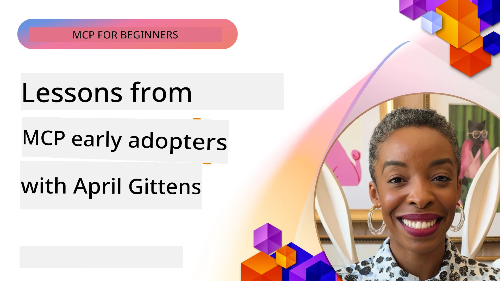

# 🌟 Tin Wey Early Adopters Dem Learn

[](https://youtu.be/jds7dSmNptE)

_(Click di picture wey dey above make you watch di video for dis lesson)_

## 🎯 Wetin Dis Module Dey Cover

Dis module go yarn how real organizations and developers dey use di Model Context Protocol (MCP) take solve real wahala and push innovation. Through correct case studies, hand-on projects, and practical examples, you go sabi how MCP dey enable secure, scalable AI integration wey dey connect language models, tools, and enterprise data.

### 📚 Make You See MCP Work

You want make you see how dem dey apply dis principles for tools wey production dey ready? Check out our [**10 Microsoft MCP Servers Wey Dey Change Developer Productivity**](microsoft-mcp-servers.md), wey show real Microsoft MCP servers wey you fit use today.

## Overview

Dis lesson go show how early adopters don use di Model Context Protocol (MCP) take solve real-world wahala and bring innovation for industries dem. Through detailed case studies and hand-on projects, you go see how MCP dey enable standardized, secure, and scalable AI integration—wey dey connect large language models, tools, and enterprise data for one framework. You go gain practical experience for how to design and build MCP-based solutions, learn from confirmed implementation patterns, and sabi best practices for how to deploy MCP for production environment. Di lesson still highlight emerging trends, future directions, and open-source resources wey go help you dey for front of MCP technology and how e dey grow.

## Learning Objectives

- Analyze real-world MCP implementations for different industries
- Design and build complete MCP-based applications
- Explore new trends and future directions for MCP technology
- Use best practices for real development situations

## Real-world MCP Implementations

### Case Study 1: Enterprise Customer Support Automation

One multinational company use MCP-based solution take standardize AI interactions across their customer support systems. E help dem:

- Create one interface wey unify many LLM providers
- Keep prompt management consistent across departments
- Put strong security and compliance controls
- Easily switch between different AI models depending on wetin dem need

**Technical Implementation:**

```python
# Python MCP server implement for customer support
import logging
import asyncio
from modelcontextprotocol import create_server, ServerConfig
from modelcontextprotocol.server import MCPServer
from modelcontextprotocol.transports import create_http_transport
from modelcontextprotocol.resources import ResourceDefinition
from modelcontextprotocol.prompts import PromptDefinition
from modelcontextprotocol.tool import ToolDefinition

# Set up logging
logging.basicConfig(level=logging.INFO)

async def main():
    # Make server configuration
    config = ServerConfig(
        name="Enterprise Customer Support Server",
        version="1.0.0",
        description="MCP server for handling customer support inquiries"
    )
    
    # Start MCP server
    server = create_server(config)
    
    # Register knowledge base resources
    server.resources.register(
        ResourceDefinition(
            name="customer_kb",
            description="Customer knowledge base documentation"
        ),
        lambda params: get_customer_documentation(params)
    )
    
    # Register prompt templates
    server.prompts.register(
        PromptDefinition(
            name="support_template",
            description="Templates for customer support responses"
        ),
        lambda params: get_support_templates(params)
    )
    
    # Register support tools
    server.tools.register(
        ToolDefinition(
            name="ticketing",
            description="Create and update support tickets"
        ),
        handle_ticketing_operations
    )
    
    # Run server wit HTTP transport
    transport = create_http_transport(port=8080)
    await server.run(transport)

if __name__ == "__main__":
    asyncio.run(main())
```

**Results:** 30% reduction for model costs, 45% better response consistency, and improved compliance for their global work.

### Case Study 2: Healthcare Diagnostic Assistant

One healthcare provider build MCP infrastructure to join multiple specialized medical AI models while making sure say sensitive patient data secure:

- Easy switch between generalist and specialist medical models
- Strong privacy controls plus audit trails
- Join with existing Electronic Health Record (EHR) systems
- Keep prompt engineering consistent for medical talk

**Technical Implementation:**

```csharp
// C# MCP host application implementation in healthcare application
using Microsoft.Extensions.DependencyInjection;
using ModelContextProtocol.SDK.Client;
using ModelContextProtocol.SDK.Security;
using ModelContextProtocol.SDK.Resources;

public class DiagnosticAssistant
{
    private readonly MCPHostClient _mcpClient;
    private readonly PatientContext _patientContext;
    
    public DiagnosticAssistant(PatientContext patientContext)
    {
        _patientContext = patientContext;
        
        // Configure MCP client with healthcare-specific settings
        var clientOptions = new ClientOptions
        {
            Name = "Healthcare Diagnostic Assistant",
            Version = "1.0.0",
            Security = new SecurityOptions
            {
                Encryption = EncryptionLevel.Medical,
                AuditEnabled = true
            }
        };
        
        _mcpClient = new MCPHostClientBuilder()
            .WithOptions(clientOptions)
            .WithTransport(new HttpTransport("https://healthcare-mcp.example.org"))
            .WithAuthentication(new HIPAACompliantAuthProvider())
            .Build();
    }
    
    public async Task<DiagnosticSuggestion> GetDiagnosticAssistance(
        string symptoms, string patientHistory)
    {
        // Create request with appropriate resources and tool access
        var resourceRequest = new ResourceRequest
        {
            Name = "patient_records",
            Parameters = new Dictionary<string, object>
            {
                ["patientId"] = _patientContext.PatientId,
                ["requestingProvider"] = _patientContext.ProviderId
            }
        };
        
        // Request diagnostic assistance using appropriate prompt
        var response = await _mcpClient.SendPromptRequestAsync(
            promptName: "diagnostic_assistance",
            parameters: new Dictionary<string, object>
            {
                ["symptoms"] = symptoms,
                patientHistory = patientHistory,
                relevantGuidelines = _patientContext.GetRelevantGuidelines()
            });
            
        return DiagnosticSuggestion.FromMCPResponse(response);
    }
}
```

**Results:** Better diagnostic suggestions for doctors with full HIPAA compliance and less context-switching between systems.

### Case Study 3: Financial Services Risk Analysis

One financial institution use MCP to standardize their risk analysis process across departments:

- Make one interface wey unify credit risk, fraud detection, and investment risk models
- Put strong access controls and model versioning
- Make auditability dey for all AI recommendations
- Keep consistent data format across different systems

**Technical Implementation:**

```java
// Java MCP server wey dem dey use for assessment of financial risk
import org.mcp.server.*;
import org.mcp.security.*;

public class FinancialRiskMCPServer {
    public static void main(String[] args) {
        // Make MCP server wey get financial compliance features
        MCPServer server = new MCPServerBuilder()
            .withModelProviders(
                new ModelProvider("risk-assessment-primary", new AzureOpenAIProvider()),
                new ModelProvider("risk-assessment-audit", new LocalLlamaProvider())
            )
            .withPromptTemplateDirectory("./compliance/templates")
            .withAccessControls(new SOCCompliantAccessControl())
            .withDataEncryption(EncryptionStandard.FINANCIAL_GRADE)
            .withVersionControl(true)
            .withAuditLogging(new DatabaseAuditLogger())
            .build();
            
        server.addRequestValidator(new FinancialDataValidator());
        server.addResponseFilter(new PII_RedactionFilter());
        
        server.start(9000);
        
        System.out.println("Financial Risk MCP Server running on port 9000");
    }
}
```

**Results:** Better regulatory compliance, 40% faster model deployment, and more consistent risk assessment across departments.

### Case Study 4: Microsoft Playwright MCP Server for Browser Automation

Microsoft build di [Playwright MCP server](https://github.com/microsoft/playwright-mcp) to enable secure, standardized browser automation through di Model Context Protocol. Dis production-ready server let AI agents and LLMs take interact with web browsers in a controlled, auditable, and extensible way—letting use cases like automated web testing, data extraction, and end-to-end workflows.

> **🎯 Production Ready Tool**
> 
> Dis case study show real MCP server wey you fit use today! Learn more about di Playwright MCP Server plus 9 other production-ready Microsoft MCP servers for our [**Microsoft MCP Servers Guide**](microsoft-mcp-servers.md#8--playwright-mcp-server).

**Key Features:**
- Show browser automation powers (navigation, form filling, screenshot capture, etc.) as MCP tools
- Put strong access controls and sandboxing to stop unauthorized action
- Provide detailed audit logs for all browser actions
- Support join with Azure OpenAI and other LLM providers for agent-driven automation
- Power GitHub Copilot's Coding Agent with web browsing powers

**Technical Implementation:**

```typescript
// TypeScript: Dem dey register Playwright browser automation tools inside MCP server
import { createServer, ToolDefinition } from 'modelcontextprotocol';
import { launch } from 'playwright';

const server = createServer({
  name: 'Playwright MCP Server',
  version: '1.0.0',
  description: 'MCP server for browser automation using Playwright'
});

// Register one tool wey go help navigate go URL and capture screenshot
server.tools.register(
  new ToolDefinition({
    name: 'navigate_and_screenshot',
    description: 'Navigate to a URL and capture a screenshot',
    parameters: {
      url: { type: 'string', description: 'The URL to visit' }
    }
  }),
  async ({ url }) => {
    const browser = await launch();
    const page = await browser.newPage();
    await page.goto(url);
    const screenshot = await page.screenshot();
    await browser.close();
    return { screenshot };
  }
);

// Make MCP server start now
server.listen(8080);
```

**Results:**

- Enable secure, programmatic browser automation for AI agents and LLMs
- Cut down manual testing work, improve test coverage for web apps
- Provide reusable, extensible framework for browser-based tool integration for enterprise
- Power GitHub Copilot's web browsing powers

**References:**

- [Playwright MCP Server GitHub Repository](https://github.com/microsoft/playwright-mcp)
- [Microsoft AI and Automation Solutions](https://azure.microsoft.com/en-us/products/ai-services/)

### Case Study 5: Azure MCP – Enterprise-Grade Model Context Protocol as a Service

Azure MCP Server ([https://aka.ms/azmcp](https://aka.ms/azmcp)) na Microsoft’s managed, enterprise-grade Model Context Protocol implementation, designed to provide scalable, secure, and compliant MCP server powers as cloud service. Azure MCP let organizations quickly deploy, manage, and join MCP servers with Azure AI, data, and security services, reduce wahala for operations and speed up AI adoption.

> **🎯 Production Ready Tool**
> 
> Dis na real MCP server wey you fit use today! Learn more about Azure AI Foundry MCP Server for our [**Microsoft MCP Servers Guide**](microsoft-mcp-servers.md).

- Fully managed MCP server hosting with build-in scaling, monitoring, and security
- Native join with Azure OpenAI, Azure AI Search, and other Azure services
- Enterprise authentication and authorization with Microsoft Entra ID
- Support custom tools, prompt templates, and resource connectors
- Comply with enterprise security and regulation demands

**Technical Implementation:**

```yaml
# Example: Azure MCP server deployment configuration (YAML)
apiVersion: mcp.microsoft.com/v1
kind: McpServer
metadata:
  name: enterprise-mcp-server
spec:
  modelProviders:
    - name: azure-openai
      type: AzureOpenAI
      endpoint: https://<your-openai-resource>.openai.azure.com/
      apiKeySecret: <your-azure-keyvault-secret>
  tools:
    - name: document_search
      type: AzureAISearch
      endpoint: https://<your-search-resource>.search.windows.net/
      apiKeySecret: <your-azure-keyvault-secret>
  authentication:
    type: EntraID
    tenantId: <your-tenant-id>
  monitoring:
    enabled: true
    logAnalyticsWorkspace: <your-log-analytics-id>
```

**Results:**  
- Reduce time to value for enterprise AI projects by providing ready-to-use, compliant MCP server platform
- Make integration of LLMs, tools, and enterprise data easier
- Enhance security, observability, and operational efficiency for MCP workloads
- Improve code quality with Azure SDK best practices and current authentication patterns

**References:**  
- [Azure MCP Documentation](https://aka.ms/azmcp)
- [Azure MCP Server GitHub Repository](https://github.com/Azure/azure-mcp)
- [Azure AI Services](https://azure.microsoft.com/en-us/products/ai-services/)
- [Microsoft MCP Center](https://mcp.azure.com)

## Case Study 6: NLWeb 
MCP (Model Context Protocol) na protocol wey dey come strong for Chatbots and AI assistants to interact with tools. Every NLWeb instance be MCP server, wey support one core method, ask, wey e use ask website question with natural language. Di answer wey e return use schema.org, one common vocabulary for describe web data. To explain simply, MCP na NLWeb as Http be to HTML. NLWeb join protocols, Schema.org formats, and sample code to help sites quick create these endpoints, helping humans through conversational interfaces and machines through natural agent-to-agent interaction.

NLWeb get two parts:
- Protocol, wey simple to start with, to interface with site in natural language plus format, wey use json and schema.org for answer wey e return. See docs for REST API for more info.
- Straightforward implementation of (1) wey use existing markup, for sites wey fit be abstracted as item lists (products, recipes, attractions, reviews, etc.). Together with UI widgets, sites fit easily provide conversational interfaces to their content. See docs for Life of a chat query for more details on how e work.
 
**References:**  
- [Azure MCP Documentation](https://aka.ms/azmcp)
- [NLWeb](https://github.com/microsoft/NlWeb)

### Case Study 7: Azure AI Foundry MCP Server – Enterprise AI Agent Integration

Azure AI Foundry MCP servers show how MCP fit help manage AI agents and workflows for enterprise environment. By joining MCP with Azure AI Foundry, organizations fit standardize agent interactions, use Foundry's workflow management, and maintain secure, scalable deployments.

> **🎯 Production Ready Tool**
> 
> Dis na real MCP server wey you fit use today! Learn more about Azure AI Foundry MCP Server for our [**Microsoft MCP Servers Guide**](microsoft-mcp-servers.md#9--azure-ai-foundry-mcp-server).

**Key Features:**
- Full access to Azure's AI ecosystem, including model catalogs and deployment management
- Knowledge indexing with Azure AI Search for RAG applications
- Tools to evaluate AI model performance and quality assurance
- Join with Azure AI Foundry Catalog and Labs for latest research models
- Agent management and evaluation powers for production environments

**Results:**
- Fast prototyping and strong monitoring of AI agent workflows
- Smooth integration with Azure AI services for advanced cases
- One interface for building, deploying, and monitoring agent pipelines
- Better security, compliance, and operational efficiency for enterprises
- Speed up AI adoption while keeping control over complex agent-driven processes

**References:**
- [Azure AI Foundry MCP Server GitHub Repository](https://github.com/azure-ai-foundry/mcp-foundry)
- [Integrating Azure AI Agents with MCP (Microsoft Foundry Blog)](https://devblogs.microsoft.com/foundry/integrating-azure-ai-agents-mcp/)

### Case Study 8: Foundry MCP Playground – Experimentation and Prototyping

The Foundry MCP Playground na ready-to-use environment to experiment with MCP servers and Azure AI Foundry joins. Developers fit quick prototype, test, and evaluate AI models and agent workflows using resources from Azure AI Foundry Catalog and Labs. The playground make setup easy, give sample projects, and support collaborative development, making it easy to check best practices and new cases with small stress. E good for teams wey want validate ideas, share experiments, and learn fast without need for complex infrastructure. By lowering entry barrier, playground help foster innovation and community contributions in MCP and Azure AI Foundry space.

**References:**

- [Foundry MCP Playground GitHub Repository](https://github.com/azure-ai-foundry/foundry-mcp-playground)

### Case Study 9: Microsoft Learn Docs MCP Server – AI-Powered Documentation Access

Microsoft Learn Docs MCP Server na cloud service wey give AI assistants real-time access to official Microsoft docs through Model Context Protocol. This production-ready server connect with Microsoft Learn ecosystem and allow semantic search across all official Microsoft sources.

> **🎯 Production Ready Tool**
> 
> Dis na real MCP server wey you fit use today! Learn more about Microsoft Learn Docs MCP Server for our [**Microsoft MCP Servers Guide**](microsoft-mcp-servers.md#1--microsoft-learn-docs-mcp-server).

**Key Features:**
- Real-time access to official Microsoft, Azure, and Microsoft 365 documentation
- Advanced semantic search wey understand context and intent
- Always up-to-date info as Microsoft Learn content dey publish
- Cover Microsoft Learn, Azure docs, and Microsoft 365 sources well well
- Return up to 10 high-quality content chunks with titles and URLs

**Why E Important:**
- Solve "outdated AI knowledge" problem for Microsoft tech
- Make sure AI assistants get latest .NET, C#, Azure, and Microsoft 365 features
- Give authoritative, first-party info for accurate code generation
- Essential for developers wey dey work with fast-changing Microsoft technologies

**Results:**
- Big improvement for accuracy of AI-generated Microsoft tech code
- Less time to find current documentation and best practices
- Better developer productivity with context-aware docs retrieval
- Smooth integration with development workflow without leaving the IDE

**References:**
- [Microsoft Learn Docs MCP Server GitHub Repository](https://github.com/MicrosoftDocs/mcp)
- [Microsoft Learn Documentation](https://learn.microsoft.com/)

## Hands-on Projects

### Project 1: Build a Multi-Provider MCP Server

**Objective:** Build MCP server wey fit route requests go many AI model providers based on set criteria.

**Requirements:**

- Support at least three model providers (e.g., OpenAI, Anthropic, local models)
- Implement routing logic based on request metadata
- Create configuration system for managing provider credentials
- Add caching to improve performance and reduce cost
- Build simple dashboard to monitor usage

**Implementation Steps:**

1. Setup basic MCP server infrastructure
2. Implement provider adapters for each AI model service
3. Create routing logic based on request attributes
4. Add caching for frequent requests
5. Build the monitoring dashboard
6. Test with different request patterns

**Technologies:** Choose Python (.NET/Java/Python depending on your choice), Redis for caching, and simple web framework for dashboard.

### Project 2: Enterprise Prompt Management System
**Objective:** Develop one MCP-based system wey go manage, version, and deploy prompt templates across one organization.

**Requirements:**

- Create one centralized place wey go keep prompt templates
- Make versioning and approval workflows work
- Build template testing wey fit use sample inputs
- Develop role-based access controls
- Create one API for template retrieval and deployment

**Implementation Steps:**

1. Design di database schema for template storage
2. Create di main API for template CRUD operations
3. Implement di versioning system
4. Build di approval workflow
5. Develop di testing framework
6. Create one simple web interface for management
7. Integrate wit one MCP server

**Technologies:** Choose any backend framework, SQL or NoSQL database, and frontend framework for management interface.

### Project 3: MCP-Based Content Generation Platform

**Objective:** Build platform wey go generate content using MCP to give consistent results across different content types.

**Requirements:**

- Support many content formats (blog posts, social media, marketing copy)
- Make template-based generation wey get customization options
- Create content review and feedback system
- Track content performance metrics
- Support content versioning and iteration

**Implementation Steps:**

1. Set up di MCP client infrastructure
2. Create templates for different content types
3. Build di content generation pipeline
4. Implement di review system
5. Develop di metrics tracking system
6. Create user interface for template management and content generation

**Technologies:** Any programming language wey you like, web framework, and database system.

## Future Directions for MCP Technology

### Emerging Trends

1. **Multi-Modal MCP**
   - MCP go expand to handle interactions wit image, audio, and video models
   - Development of cross-modal reasoning capabilities
   - Standard prompt formats for different modalities

2. **Federated MCP Infrastructure**
   - Distributed MCP networks wey fit share resources across organizations
   - Standard protocols for secure model sharing
   - Privacy-preserving computation techniques

3. **MCP Marketplaces**
   - Ecosystems wey dey share and make money from MCP templates and plugins
   - Quality assurance and certification processes
   - Integration wit model marketplaces

4. **MCP for Edge Computing**
   - Adapt MCP standards for resource-constrained edge devices
   - Optimized protocols for low-bandwidth environments
   - MCP implementations specialized for IoT ecosystems

5. **Regulatory Frameworks**
   - Develop MCP extensions for regulatory compliance
   - Standard audit trails and explainability interfaces
   - Integration wit emerging AI governance frameworks

### MCP Solutions from Microsoft

Microsoft and Azure don develop plenty open-source repositories to help developers implement MCP for different situations:

#### Microsoft Organization

1. [playwright-mcp](https://github.com/microsoft/playwright-mcp) - Playwright MCP server for browser automation and testing
2. [files-mcp-server](https://github.com/microsoft/files-mcp-server) - OneDrive MCP server for local testing and community contributions
3. [NLWeb](https://github.com/microsoft/NlWeb) - NLWeb na collection of open protocols and open source tools. E main focus na to build foundation for AI Web

#### Azure-Samples Organization

1. [mcp](https://github.com/Azure-Samples/mcp) - Links to samples, tools, and resources wey fit build and integrate MCP servers on Azure wit multiple languages
2. [mcp-auth-servers](https://github.com/Azure-Samples/mcp-auth-servers) - Reference MCP servers wey show authentication wit current Model Context Protocol specification
3. [remote-mcp-functions](https://github.com/Azure-Samples/remote-mcp-functions) - Landing page for Remote MCP Server implementations in Azure Functions wit links to language-specific repos
4. [remote-mcp-functions-python](https://github.com/Azure-Samples/remote-mcp-functions-python) - Quickstart template for building and deploying custom remote MCP servers using Azure Functions wit Python
5. [remote-mcp-functions-dotnet](https://github.com/Azure-Samples/remote-mcp-functions-dotnet) - Quickstart template for building and deploying custom remote MCP servers using Azure Functions wit .NET/C#
6. [remote-mcp-functions-typescript](https://github.com/Azure-Samples/remote-mcp-functions-typescript) - Quickstart template for building and deploying custom remote MCP servers using Azure Functions wit TypeScript
7. [remote-mcp-apim-functions-python](https://github.com/Azure-Samples/remote-mcp-apim-functions-python) - Azure API Management as AI Gateway to Remote MCP servers using Python
8. [AI-Gateway](https://github.com/Azure-Samples/AI-Gateway) - APIM ❤️ AI experiments including MCP capabilities, integrating wit Azure OpenAI and AI Foundry

These repositories get different implementations, templates, and resources for working wit Model Context Protocol across different programming languages and Azure services. Dem cover use cases from basic server to authentication, cloud deployment, and enterprise integration.

#### MCP Resources Directory

Di [MCP Resources directory](https://github.com/microsoft/mcp/tree/main/Resources) for official Microsoft MCP repository get curated collection of sample resources, prompt templates, and tool definitions to use with Model Context Protocol servers. This directory dey help developers start MCP quick quick by offering reusable building blocks and beta practice examples for:

- **Prompt Templates:** Ready-to-use prompt templates for common AI tasks and situations, wey fit adapt for your own MCP server
- **Tool Definitions:** Example tool schemas and metadata to standardize tool integration and use across MCP servers
- **Resource Samples:** Example resource definitions for connecting to data sources, APIs, and external services inside MCP framework
- **Reference Implementations:** Practical samples wey show how to structure and organize resources, prompts, and tools for real MCP projects

These resources dey speed development, promote standardization, and help ensure beta practices when building and deploying MCP-based solutions.

#### MCP Resources Directory

- [MCP Resources (Sample Prompts, Tools, and Resource Definitions)](https://github.com/microsoft/mcp/tree/main/Resources)

### Research Opportunities

- Efficient prompt optimization for MCP frameworks
- Security models for multi-tenant MCP deployments
- Performance benchmarking across different MCP implementations
- Formal verification methods for MCP servers

## Conclusion

Model Context Protocol (MCP) dey sharply shape future of standardized, secure, and interoperable AI integration across industries. From di case studies and hands-on projects for this lesson, you don see how early adopters—including Microsoft and Azure—dey leverage MCP to solve real world palava, speed AI adoption, and ensure compliance, security, and scalability. MCP modular approach make organizations fit connect large language models, tools, and enterprise data in one unified, auditable framework. As MCP continue grow, to dey engage wit community, explore open-source resources, and apply beta practices go dey key to build solid, future-ready AI solutions.

## Additional Resources

- [MCP Foundry GitHub Repository](https://github.com/azure-ai-foundry/mcp-foundry)
- [Foundry MCP Playground](https://github.com/azure-ai-foundry/foundry-mcp-playground)
- [Integrating Azure AI Agents with MCP (Microsoft Foundry Blog)](https://devblogs.microsoft.com/foundry/integrating-azure-ai-agents-mcp/)
- [MCP GitHub Repository (Microsoft)](https://github.com/microsoft/mcp)
- [MCP Resources Directory (Sample Prompts, Tools, and Resource Definitions)](https://github.com/microsoft/mcp/tree/main/Resources)
- [MCP Community & Documentation](https://modelcontextprotocol.io/introduction)
- [MCP Specification (2025-11-25)](https://spec.modelcontextprotocol.io/specification/2025-11-25/)
- [Azure MCP Documentation](https://aka.ms/azmcp)
- [OWASP MCP Top 10](https://microsoft.github.io/mcp-azure-security-guide/mcp/) - Security best practices
- [Playwright MCP Server GitHub Repository](https://github.com/microsoft/playwright-mcp)
- [Files MCP Server (OneDrive)](https://github.com/microsoft/files-mcp-server)
- [Azure-Samples MCP](https://github.com/Azure-Samples/mcp)
- [MCP Auth Servers (Azure-Samples)](https://github.com/Azure-Samples/mcp-auth-servers)
- [Remote MCP Functions (Azure-Samples)](https://github.com/Azure-Samples/remote-mcp-functions)
- [Remote MCP Functions Python (Azure-Samples)](https://github.com/Azure-Samples/remote-mcp-functions-python)
- [Remote MCP Functions .NET (Azure-Samples)](https://github.com/Azure-Samples/remote-mcp-functions-dotnet)
- [Remote MCP Functions TypeScript (Azure-Samples)](https://github.com/Azure-Samples/remote-mcp-functions-typescript)
- [Remote MCP APIM Functions Python (Azure-Samples)](https://github.com/Azure-Samples/remote-mcp-apim-functions-python)
- [AI-Gateway (Azure-Samples)](https://github.com/Azure-Samples/AI-Gateway)
- [Microsoft AI and Automation Solutions](https://azure.microsoft.com/en-us/products/ai-services/)

## Exercises

1. Analyze one case study and propose alternative implementation approach.
2. Choose one project idea and create detailed technical specification.
3. Research one industry wey no dey for case studies and outline how MCP fit solve im specific challenges.
4. Explore one future direction and create concept for new MCP extension to support am.

## What's Next

Explore more: [Microsoft MCP Servers](./microsoft-mcp-servers.md)

Continue to: [Module 8: Best Practices](../08-BestPractices/README.md)

---

<!-- CO-OP TRANSLATOR DISCLAIMER START -->
**Disclaimer**:
Dis dokument don translate with AI translation service wey dem call [Co-op Translator](https://github.com/Azure/co-op-translator). Even though we dey try make am correct, abeg sabi say automated translation fit get some errors or wrong tins. Di original dokument wey dem write for im own language na di correct source. If na serious matter, e better make human translator wey sabi di tins translate am. We no go take responsibility if anybody no understand well or if mistake show because of dis translation.
<!-- CO-OP TRANSLATOR DISCLAIMER END -->