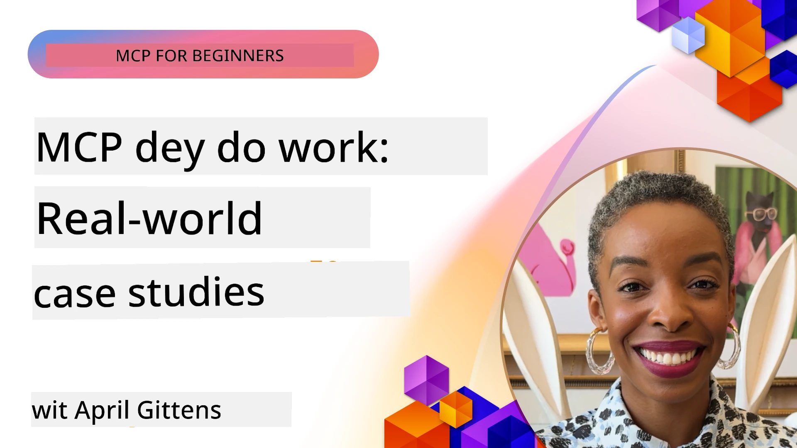

# MCP for Action: Real-World Case Studies

_(Click the image wey dey above to watch video for this lesson)_

Di Model Context Protocol (MCP) dey change how AI applications dey take interact wit data, tools, and services. Dis section dey show real-life case studies wey dey demonstrate wetin MCP fit do for different business palava.

## Overview

Dis section go show correct examples of MCP implementations, to show how organisations dey use dis protocol take solve complex business problems. If you check dis case studies, you go understand how MCP fit work well, how e fit grow, and di real benefits e get for real-life situations.

## Key Learning Objectives

If you explore dis case studies, you go:

- Understand how MCP fit help solve particular business wahala
- Learn different kain integration style and architecture approach
- Know di better way to implement MCP inside business systems
- See the challenges and solutions dem wey happen for real life implementations
- Find ways to apply similar methods for your own projects

## Featured Case Studies

### 1. [Azure AI Travel Agents – Reference Implementation](./travelagentsample.md)

Dis case na Microsoft official reference solution wey show how to build multi-agent, AI-powered travel planning app using MCP, Azure OpenAI, and Azure AI Search. Di project show:

- Multi-agent coordination through MCP
- Enterprise data integration wit Azure AI Search
- Secure and scalable structure using Azure services
- Extensible tools wey get reusable MCP parts
- Conversational user experience powered by Azure OpenAI

Di structure and implementation details go give you beta insight about how to build waka multi-agent systems with MCP as di control layer.

### 2. [Updating Azure DevOps Items from YouTube Data](./UpdateADOItemsFromYT.md)

Dis case show practical way to use MCP for automate workflow. E show how MCP tools fit do:

- Extract data from online sites like YouTube
- Update work items for Azure DevOps systems
- Create repeatable automation workflow dem
- Connect data across different systems

Dis example show as even small small MCP implementation fit bring better efficiency by automat routine work and make data consistent for different systems.

### 3. [Real-Time Documentation Retrieval with MCP](./docs-mcp/README.md)

Dis case study go guide you to connect Python console client to MCP server to fetch and log real-time, context-aware Microsoft documentation. You go learn how to:

- Connect MCP server wit Python client and official MCP SDK
- Use streaming HTTP clients for efficient real-time data fetching
- Call documentation tools on di server and log the response direct to console
- Integrate up-to-date Microsoft documentation for your workflow without comot terminal

Di chapter get hands-on assignment, small working code sample, and tori links for deep learning. See full walkthrough and code for linked chapter to understand how MCP fit change how to access documentation and boost developer productivity for console environment.

### 4. [Interactive Study Plan Generator Web App with MCP](./docs-mcp/README.md)

Dis case show how to build interactive web app using Chainlit and MCP to generate personalized study plans for any subject. Users fit specify subject (like "AI-900 certification") and study duration (like 8 weeks), and di app go give week-by-week content guide. Chainlit dey enable conversational chat interface, making the experience interesting and flexible.

- Conversational web app powered by Chainlit
- User-driven prompts for subject and duration
- Week-by-week content recommendations using MCP
- Real-time, flexible responses inside chat interface

Di project show how conversational AI and MCP fit join body to create active, user-driven education tool inside modern web app.

### 5. [In-Editor Docs with MCP Server in VS Code](./docs-mcp/README.md)

Dis case show how you fit bring Microsoft Learn Docs directly inside your VS Code environment using MCP server—no need to shift browse tab again! You go see how to:

- Immediately search and read docs inside VS Code using MCP panel or command palette
- Reference docs and insert links inside your README or course markdown files
- Use GitHub Copilot and MCP together for smooth AI-powered docs and code workflows
- Validate and improve your docs with live feedback and Microsoft-verified accuracy
- Integrate MCP with GitHub workflow for continuous docs validation

Implementation get:

- Example `.vscode/mcp.json` setup for easy configuration
- Screenshot walkthroughs for in-editor experience
- Tips for combining Copilot and MCP for max productivity

Dis scenario perfect for course authors, document writers, and developers wey wan focus for their editor while dem dey work with docs, Copilot, and validation tool—everything powered by MCP.

### 6. [APIM MCP Server Creation](./apimsample.md)

Dis case dey give step-by-step guide on how to create MCP server using Azure API Management (APIM). E cover:

- Setup MCP server inside Azure API Management
- Expose API operations as MCP tools
- Configure policy dem for rate limiting and security
- Test MCP server with Visual Studio Code and GitHub Copilot

Dis example show how to use Azure power to create strong MCP server wey fit work for many apps, improve AI system integration with enterprise APIs.

### 7. [GitHub MCP Registry — Accelerating Agentic Integration](https://github.com/mcp)

Dis case dey look GitHub MCP Registry wey dem launch for September 2025, to solve big problem for AI ecosystem: scattered discovery and deployment of MCP servers.

#### Overview
**MCP Registry** dey solve di big wahala wey scattered MCP servers for different repos and registries dey bring, wey before dey make integration slow and get error. Dem MCP servers dey help AI agents interact with outside systems like APIs, databases, and document sources.

#### Problem Statement
Developers wey dey build agentic workflows get plenty challenges:
- **Hard to find MCP servers** cross different platforms
- **Repeat questions** scatter for forums and docs
- **Security risk** from unverified and untrusted sources
- **No standards** for server quality and compatibility

#### Solution Architecture
GitHub MCP Registry centralize trusted MCP servers with key features:
- **One-click install** via VS Code to setup sharp sharp
- **Signal-over-noise sorting** by stars, activity, and community validation
- **Direct integration** with GitHub Copilot and other MCP tools
- **Open contribution model** wey allow community and enterprise partners make contributions

#### Business Impact
The registry don bring clear improvements:
- **Faster onboarding** for developers using tools like Microsoft Learn MCP Server, wey streams official docs directly into agents
- **Better productivity** via special servers like `github-mcp-server`, wey enable natural language GitHub automation (PR creation, CI rerun, code scanning)
- **Stronger trust** through curated listings and transparent configuration standards

#### Strategic Value
For practitioners wey specialize for agent lifecycle management and reproducible workflows, MCP Registry provide:
- **Modular agent deployment** with standard parts
- **Registry-backed evaluation pipelines** for consistent testing and validation
- **Cross-tool interoperability** for smooth integration across AI platforms

Dis case show say MCP Registry no be just directory—na base platform for scalable real-world model integration and agentic system deployment.

## Conclusion

Dis seven complete case studies show strong flexiblity and practical use of Model Context Protocol across different real-world business situations. From complex multi-agent travel planning and enterprise API management to streamlined docs workflow and revolutionary GitHub MCP Registry, these examples show how MCP provide standardized and scalable way to connect AI systems with tools, data, and services to deliver top value.

The case studies cover different aspects of MCP:
- **Enterprise Integration**: Azure API Management and Azure DevOps automation
- **Multi-Agent Orchestration**: Travel planning wit coordinated AI agents
- **Developer Productivity**: VS Code integration and live docs access
- **Ecosystem Development**: GitHub MCP Registry as base platform
- **Educational Applications**: Interactive study plans and conversational interfaces

If you study these, you go see:
- **Architecture patterns** for different size and usage
- **Implementation plans** wey balance work and maintainability
- **Security and scalability** concerns for production use
- **Best practices** for MCP server and client integration
- **Ecosystem ideas** for building interconnected AI-powered solutions

Dis examples together show say MCP no be just theory but mature, production-ready protocol wey enable practical solutions to complex business wahala. Whether you dey build simple automation or advanced multi-agent systems, di patterns and approach for here na strong base for your MCP projects.

## Additional Resources

- [Azure AI Travel Agents GitHub Repository](https://github.com/Azure-Samples/azure-ai-travel-agents)
- [Azure DevOps MCP Tool](https://github.com/microsoft/azure-devops-mcp)
- [Playwright MCP Tool](https://github.com/microsoft/playwright-mcp)
- [Microsoft Docs MCP Server](https://github.com/MicrosoftDocs/mcp)
- [GitHub MCP Registry — Accelerating Agentic Integration](https://github.com/mcp)
- [MCP Community Examples](https://github.com/microsoft/mcp)

## What's Next

- Previous: [Module 8: Best Practices](../08-BestPractices/README.md)
- Next: [Module 10: Streamlining AI Workflows: Building an MCP Server with AI Toolkit](../10-StreamliningAIWorkflowsBuildingAnMCPServerWithAIToolkit/README.md)

---

<!-- CO-OP TRANSLATOR DISCLAIMER START -->
**Disclaimer**:
Dis document na wetin AI translation service wey be [Co-op Translator](https://github.com/Azure/co-op-translator) translate. Even though we dey try make everything correct, abeg sabi say automated translation fit get mistake or no too correct. The og document wey e start from for e own language still be the correct one. For important mata, make person wey sabi translate am humanly do am. We no go responsible if anybody misundersand or commot wrong meaning from this translation.
<!-- CO-OP TRANSLATOR DISCLAIMER END -->