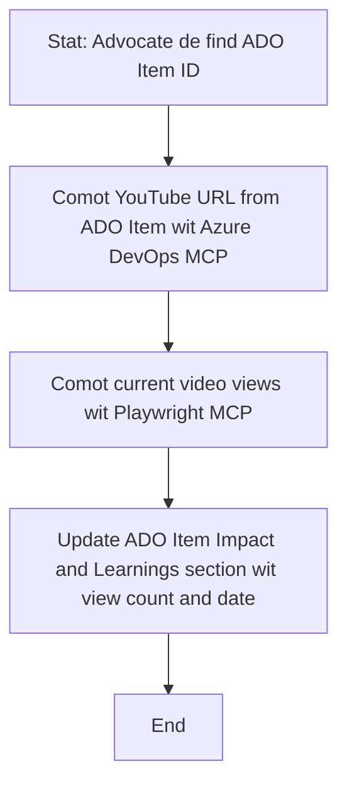

# Case Study: Updating Azure DevOps Items from YouTube Data with MCP

> **Disclaimer:** Dem get existing online tools and reports we fit automate how person dey update Azure DevOps items with data from platform dem like YouTube. The scenario wey follow na example to show how MCP tools fit dey use for automation and integration work.

## Overview

Dis case study show one example of how Model Context Protocol (MCP) and im tools fit take automate the process to update Azure DevOps (ADO) work items with info we dem fit source from online platforms, like YouTube. The scenario wey dem talk na only one example of how these tools dey work, and you fit use am for many other similar automation works.

For dis example, one Advocate dey track online sessions with ADO items, and every item get YouTube video URL inside am. By using MCP tools, the Advocate fit keep ADO items up-to-date with the latest video metrics, like how many people don view am, inside automatic and repeatable way. You fit generalize this to other use cases wey need to join info from online source into ADO or other systems.

## Scenario

One Advocate dey responsible to dey track how online sessions and community engagement dey impact. Every session na ADO work item wey dem record for 'DevRel' project, and the work item get field wey carry YouTube video URL. To fit report the session reach well, the Advocate need update the ADO item with correct number of video views and the date when the info dem collect.

## Tools Used

- [Azure DevOps MCP](https://github.com/microsoft/azure-devops-mcp): E dey allow programmatic access and update to ADO work items using MCP.
- [Playwright MCP](https://github.com/microsoft/playwright-mcp): E dey automate browser actions to comot live data from web pages, like YouTube video stats.

## Step-by-Step Workflow

1. **Identify the ADO Item**: Start with the ADO work item ID (example, 1234) for the 'DevRel' project.
2. **Retrieve the YouTube URL**: Use Azure DevOps MCP tool to carry out the YouTube URL for the work item.
3. **Extract Video Views**: Use Playwright MCP tool to waka go the YouTube URL and comot the current view count.
4. **Update the ADO Item**: Write the latest view count and the date wey you collect the info inside the 'Impact and Learnings' part of the ADO work item with Azure DevOps MCP tool.

## Example Prompt

```bash
- Work with the ADO Item ID: 1234
- The project is '2025-Awesome'
- Get the YouTube URL for the ADO item
- Use Playwright to get the current views from the YouTube video
- Update the ADO item with the current video views and the updated date of the information
```

## Mermaid Flowchart


## Technical Implementation

- **MCP Orchestration**: MCP server dey manage how to use both Azure DevOps MCP and Playwright MCP tools well.
- **Automation**: Dem fit trigger the process manually or arrange am to run at intervals to make sure ADO items dey always up to date.
- **Extensibility**: You fit use the same pattern to update ADO items with other online metrics (like likes, comments) or from other platforms.

## Results and Impact

- **Efficiency**: E reduce manual work for Advocates by automating how dem de collect and update video metrics.
- **Accuracy**: E make sure say ADO items get the most correct data wey dey available from online sources.
- **Repeatability**: E get reusable workflow wey fit work for similar things wey concern other data source or metrics.

## References

- [Azure DevOps MCP](https://github.com/microsoft/azure-devops-mcp)
- [Playwright MCP](https://github.com/microsoft/playwright-mcp)
- [Model Context Protocol (MCP)](https://modelcontextprotocol.io/)

## What's Next

- Back to: [Case Studies Overview](./README.md)
- Next: [Real-Time Documentation Retrieval with MCP](./docs-mcp/README.md)

---

<!-- CO-OP TRANSLATOR DISCLAIMER START -->
**Disclaimer**:
Dis document don translate wit AI translation service wey dem dey call [Co-op Translator](https://github.com/Azure/co-op-translator). Even though we try make am correct, abeg sabi say automated translation fit get some mistake or no too correct. Di original document wey dey dia language na di oga wey pass. If na important information, better make human professional translate am. We no go carry any blame if person misunderstand or interpret am wrongly because of dis translation.
<!-- CO-OP TRANSLATOR DISCLAIMER END -->