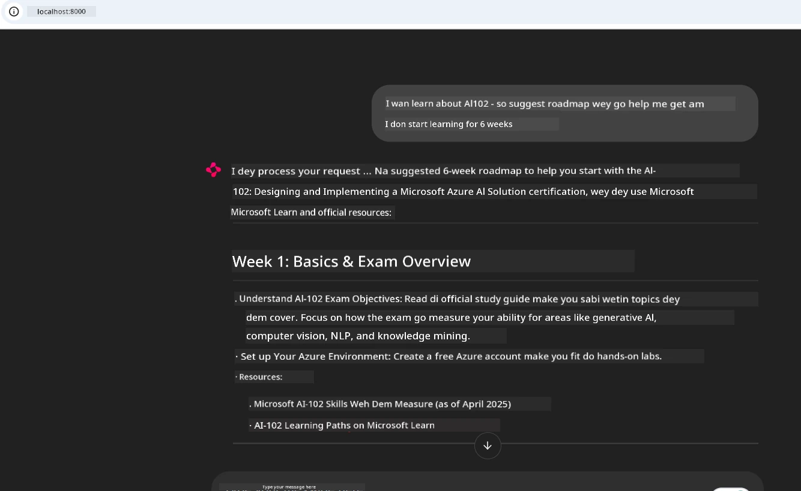

# Case Study: How to Connect to Microsoft Learn Docs MCP Server from Client

You don tire dey waka between documentation sites, Stack Overflow, plus plenti tabs for search engine, all dis while you dey try fix problem for your code? Maybe you get another monitor just for docs, or you dey dey fast fast dey switch between your IDE and browser. E no go beta if you fit carry the documentation enter your workflow—join am inside your apps, your IDE, or even your own custom tools? For dis case study, we go show how to do am by connecting directly to Microsoft Learn Docs MCP server from your own client app.

## Overview

Modern development no be just to write code—e mean say you go find correct info when you need am. Documentation dey everywhere, but e no dey where you need am most: inside your tools and workflows. If you join documentation retrieval direct inside your apps, you fit save time, reduce change of context, and improve productivity. For dis part, we go show you how to connect client to Microsoft Learn Docs MCP server, so you fit get real-time, context-aware documentation without leave your app.

We go waka you through how to establish connection, send request, and handle streaming response well well. Dis way no go only make your workflow smooth but also open road to build better developer tools.

## Learning Objectives

Why we dey do dis? Na because the best developer experience na dem wey no dey cause wahala. Imagine say your code editor, chatbot, or web app fit answer your documentation questions sharp sharp, using the latest content from Microsoft Learn. By the time you finish this chapter, you go sabi how to:

- Understand basics of MCP server-client communication for documentation
- Build console or web app to connect to Microsoft Learn Docs MCP server
- Use streaming HTTP client for real-time documentation retrieval
- Log and understand documentation responses for your app

You go see how these skills fit help you build tools wey no be just reactive, but truly interactive and context-aware.

## Scenario 1 - Real-Time Documentation Retrieval with MCP

For dis scenario, we go show you how to connect client to Microsoft Learn Docs MCP server, so you fit get real-time, context-aware documentation without leave your app.

Make we try do am. Your work na to write app wey go connect to Microsoft Learn Docs MCP server, call `microsoft_docs_search` tool, and log streaming response for console.

### Why dis approach?
Because na the base to build advanced integration—whether you want power chatbot, IDE extension, or web dashboard.

You go find code and instructions for dis scenario inside [`solution`](./solution/README.md) folder for this case study. The steps go guide you for connection setup:
- Use official MCP SDK plus streamable HTTP client connect
- Call `microsoft_docs_search` tool with query parameter to get documentation
- Do correct logging and error handling
- Build interactive console interface wey allow users put multiple search queries

Dis scenario show how to:
- Connect to Docs MCP server
- Send query
- Parse and print results

See how running the solution fit look:

```
Prompt> What is Azure Key Vault?
Answer> Azure Key Vault is a cloud service for securely storing and accessing secrets. ...
```

Below na minimal sample solution. Full code and detail dey for solution folder.

<details>
<summary>Python</summary>

```python
import asyncio
from mcp.client.streamable_http import streamablehttp_client
from mcp import ClientSession

async def main():
    async with streamablehttp_client("https://learn.microsoft.com/api/mcp") as (read_stream, write_stream, _):
        async with ClientSession(read_stream, write_stream) as session:
            await session.initialize()
            result = await session.call_tool("microsoft_docs_search", {"query": "Azure Functions best practices"})
            print(result.content)

if __name__ == "__main__":
    asyncio.run(main())
```

- For full implementation and logging, check [`scenario1.py`](../../../../09-CaseStudy/docs-mcp/solution/python/scenario1.py).
- For installation and usage instructions, see [`README.md`](./solution/python/README.md) for same folder.
</details>


## Scenario 2 - Interactive Study Plan Generator Web App with MCP

For dis scenario, you go learn how to join Docs MCP inside web development project. The aim na to make users fit search Microsoft Learn documentation directly from web interface, so documentation go dey quick reach inside your app or site.

You go see how to:
- Setup web app
- Connect to Docs MCP server
- Handle user input and show results

See how solution fit look:

```
User> I want to learn about AI102 - so suggest the roadmap to get it started from learn for 6 weeks

Assistant> Here’s a detailed 6-week roadmap to start your preparation for the AI-102: Designing and Implementing a Microsoft Azure AI Solution certification, using official Microsoft resources and focusing on exam skills areas:

---
## Week 1: Introduction & Fundamentals
- **Understand the Exam**: Review the [AI-102 exam skills outline](https://learn.microsoft.com/en-us/credentials/certifications/exams/ai-102/).
- **Set up Azure**: Sign up for a free Azure account if you don't have one.
- **Learning Path**: [Introduction to Azure AI services](https://learn.microsoft.com/en-us/training/modules/intro-to-azure-ai/)
- **Focus**: Get familiar with Azure portal, AI capabilities, and necessary tools.

....more weeks of the roadmap...

Let me know if you want module-specific recommendations or need more customized weekly tasks!
```

Below na minimal sample solution. Full code and detail dey for solution folder.



<details>
<summary>Python (Chainlit)</summary>

Chainlit na framework for building conversational AI web apps. E make am easy to build interactive chatbots and assistants wey fit call MCP tools and show results real time. E good for quick prototype and user-friendly interfaces.

```python
import chainlit as cl
import requests

MCP_URL = "https://learn.microsoft.com/api/mcp"

@cl.on_message
def handle_message(message):
    query = {"question": message}
    response = requests.post(MCP_URL, json=query)
    if response.ok:
        result = response.json()
        cl.Message(content=result.get("answer", "No answer found.")).send()
    else:
        cl.Message(content="Error: " + response.text).send()
```

- For full implementation, check [`scenario2.py`](../../../../09-CaseStudy/docs-mcp/solution/python/scenario2.py).
- For setup and running instructions, see [`README.md`](./solution/python/README.md).
</details>


## Scenario 3: In-Editor Docs with MCP Server in VS Code

If you want make Microsoft Learn Docs dey directly inside your VS Code (instead of dey switch browser tabs), you fit use MCP server for your editor. Dis one allow you:
- Search and read docs inside VS Code without leave your coding environment.
- Reference documentation and put links directly inside your README or course files.
- Use GitHub Copilot and MCP together to get smooth AI-powered documentation workflow.

**You go learn how to:**
- Add valid `.vscode/mcp.json` file to your workspace root (check example below).
- Open MCP panel or use command palette inside VS Code to search and put docs.
- Reference documentation direct inside markdown files as you dey work.
- Combine this workflow with GitHub Copilot to boost productivity more.

Here na example on how to setup MCP server inside VS Code:

```json
{
  "servers": {
    "LearnDocsMCP": {
      "url": "https://learn.microsoft.com/api/mcp"
    }
  }
}
```

</details>

> For detailed walkthrough with screenshots and step-by-step guide, see [`README.md`](./solution/scenario3/README.md).


Dis one good for people wey dey build technical courses, write documentation, or develop code wey need plenty referencing.

## Key Takeaways

To integrate documentation direct inside your tools no be just convenience—it dey boost productivity well well. By connecting to Microsoft Learn Docs MCP server from your client, you fit:

- Stop dey change between your code and documentation
- Get up-to-date, context-aware docs for real time
- Build smarter, more interactive developer tools

These skills go help you create solutions wey no only efficient, but also sweet to use.

## Additional Resources

To sabi well well, explore these official resources:

- [Microsoft Learn Docs MCP Server (GitHub)](https://github.com/MicrosoftDocs/mcp)
- [Get started with Azure MCP Server (mcp-python)](https://learn.microsoft.com/en-us/azure/developer/azure-mcp-server/get-started#create-the-python-app)
- [Wetin be Azure MCP Server?](https://learn.microsoft.com/en-us/azure/developer/azure-mcp-server/)
- [Model Context Protocol (MCP) Introduction](https://modelcontextprotocol.io/introduction)
- [Add plugins from MCP Server (Python)](https://learn.microsoft.com/en-us/semantic-kernel/concepts/plugins/adding-mcp-plugins)

## What's Next

- Go back to: [Case Studies Overview](../README.md)
- Continue to: [Module 10: Streamlining AI Workflows with AI Toolkit](../../10-StreamliningAIWorkflowsBuildingAnMCPServerWithAIToolkit/README.md)

---

<!-- CO-OP TRANSLATOR DISCLAIMER START -->
**Disclaimer**:
Dis document na AI translation service [Co-op Translator](https://github.com/Azure/co-op-translator) wey translate am. Even though we dey try make e correct, abeg sabi say automated translation fit get errors or mistakes. The original document wey e dey for im own language na im be the correct source. If na important information, e better make human professional translate am. We no go responsible if pesin misunderstand or use this translation wrong.
<!-- CO-OP TRANSLATOR DISCLAIMER END -->