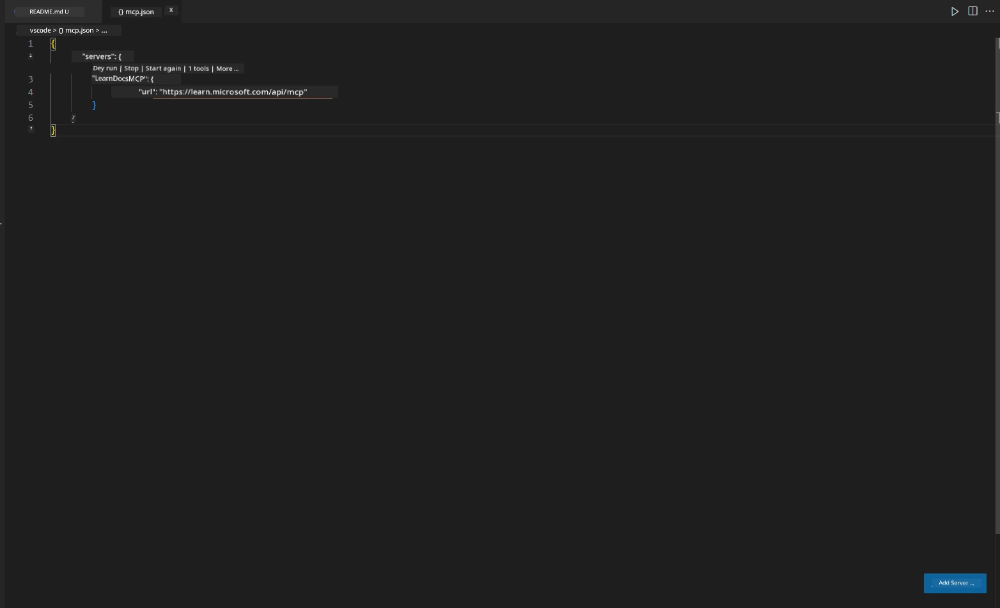
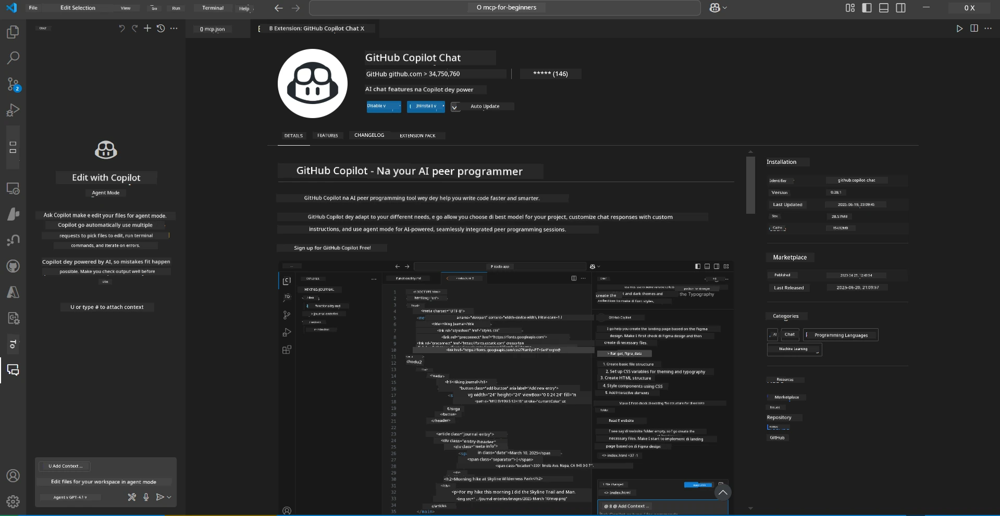
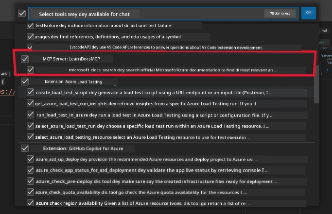
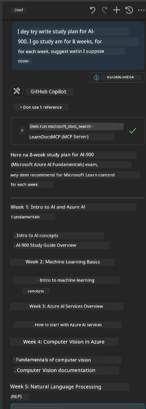
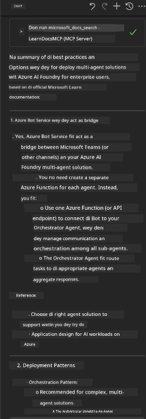

# Scenario 3: In-Editor Docs wit MCP Server for VS Code

## Overview

For dis scenario, you go learn how you fit carry Microsoft Learn Docs enter your Visual Studio Code environment using MCP server. Instead of dey jump from one browser tab to another dey find documentation, you fit access, search, and use official docs directly inside your editor. Dis method go make your work smooth, keep you focused, and e go fit work well with tools like GitHub Copilot.

- Search and read docs inside VS Code without comot your coding environment.
- Use documentation and put links directly for your README or course files.
- Combine GitHub Copilot and MCP together for smooth, AI-powered documentation workflow.

## Learning Objectives

By the time you finish dis chapter, you go sabi how to set up and use MCP server inside VS Code to make your documentation and development workflow better. You go fit:

- Set up your workspace to use MCP server for documentation lookup.
- Search and put documentation directly from inside VS Code.
- Combine GitHub Copilot power and MCP for better, AI-augmented workflow.

Dis skills go help you stay focused, make your documentation better, and increase your productivity as developer or technical writer.

## Solution

To fit access documentation inside editor, you go follow some steps wey go connect MCP server with VS Code and GitHub Copilot. Dis solution dey perfect for course authors, documentation writers, and developers wey wan stay focused inside editor while dem dey work with docs and Copilot.

- Quickly add reference links to README while you dey write course or project documentation.
- Use Copilot to generate code and MCP to find and use relevant docs fast.
- Stay focused inside your editor and increase productivity.

### Step-by-Step Guide

To start, follow dis steps. For each step, you fit add screenshot from assets folder to show how e dey work.

1. **Add MCP configuration:**
   For your project root, create `.vscode/mcp.json` file and add dis configuration:
   ```json
   {
     "servers": {
       "LearnDocsMCP": {
         "url": "https://learn.microsoft.com/api/mcp"
       }
     }
   }
   ```
   Dis configuration dey tell VS Code how e go connect to [`Microsoft Learn Docs MCP server`](https://github.com/MicrosoftDocs/mcp).
   
   
    
2. **Open GitHub Copilot Chat panel:**
   If you never install GitHub Copilot extension, go Extensions view for VS Code and install am. You fit download am directly from [Visual Studio Code Marketplace](https://marketplace.visualstudio.com/items?itemName=GitHub.copilot-chat). Then, open Copilot Chat panel from sidebar.

   

3. **Enable agent mode and check tools:**
   For Copilot Chat panel, enable agent mode.

   

   After you enable agent mode, check say MCP server dey listed as one of the available tools. Dis one go make sure say Copilot agent fit access documentation server to bring correct information.
   
   
4. **Start new chat and ask agent:**
   Open new chat for Copilot Chat panel. You fit now ask the agent your documentation questions. The agent go use MCP server to bring and show relevant Microsoft Learn documentation directly inside your editor.

   - *"I dey try write study plan for topic X. I wan study am for 8 weeks, for each week, suggest content wey I go fit take."*

   

5. **Live Query:**

   > Make we take live query from [#get-help](https://discord.gg/D6cRhjHWSC) section for Azure AI Foundry Discord ([view original message](https://discord.com/channels/1113626258182504448/1385498306720829572)):
   
   *"I dey find answers on how to deploy multi-agent solution with AI agents wey dem develop for Azure AI Foundry. I see say no direct deployment method dey, like Copilot Studio channels. So, wetin be the different ways to do dis deployment for enterprise users to interact and finish the work?
Plenty articles/blogs dey wey talk say we fit use Azure Bot service to do dis work wey go act as bridge between MS teams and Azure AI Foundry Agents, well e go work if I set up Azure bot wey connect to Orchestrator Agent for Azure AI Foundry via Azure function to do the orchestration or I need to create Azure function for each AI agent wey dey part of multi-agent solution to do the orchestration for Bot framework? Any other suggestions dey welcome.
"*

   

   The agent go respond with relevant documentation links and summaries, wey you fit put directly inside your markdown files or use as references for your code.
   
### Sample Queries

Try dis example queries. Dis queries go show how MCP server and Copilot fit work together to give instant, context-aware documentation and references without comot VS Code:

- "Show me how to use Azure Functions triggers."
- "Insert link to official documentation for Azure Key Vault."
- "Wetin be best practices for securing Azure resources?"
- "Find quickstart for Azure AI services."

Dis queries go show how MCP server and Copilot fit work together to give instant, context-aware documentation and references without comot VS Code.

---

---

<!-- CO-OP TRANSLATOR DISCLAIMER START -->
**Disclaimer**:  
Dis dokyument don use AI transle-shon service [Co-op Translator](https://github.com/Azure/co-op-translator) do di transle-shon. Even as we dey try make am accurate, abeg make you sabi say transle-shon wey machine do fit get mistake or no dey correct well. Di original dokyument for di language wey dem write am first na di one wey you go take as di correct source. For important mata, e good make you use professional human transle-shon. We no go fit take blame for any misunderstanding or wrong interpretation wey fit happen because you use dis transle-shon.
<!-- CO-OP TRANSLATOR DISCLAIMER END -->