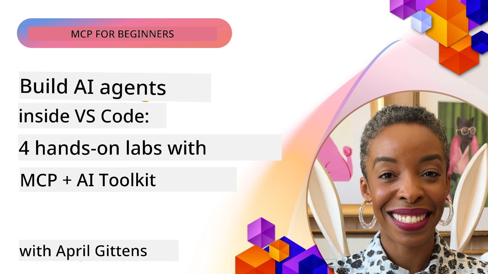

# Streamlining AI Workflows: Building an MCP Server with AI Toolkit

## 🎯  Overview

_(Click di piksha wey dey above to watch video for dis lesson)_

Welcome to di **Model Context Protocol (MCP) Workshop**! Dis kain hands-on workshop combine two top latest technologies wey go change how person dey build AI application dem:

- **🔗 Model Context Protocol (MCP)**: One open standard for easy AI-tool work together
- **🛠️ AI Toolkit for Visual Studio Code (AITK)**: Microsoft strong AI development extension

### 🎓 Wetin You Go Learn

By di time you don finish dis workshop, you go sabi how to build smart applications wey fit join AI models with real-world tools and services. From automated testing reach custom API integrations, you go get skills to fit solve serious business wahala.

## 🏗️ Technology Stack

### 🔌 Model Context Protocol (MCP)

MCP na di **"USB-C for AI"** - na universal standard wey dey connect AI models to other tools and data sources.

**✨ Main Features:**

- 🔄 **Standardized Integration**: Universal interface to join AI-tool together
- 🏛️ **Flexible Architecture**: Local and remote servers wey dey use stdio/SSE transport
- 🧰 **Rich Ecosystem**: Tools, prompts, and resources inside one protocol
- 🔒 **Enterprise-Ready**: Security and reliability inside

**🎯 Why MCP Matter:**
Just like USB-C stop cable wahala, MCP stop the trouble of AI integration. One protocol, plenty possibilities.

### 🤖 AI Toolkit for Visual Studio Code (AITK)

Microsoft AI development extension wey fit turn VS Code into AI powerhouse.

**🚀 Core Bana:**

- 📦 **Model Catalog**: Access models from Azure AI, GitHub, Hugging Face, Ollama
- ⚡ **Local Inference**: ONNX-optimized CPU/GPU/NPU running
- 🏗️ **Agent Builder**: Visual AI agent development with MCP connection
- 🎭 **Multi-Modal**: Text, vision, and structured output support

**💡 Development Benefits:**

- No wahala model deployment
- Visual prompt engineering
- Real-time testing playground
- Smooth MCP server join

## 📚 Learning Journey

### [🚀 Module 1: AI Toolkit Fundamentals](./lab1/README.md)

**Duration**: 15 minutes

- 🛠️ Install and configure AI Toolkit for VS Code
- 🗂️ Check out Model Catalog (100+ models from GitHub, ONNX, OpenAI, Anthropic, Google)
- 🎮 Master di Interactive Playground for real-time model testing
- 🤖 Build your first AI agent with Agent Builder
- 📊 Check model performance with built-in metrics (F1, relevance, similarity, coherence)
- ⚡ Learn batch processing and multi-modal support skill dem

**🎯 Learning Outcome**: Build proper AI agent with full understanding of AITK functions

### [🌐 Module 2: MCP with AI Toolkit Fundamentals](./lab2/README.md)

**Duration**: 20 minutes

- 🧠 Understand Model Context Protocol (MCP) architecture and ideas
- 🌐 Explore Microsoft MCP server setup
- 🤖 Build browser automation agent using Playwright MCP server
- 🔧 Join MCP servers with AI Toolkit Agent Builder
- 📊 Configure and test MCP tools inside your agents
- 🚀 Export and deploy MCP-powered agents for production

**🎯 Learning Outcome**: Deploy AI agent wey dey powered by external tools through MCP

### [🔧 Module 3: Advanced MCP Development with AI Toolkit](./lab3/README.md)

**Duration**: 20 minutes

- 💻 Build custom MCP servers using AI Toolkit
- 🐍 Configure and use latest MCP Python SDK (v1.9.3)
- 🔍 Setup and use MCP Inspector for debugging
- 🛠️ Build Weather MCP Server with professional debugging workflow
- 🧪 Debug MCP servers for both Agent Builder and Inspector environment

**🎯 Learning Outcome**: Develop and debug custom MCP servers with modern tools

### [🐙 Module 4: Practical MCP Development - Custom GitHub Clone Server](./lab4/README.md)

**Duration**: 30 minutes

- 🏗️ Build real-world GitHub Clone MCP Server for development workflow
- 🔄 Implement smart repository cloning with validation and error handling
- 📁 Create intelligent directory management and VS Code integration
- 🤖 Use GitHub Copilot Agent Mode with custom MCP tools
- 🛡️ Apply production-ready reliability and cross-platform compatibility

**🎯 Learning Outcome**: Deploy production-ready MCP server wey go simplify real development workflow

## 💡 Real-World Applications & Impact

### 🏢 Enterprise Use Cases

#### 🔄 DevOps Automation

Change your development workflow with smart automation:

- **Smart Repository Management**: AI-powered code review and merge decisions
- **Intelligent CI/CD**: Automated pipeline improvement based on code changes
- **Issue Triage**: Automatic bug classification and assignment

#### 🧪 Quality Assurance Revolution

Improve testing with AI automation:

- **Smart Test Generation**: Automatically create full test suites
- **Visual Regression Testing**: AI-powered UI change detection
- **Performance Monitoring**: Early issue detection and fixing

#### 📊 Data Pipeline Intelligence

Build smarter data processing workflow:

- **Adaptive ETL Processes**: Self-optimizing data transformation
- **Anomaly Detection**: Real-time data quality checking
- **Smart Routing**: Smart data flow management

#### 🎧 Customer Experience Enhancement

Make top customer interaction:

- **Context-Aware Support**: AI agents get access to customer history
- **Proactive Issue Solution**: Predict customer service issues
- **Multi-Channel Integration**: Unified AI experience across different platforms

## 🛠️ Prerequisites & Setup

### 💻 System Requirements

| Component | Requirement | Notes |
|-----------|-------------|-------|
| **Operating System** | Windows 10+, macOS 10.15+, Linux | Any modern OS |
| **Visual Studio Code** | Latest stable version | Needed for AITK |
| **Node.js** | v18.0+ and npm | For MCP server development |
| **Python** | 3.10+ | Optional for Python MCP servers |
| **Memory** | 8GB RAM minimum | 16GB recommended for local models |

### 🔧 Development Environment

#### Recommended VS Code Extensions

- **AI Toolkit** (ms-windows-ai-studio.windows-ai-studio)
- **Python** (ms-python.python)
- **Python Debugger** (ms-python.debugpy)
- **GitHub Copilot** (GitHub.copilot) - Optional but useful

#### Optional Tools

- **uv**: Modern Python package manager
- **MCP Inspector**: Visual debugging tool for MCP servers
- **Playwright**: For web automation examples

## 🎖️ Learning Outcomes & Certification Path

### 🏆 Skill Mastery Checklist

After you finish dis workshop, you go fit master:

#### 🎯 Core Competencies

- [ ] **MCP Protocol Mastery**: Understand architecture and implementation patterns well well
- [ ] **AITK Proficiency**: Expert in AI Toolkit for quick development
- [ ] **Custom Server Development**: Build, deploy, and maintain production MCP servers
- [ ] **Tool Integration Excellence**: Join AI with existing development workflow smoothly
- [ ] **Problem-Solving Application**: Use learned skills to handle real business issues

#### 🔧 Technical Skills

- [ ] Setup and configure AI Toolkit in VS Code
- [ ] Design and build custom MCP servers
- [ ] Join GitHub Models with MCP architecture
- [ ] Build automated testing workflow with Playwright
- [ ] Deploy AI agents for production
- [ ] Debug and improve MCP server performance

#### 🚀 Advanced Capabilities

- [ ] Build enterprise-scale AI integrations
- [ ] Use good security practice for AI apps
- [ ] Design scalable MCP server architectures
- [ ] Build custom tool chains for specific areas
- [ ] Mentor others in AI-native development

## 📖 Additional Resources

- [MCP Specification (2025-11-25)](https://spec.modelcontextprotocol.io/specification/2025-11-25/)
- [AI Toolkit GitHub Repository](https://github.com/microsoft/vscode-ai-toolkit)
- [Sample MCP Servers Collection](https://github.com/modelcontextprotocol/servers)
- [Best Practices Guide](https://modelcontextprotocol.io/docs/best-practices)
- [OWASP MCP Top 10](https://microsoft.github.io/mcp-azure-security-guide/mcp/) - Security best practices

---

**🚀 Ready to change your AI development workflow?**

Make we build future intelligent applications together with MCP and AI Toolkit!

## What's Next

Continue to: [Module 11: MCP Server Hands-On Labs](../11-MCPServerHandsOnLabs/README.md)

---

<!-- CO-OP TRANSLATOR DISCLAIMER START -->
**Disclaimer**:
Dis document don translate wit AI translation service [Co-op Translator](https://github.com/Azure/co-op-translator). Even though we dey try make am correct, abeg sabi sey automated translations fit get error or wahala. Di original document wey e dey for im own language na di correct tin. If na important information, e good make person get professional human translation. We no go take responsibility for any misunderstanding or wrong meaning wey fit show because of dis translation.
<!-- CO-OP TRANSLATOR DISCLAIMER END -->