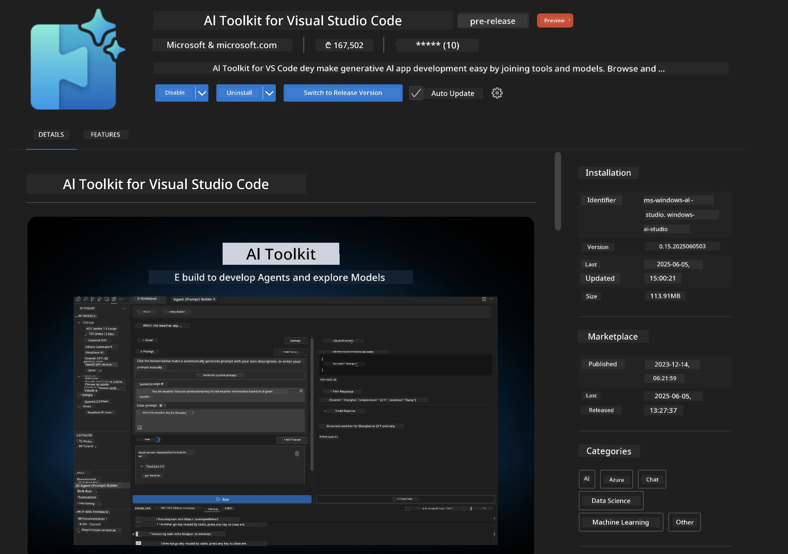
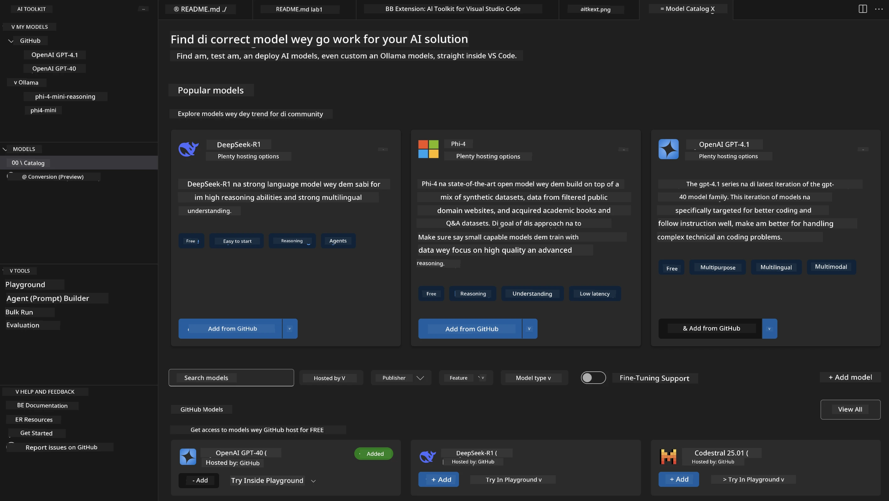
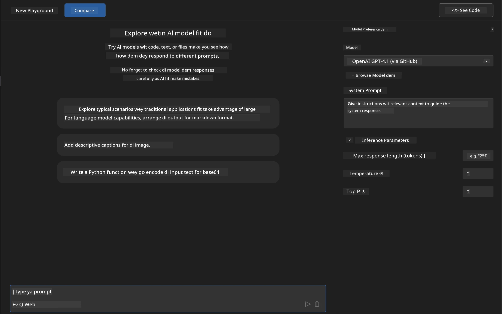
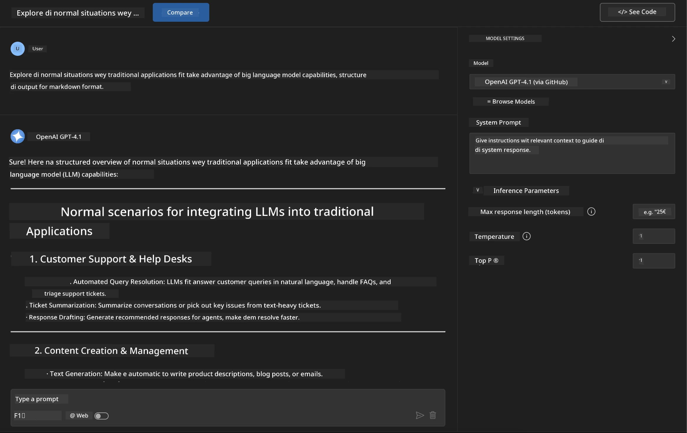
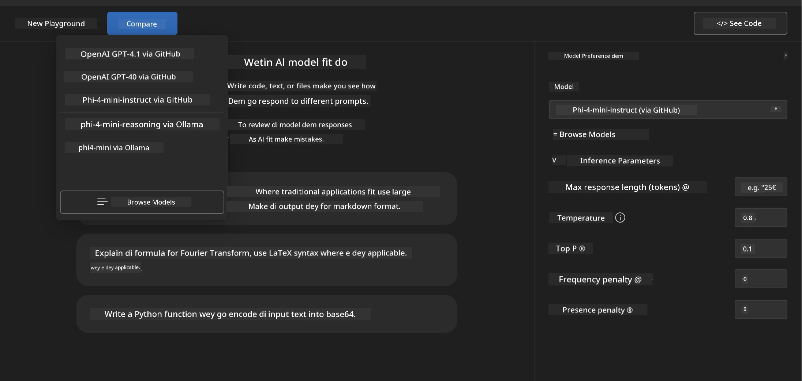
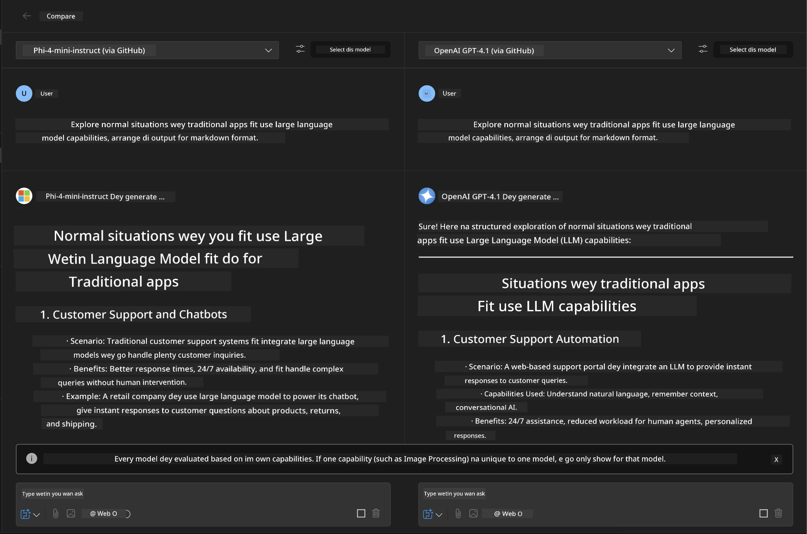
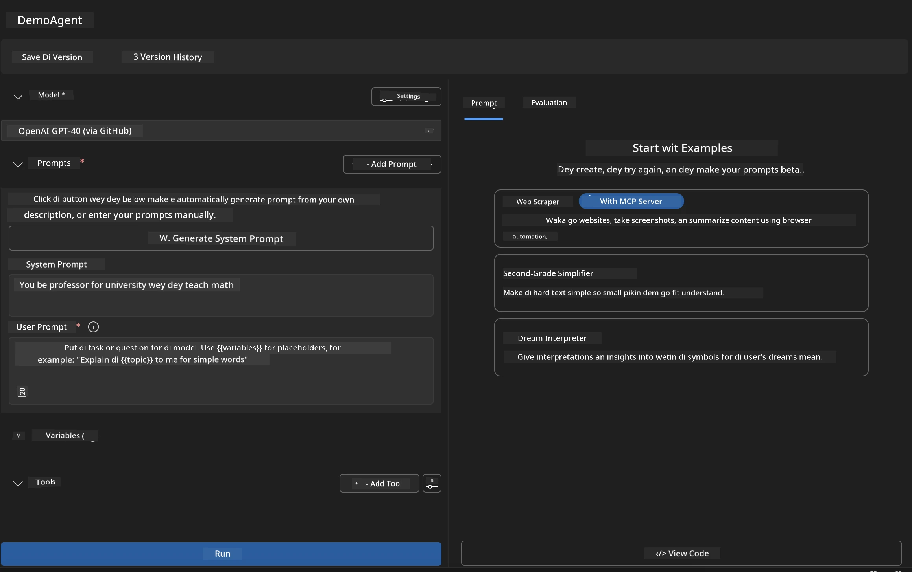
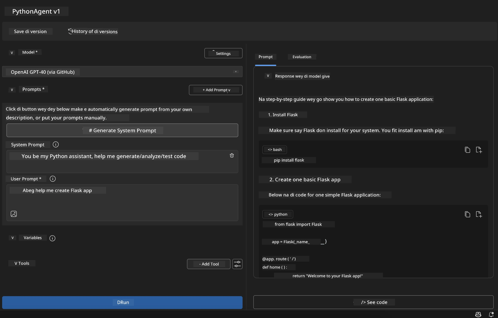

# 🚀 Module 1: AI Toolkit Fundamentals

[]()
[]()
[]()

## 📋 Wetin You Go Learn

By di end of dis module, you go sabi:
- ✅ How to install and set up AI Toolkit for Visual Studio Code
- ✅ How to waka through di Model Catalog and sabi di different model sources
- ✅ How to use di Playground to test and experiment wit models
- ✅ How to create custom AI agents wit Agent Builder
- ✅ How to compare di performance of models from different providers
- ✅ Di best way to do prompt engineering

## 🧠 Wetin Be AI Toolkit (AITK)

Di **AI Toolkit for Visual Studio Code** na Microsoft main extension wey dey turn VS Code into one complete AI development environment. E dey connect di gap between AI research and practical application development, making generative AI easy for developers wey get any level of skill.

### 🌟 Di Main Things We AI Toolkit Fit Do

| Feature | Wetin E Do | Wetin E Fit Help You Do |
|---------|-------------|----------|
| **🗂️ Model Catalog** | Access over 100 models from GitHub, ONNX, OpenAI, Anthropic, Google | Find and choose models |
| **🔌 BYOM Support** | Add your own models (local/remote) | Deploy custom models |
| **🎮 Interactive Playground** | Test models live wit chat interface | Quick prototyping and testing |
| **📎 Multi-Modal Support** | Work wit text, images, and attachments | Build complex AI applications |
| **⚡ Batch Processing** | Run many prompts at di same time | Test workflows fast |
| **📊 Model Evaluation** | Built-in metrics (F1, relevance, similarity, coherence) | Check model performance |

### 🎯 Why AI Toolkit Important

- **🚀 Fast Development**: Move from idea to prototype quick
- **🔄 One Workflow**: Use one interface for many AI providers
- **🧪 Easy Testing**: Compare models without wahala
- **📈 Ready for Production**: Move from prototype to deployment smooth

## 🛠️ Wetin You Need & How to Set Up

### 📦 Install AI Toolkit Extension

**Step 1: Go Extensions Marketplace**
1. Open Visual Studio Code
2. Go di Extensions view (`Ctrl+Shift+X` or `Cmd+Shift+X`)
3. Search "AI Toolkit"

**Step 2: Choose di Version We You Want**
- **🟢 Release**: Good for production use
- **🔶 Pre-release**: Early access to new features

**Step 3: Install and Activate**



### ✅ Verification Checklist
- [ ] AI Toolkit icon dey di VS Code sidebar
- [ ] Extension don activate
- [ ] No installation error dey di output panel

## 🧪 Hands-on Exercise 1: Explore GitHub Models

**🎯 Goal**: Learn how to use di Model Catalog and test your first AI model

### 📊 Step 1: Waka Through di Model Catalog

Di Model Catalog na di place wey you go find plenty AI models. E dey bring models from different providers together so you fit compare and choose.

**🔍 How to Navigate:**

Click **MODELS - Catalog** for di AI Toolkit sidebar



**💡 Pro Tip**: Look for models wey get di features wey fit your work (e.g., code generation, creative writing, analysis).

**⚠️ Note**: GitHub-hosted models (GitHub Models) dey free but e get limit for requests and tokens. If you wan use models wey no dey GitHub (like Azure AI or other endpoints), you go need API key or authentication.

### 🚀 Step 2: Add and Set Up Your First Model

**How to Choose Model:**
- **GPT-4.1**: Good for complex reasoning and analysis
- **Phi-4-mini**: Fast response for simple tasks

**🔧 How to Set Up:**
1. Choose **OpenAI GPT-4.1** from di catalog
2. Click **Add to My Models** - e go register di model for use
3. Choose **Try in Playground** to open di testing environment
4. Wait for di model to initialize (e fit take small time for first setup)



**⚙️ Understand Model Parameters:**
- **Temperature**: E control creativity (0 = predictable, 1 = creative)
- **Max Tokens**: Di longest response wey di model fit give
- **Top-p**: E dey help make response diverse

### 🎯 Step 3: Sabi di Playground Interface

Di Playground na di place wey you fit test AI models. Here na how to use am well:

**🎨 Prompt Engineering Tips:**
1. **Be Clear**: Give di model clear instructions
2. **Add Context**: Put background info wey go help di model
3. **Use Examples**: Show di model wetin you want wit examples
4. **Refine**: Adjust prompts based on di first results

**🧪 Testing Scenarios:**
```markdown
# Example 1: Code Generation
"Write a Python function that calculates the factorial of a number using recursion. Include error handling and docstrings."

# Example 2: Creative Writing
"Write a professional email to a client explaining a project delay, maintaining a positive tone while being transparent about challenges."

# Example 3: Data Analysis
"Analyze this sales data and provide insights: [paste your data]. Focus on trends, anomalies, and actionable recommendations."
```



### 🏆 Challenge Exercise: Compare Model Performance

**🎯 Goal**: Test different models wit di same prompt to see di difference

**📋 Instructions:**
1. Add **Phi-4-mini** to your workspace
2. Use di same prompt for GPT-4.1 and Phi-4-mini



3. Compare di response quality, speed, and accuracy
4. Write down wetin you find for di results section



**💡 Wetin You Go Learn:**
- When to use LLM vs SLM
- Di balance between cost and performance
- Di special features of different models

## 🤖 Hands-on Exercise 2: Build Custom Agents wit Agent Builder

**🎯 Goal**: Create AI agents wey dey fit specific tasks and workflows

### 🏗️ Step 1: Wetin Be Agent Builder

Agent Builder na di place wey AI Toolkit dey shine well. E dey help you create AI assistants wey dey combine di power of large language models wit custom instructions, special settings, and knowledge.

**🧠 Agent Architecture:**
- **Core Model**: Di main LLM (GPT-4, Groks, Phi, etc.)
- **System Prompt**: E dey define di agent personality and behavior
- **Parameters**: Fine-tune settings for better performance
- **Tools Integration**: Connect external APIs and MCP services
- **Memory**: Keep conversation context and session info



### ⚙️ Step 2: How to Set Up Agent

**🎨 Create Good System Prompts:**
```markdown
# Template Structure:
## Role Definition
You are a [specific role] with expertise in [domain].

## Capabilities
- List specific abilities
- Define scope of knowledge
- Clarify limitations

## Behavior Guidelines
- Response style (formal, casual, technical)
- Output format preferences
- Error handling approach

## Examples
Provide 2-3 examples of ideal interactions
```

*You fit also use Generate System Prompt to make AI help you create and improve prompts*

**🔧 Optimize Parameters:**
| Parameter | Range We You Fit Use | Wetin E Fit Do |
|-----------|------------------|----------|
| **Temperature** | 0.1-0.3 | For technical/factual answers |
| **Temperature** | 0.7-0.9 | For creative/brainstorming tasks |
| **Max Tokens** | 500-1000 | For short answers |
| **Max Tokens** | 2000-4000 | For detailed explanations |

### 🐍 Step 3: Practical Exercise - Python Programming Agent

**🎯 Mission**: Create one Python coding assistant

**📋 How to Set Up:**

1. **Choose Model**: Pick **Claude 3.5 Sonnet** (e dey good for code)

2. **Design System Prompt**:
```markdown
# Python Programming Expert Agent

## Role
You are a senior Python developer with 10+ years of experience. You excel at writing clean, efficient, and well-documented Python code.

## Capabilities
- Write production-ready Python code
- Debug complex issues
- Explain code concepts clearly
- Suggest best practices and optimizations
- Provide complete working examples

## Response Format
- Always include docstrings
- Add inline comments for complex logic
- Suggest testing approaches
- Mention relevant libraries when applicable

## Code Quality Standards
- Follow PEP 8 style guidelines
- Use type hints where appropriate
- Handle exceptions gracefully
- Write readable, maintainable code
```

3. **Set Parameters**:
   - Temperature: 0.2 (for consistent, reliable code)
   - Max Tokens: 2000 (for detailed explanations)
   - Top-p: 0.9 (balanced creativity)



### 🧪 Step 4: Test Your Python Agent

**Test Scenarios:**
1. **Simple Function**: "Write function to find prime numbers"
2. **Complex Algorithm**: "Create binary search tree wit insert, delete, and search methods"
3. **Real-world Problem**: "Make web scraper wey fit handle rate limiting and retries"
4. **Debugging**: "Fix dis code [paste buggy code]"

**🏆 Wetin Go Show Say E Work:**
- ✅ Code dey run well
- ✅ E get proper documentation
- ✅ E follow Python best practices
- ✅ E explain well
- ✅ E suggest better ways

## 🎓 Module 1 Wrap-Up & Wetin Next

### 📊 Test Wetin You Don Learn

Check yourself:
- [ ] You fit explain di difference between models for di catalog?
- [ ] You don create and test custom agent?
- [ ] You sabi how to set parameters for different tasks?
- [ ] You fit design good system prompts?

### 📚 Extra Resources

- **AI Toolkit Documentation**: [Official Microsoft Docs](https://github.com/microsoft/vscode-ai-toolkit)
- **Prompt Engineering Guide**: [Best Practices](https://platform.openai.com/docs/guides/prompt-engineering)
- **Models in AI Toolkit**: [Models in Develpment](https://github.com/microsoft/vscode-ai-toolkit/blob/main/doc/models.md)

**🎉 Congrats!** You don sabi di basics of AI Toolkit and you ready to build advanced AI applications!

### 🔜 Move to Next Module

Ready for di next level? Go **[Module 2: MCP with AI Toolkit Fundamentals](../lab2/README.md)** wey go teach you:
- How to connect agents to external tools wit Model Context Protocol (MCP)
- How to build browser automation agents wit Playwright
- How to integrate MCP servers wit your AI Toolkit agents
- How to make your agents stronger wit external data and features

---

<!-- CO-OP TRANSLATOR DISCLAIMER START -->
**Disclaimer**:  
Dis docu don use AI translation service [Co-op Translator](https://github.com/Azure/co-op-translator) take translate am. Even though we dey try make sure say e correct, abeg no forget say automatic translation fit get mistake or no dey accurate well. Di original docu for di language wey dem write am first na di main correct one. For important information, e better make professional human translator check am. We no go fit take blame for any misunderstanding or wrong interpretation wey fit happen because of dis translation.
<!-- CO-OP TRANSLATOR DISCLAIMER END -->