# 🌐 Module 2: MCP wit AI Toolkit Fundamentals

[]()
[]()
[]()

## 📋 Wetin You Go Learn

By di end of dis module, you go sabi:
- ✅ Understand Model Context Protocol (MCP) architecture and di benefits
- ✅ Check Microsoft MCP server ecosystem
- ✅ Connect MCP servers wit AI Toolkit Agent Builder
- ✅ Build browser automation agent wey dey work well wit Playwright MCP
- ✅ Configure and test MCP tools inside your agents
- ✅ Export and deploy MCP-powered agents for production use

## 🎯 Building on Module 1

For Module 1, we don learn AI Toolkit basics and create our first Python Agent. Now we go **supercharge** your agents by connecting dem to external tools and services wit di revolutionary **Model Context Protocol (MCP)**.

E be like upgrading from calculator to full computer - your AI agents go fit:
- 🌐 Browse and interact wit websites
- 📁 Access and manipulate files
- 🔧 Connect wit enterprise systems
- 📊 Process real-time data from APIs

## 🧠 Understanding Model Context Protocol (MCP)

### 🔍 Wetin Be MCP?

Model Context Protocol (MCP) na di **"USB-C for AI applications"** - e be open standard wey dey connect Large Language Models (LLMs) to external tools, data sources, and services. Just like how USB-C clear cable wahala wit one universal connector, MCP dey clear AI integration wahala wit one standardized protocol.

### 🎯 Di Problem Wey MCP Dey Solve

**Before MCP:**
- 🔧 Custom integration for every tool
- 🔄 Vendor lock-in wit proprietary solutions  
- 🔒 Security wahala from ad-hoc connections
- ⏱️ Months to develop basic integrations

**Wit MCP:**
- ⚡ Plug-and-play tool integration
- 🔄 Vendor-agnostic architecture
- 🛡️ Security best practices dey inside
- 🚀 Minutes to add new capabilities

### 🏗️ MCP Architecture Deep Dive

MCP dey use **client-server architecture** wey dey create secure, scalable ecosystem:

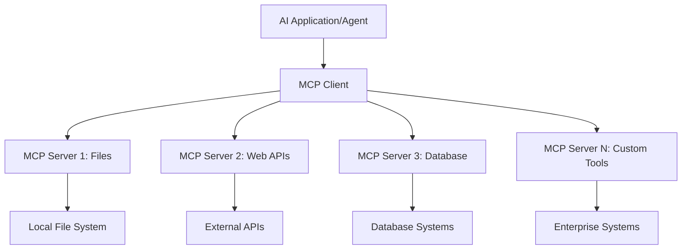

**🔧 Core Components:**

| Component | Role | Examples |
|-----------|------|----------|
| **MCP Hosts** | Applications wey dey use MCP services | Claude Desktop, VS Code, AI Toolkit |
| **MCP Clients** | Protocol handlers (1:1 wit servers) | Built into host applications |
| **MCP Servers** | Expose capabilities via standard protocol | Playwright, Files, Azure, GitHub |
| **Transport Layer** | Communication methods | stdio, HTTP, WebSockets |

## 🏢 Microsoft's MCP Server Ecosystem

Microsoft dey lead di MCP ecosystem wit enterprise-grade servers wey dey solve real business problems.

### 🌟 Featured Microsoft MCP Servers

#### 1. ☁️ Azure MCP Server
**🔗 Repository**: [azure/azure-mcp](https://github.com/azure/azure-mcp)
**🎯 Purpose**: Manage Azure resources wit AI integration

**✨ Key Features:**
- Declarative infrastructure provisioning
- Real-time resource monitoring
- Cost optimization recommendations
- Security compliance checking

**🚀 Use Cases:**
- Infrastructure-as-Code wit AI help
- Automated resource scaling
- Cloud cost optimization
- DevOps workflow automation

#### 2. 📊 Microsoft Dataverse MCP
**📚 Documentation**: [Microsoft Dataverse Integration](https://go.microsoft.com/fwlink/?linkid=2320176)
**🎯 Purpose**: Natural language interface for business data

**✨ Key Features:**
- Natural language database queries
- Business context understanding
- Custom prompt templates
- Enterprise data governance

**🚀 Use Cases:**
- Business intelligence reporting
- Customer data analysis
- Sales pipeline insights
- Compliance data queries

#### 3. 🌐 Playwright MCP Server
**🔗 Repository**: [microsoft/playwright-mcp](https://github.com/microsoft/playwright-mcp)
**🎯 Purpose**: Browser automation and web interaction

**✨ Key Features:**
- Cross-browser automation (Chrome, Firefox, Safari)
- Intelligent element detection
- Screenshot and PDF generation
- Network traffic monitoring

**🚀 Use Cases:**
- Automated testing workflows
- Web scraping and data extraction
- UI/UX monitoring
- Competitive analysis automation

#### 4. 📁 Files MCP Server
**🔗 Repository**: [microsoft/files-mcp-server](https://github.com/microsoft/files-mcp-server)
**🎯 Purpose**: Intelligent file system operations

**✨ Key Features:**
- Declarative file management
- Content synchronization
- Version control integration
- Metadata extraction

**🚀 Use Cases:**
- Documentation management
- Code repository organization
- Content publishing workflows
- Data pipeline file handling

#### 5. 📝 MarkItDown MCP Server
**🔗 Repository**: [microsoft/markitdown](https://github.com/microsoft/markitdown)
**🎯 Purpose**: Advanced Markdown processing

**✨ Key Features:**
- Rich Markdown parsing
- Format conversion (MD ↔ HTML ↔ PDF)
- Content structure analysis
- Template processing

**🚀 Use Cases:**
- Technical documentation workflows
- Content management systems
- Report generation
- Knowledge base automation

#### 6. 📈 Clarity MCP Server
**📦 Package**: [@microsoft/clarity-mcp-server](https://www.npmjs.com/package/@microsoft/clarity-mcp-server)
**🎯 Purpose**: Web analytics and user behavior insights

**✨ Key Features:**
- Heatmap data analysis
- User session recordings
- Performance metrics
- Conversion funnel analysis

**🚀 Use Cases:**
- Website optimization
- User experience research
- A/B testing analysis
- Business intelligence dashboards

### 🌍 Community Ecosystem

Apart from Microsoft servers, MCP ecosystem get:
- **🐙 GitHub MCP**: Repository management and code analysis
- **🗄️ Database MCPs**: PostgreSQL, MySQL, MongoDB integrations
- **☁️ Cloud Provider MCPs**: AWS, GCP, Digital Ocean tools
- **📧 Communication MCPs**: Slack, Teams, Email integrations

## 🛠️ Hands-On Lab: Build Browser Automation Agent

**🎯 Project Goal**: Create browser automation agent wit Playwright MCP server wey go fit navigate websites, extract info, and perform web interactions.

### 🚀 Phase 1: Agent Foundation Setup

#### Step 1: Initialize Your Agent
1. **Open AI Toolkit Agent Builder**
2. **Create New Agent** wit dis configuration:
   - **Name**: `BrowserAgent`
   - **Model**: Choose GPT-4o 

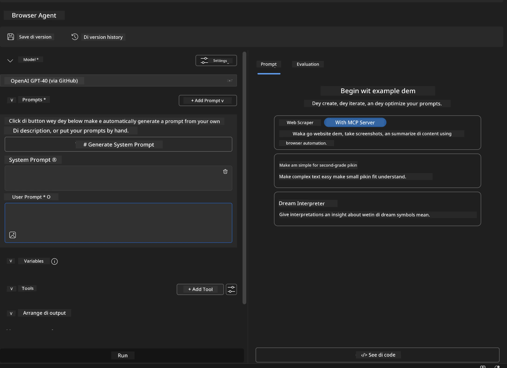

### 🔧 Phase 2: MCP Integration Workflow

#### Step 3: Add MCP Server Integration
1. **Go Tools Section** for Agent Builder
2. **Click "Add Tool"** to open integration menu
3. **Select "MCP Server"** from di options

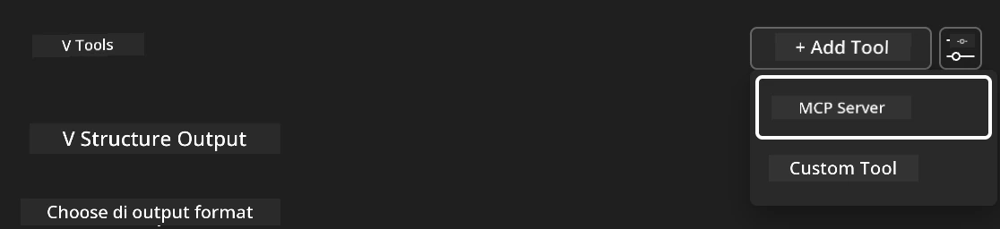

**🔍 Tool Types:**
- **Built-in Tools**: Pre-configured AI Toolkit functions
- **MCP Servers**: External service integrations
- **Custom APIs**: Your own service endpoints
- **Function Calling**: Direct model function access

#### Step 4: MCP Server Selection
1. **Choose "MCP Server"** option
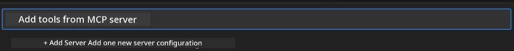

2. **Browse MCP Catalog** to see available integrations
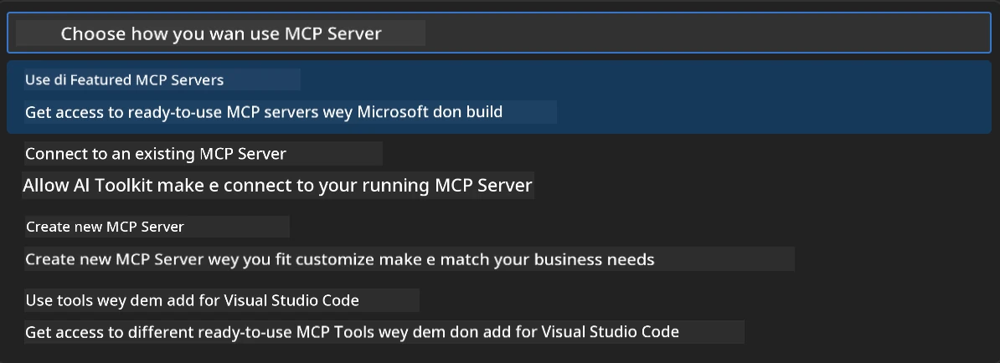

### 🎮 Phase 3: Playwright MCP Configuration

#### Step 5: Select and Configure Playwright
1. **Click "Use Featured MCP Servers"** to see Microsoft verified servers
2. **Select "Playwright"** from di list
3. **Accept Default MCP ID** or customize am

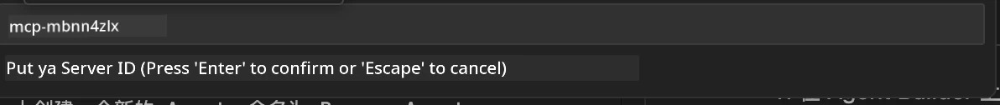

#### Step 6: Enable Playwright Capabilities
**🔑 Important Step**: Select **ALL** Playwright methods for full functionality

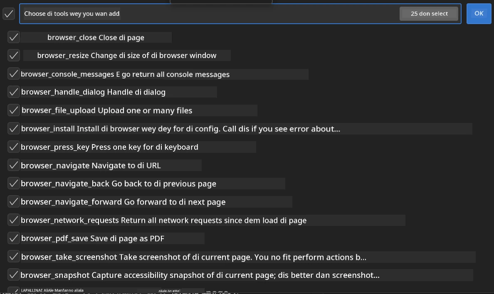

**🛠️ Playwright Tools:**
- **Navigation**: `goto`, `goBack`, `goForward`, `reload`
- **Interaction**: `click`, `fill`, `press`, `hover`, `drag`
- **Extraction**: `textContent`, `innerHTML`, `getAttribute`
- **Validation**: `isVisible`, `isEnabled`, `waitForSelector`
- **Capture**: `screenshot`, `pdf`, `video`
- **Network**: `setExtraHTTPHeaders`, `route`, `waitForResponse`

#### Step 7: Verify Integration Success
**✅ Success Signs:**
- All tools dey show for Agent Builder interface
- No error message for integration panel
- Playwright server status dey show "Connected"

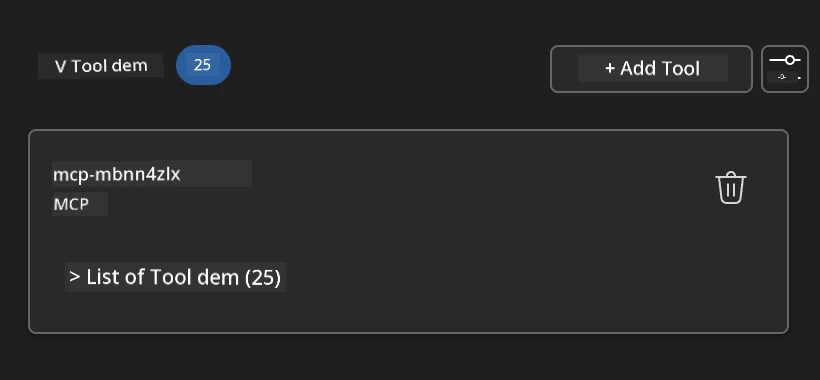

**🔧 Common Issues Troubleshooting:**
- **Connection Failed**: Check internet and firewall settings
- **Missing Tools**: Make sure you select all capabilities
- **Permission Errors**: Confirm say VS Code get system permissions

### 🎯 Phase 4: Advanced Prompt Engineering

#### Step 8: Design Intelligent System Prompts
Create prompts wey go use Playwright full capabilities:

```markdown
# Web Automation Expert System Prompt

## Core Identity
You are an advanced web automation specialist with deep expertise in browser automation, web scraping, and user experience analysis. You have access to Playwright tools for comprehensive browser control.

## Capabilities & Approach
### Navigation Strategy
- Always start with screenshots to understand page layout
- Use semantic selectors (text content, labels) when possible
- Implement wait strategies for dynamic content
- Handle single-page applications (SPAs) effectively

### Error Handling
- Retry failed operations with exponential backoff
- Provide clear error descriptions and solutions
- Suggest alternative approaches when primary methods fail
- Always capture diagnostic screenshots on errors

### Data Extraction
- Extract structured data in JSON format when possible
- Provide confidence scores for extracted information
- Validate data completeness and accuracy
- Handle pagination and infinite scroll scenarios

### Reporting
- Include step-by-step execution logs
- Provide before/after screenshots for verification
- Suggest optimizations and alternative approaches
- Document any limitations or edge cases encountered

## Ethical Guidelines
- Respect robots.txt and rate limiting
- Avoid overloading target servers
- Only extract publicly available information
- Follow website terms of service
```

#### Step 9: Create Dynamic User Prompts
Design prompts wey show different capabilities:

**🌐 Web Analysis Example:**
```markdown
Navigate to github.com/kinfey and provide a comprehensive analysis including:
1. Repository structure and organization
2. Recent activity and contribution patterns  
3. Documentation quality assessment
4. Technology stack identification
5. Community engagement metrics
6. Notable projects and their purposes

Include screenshots at key steps and provide actionable insights.
```

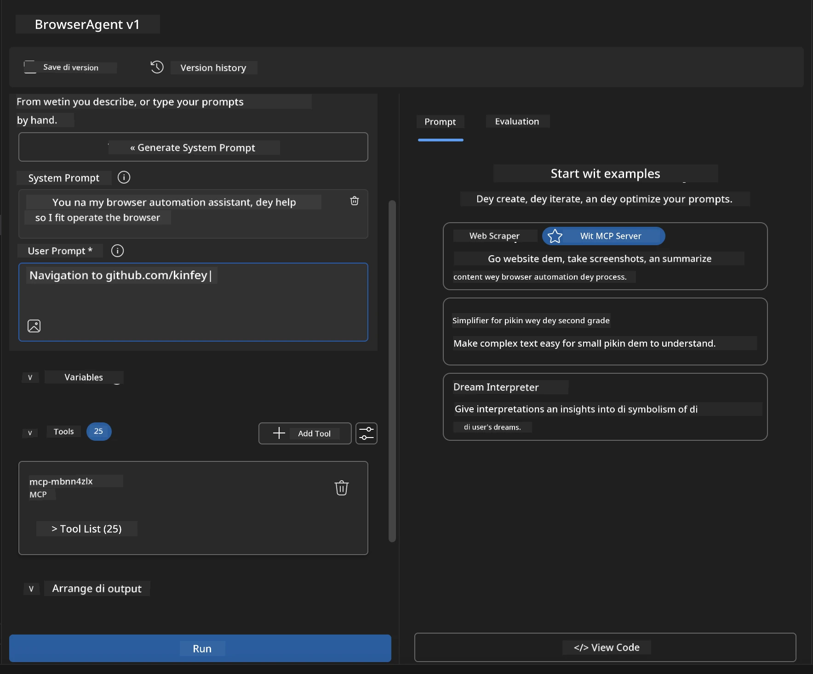

### 🚀 Phase 5: Execution and Testing

#### Step 10: Run Your First Automation
1. **Click "Run"** to start automation
2. **Monitor Execution**:
   - Chrome browser go launch automatically
   - Agent go navigate target website
   - Screenshots go dey capture steps
   - Analysis results go dey stream

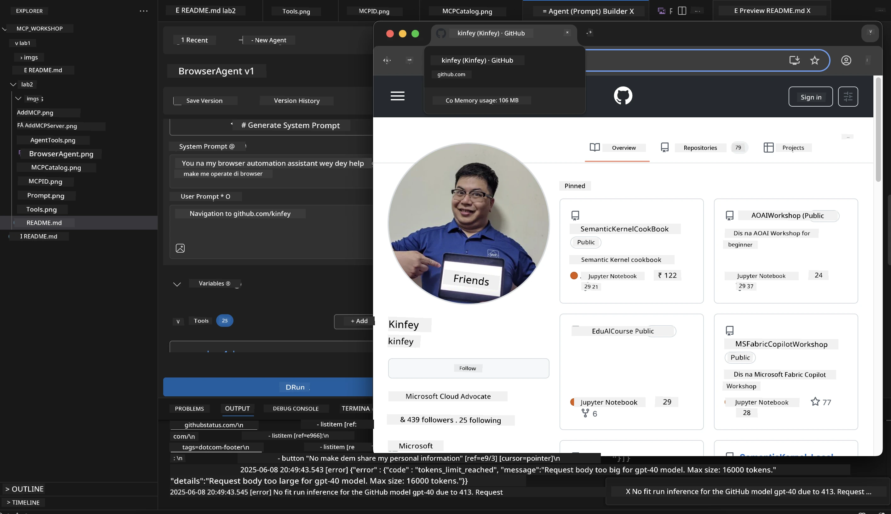

#### Step 11: Check Results and Insights
Review analysis for Agent Builder interface:

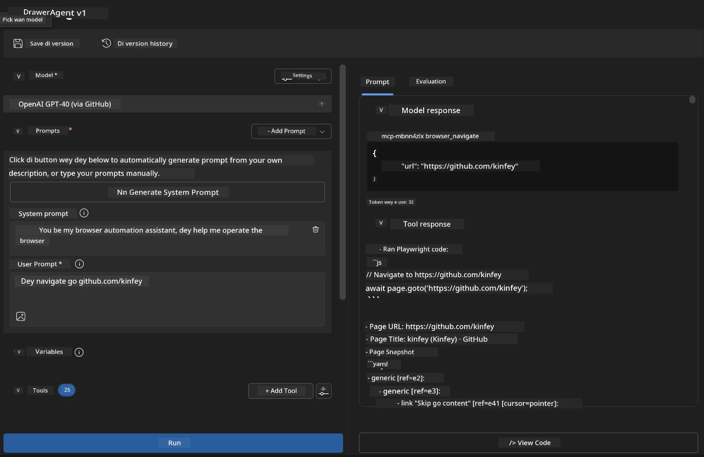

### 🌟 Phase 6: Advanced Capabilities and Deployment

#### Step 12: Export and Deploy
Agent Builder dey support different deployment options:

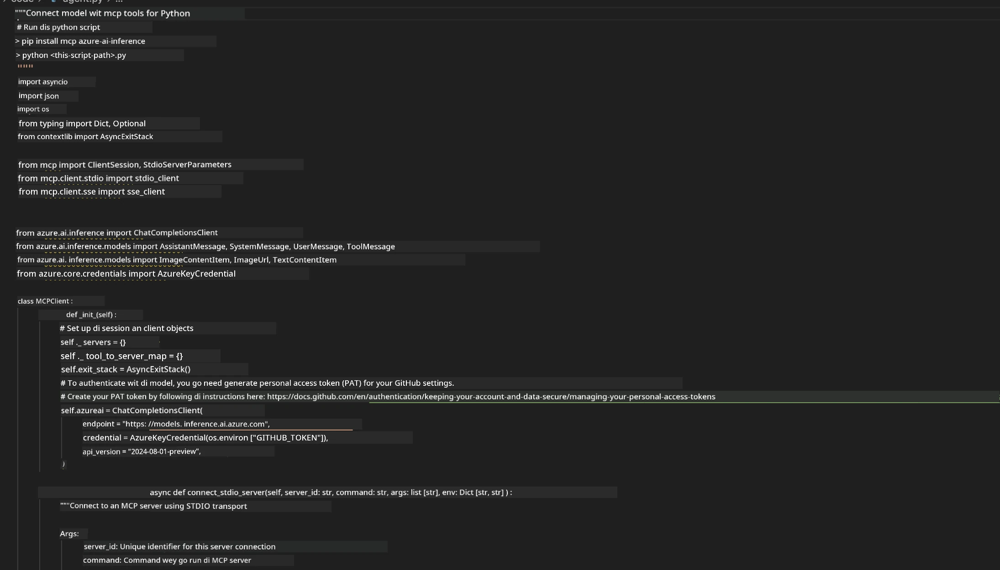

## 🎓 Module 2 Summary & Next Steps

### 🏆 Achievement Unlocked: MCP Integration Master

**✅ Skills You Don Learn:**
- [ ] Understand MCP architecture and benefits
- [ ] Navigate Microsoft's MCP server ecosystem
- [ ] Connect Playwright MCP wit AI Toolkit
- [ ] Build browser automation agents
- [ ] Advanced prompt engineering for web automation

### 📚 Extra Resources

- **🔗 MCP Specification**: [Official Protocol Documentation](https://modelcontextprotocol.io/)
- **🛠️ Playwright API**: [Complete Method Reference](https://playwright.dev/docs/api/class-playwright)
- **🏢 Microsoft MCP Servers**: [Enterprise Integration Guide](https://github.com/microsoft/mcp-servers)
- **🌍 Community Examples**: [MCP Server Gallery](https://github.com/modelcontextprotocol/servers)

**🎉 Congrats!** You don master MCP integration and fit build production-ready AI agents wit external tool capabilities!

### 🔜 Continue to Next Module

Ready to level up your MCP skills? Move to **[Module 3: Advanced MCP Development wit AI Toolkit](../lab3/README.md)** wey go teach you:
- How to create custom MCP servers
- Configure and use MCP Python SDK
- Set up MCP Inspector for debugging
- Master advanced MCP server development workflows
- Build Weather MCP Server from scratch

---

<!-- CO-OP TRANSLATOR DISCLAIMER START -->
**Disclaimer**:  
Dis dokyument don use AI translation service [Co-op Translator](https://github.com/Azure/co-op-translator) do di translation. Even as we dey try make am accurate, abeg sabi say automated translations fit get mistake or no dey correct well. Di original dokyument for im native language na di main source wey you go trust. For important mata, e better make professional human translation dey use. We no go fit take blame for any misunderstanding or wrong interpretation wey fit happen because you use dis translation.
<!-- CO-OP TRANSLATOR DISCLAIMER END -->