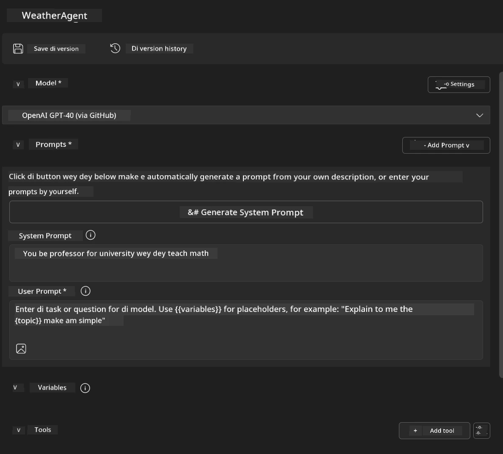
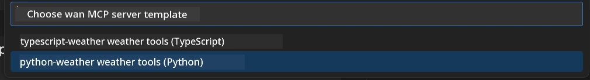
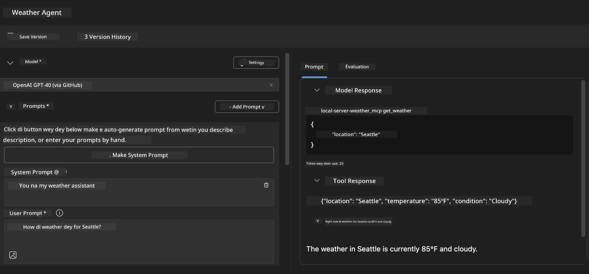
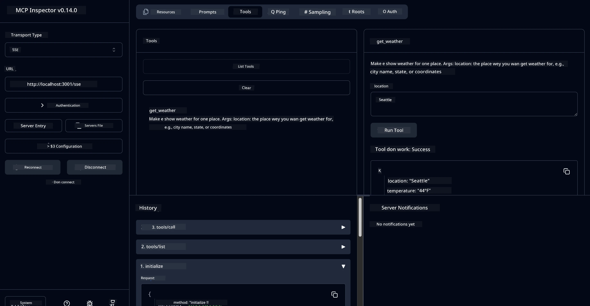

# 🔧 Module 3: Advanced MCP Development wit AI Toolkit


## 🎯 Wetin You Go Learn

By di end of dis lab, you go sabi:

- ✅ Create custom MCP servers wit di AI Toolkit
- ✅ Configure and use di latest MCP Python SDK (v1.9.3)
- ✅ Set up and use MCP Inspector for debugging
- ✅ Debug MCP servers for both Agent Builder and Inspector environments
- ✅ Understand advanced MCP server development workflows

## 📋 Wetin You Need Before You Start

- Don complete Lab 2 (MCP Fundamentals)
- VS Code wey get AI Toolkit extension installed
- Python 3.10+ environment
- Node.js and npm for Inspector setup

## 🏗️ Wetin You Go Build

For dis lab, you go create **Weather MCP Server** wey go show:
- Custom MCP server implementation
- Integration wit AI Toolkit Agent Builder
- Professional debugging workflows
- Modern MCP SDK usage patterns

---

## 🔧 Overview of di Main Components

### 🐍 MCP Python SDK
Di Model Context Protocol Python SDK na di foundation wey you go use build custom MCP servers. You go use version 1.9.3 wey get better debugging features.

### 🔍 MCP Inspector
Dis na powerful debugging tool wey dey provide:
- Real-time server monitoring
- Tool execution visualization
- Network request/response inspection
- Interactive testing environment

---

## 📖 Step-by-Step Implementation

### Step 1: Create WeatherAgent for Agent Builder

1. **Open Agent Builder** for VS Code through di AI Toolkit extension
2. **Create new agent** wit dis configuration:
   - Agent Name: `WeatherAgent`



### Step 2: Initialize MCP Server Project

1. **Go Tools** → **Add Tool** for Agent Builder
2. **Select "MCP Server"** from di options wey dey
3. **Choose "Create A new MCP Server"**
4. **Select di `python-weather` template**
5. **Name your server:** `weather_mcp`



### Step 3: Open and Check di Project

1. **Open di project wey dem generate** for VS Code
2. **Check di project structure:**
   ```
   weather_mcp/
   ├── src/
   │   ├── __init__.py
   │   └── server.py
   ├── inspector/
   │   ├── package.json
   │   └── package-lock.json
   ├── .vscode/
   │   ├── launch.json
   │   └── tasks.json
   ├── pyproject.toml
   └── README.md
   ```

### Step 4: Upgrade to Latest MCP SDK

> **🔍 Why Upgrade?** We wan use di latest MCP SDK (v1.9.3) and Inspector service (0.14.0) wey get better features and debugging capabilities.

#### 4a. Update Python Dependencies

**Edit `pyproject.toml`:** update [./code/weather_mcp/pyproject.toml](../../../../10-StreamliningAIWorkflowsBuildingAnMCPServerWithAIToolkit/lab3/code/weather_mcp/pyproject.toml)


#### 4b. Update Inspector Configuration

**Edit `inspector/package.json`:** update [./code/weather_mcp/inspector/package.json](../../../../10-StreamliningAIWorkflowsBuildingAnMCPServerWithAIToolkit/lab3/code/weather_mcp/inspector/package.json)

#### 4c. Update Inspector Dependencies

**Edit `inspector/package-lock.json`:** update [./code/weather_mcp/inspector/package-lock.json](../../../../10-StreamliningAIWorkflowsBuildingAnMCPServerWithAIToolkit/lab3/code/weather_mcp/inspector/package-lock.json)

> **📝 Note:** Dis file get plenty dependency definitions. Di structure wey dey below na di main one - di full content dey make sure say dependency resolution go work well.


> **⚡ Full Package Lock:** Di complete package-lock.json get ~3000 lines of dependency definitions. Di one wey dey above na di main structure - use di file wey dem provide for full dependency resolution.

### Step 5: Configure VS Code Debugging

*Note: Make sure say you copy di file for di path wey dem talk to replace di local file*

#### 5a. Update Launch Configuration

**Edit `.vscode/launch.json`:**

```json
{
  "version": "0.2.0",
  "configurations": [
    {
      "name": "Attach to Local MCP",
      "type": "debugpy",
      "request": "attach",
      "connect": {
        "host": "localhost",
        "port": 5678
      },
      "presentation": {
        "hidden": true
      },
      "internalConsoleOptions": "neverOpen",
      "postDebugTask": "Terminate All Tasks"
    },
    {
      "name": "Launch Inspector (Edge)",
      "type": "msedge",
      "request": "launch",
      "url": "http://localhost:6274?timeout=60000&serverUrl=http://localhost:3001/sse#tools",
      "cascadeTerminateToConfigurations": [
        "Attach to Local MCP"
      ],
      "presentation": {
        "hidden": true
      },
      "internalConsoleOptions": "neverOpen"
    },
    {
      "name": "Launch Inspector (Chrome)",
      "type": "chrome",
      "request": "launch",
      "url": "http://localhost:6274?timeout=60000&serverUrl=http://localhost:3001/sse#tools",
      "cascadeTerminateToConfigurations": [
        "Attach to Local MCP"
      ],
      "presentation": {
        "hidden": true
      },
      "internalConsoleOptions": "neverOpen"
    }
  ],
  "compounds": [
    {
      "name": "Debug in Agent Builder",
      "configurations": [
        "Attach to Local MCP"
      ],
      "preLaunchTask": "Open Agent Builder",
    },
    {
      "name": "Debug in Inspector (Edge)",
      "configurations": [
        "Launch Inspector (Edge)",
        "Attach to Local MCP"
      ],
      "preLaunchTask": "Start MCP Inspector",
      "stopAll": true
    },
    {
      "name": "Debug in Inspector (Chrome)",
      "configurations": [
        "Launch Inspector (Chrome)",
        "Attach to Local MCP"
      ],
      "preLaunchTask": "Start MCP Inspector",
      "stopAll": true
    }
  ]
}
```

**Edit `.vscode/tasks.json`:**

```
{
  "version": "2.0.0",
  "tasks": [
    {
      "label": "Start MCP Server",
      "type": "shell",
      "command": "python -m debugpy --listen 127.0.0.1:5678 src/__init__.py sse",
      "isBackground": true,
      "options": {
        "cwd": "${workspaceFolder}",
        "env": {
          "PORT": "3001"
        }
      },
      "problemMatcher": {
        "pattern": [
          {
            "regexp": "^.*$",
            "file": 0,
            "location": 1,
            "message": 2
          }
        ],
        "background": {
          "activeOnStart": true,
          "beginsPattern": ".*",
          "endsPattern": "Application startup complete|running"
        }
      }
    },
    {
      "label": "Start MCP Inspector",
      "type": "shell",
      "command": "npm run dev:inspector",
      "isBackground": true,
      "options": {
        "cwd": "${workspaceFolder}/inspector",
        "env": {
          "CLIENT_PORT": "6274",
          "SERVER_PORT": "6277",
        }
      },
      "problemMatcher": {
        "pattern": [
          {
            "regexp": "^.*$",
            "file": 0,
            "location": 1,
            "message": 2
          }
        ],
        "background": {
          "activeOnStart": true,
          "beginsPattern": "Starting MCP inspector",
          "endsPattern": "Proxy server listening on port"
        }
      },
      "dependsOn": [
        "Start MCP Server"
      ]
    },
    {
      "label": "Open Agent Builder",
      "type": "shell",
      "command": "echo ${input:openAgentBuilder}",
      "presentation": {
        "reveal": "never"
      },
      "dependsOn": [
        "Start MCP Server"
      ],
    },
    {
      "label": "Terminate All Tasks",
      "command": "echo ${input:terminate}",
      "type": "shell",
      "problemMatcher": []
    }
  ],
  "inputs": [
    {
      "id": "openAgentBuilder",
      "type": "command",
      "command": "ai-mlstudio.agentBuilder",
      "args": {
        "initialMCPs": [ "local-server-weather_mcp" ],
        "triggeredFrom": "vsc-tasks"
      }
    },
    {
      "id": "terminate",
      "type": "command",
      "command": "workbench.action.tasks.terminate",
      "args": "terminateAll"
    }
  ]
}
```


---

## 🚀 How to Run and Test Your MCP Server

### Step 6: Install Dependencies

After you don make di configuration changes, run dis commands:

**Install Python dependencies:**
```bash
uv sync
```

**Install Inspector dependencies:**
```bash
cd inspector
npm install
```

### Step 7: Debug wit Agent Builder

1. **Press F5** or use di **"Debug in Agent Builder"** configuration
2. **Select di compound configuration** from di debug panel
3. **Wait make di server start** and Agent Builder open
4. **Test your weather MCP server** wit natural language queries

Input prompt like dis

SYSTEM_PROMPT

```
You are my weather assistant
```

USER_PROMPT

```
How's the weather like in Seattle
```



### Step 8: Debug wit MCP Inspector

1. **Use di "Debug in Inspector"** configuration (Edge or Chrome)
2. **Open di Inspector interface** for `http://localhost:6274`
3. **Explore di interactive testing environment:**
   - See di tools wey dey available
   - Test tool execution
   - Monitor network requests
   - Debug server responses



---

## 🎯 Wetin You Don Learn

By di time you finish dis lab, you don:

- [x] **Create custom MCP server** wit AI Toolkit templates
- [x] **Upgrade to di latest MCP SDK** (v1.9.3) wey get better functionality
- [x] **Configure professional debugging workflows** for both Agent Builder and Inspector
- [x] **Set up MCP Inspector** for interactive server testing
- [x] **Master VS Code debugging configurations** for MCP development

## 🔧 Advanced Features We Don Explore

| Feature | Description | Use Case |
|---------|-------------|----------|
| **MCP Python SDK v1.9.3** | Latest protocol implementation | Modern server development |
| **MCP Inspector 0.14.0** | Interactive debugging tool | Real-time server testing |
| **VS Code Debugging** | Integrated development environment | Professional debugging workflow |
| **Agent Builder Integration** | Direct AI Toolkit connection | End-to-end agent testing |

## 📚 Extra Resources

- [MCP Python SDK Documentation](https://modelcontextprotocol.io/docs/sdk/python)
- [AI Toolkit Extension Guide](https://code.visualstudio.com/docs/ai/ai-toolkit)
- [VS Code Debugging Documentation](https://code.visualstudio.com/docs/editor/debugging)
- [Model Context Protocol Specification](https://modelcontextprotocol.io/docs/concepts/architecture)

---

**🎉 Congrats!** You don complete Lab 3 and now sabi how to create, debug, and deploy custom MCP servers wit professional development workflows.

### 🔜 Move to di Next Module

Ready to use your MCP skills for real-world development workflow? Move to **[Module 4: Practical MCP Development - Custom GitHub Clone Server](../lab4/README.md)** wey go teach you:
- How to build production-ready MCP server wey dey automate GitHub repository operations
- How to implement GitHub repository cloning functionality via MCP
- How to integrate custom MCP servers wit VS Code and GitHub Copilot Agent Mode
- How to test and deploy custom MCP servers for production environments
- How to learn practical workflow automation for developers

---

<!-- CO-OP TRANSLATOR DISCLAIMER START -->
**Disclaimer**:  
Dis dokyument don use AI translation service [Co-op Translator](https://github.com/Azure/co-op-translator) do di translation. Even as we dey try make am accurate, abeg sabi say automated translations fit get mistake or no dey correct well. Di original dokyument for im native language na di one wey you go take as di correct source. For important information, e good make professional human translation dey use. We no go fit take blame for any misunderstanding or wrong interpretation wey fit happen because you use dis translation.
<!-- CO-OP TRANSLATOR DISCLAIMER END -->