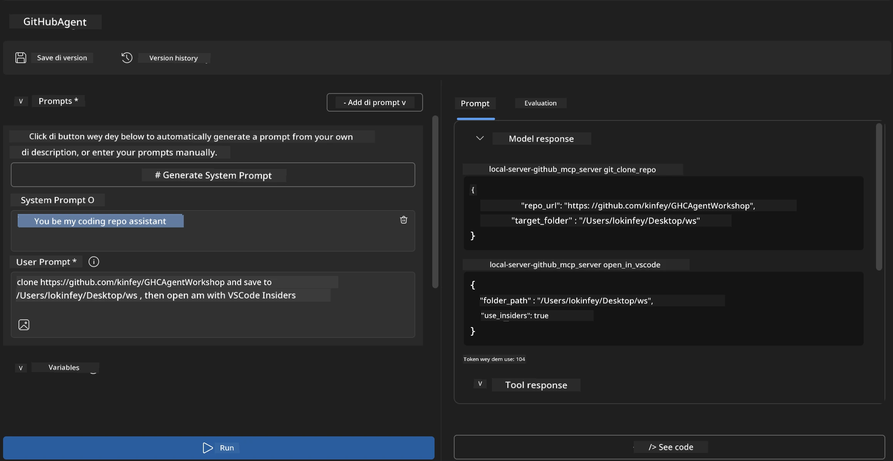
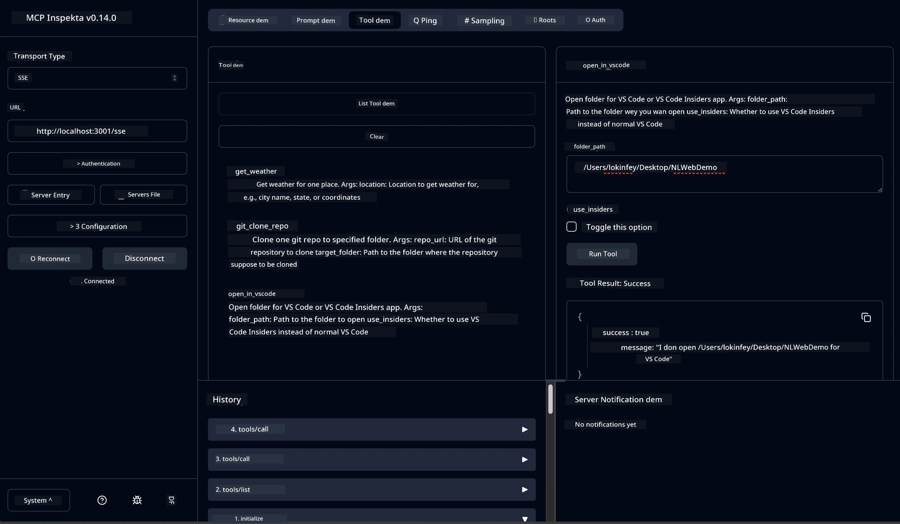

# 🐙 Module 4: Practical MCP Development - Custom GitHub Clone Server


> **⚡ Quick Start:** Build beta-ready MCP server wey dey automate GitHub repository cloning plus VS Code integration for just 30 minutes!

## 🎯 Learning Objectives

By di end of dis lab, you go fit:

- ✅ Create custom MCP server for real-world development workflows
- ✅ Implement GitHub repository cloning functionality via MCP
- ✅ Integrate custom MCP servers wit VS Code and Agent Builder
- ✅ Use GitHub Copilot Agent Mode wit custom MCP tools
- ✅ Test and deploy custom MCP servers for production environments

## 📋 Prerequisites

- Finish Labs 1-3 (MCP fundamentals and advanced development)
- GitHub Copilot subscription ([free signup dey](https://github.com/github-copilot/signup))
- VS Code wit AI Toolkit and GitHub Copilot extensions
- Git CLI installed and configured

## 🏗️ Project Overview

### **Real-World Development Challenge**
As developers, we dey always use GitHub to clone repositories and open dem for VS Code or VS Code Insiders. Dis manual process na:
1. Open terminal/command prompt
2. Move go di right directory
3. Run `git clone` command
4. Open VS Code for di cloned directory

**Our MCP solution go make dis na one smart command!**

### **Wetin You Go Build**
One **GitHub Clone MCP Server** (`git_mcp_server`) wey dey provide:

| Feature | Description | Benefit |
|---------|-------------|---------|
| 🔄 **Smart Repository Cloning** | Clone GitHub repos wit validation | Automatic error checking |
| 📁 **Intelligent Directory Management** | Check and create directories well | E go prevent overwriting |
| 🚀 **Cross-Platform VS Code Integration** | Open projects for VS Code/Insiders | Smooth workflow transition |
| 🛡️ **Robust Error Handling** | Manage network, permission, and path wahala | Production-ready reliability |

---

## 📖 Step-by-Step Implementation

### Step 1: Create GitHub Agent for Agent Builder

1. **Launch Agent Builder** through AI Toolkit extension
2. **Create new agent** wit dis configuration:
   ```
   Agent Name: GitHubAgent
   ```

3. **Start custom MCP server:**
   - Go **Tools** → **Add Tool** → **MCP Server**
   - Pick **"Create A new MCP Server"**
   - Use **Python template** for beta flexibility
   - **Server Name:** `git_mcp_server`

### Step 2: Configure GitHub Copilot Agent Mode

1. **Open GitHub Copilot** for VS Code (Ctrl/Cmd + Shift + P → "GitHub Copilot: Open")
2. **Select Agent Model** inside Copilot interface
3. **Choose Claude 3.7 model** for better reasoning power
4. **Turn on MCP integration** for tool access

> **💡 Pro Tip:** Claude 3.7 get strong understanding for development workflows plus error handling ways.

### Step 3: Implement Core MCP Server Functionality

**Make use of di detailed prompt with GitHub Copilot Agent Mode:**

```
Create two MCP tools with the following comprehensive requirements:

🔧 TOOL A: clone_repository
Requirements:
- Clone any GitHub repository to a specified local folder
- Return the absolute path of the successfully cloned project
- Implement comprehensive validation:
  ✓ Check if target directory already exists (return error if exists)
  ✓ Validate GitHub URL format (https://github.com/user/repo)
  ✓ Verify git command availability (prompt installation if missing)
  ✓ Handle network connectivity issues
  ✓ Provide clear error messages for all failure scenarios

🚀 TOOL B: open_in_vscode
Requirements:
- Open specified folder in VS Code or VS Code Insiders
- Cross-platform compatibility (Windows/Linux/macOS)
- Use direct application launch (not terminal commands)
- Auto-detect available VS Code installations
- Handle cases where VS Code is not installed
- Provide user-friendly error messages

Additional Requirements:
- Follow MCP 1.9.3 best practices
- Include proper type hints and documentation
- Implement logging for debugging purposes
- Add input validation for all parameters
- Include comprehensive error handling
```

### Step 4: Test Your MCP Server

#### 4a. Test for Agent Builder

1. **Start debug configuration** for Agent Builder
2. **Set your agent wit dis system prompt:**

```
SYSTEM_PROMPT:
You are my intelligent coding repository assistant. You help developers efficiently clone GitHub repositories and set up their development environment. Always provide clear feedback about operations and handle errors gracefully.
```

3. **Test wit realistic user cases:**

```
USER_PROMPT EXAMPLES:

Scenario : Basic Clone and Open
"Clone {Your GitHub Repo link such as https://github.com/kinfey/GHCAgentWorkshop
 } and save to {The global path you specify}, then open it with VS Code Insiders"
```



**Wetin You Suppose See:**
- ✅ Successful cloning wit path confirmation
- ✅ VS Code go open automatically
- ✅ Clear error messages for wrong cases
- ✅ Correct handling of edge cases

#### 4b. Test for MCP Inspector




---


**🎉 Congrats!** You don successfully create practical, production-ready MCP server wey solve real development workflow wahala. Your custom GitHub clone server show di power of MCP to automate and improve developer productivity.

### 🏆 Achievement Unlocked:
- ✅ **MCP Developer** - Create custom MCP server
- ✅ **Workflow Automator** - Make development processes easy  
- ✅ **Integration Expert** - Connect different development tools
- ✅ **Production Ready** - Build solutions wey fit deploy

---

## 🎓 Workshop Completion: Your Journey wit Model Context Protocol

**Dear Workshop Participant,**

Congrats for finishing all four modules of Model Context Protocol workshop! You don waka far from the basic AI Toolkit concepts to building production-ready MCP servers wey fit solve real-world development problems.

### 🚀 Your Learning Path Recap:

**[Module 1](../lab1/README.md)**: You begin to sabi AI Toolkit basics, model testing, plus create your first AI agent.

**[Module 2](../lab2/README.md)**: You learn MCP architecture, finish Playwright MCP integration, and build your first browser automation agent.

**[Module 3](../lab3/README.md)**: You advance to custom MCP server development wit Weather MCP server and master debug tools.

**[Module 4](../lab4/README.md)**: Now you don apply all to create practical GitHub repository workflow automation tool.

### 🌟 Wetin You Don Master:

- ✅ **AI Toolkit Ecosystem**: Models, agents, and integration methods
- ✅ **MCP Architecture**: Client-server design, transport protocols, and security
- ✅ **Developer Tools**: From Playground to Inspector to production deployment
- ✅ **Custom Development**: Building, testing, and deploying your own MCP servers
- ✅ **Practical Applications**: Solve real-world workflow challenges wit AI

### 🔮 Wetin Next You Go Do:

1. **Build Your Own MCP Server**: Use these skills to automate your own workflows
2. **Join MCP Community**: Share your work and learn from others
3. **Explore Advanced Integration**: Connect MCP servers to enterprise systems
4. **Contribute to Open Source**: Help improve MCP tools and docs

Remember, dis workshop na di beginning. Model Context Protocol ecosystem dey grow fast, and you ready to dey front for AI-powered development tools.

**Thank you for your participation and dedication to learning!**

We hope dis workshop don spark ideas wey go change how you build and use AI tools for your development journey.

**Happy coding!**

---

## Wetin Next

Congrats for finishing all labs for Module 10!

- Go back to: [Module 10 Overview](../README.md)
- Continue to: [Module 11: MCP Server Hands-On Labs](../../11-MCPServerHandsOnLabs/README.md)

---

<!-- CO-OP TRANSLATOR DISCLAIMER START -->
**Disclaimer**:
Dis document don translate by AI translation service [Co-op Translator](https://github.com/Azure/co-op-translator). Even though we try to make am correct, abeg sabi say machine translation fit get some mistakes or wrong parts. Di original document wey dey dia for im own language na di correct one. If na serious matter, make you use person wey sabi translate well well. We no go take responsibility if person no understand well or if e use dis translation cause wahala.
<!-- CO-OP TRANSLATOR DISCLAIMER END -->