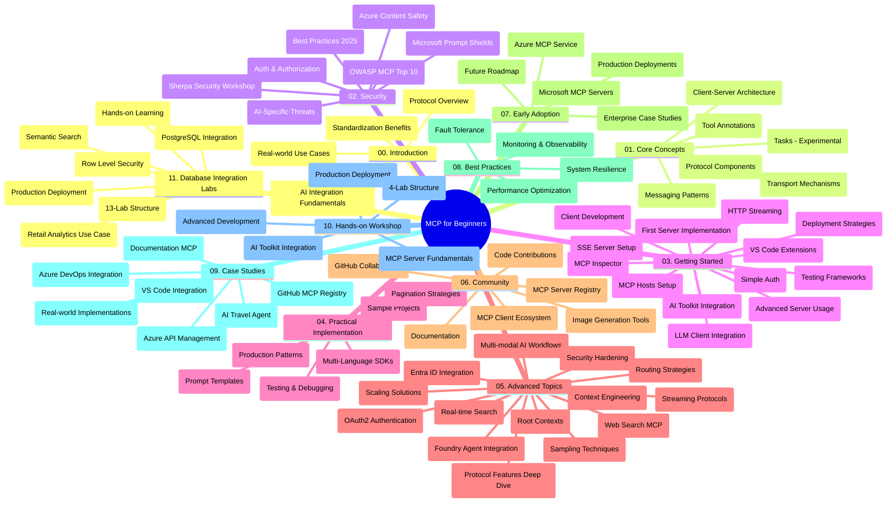

# Model Context Protocol (MCP) for Beginners - Study Guide

Dis study guide dey give overview of di repository structure and content for di "Model Context Protocol (MCP) for Beginners" curriculum. Use dis guide make you fit navigate di repository well well and take advantage of di resources wey dey.

## Repository Overview

Di Model Context Protocol (MCP) na one standardized framework wey dey guide how AI models dey interact wit client applications. Di protocol start from Anthropic but now na di bigger MCP community dey maintain am through di official GitHub organization. Dis repository get full curriculum wit hands-on code examples for C#, Java, JavaScript, Python, and TypeScript, wey dem design for AI developers, system architects, and software engineers.

## Visual Curriculum Map

## Repository Structure

Di repository organize into eleven main sections, each one dey focus on different parts of MCP:

1. **Introduction (00-Introduction/)**
   - Overview of di Model Context Protocol
   - Why standardization important for AI pipelines
   - Practical use cases and benefits

2. **Core Concepts (01-CoreConcepts/)**
   - Client-server architecture
   - Key protocol components
   - Messaging patterns for MCP

3. **Security (02-Security/)**
   - Security threats inside MCP-based systems
   - Best practices to secure how you implement am
   - Authentication and authorization strategies
   - **Comprehensive Security Documentation**:
     - MCP Security Best Practices 2025
     - Azure Content Safety Implementation Guide
     - MCP Security Controls and Techniques
     - MCP Best Practices Quick Reference
   - **Key Security Topics**:
     - Prompt injection and tool poisoning attacks
     - Session hijacking and confused deputy problems
     - Token passthrough vulnerabilities
     - Excessive permissions and access control
     - Supply chain security for AI components
     - Microsoft Prompt Shields integration

4. **Getting Started (03-GettingStarted/)**
   - How to set up environment and configuration
   - Creating basic MCP servers and clients
   - How to integrate with existing applications
   - Include sections for:
     - First server implementation
     - Client development
     - LLM client integration
     - VS Code integration
     - Server-Sent Events (SSE) server
     - Advanced server usage
     - HTTP streaming
     - AI Toolkit integration
     - Testing strategies
     - Deployment guidelines

5. **Practical Implementation (04-PracticalImplementation/)**
   - How to use SDKs for different programming languages
   - Debugging, testing, and validation techniques
   - How to create reusable prompt templates and workflows
   - Sample projects wey get implementation examples

6. **Advanced Topics (05-AdvancedTopics/)**
   - Context engineering techniques
   - Foundry agent integration
   - Multi-modal AI workflows 
   - OAuth2 authentication demos
   - Real-time search capabilities
   - Real-time streaming
   - Root contexts implementation
   - Routing strategies
   - Sampling techniques
   - Scaling approaches
   - Security considerations
   - Entra ID security integration
   - Web search integration

7. **Community Contributions (06-CommunityContributions/)**
   - How you fit contribute code and documentation
   - How to collaborate through GitHub
   - Community-driven improvements and feedback
   - How to use different MCP clients (Claude Desktop, Cline, VSCode)
   - Work with popular MCP servers including image generation ones

8. **Lessons from Early Adoption (07-LessonsfromEarlyAdoption/)**
   - Real-world implementations and success stories
   - How to build and deploy MCP-based solutions
   - Trends and future roadmap
   - **Microsoft MCP Servers Guide**: Full guide to 10 production-ready Microsoft MCP servers including:
     - Microsoft Learn Docs MCP Server
     - Azure MCP Server (15+ specialized connectors)
     - GitHub MCP Server
     - Azure DevOps MCP Server
     - MarkItDown MCP Server
     - SQL Server MCP Server
     - Playwright MCP Server
     - Dev Box MCP Server
     - Azure AI Foundry MCP Server
     - Microsoft 365 Agents Toolkit MCP Server

9. **Best Practices (08-BestPractices/)**
   - Performance tuning and optimization
   - How to design fault-tolerant MCP systems
   - Testing and resilience strategies

10. **Case Studies (09-CaseStudy/)**
    - **Seven complete case studies** wey show how MCP fit work for different scenarios:
    - **Azure AI Travel Agents**: Multi-agent orchestration wit Azure OpenAI and AI Search
    - **Azure DevOps Integration**: Automate workflow processes wit YouTube data updates
    - **Real-Time Documentation Retrieval**: Python console client wit streaming HTTP
    - **Interactive Study Plan Generator**: Chainlit web app wit conversational AI
    - **In-Editor Documentation**: VS Code integration wit GitHub Copilot workflows
    - **Azure API Management**: Enterprise API integration wit MCP server creation
    - **GitHub MCP Registry**: Ecosystem development and agentic integration platform
    - Implementation examples wey cover enterprise integration, developer productivity, and ecosystem development

11. **Hands-on Workshop (10-StreamliningAIWorkflowsBuildingAnMCPServerWithAIToolkit/)**
    - Full hands-on workshop wey combine MCP wit AI Toolkit
    - Build intelligent apps wey bridge AI models wit real-world tools
    - Practical modules cover fundamentals, custom server development, and production deployment strategies
    - **Lab Structure**:
      - Lab 1: MCP Server Fundamentals
      - Lab 2: Advanced MCP Server Development
      - Lab 3: AI Toolkit Integration
      - Lab 4: Production Deployment and Scaling
    - Lab-based learning wit step-by-step instructions

12. **MCP Server Database Integration Labs (11-MCPServerHandsOnLabs/)**
    - **Comprehensive 13-lab learning path** wey teach how to build production-ready MCP servers wit PostgreSQL integration
    - **Real-world retail analytics implementation** using Zava Retail use case
    - **Enterprise-grade patterns** including Row Level Security (RLS), semantic search, and multi-tenant data access
    - **Complete Lab Structure**:
      - **Labs 00-03: Foundations** - Introduction, Architecture, Security, Environment Setup
      - **Labs 04-06: Building the MCP Server** - Database Design, MCP Server Implementation, Tool Development
      - **Labs 07-09: Advanced Features** - Semantic Search, Testing & Debugging, VS Code Integration
      - **Labs 10-12: Production & Best Practices** - Deployment, Monitoring, Optimization
    - **Technologies Covered**: FastMCP framework, PostgreSQL, Azure OpenAI, Azure Container Apps, Application Insights
    - **Learning Outcomes**: Production-ready MCP servers, database integration patterns, AI-powered analytics, enterprise security

## Additional Resources

Di repository get other resources to support you:

- **Images folder**: Get diagrams and illustrations wey dem use for di curriculum
- **Translations**: Multi-language support wit automated translations of documentation
- **Official MCP Resources**:
  - [MCP Documentation](https://modelcontextprotocol.io/)
  - [MCP Specification](https://spec.modelcontextprotocol.io/)
  - [MCP GitHub Repository](https://github.com/modelcontextprotocol)

## How to Use This Repository

1. **Sequential Learning**: Follow di chapters one by one (00 reach 11) for structured learning experience.
2. **Language-Specific Focus**: If you get interest for one programming language, check di samples directories for examples in your language.
3. **Practical Implementation**: Start wit di "Getting Started" section to set up your environment and create your first MCP server and client.
4. **Advanced Exploration**: After you sabi di basics, enter advanced topics to grow your knowledge.
5. **Community Engagement**: Join MCP community through GitHub discussions and Discord channels to connect wit experts and other developers.

## MCP Clients and Tools

Di curriculum dey cover different MCP clients and tools:

1. **Official Clients**:
   - Visual Studio Code 
   - MCP inside Visual Studio Code
   - Claude Desktop
   - Claude for VSCode 
   - Claude API

2. **Community Clients**:
   - Cline (terminal-based)
   - Cursor (code editor)
   - ChatMCP
   - Windsurf

3. **MCP Management Tools**:
   - MCP CLI
   - MCP Manager
   - MCP Linker
   - MCP Router

## Popular MCP Servers

Di repository dey introduce many MCP servers, for example:

1. **Official Microsoft MCP Servers**:
   - Microsoft Learn Docs MCP Server
   - Azure MCP Server (15+ specialized connectors)
   - GitHub MCP Server
   - Azure DevOps MCP Server
   - MarkItDown MCP Server
   - SQL Server MCP Server
   - Playwright MCP Server
   - Dev Box MCP Server
   - Azure AI Foundry MCP Server
   - Microsoft 365 Agents Toolkit MCP Server

2. **Official Reference Servers**:
   - Filesystem
   - Fetch
   - Memory
   - Sequential Thinking

3. **Image Generation**:
   - Azure OpenAI DALL-E 3
   - Stable Diffusion WebUI
   - Replicate

4. **Development Tools**:
   - Git MCP
   - Terminal Control
   - Code Assistant

5. **Specialized Servers**:
   - Salesforce
   - Microsoft Teams
   - Jira & Confluence

## Contributing

Dis repository dey welcome contributions from di community. Check di Community Contributions section for tips on how to contribute well well to di MCP ecosystem.

----

*Dis study guide last update na February 5, 2026, e reflect di latest MCP Specification 2025-11-25 and e give overview of di repository as of dat date. Di repository content fit still get update after dat day.*

---

<!-- CO-OP TRANSLATOR DISCLAIMER START -->
**Disclaimer**:
Dis document don translate wit AI translation service [Co-op Translator](https://github.com/Azure/co-op-translator). Even though we try make am correct, abeg make you sabi say automated translation fit get mistake or no too correct. Di original document for im own language na di main correct source. For important info, na human professional translation better. We no go take any yawa wey fit happen as result of dis translation.
<!-- CO-OP TRANSLATOR DISCLAIMER END -->