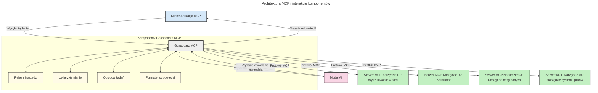

# Wprowadzenie do Model Context Protocol (MCP): Dlaczego ma znaczenie dla skalowalnych aplikacji AI

[](https://youtu.be/agBbdiOPLQA)

_(Kliknij powyższy obraz, aby obejrzeć wideo z tej lekcji)_

Generatywne aplikacje AI to duży krok naprzód, ponieważ często pozwalają użytkownikowi na interakcję z aplikacją za pomocą naturalnych promptów językowych. Jednak w miarę inwestowania większej ilości czasu i zasobów w takie aplikacje, chcesz mieć pewność, że możesz łatwo integrować funkcjonalności i zasoby w sposób umożliwiający łatwą rozbudowę, że Twoja aplikacja może obsługiwać więcej niż jeden model oraz radzić sobie z różnymi zawiłościami modeli. Krótko mówiąc, budowanie aplikacji Gen AI jest łatwe na początku, ale w miarę ich rozwoju i zwiększania złożoności musisz zacząć definiować architekturę i prawdopodobnie polegać na standardzie, aby zapewnić, że Twoje aplikacje są budowane w spójny sposób. Właśnie tutaj wchodzi MCP, aby uporządkować sprawy i dostarczyć standard.

---

## **🔍 Czym jest Model Context Protocol (MCP)?**

**Model Context Protocol (MCP)** to **otwarty, ustandaryzowany interfejs**, który pozwala dużym modelom językowym (LLM) na płynną integrację z zewnętrznymi narzędziami, API i źródłami danych. Zapewnia spójną architekturę zwiększającą funkcjonalność modeli AI poza danymi treningowymi, umożliwiając tworzenie inteligentniejszych, skalowalnych i bardziej responsywnych systemów AI.

---

## **🎯 Dlaczego standaryzacja w AI jest ważna**

W miarę jak generatywne aplikacje AI stają się bardziej złożone, konieczne jest przyjęcie standardów zapewniających **skalowalność, rozszerzalność, łatwość utrzymania** i **uniknięcie uzależnienia od jednego dostawcy**. MCP odpowiada na te potrzeby poprzez:

- Ujednolicenie integracji modeli z narzędziami  
- Redukcję kruchego, jednostkowego kodu niestandardowego  
- Pozwolenie na współistnienie wielu modeli różnych dostawców w jednym ekosystemie  

**Uwaga:** Chociaż MCP reklamuje się jako otwarty standard, nie ma planów standaryzacji MCP przez jakiekolwiek istniejące organy standaryzacyjne, takie jak IEEE, IETF, W3C, ISO czy inny organ standardów.

---

## **📚 Cele nauki**

Po przeczytaniu tego artykułu będziesz potrafił:

- Zdefiniować **Model Context Protocol (MCP)** i jego zastosowania  
- Zrozumieć, jak MCP standaryzuje komunikację model-narzędzie  
- Zidentyfikować kluczowe komponenty architektury MCP  
- Poznać przykłady zastosowań MCP w kontekstach korporacyjnych i deweloperskich  

---

## **💡 Dlaczego Model Context Protocol (MCP) to przełom**

### **🔗 MCP rozwiązuje fragmentację w interakcjach AI**

Przed MCP integracja modeli z narzędziami wymagała:

- Niestandardowego kodu dla każdej pary narzędzie-model  
- Niestandardowych API dla każdego dostawcy  
- Częstych przerw spowodowanych aktualizacjami  
- Słabej skalowalności przy większej liczbie narzędzi  

### **✅ Korzyści ze standaryzacji MCP**

| **Korzyść**             | **Opis**                                                                       |
|-------------------------|--------------------------------------------------------------------------------|
| Interoperacyjność       | LLM działają płynnie z narzędziami różnych dostawców                          |
| Spójność                | Jednolite zachowanie na platformach i narzędziach                            |
| Możliwość ponownego użycia | Narzędzia zbudowane raz mogą być używane w wielu projektach i systemach       |
| Przyspieszenie rozwoju  | Skrócenie czasu tworzenia dzięki ustandaryzowanym interfejsom plug-and-play  |

---

## **🧱 Przegląd architektury MCP na wysokim poziomie**

MCP opiera się na **modelu klient-serwer**, gdzie:

- **Hosty MCP** uruchamiają modele AI  
- **Klienci MCP** inicjują żądania  
- **Serwery MCP** dostarczają kontekst, narzędzia i możliwości  

### **Kluczowe komponenty:**

- **Zasoby** – statyczne lub dynamiczne dane dla modeli  
- **Prompty** – zdefiniowane przepływy pracy do sterowanej generacji  
- **Narzędzia** – wykonywalne funkcje, takie jak wyszukiwanie, obliczenia  
- **Próbkowanie (Sampling)** – zachowanie agentowe przez rekursywne interakcje  
- **Elicytacja** – żądania inicjowane przez serwer w celu uzyskania danych od użytkownika  
- **Roots** – granice systemu plików do kontroli dostępu serwera  

### **Architektura protokołu:**

MCP używa dwuwarstwowej architektury:  
- **Warstwa danych**: komunikacja oparta na JSON-RPC 2.0 z zarządzaniem cyklem życia i prymitywami  
- **Warstwa transportu**: kanały komunikacyjne STDIO (lokalne) oraz strumieniowany HTTP ze SSE (zdalny)  

---

## Jak działają serwery MCP

Serwery MCP działają w następujący sposób:

- **Przepływ żądania**:  
    1. Żądanie inicjuje użytkownik końcowy lub oprogramowanie działające w jego imieniu.  
    2. **Klient MCP** wysyła żądanie do **Hosta MCP**, który zarządza środowiskiem wykonawczym modelu AI.  
    3. **Model AI** otrzymuje prompt od użytkownika i może żądać dostępu do zewnętrznych narzędzi lub danych za pomocą jednego lub więcej wywołań narzędzi.  
    4. **Host MCP**, a nie sam model, komunikuje się z odpowiednim(i) **serwerem(ami) MCP** używając ustandaryzowanego protokołu.  
- **Funkcjonalność Host MCP**:  
    - **Rejestr narzędzi**: Zarządza katalogiem dostępnych narzędzi i ich możliwościami.  
    - **Uwierzytelnianie**: Weryfikuje uprawnienia do dostępu do narzędzi.  
    - **Obsługa żądań**: Przetwarza nadchodzące żądania narzędzi od modelu.  
    - **Formatowanie odpowiedzi**: Strukturyzuje wyniki narzędzi w formacie zrozumiałym dla modelu.  
- **Wykonanie serwera MCP**:  
    - **Host MCP** kieruje wywołania narzędzi do jednego lub wielu **serwerów MCP**, z których każdy udostępnia specjalistyczne funkcje (np. wyszukiwanie, obliczenia, zapytania bazodanowe).  
    - **Serwery MCP** wykonują swoje operacje i zwracają wyniki do **Hosta MCP** w spójnym formacie.  
    - **Host MCP** formatuje i przekazuje te wyniki do **modelu AI**.  
- **Zakończenie odpowiedzi**:  
    - **Model AI** włącza wyniki narzędzi do odpowiedzi końcowej.  
    - **Host MCP** wysyła tę odpowiedź z powrotem do **klienta MCP**, który dostarcza ją użytkownikowi końcowemu lub wywołującemu oprogramowaniu.
    


## 👨‍💻 Jak zbudować serwer MCP (z przykładami)

Serwery MCP umożliwiają rozszerzenie możliwości LLM przez dostarczanie danych i funkcjonalności.

Gotowy na wypróbowanie? Oto SDK specyficzne dla języka i/lub stacku z przykładami tworzenia prostych serwerów MCP w różnych językach/stackach:

- **Python SDK**: https://github.com/modelcontextprotocol/python-sdk

- **TypeScript SDK**: https://github.com/modelcontextprotocol/typescript-sdk

- **Java SDK**: https://github.com/modelcontextprotocol/java-sdk

- **C#/.NET SDK**: https://github.com/modelcontextprotocol/csharp-sdk


## 🌍 Przykłady zastosowań MCP w praktyce

MCP umożliwia szeroki zakres zastosowań poprzez rozszerzanie możliwości AI:

| **Zastosowanie**           | **Opis**                                                                       |
|----------------------------|--------------------------------------------------------------------------------|
| Integracja danych korporacyjnych | Łączenie LLM z bazami danych, CRM lub narzędziami wewnętrznymi            |
| Systemy agentowe AI         | Umożliwienie autonomicznym agentom dostępu do narzędzi i przepływów decyzyjnych|
| Aplikacje multimodalne      | Łączenie narzędzi tekstowych, obrazowych i audio w jednej zunifikowanej aplikacji AI |
| Integracja danych w czasie rzeczywistym | Wprowadzanie danych na żywo do interakcji AI dla bardziej precyzyjnych i aktualnych wyników |


### 🧠 MCP = Uniwersalny standard dla interakcji AI

Model Context Protocol (MCP) działa jako uniwersalny standard dla interakcji AI, podobnie jak USB-C ustandaryzował fizyczne połączenia urządzeń. W świecie AI MCP zapewnia spójny interfejs, pozwalający modelom (klientom) na płynną integrację z zewnętrznymi narzędziami i dostawcami danych (serwerami). Eliminuje to potrzebę posiadania wielu, niestandardowych protokołów dla każdego API lub źródła danych.

W ramach MCP narzędzie kompatybilne z MCP (zwane serwerem MCP) działa według jednolitego standardu. Serwery te mogą wyświetlać listę oferowanych narzędzi lub akcji oraz wykonywać je na żądanie agenta AI. Platformy agentów AI wspierające MCP potrafią odnajdywać dostępne narzędzia na serwerach i wywoływać je za pomocą tego standardowego protokołu.

### 💡 Ułatwia dostęp do wiedzy

Poza oferowaniem narzędzi, MCP ułatwia także dostęp do wiedzy. Umożliwia aplikacjom dostarczanie kontekstu dużym modelom językowym (LLM) poprzez łączenie ich z różnymi źródłami danych. Przykładowo, serwer MCP może reprezentować repozytorium dokumentów firmy, pozwalając agentom wyszukiwać odpowiednie informacje na żądanie. Inny serwer może obsługiwać konkretne działania, takie jak wysyłanie e-maili czy aktualizacja rekordów. Z perspektywy agenta to po prostu narzędzia, które może używać – niektóre zwracają dane (kontekst wiedzy), inne wykonują akcje. MCP efektywnie zarządza obiema funkcjonalnościami.

Agent łączący się z serwerem MCP automatycznie poznaje dostępne na serwerze możliwości i dostępne dane dzięki standardowemu formatowi. Ta standaryzacja umożliwia dynamiczną dostępność narzędzi. Na przykład dodanie nowego serwera MCP do systemu agenta sprawia, że jego funkcje są natychmiast dostępne, bez potrzeby dalszej personalizacji instrukcji agenta.

Ta uproszczona integracja jest zgodna z przepływem pokazanym na poniższym diagramie, gdzie serwery dostarczają zarówno narzędzia, jak i wiedzę, zapewniając bezproblemową współpracę między systemami.

### 👉 Przykład: Skalowalne rozwiązanie agentowe

```mermaid
---
title: Skalowalne rozwiązanie agenta z MCP
description: Diagram ilustrujący, jak użytkownik wchodzi w interakcję z LLM, który łączy się z wieloma serwerami MCP, z których każdy dostarcza zarówno wiedzę, jak i narzędzia, tworząc skalowalną architekturę systemu AI
---
graph TD
    User -->|Prompt| LLM
    LLM -->|Odpowiedź| User
    LLM -->|MCP| ServerA
    LLM -->|MCP| ServerB
    ServerA -->|Uniwersalne łącze| ServerB
    ServerA --> KnowledgeA
    ServerA --> ToolsA
    ServerB --> KnowledgeB
    ServerB --> ToolsB

    subgraph Server A
        KnowledgeA[Wiedza]
        ToolsA[Narzędzia]
    end

    subgraph Server B
        KnowledgeB[Wiedza]
        ToolsB[Narzędzia]
    end
```Uniwersalny konektor umożliwia serwerom MCP komunikację i współdzielenie możliwości między sobą, pozwalając ServerA delegować zadania do ServerB lub uzyskać dostęp do jego narzędzi i wiedzy. To federuje narzędzia i dane między serwerami, wspierając skalowalne i modułowe architektury agentów. Ponieważ MCP standaryzuje udostępnianie narzędzi, agenci mogą dynamicznie odkrywać i kierować żądania między serwerami bez twardo zakodowanych integracji.

Federacja narzędzi i wiedzy: narzędzia i dane mogą być dostępne między serwerami, co umożliwia bardziej skalowalne i modułowe architektury agentowe.

### 🔄 Zaawansowane scenariusze MCP z integracją LLM po stronie klienta

Poza podstawową architekturą MCP istnieją zaawansowane scenariusze, gdzie zarówno klient, jak i serwer zawierają LLM, co umożliwia bardziej wyrafinowane interakcje. Na poniższym diagramie **Aplikacja Klienta** może być np. IDE z wieloma narzędziami MCP dostępnymi dla użytkownika przez LLM:

```mermaid
---
title: Zaawansowane scenariusze MCP z integracją LLM klient-serwer
description: Diagram sekwencji pokazujący szczegółowy przebieg interakcji pomiędzy użytkownikiem, aplikacją kliencką, LLM klienta, wieloma serwerami MCP oraz LLM serwera, ilustrujący fazy odkrywania narzędzi, interakcji użytkownika, bezpośredniego wywoływania narzędzi oraz negocjacji funkcji
---
sequenceDiagram
    autonumber
    actor User as 👤 Użytkownik
    participant ClientApp as 🖥️ Aplikacja Klienta
    participant ClientLLM as 🧠 LLM Klienta
    participant Server1 as 🔧 Serwer MCP 1
    participant Server2 as 📚 Serwer MCP 2
    participant ServerLLM as 🤖 LLM Serwera
    
    %% Faza odkrywania
    rect rgb(220, 240, 255)
        Note over ClientApp, Server2: FAZA ODKRYWANIA NARZĘDZI
        ClientApp->>+Server1: Żądanie dostępnych narzędzi/zasobów
        Server1-->>-ClientApp: Zwróć listę narzędzi (JSON)
        ClientApp->>+Server2: Żądanie dostępnych narzędzi/zasobów
        Server2-->>-ClientApp: Zwróć listę narzędzi (JSON)
        Note right of ClientApp: Lokalnie zapisz<br/>połączony katalog narzędzi
    end
    
    %% Interakcja użytkownika
    rect rgb(255, 240, 220)
        Note over User, ClientLLM: FAZA INTERAKCJI UŻYTKOWNIKA
        User->>+ClientApp: Wprowadź polecenie w języku naturalnym
        ClientApp->>+ClientLLM: Przekaż polecenie + katalog narzędzi
        ClientLLM->>-ClientLLM: Analizuj polecenie i wybierz narzędzia
    end
    
    %% Scenariusz A: Bezpośrednie wywoływanie narzędzi
    alt Bezpośrednie wywoływanie narzędzi
        rect rgb(220, 255, 220)
            Note over ClientApp, Server1: SCENARIUSZ A: BEZPOŚREDNIE WYWOŁANIE NARZĘDZIA
            ClientLLM->>+ClientApp: Żądanie wykonania narzędzia
            ClientApp->>+Server1: Wykonaj określone narzędzie
            Server1-->>-ClientApp: Zwróć wyniki
            ClientApp->>+ClientLLM: Przetwórz wyniki
            ClientLLM-->>-ClientApp: Wygeneruj odpowiedź
            ClientApp-->>-User: Wyświetl końcową odpowiedź
        end
    
    %% Scenariusz B: Negocjacja funkcji (w stylu VS Code)
    else Negocjacja funkcji (w stylu VS Code)
        rect rgb(255, 220, 220)
            Note over ClientApp, ServerLLM: SCENARIUSZ B: NEGOCJACJA FUNKCJI
            ClientLLM->>+ClientApp: Określ potrzebne możliwości
            ClientApp->>+Server2: Negocjuj funkcje/możliwości
            Server2->>+ServerLLM: Żądaj dodatkowego kontekstu
            ServerLLM-->>-Server2: Dostarcz kontekst
            Server2-->>-ClientApp: Zwróć dostępne funkcje
            ClientApp->>+Server2: Wywołaj uzgodnione narzędzia
            Server2-->>-ClientApp: Zwróć wyniki
            ClientApp->>+ClientLLM: Przetwórz wyniki
            ClientLLM-->>-ClientApp: Wygeneruj odpowiedź
            ClientApp-->>-User: Wyświetl końcową odpowiedź
        end
    end
```
## 🔐 Praktyczne korzyści MCP

Oto praktyczne korzyści płynące z używania MCP:

- **Aktualność**: Modele mogą uzyskiwać dostęp do najnowszych informacji spoza danych treningowych  
- **Rozszerzenie możliwości**: Modele mogą korzystać ze specjalistycznych narzędzi do zadań, do których nie były trenowane  
- **Redukcja halucynacji**: Zewnętrzne źródła danych dostarczają faktograficzne podstawy  
- **Prywatność**: Wrażliwe dane mogą pozostawać w bezpiecznym środowisku zamiast być osadzane w promptach  

## 📌 Kluczowe wnioski

Oto kluczowe wnioski dotyczące używania MCP:

- **MCP** standaryzuje sposób, w jaki modele AI współdziałają z narzędziami i danymi  
- Promuje **rozszerzalność, spójność i interoperacyjność**  
- MCP pomaga **skrócić czas tworzenia, zwiększyć niezawodność i rozszerzyć możliwości modeli**  
- Architektura klient-serwer **umożliwia elastyczne, rozszerzalne aplikacje AI**  

## 🧠 Ćwiczenie

Pomyśl o aplikacji AI, którą chcesz stworzyć.

- Jakie **zewnętrzne narzędzia lub dane** mogłyby wzbogacić jej możliwości?  
- W jaki sposób MCP mogłoby uczynić integrację **prostszej i bardziej niezawodnej**?  

## Dodatkowe zasoby

- [Repozytorium MCP na GitHub](https://github.com/modelcontextprotocol)  


## Co dalej

Następny rozdział: [Rozdział 1: Podstawowe koncepcje](../01-CoreConcepts/README.md)

---

<!-- CO-OP TRANSLATOR DISCLAIMER START -->
**Zastrzeżenie**:  
Niniejszy dokument został przetłumaczony za pomocą automatycznej usługi tłumaczeniowej AI [Co-op Translator](https://github.com/Azure/co-op-translator). Chociaż dokładamy starań, aby tłumaczenia były jak najbardziej precyzyjne, prosimy pamiętać, że tłumaczenia automatyczne mogą zawierać błędy lub nieścisłości. Za wiarygodne źródło należy uznać oryginalny dokument w jego języku oryginalnym. W przypadku informacji krytycznych zaleca się skorzystanie z profesjonalnego tłumaczenia wykonanego przez człowieka. Nie ponosimy odpowiedzialności za jakiekolwiek nieporozumienia lub błędne interpretacje wynikające z korzystania z tego tłumaczenia.
<!-- CO-OP TRANSLATOR DISCLAIMER END -->