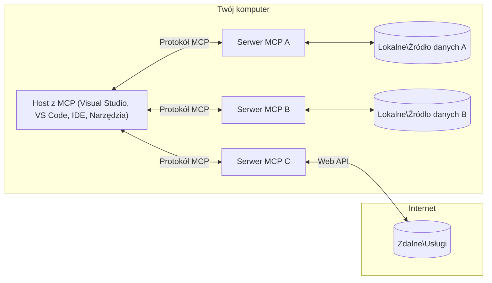

# Podstawowe koncepcje MCP: Opanowanie Model Context Protocol dla integracji AI

[](https://youtu.be/earDzWGtE84)

_(Kliknij powyższy obraz, aby obejrzeć wideo z tej lekcji)_

[Model Context Protocol (MCP)](https://github.com/modelcontextprotocol) to potężne, ustandaryzowane ramy optymalizujące komunikację między dużymi modelami językowymi (LLM) a zewnętrznymi narzędziami, aplikacjami i źródłami danych.  
Ten przewodnik przeprowadzi Cię przez podstawowe koncepcje MCP. Poznasz jego architekturę klient-serwer, kluczowe komponenty, mechanikę komunikacji oraz najlepsze praktyki implementacyjne.

- **Wyraźna zgoda użytkownika**: Wszystkie operacje i dostęp do danych wymagają wyraźnej zgody użytkownika przed wykonaniem. Użytkownicy muszą dokładnie rozumieć, do jakich danych będzie przyznany dostęp i jakie działania zostaną podjęte, z dokładną kontrolą nad uprawnieniami i autoryzacjami.

- **Ochrona prywatności danych**: Dane użytkownika są ujawniane tylko za wyraźną zgodą i muszą być chronione przez solidne mechanizmy kontroli dostępu przez cały czas trwania interakcji. Implementacje muszą zapobiegać nieautoryzowanemu przesyłaniu danych i utrzymywać ścisłe granice prywatności.

- **Bezpieczeństwo wykonywania narzędzi**: Każde wywołanie narzędzi wymaga wyraźnej zgody użytkownika ze zrozumieniem funkcji, parametrów i potencjalnego wpływu narzędzia. Solidne granice bezpieczeństwa muszą zapobiegać niezamierzonym, niebezpiecznym lub złośliwym wykonaniom narzędzi.

- **Bezpieczeństwo warstwy transportowej**: Wszystkie kanały komunikacji powinny korzystać z odpowiednich mechanizmów szyfrowania i uwierzytelniania. Połączenia zdalne powinny implementować bezpieczne protokoły transportowe i właściwe zarządzanie poświadczeniami.

#### Wskazówki implementacyjne:

- **Zarządzanie uprawnieniami**: Implementuj szczegółowe systemy uprawnień pozwalające użytkownikom kontrolować, które serwery, narzędzia i zasoby są dostępne  
- **Uwierzytelnianie i autoryzacja**: Stosuj bezpieczne metody uwierzytelniania (OAuth, klucze API) z prawidłowym zarządzaniem i wygasaniem tokenów  
- **Walidacja danych wejściowych**: Waliduj wszystkie parametry i dane wejściowe zgodnie z określonymi schematami, aby zapobiegać atakom typu injection  
- **Rejestrowanie zdarzeń**: Utrzymuj kompleksowe logi wszystkich operacji do monitoringu bezpieczeństwa i zgodności

## Przegląd

Ta lekcja omawia podstawową architekturę i komponenty tworzące ekosystem Model Context Protocol (MCP). Poznasz architekturę klient-serwer, kluczowe komponenty i mechanizmy komunikacyjne, które umożliwiają interakcje MCP.

## Kluczowe cele nauki

Po ukończeniu tej lekcji będziesz potrafił:

- Zrozumieć architekturę klient-serwer MCP.  
- Zidentyfikować role i obowiązki Hostów, Klientów i Serwerów.  
- Przeanalizować kluczowe cechy, które czynią MCP elastyczną warstwą integracyjną.  
- Poznać przepływ informacji w ekosystemie MCP.  
- Zdobyć praktyczne informacje dzięki przykładom kodu w .NET, Java, Python i JavaScript.

## Architektura MCP: Głębsze spojrzenie

Ekosystem MCP opiera się na modelu klient-serwer. Ta modułowa struktura pozwala aplikacjom AI na efektywną interakcję z narzędziami, bazami danych, API i zasobami kontekstowymi. Rozbijmy tę architekturę na podstawowe komponenty.

W swej istocie MCP stosuje architekturę klient-serwer, w której aplikacja hosta może łączyć się z wieloma serwerami:


- **Hosty MCP**: Programy takie jak VSCode, Claude Desktop, IDE lub narzędzia AI, które chcą uzyskać dostęp do danych przez MCP  
- **Klienci MCP**: Klienci protokołu utrzymujący połączenia 1:1 z serwerami  
- **Serwery MCP**: Lekkie programy udostępniające określone możliwości przez ustandaryzowany Model Context Protocol  
- **Lokalne źródła danych**: Pliki, bazy danych i usługi Twojego komputera, do których serwery MCP mają bezpieczny dostęp  
- **Zdalne usługi**: Zewnętrzne systemy dostępne przez internet, do których serwery MCP mogą łączyć się przez API.

Protokół MCP jest standardem ewoluującym, wykorzystującym wersjonowanie oparte na dacie (format RRRR-MM-DD). Obecna wersja protokołu to **2025-11-25**. Najnowsze aktualizacje do [specyfikacji protokołu](https://modelcontextprotocol.io/specification/2025-11-25/) możesz zobaczyć tam.

### 1. Hosty

W Model Context Protocol (MCP), **Hosty** to aplikacje AI, które pełnią rolę głównego interfejsu, przez który użytkownicy komunikują się z protokołem. Hosty koordynują i zarządzają połączeniami z wieloma serwerami MCP, tworząc dedykowanych klientów MCP dla każdego połączenia. Przykłady Hostów:

- **Aplikacje AI**: Claude Desktop, Visual Studio Code, Claude Code  
- **Środowiska programistyczne**: IDE i edytory kodu z integracją MCP  
- **Aplikacje niestandardowe**: Specjalistyczne agenty AI i narzędzia

**Hosty** to aplikacje koordynujące interakcje z modelami AI. One:

- **Orkiestrują modele AI**: Wykonują lub komunikują się z LLM, by generować odpowiedzi i zarządzać przepływem pracy AI  
- **Zarządzają połączeniami klientów**: Tworzą i utrzymują po jednym kliencie MCP na każde połączenie z serwerem MCP  
- **Kontrolują interfejs użytkownika**: Zarządzają przepływem konwersacji, interakcjami użytkownika i prezentacją odpowiedzi  
- **Wprowadzają zabezpieczenia**: Kontrolują uprawnienia, ograniczenia bezpieczeństwa i uwierzytelnianie  
- **Obsługują zgodę użytkownika**: Zarządzają zatwierdzeniami użytkownika dotyczącymi udostępniania danych i wykonywania narzędzi

### 2. Klienci

**Klienci** to podstawowe komponenty utrzymujące dedykowane połączenia jeden do jednego między Hostami a serwerami MCP. Każdy klient MCP jest tworzony przez Host i łączy się z określonym serwerem MCP, zapewniając uporządkowane i bezpieczne kanały komunikacji. Wielu klientów umożliwia Hostom jednoczesne łączenie się z wieloma serwerami.

**Klienci** to komponenty łączące w aplikacji hosta. Oni:

- **Komunikują się protokołem**: Wysyłają żądania JSON-RPC 2.0 do serwerów z zapytaniami i instrukcjami  
- **Negocjują możliwości**: Negocjują obsługiwane funkcje i wersje protokołu z serwerami podczas inicjalizacji  
- **Wykonują narzędzia**: Zarządzają żądaniami wykonania narzędzi od modeli i przetwarzają odpowiedzi  
- **Aktualizacje w czasie rzeczywistym**: Obsługują powiadomienia i aktualizacje w czasie rzeczywistym od serwerów  
- **Przetwarzają odpowiedzi**: Przygotowują i formatują odpowiedzi serwera do wyświetlenia użytkownikowi

### 3. Serwery

**Serwery** to programy dostarczające kontekst, narzędzia i możliwości klientom MCP. Mogą działać lokalnie (na tej samej maszynie co Host) lub zdalnie (na platformach zewnętrznych) i odpowiadają za obsługę żądań klientów oraz dostarczanie ustrukturyzowanych odpowiedzi. Serwery udostępniają określoną funkcjonalność przez ustandaryzowany Model Context Protocol.

**Serwery** to usługi dostarczające kontekst i możliwości. One:

- **Rejestrują funkcje**: Rejestrują i udostępniają dostępne prymitywy (zasoby, prompt’y, narzędzia) klientom  
- **Przetwarzają żądania**: Odbierają i wykonują wywołania narzędzi, żądania zasobów i promptów od klientów  
- **Dostarczają kontekst**: Zapewniają informacje kontekstowe i dane wzbogacające odpowiedzi modeli  
- **Zarządzają stanem**: Utrzymują stan sesji i obsługują interakcje stanowe, jeśli to potrzebne  
- **Powiadomienia w czasie rzeczywistym**: Wysyłają powiadomienia o zmianach funkcji i aktualizacjach do podłączonych klientów

Serwery mogą być tworzone przez każdego, aby rozszerzyć możliwości modeli o specjalistyczną funkcjonalność, oraz wspierać scenariusze wdrożeń lokalnych i zdalnych.

### 4. Prymitywy serwera

Serwery w Model Context Protocol (MCP) dostarczają trzy podstawowe **prymitywy**, które definiują fundamentalne składniki do bogatych interakcji między klientami, hostami i modelami językowymi. Te prymitywy określają typy dostępnej informacji kontekstowej i działań przez protokół.

Serwery MCP mogą udostępniać dowolną kombinację następujących trzech podstawowych prymitywów:

#### Zasoby

**Zasoby** to źródła danych dostarczające informacje kontekstowe dla aplikacji AI. Reprezentują statyczne lub dynamiczne treści, które mogą wzbogacać zrozumienie i podejmowanie decyzji przez modele:

- **Dane kontekstowe**: Ustrukturyzowane informacje i kontekst do wykorzystania przez model AI  
- **Bazy wiedzy**: Repozytoria dokumentów, artykuły, podręczniki i prace naukowe  
- **Lokalne źródła danych**: Pliki, bazy danych i informacje systemowe lokalne  
- **Dane zewnętrzne**: Odpowiedzi API, usługi sieciowe i dane z systemów zdalnych  
- **Treści dynamiczne**: Dane w czasie rzeczywistym aktualizowane na podstawie warunków zewnętrznych

Zasoby są identyfikowane przez URI i obsługują odkrywanie przez metody `resources/list` oraz pobieranie przez `resources/read`:

```text
file://documents/project-spec.md
database://production/users/schema
api://weather/current
```

#### Prompty

**Prompty** to wielokrotnego użytku szablony ułatwiające strukturyzowanie interakcji z modelami językowymi. Dostarczają ustandaryzowane wzory interakcji i szablonowe przepływy pracy:

- **Interakcje oparte na szablonach**: Wstępnie zbudowane komunikaty i rozpoczęcia rozmów  
- **Szablony przepływów pracy**: Ustandaryzowane sekwencje dla typowych zadań i interakcji  
- **Przykłady few-shot**: Szablony bazujące na przykładach dla instrukcji modelu  
- **Prompty systemowe**: Podstawowe polecenia definiujące zachowanie i kontekst modelu  
- **Szablony dynamiczne**: Prompt’y parametryzowane, dopasowujące się do konkretnych kontekstów

Prompty obsługują podstawianie zmiennych i można je odkrywać poprzez `prompts/list`, a pobierać przez `prompts/get`:

```markdown
Generate a {{task_type}} for {{product}} targeting {{audience}} with the following requirements: {{requirements}}
```

#### Narzędzia

**Narzędzia** to wykonywalne funkcje, które modele AI mogą wywoływać w celu wykonania określonych działań. Reprezentują „czasowniki” ekosystemu MCP, pozwalając modelom na interakcję z systemami zewnętrznymi:

- **Funkcje wykonywalne**: Dyskretne operacje, które modele mogą wywołać z określonymi parametrami  
- **Integracja systemów zewnętrznych**: Wywołania API, zapytania do baz danych, operacje na plikach, obliczenia  
- **Unikalna tożsamość**: Każde narzędzie ma nazwę, opis i schemat parametrów  
- **Ustrukturyzowany I/O**: Narzędzia przyjmują zwalidowane parametry i zwracają ustrukturyzowane, typowane odpowiedzi  
- **Możliwości działania**: Umożliwiają modelom wykonywanie akcji w świecie rzeczywistym i pozyskiwanie danych na żywo

Narzędzia definiowane są za pomocą JSON Schema do walidacji parametrów, można je odkrywać przez `tools/list` i wywoływać przez `tools/call`. Narzędzia mogą także zawierać **ikony** jako dodatkowe metadane dla lepszej prezentacji w UI.

**Adnotacje narzędzi**: Narzędzia wspierają adnotacje zachowania (np. `readOnlyHint`, `destructiveHint`), które opisują czy narzędzie jest tylko do odczytu lub destrukcyjne, ułatwiając klientom podejmowanie świadomych decyzji w zakresie wykonania narzędzia.

Przykład definicji narzędzia:

```typescript
server.tool(
  "search_products", 
  {
    query: z.string().describe("Search query for products"),
    category: z.string().optional().describe("Product category filter"),
    max_results: z.number().default(10).describe("Maximum results to return")
  }, 
  async (params) => {
    // Wykonaj wyszukiwanie i zwróć ustrukturyzowane wyniki
    return await productService.search(params);
  }
);
```

## Prymitywy klienta

W Model Context Protocol (MCP), **klienci** mogą udostępniać prymitywy umożliwiające serwerom żądanie dodatkowych funkcji od aplikacji hosta. Prymitywy po stronie klienta umożliwiają bogatsze, bardziej interaktywne implementacje serwerów, które mogą uzyskiwać dostęp do możliwości modeli AI oraz interakcji użytkowników.

### Sampling

**Sampling** pozwala serwerom żądać generowania odpowiedzi modeli językowych od aplikacji AI klienta. Ten prymityw umożliwia serwerom dostęp do możliwości LLM bez osadzania własnych zależności modelowych:

- **Dostęp niezależny od modelu**: Serwery mogą żądać uzupełnień bez włączania SDK LLM lub zarządzania dostępem do modeli  
- **AI inicjowane przez serwer**: Umożliwia serwerom autonomiczne generowanie treści za pomocą modelu AI klienta  
- **Rekursywne interakcje LLM**: Wspiera złożone scenariusze, gdzie serwery potrzebują pomocy AI do przetwarzania  
- **Dynamiczne generowanie treści**: Pozwala serwerom tworzyć kontekstowe odpowiedzi przy użyciu modelu hosta  
- **Wsparcie dla wywołań narzędzi**: Serwery mogą włączać parametry `tools` i `toolChoice`, aby model klienta mógł wywoływać narzędzia podczas generowania odpowiedzi

Sampling wywoływany jest przez metodę `sampling/complete`, gdzie serwery wysyłają żądania uzupełnienia do klientów.

### Roots

**Roots** dostarczają ustandaryzowany sposób, w jaki klienci mogą eksponować serwerom granice systemu plików, pomagając serwerom zrozumieć, do których katalogów i plików mają dostęp:

- **Granice systemu plików**: Definiują obszary, gdzie serwery mogą działać w systemie plików  
- **Kontrola dostępu**: Pomagają serwerom zrozumieć, do których katalogów i plików mają uprawnienia  
- **Aktualizacje dynamiczne**: Klienci mogą powiadamiać serwery o zmianach listy roots  
- **Identyfikacja URI**: Roots korzystają z URI w formacie `file://` do identyfikacji dostępnych katalogów i plików

Roots odkrywane są metodą `roots/list`, a klienci wysyłają `notifications/roots/list_changed` przy zmianach.

### Elicitation

**Elicitation** umożliwia serwerom proszenie użytkowników o dodatkowe informacje lub potwierdzenie za pośrednictwem interfejsu klienta:

- **Prośby o dane od użytkownika**: Serwery mogą pytać o dodatkowe informacje potrzebne do wykonania narzędzia  
- **Dialogi potwierdzające**: Żądania zgody użytkownika na operacje wrażliwe lub istotne  
- **Interaktywne przepływy pracy**: Umożliwiają serwerom tworzenie krok po kroku interakcji z użytkownikiem  
- **Dynamiczne zbieranie parametrów**: Zbieranie brakujących lub opcjonalnych parametrów w trakcie wykonywania narzędzia

Żądania elicitation realizowane są metodą `elicitation/request` do zbierania danych przez interfejs klienta.

**Elicitation w trybie URL**: Serwery mogą także żądać interakcji użytkownika bazującej na URL, kierując użytkowników na zewnętrzne strony internetowe, np. do uwierzytelniania, potwierdzania lub wprowadzania danych.

### Logowanie

**Logowanie** pozwala serwerom przesyłać ustrukturyzowane komunikaty logów do klientów dla celów debugowania, monitoringu i przejrzystości operacyjnej:

- **Wsparcie debugowania**: Pozwala serwerom dostarczać szczegółowe logi wykonania do diagnozy  
- **Monitorowanie operacyjne**: Wysyłanie aktualizacji statusu i wskaźników wydajności do klientów  
- **Raportowanie błędów**: Dostarczanie szczegółowego kontekstu błędów i informacji diagnostycznych  
- **Ścieżki audytowe**: Tworzenie kompleksowych logów działań i decyzji serwera

Komunikaty logów przesyłane są do klientów, by zapewnić przejrzystość działania serwerów i wspierać debugowanie.

## Przepływ informacji w MCP

Model Context Protocol (MCP) definiuje ustrukturyzowany przepływ informacji między hostami, klientami, serwerami i modelami. Zrozumienie tego przepływu pozwala wyjaśnić, jak przetwarzane są żądania użytkowników i jak zewnętrzne narzędzia oraz dane są integrowane w odpowiedzi modeli.

- **Host inicjuje połączenie**  
  Aplikacja hosta (np. IDE lub interfejs czatu) nawiązuje połączenie z serwerem MCP, zwykle przez STDIO, WebSocket lub inny obsługiwany transport.

- **Negocjacja możliwości**  
  Klient (wbudowany w hosta) i serwer wymieniają informacje o swoich obsługiwanych funkcjach, narzędziach, zasobach i wersjach protokołu. Zapewnia to wzajemne zrozumienie dostępnych możliwości sesji.

- **Żądanie użytkownika**  
  Użytkownik wchodzi w interakcję z hostem (np. wprowadza prompt lub polecenie). Host zbiera to wejście i przekazuje klientowi do przetworzenia.

- **Użycie zasobów lub narzędzi**  
  - Klient może żądać dodatkowego kontekstu lub zasobów od serwera (takich jak pliki, wpisy baz danych czy artykuły z bazy wiedzy), by wzbogacić zrozumienie modelu.  
  - Jeśli model ustali, że potrzebne jest narzędzie (np. do pobrania danych, wykonania obliczenia, wywołania API), klient wysyła żądanie wywołania narzędzia do serwera, określając nazwę narzędzia i parametry.

- **Wykonanie na serwerze**  

Serwer odbiera żądanie zasobu lub narzędzia, wykonuje niezbędne operacje (takie jak uruchomienie funkcji, zapytanie do bazy danych lub pobranie pliku) i zwraca wyniki klientowi w ustrukturyzowanym formacie.

- **Generowanie odpowiedzi**  
  Klient integruje odpowiedzi serwera (dane zasobów, wyniki działania narzędzi itp.) z trwającą interakcją modelu. Model korzysta z tych informacji, aby wygenerować kompleksową i kontekstowo odpowiednią odpowiedź.

- **Prezentacja wyniku**  
  Host odbiera ostateczny wynik od klienta i prezentuje go użytkownikowi, często zawierając zarówno tekst wygenerowany przez model, jak i wszelkie wyniki wykonania narzędzi lub wyszukiwania zasobów.

Ten proces umożliwia MCP wspieranie zaawansowanych, interaktywnych i świadomych kontekstu aplikacji AI, łącząc modele z zewnętrznymi narzędziami i źródłami danych w płynny sposób.

## Architektura protokołu i warstwy

MCP składa się z dwóch wyraźnych warstw architektonicznych, które współdziałają, aby dostarczyć kompletny framework komunikacyjny:

### Warstwa danych

**Warstwa Danych** implementuje podstawowy protokół MCP wykorzystując jako fundament **JSON-RPC 2.0**. Ta warstwa definiuje strukturę wiadomości, semantykę i wzorce interakcji:

#### Podstawowe elementy:

- **Protokół JSON-RPC 2.0**: Cała komunikacja używa ustandaryzowanego formatu wiadomości JSON-RPC 2.0 dla wywołań metod, odpowiedzi i powiadomień
- **Zarządzanie cyklem życia**: Obsługa inicjalizacji połączenia, negocjacji możliwości oraz zakończenia sesji między klientami a serwerami
- **Pierwotne funkcje serwera**: Umożliwia serwerom udostępnianie podstawowej funkcjonalności przez narzędzia, zasoby i wskazówki (prompty)
- **Pierwotne funkcje klienta**: Umożliwia serwerom żądanie próbkowania z LLM-ów, pozyskiwanie danych od użytkownika oraz wysyłanie komunikatów logów
- **Powiadomienia w czasie rzeczywistym**: Wspiera asynchroniczne powiadomienia dla dynamicznych aktualizacji bez potrzeby sondowania

#### Kluczowe cechy:

- **Negocjacja wersji protokołu**: Wykorzystuje datowaną wersjonizację (RRRR-MM-DD) w celu zapewnienia kompatybilności
- **Wykrywanie możliwości**: Klienci i serwery wymieniają informacje o wspieranych funkcjach podczas inicjalizacji
- **Sesje ze stanem**: Utrzymuje stan połączenia w trakcie wielu interakcji dla zapewnienia spójności kontekstu

### Warstwa transportowa

**Warstwa Transportowa** zarządza kanałami komunikacyjnymi, ramkowaniem wiadomości oraz uwierzytelnianiem pomiędzy uczestnikami MCP:

#### Obsługiwane mechanizmy transportowe:

1. **Transport STDIO**:
   - Używa standardowych strumieni wejścia/wyjścia do bezpośredniej komunikacji procesów
   - Optymalny dla lokalnych procesów na tej samej maszynie bez narzutu sieciowego
   - Powszechnie stosowany w implementacjach lokalnych serwerów MCP

2. **Transport HTTP ze strumieniowaniem**:
   - Używa HTTP POST do przesyłania wiadomości klient → serwer  
   - Opcjonalne Server-Sent Events (SSE) do strumieniowania z serwera do klienta
   - Umożliwia zdalną komunikację serwerową przez sieci
   - Obsługuje standardowe uwierzytelnianie HTTP (tokeny bearer, klucze API, niestandardowe nagłówki)
   - MCP rekomenduje OAuth dla bezpiecznego uwierzytelniania opartego na tokenach

#### Abstrakcja transportu:

Warstwa transportowa abstrahuje szczegóły komunikacji od warstwy danych, umożliwiając stosowanie tego samego formatu wiadomości JSON-RPC 2.0 we wszystkich mechanizmach transportowych. Ta abstrakcja pozwala aplikacjom na płynne przełączanie się między lokalnymi i zdalnymi serwerami.

### Aspekty bezpieczeństwa

Implementacje MCP muszą przestrzegać kilku krytycznych zasad bezpieczeństwa, aby zapewnić bezpieczne, godne zaufania i chronione interakcje we wszystkich operacjach protokołu:

- **Zgoda i kontrola użytkownika**: Użytkownicy muszą wyrazić wyraźną zgodę przed uzyskaniem dostępu do danych lub wykonaniem operacji. Powinni mieć jasną kontrolę nad tym, jakie dane są udostępniane oraz które działania są autoryzowane, wspieraną przez intuicyjne interfejsy do przeglądu i zatwierdzania aktywności.

- **Prywatność danych**: Dane użytkownika powinny być ujawniane tylko za wyraźną zgodą i muszą być chronione odpowiednimi mechanizmami kontroli dostępu. Implementacje MCP muszą zabezpieczać przed nieautoryzowaną transmisją danych i zapewniać zachowanie prywatności w całym zakresie interakcji.

- **Bezpieczeństwo narzędzi**: Przed wywołaniem jakiegokolwiek narzędzia wymagana jest wyraźna zgoda użytkownika. Użytkownicy powinni mieć przejrzyste informacje o funkcjach każdego narzędzia, a silne granice bezpieczeństwa muszą być egzekwowane, aby zapobiegać niezamierzonemu lub niebezpiecznemu wykonaniu narzędzia.

Przestrzegając tych zasad bezpieczeństwa, MCP zapewnia utrzymanie zaufania użytkowników, ochronę prywatności i bezpieczeństwo we wszystkich interakcjach protokołu, jednocześnie umożliwiając potężne integracje AI.

## Przykłady kodu: kluczowe komponenty

Poniżej znajdują się przykłady kodu w kilku popularnych językach programowania ilustrujące, jak wdrożyć kluczowe komponenty serwera MCP oraz narzędzia.

### Przykład .NET: Tworzenie prostego serwera MCP z narzędziami

Oto praktyczny przykład w .NET pokazujący, jak zaimplementować prosty serwer MCP z własnymi narzędziami. Ten przykład demonstruje, jak definiować i rejestrować narzędzia, obsługiwać żądania i łączyć serwer używając Model Context Protocol.

```csharp
using System;
using System.Threading.Tasks;
using ModelContextProtocol.Server;
using ModelContextProtocol.Server.Transport;
using ModelContextProtocol.Server.Tools;

public class WeatherServer
{
    public static async Task Main(string[] args)
    {
        // Create an MCP server
        var server = new McpServer(
            name: "Weather MCP Server",
            version: "1.0.0"
        );
        
        // Register our custom weather tool
        server.AddTool<string, WeatherData>("weatherTool", 
            description: "Gets current weather for a location",
            execute: async (location) => {
                // Call weather API (simplified)
                var weatherData = await GetWeatherDataAsync(location);
                return weatherData;
            });
        
        // Connect the server using stdio transport
        var transport = new StdioServerTransport();
        await server.ConnectAsync(transport);
        
        Console.WriteLine("Weather MCP Server started");
        
        // Keep the server running until process is terminated
        await Task.Delay(-1);
    }
    
    private static async Task<WeatherData> GetWeatherDataAsync(string location)
    {
        // This would normally call a weather API
        // Simplified for demonstration
        await Task.Delay(100); // Simulate API call
        return new WeatherData { 
            Temperature = 72.5,
            Conditions = "Sunny",
            Location = location
        };
    }
}

public class WeatherData
{
    public double Temperature { get; set; }
    public string Conditions { get; set; }
    public string Location { get; set; }
}
```

### Przykład Java: Komponenty serwera MCP

Ten przykład pokazuje ten sam serwer MCP i rejestrację narzędzi co powyższy przykład .NET, ale zaimplementowany w Javie.

```java
import io.modelcontextprotocol.server.McpServer;
import io.modelcontextprotocol.server.McpToolDefinition;
import io.modelcontextprotocol.server.transport.StdioServerTransport;
import io.modelcontextprotocol.server.tool.ToolExecutionContext;
import io.modelcontextprotocol.server.tool.ToolResponse;

public class WeatherMcpServer {
    public static void main(String[] args) throws Exception {
        // Utwórz serwer MCP
        McpServer server = McpServer.builder()
            .name("Weather MCP Server")
            .version("1.0.0")
            .build();
            
        // Zarejestruj narzędzie pogodowe
        server.registerTool(McpToolDefinition.builder("weatherTool")
            .description("Gets current weather for a location")
            .parameter("location", String.class)
            .execute((ToolExecutionContext ctx) -> {
                String location = ctx.getParameter("location", String.class);
                
                // Pobierz dane pogodowe (upraszczone)
                WeatherData data = getWeatherData(location);
                
                // Zwróć sformatowaną odpowiedź
                return ToolResponse.content(
                    String.format("Temperature: %.1f°F, Conditions: %s, Location: %s", 
                    data.getTemperature(), 
                    data.getConditions(), 
                    data.getLocation())
                );
            })
            .build());
        
        // Połącz serwer, używając transportu stdio
        try (StdioServerTransport transport = new StdioServerTransport()) {
            server.connect(transport);
            System.out.println("Weather MCP Server started");
            // Utrzymuj serwer w działaniu aż do zakończenia procesu
            Thread.currentThread().join();
        }
    }
    
    private static WeatherData getWeatherData(String location) {
        // Implementacja wywołałaby API pogodowe
        // Uproszczone dla celów przykładu
        return new WeatherData(72.5, "Sunny", location);
    }
}

class WeatherData {
    private double temperature;
    private String conditions;
    private String location;
    
    public WeatherData(double temperature, String conditions, String location) {
        this.temperature = temperature;
        this.conditions = conditions;
        this.location = location;
    }
    
    public double getTemperature() {
        return temperature;
    }
    
    public String getConditions() {
        return conditions;
    }
    
    public String getLocation() {
        return location;
    }
}
```

### Przykład Python: Budowanie serwera MCP

Ten przykład wykorzystuje fastmcp, upewnij się więc, że jest on najpierw zainstalowany:

```python
pip install fastmcp
```
Przykład kodu:

```python
#!/usr/bin/env python3
import asyncio
from fastmcp import FastMCP
from fastmcp.transports.stdio import serve_stdio

# Utwórz serwer FastMCP
mcp = FastMCP(
    name="Weather MCP Server",
    version="1.0.0"
)

@mcp.tool()
def get_weather(location: str) -> dict:
    """Gets current weather for a location."""
    return {
        "temperature": 72.5,
        "conditions": "Sunny",
        "location": location
    }

# Alternatywne podejście za pomocą klasy
class WeatherTools:
    @mcp.tool()
    def forecast(self, location: str, days: int = 1) -> dict:
        """Gets weather forecast for a location for the specified number of days."""
        return {
            "location": location,
            "forecast": [
                {"day": i+1, "temperature": 70 + i, "conditions": "Partly Cloudy"}
                for i in range(days)
            ]
        }

# Zarejestruj narzędzia klasy
weather_tools = WeatherTools()

# Uruchom serwer
if __name__ == "__main__":
    asyncio.run(serve_stdio(mcp))
```

### Przykład JavaScript: Tworzenie serwera MCP

Ten przykład pokazuje tworzenie serwera MCP w JavaScript oraz rejestrację dwóch narzędzi związanych z pogodą.

```javascript
// Korzystanie z oficjalnego SDK Model Context Protocol
import { McpServer } from "@modelcontextprotocol/sdk/server/mcp.js";
import { StdioServerTransport } from "@modelcontextprotocol/sdk/server/stdio.js";
import { z } from "zod"; // Do walidacji parametrów

// Utwórz serwer MCP
const server = new McpServer({
  name: "Weather MCP Server",
  version: "1.0.0"
});

// Zdefiniuj narzędzie pogodowe
server.tool(
  "weatherTool",
  {
    location: z.string().describe("The location to get weather for")
  },
  async ({ location }) => {
    // Zazwyczaj wywołuje API pogodowe
    // Uproszczone do celów demonstracyjnych
    const weatherData = await getWeatherData(location);
    
    return {
      content: [
        { 
          type: "text", 
          text: `Temperature: ${weatherData.temperature}°F, Conditions: ${weatherData.conditions}, Location: ${weatherData.location}` 
        }
      ]
    };
  }
);

// Zdefiniuj narzędzie prognozy
server.tool(
  "forecastTool",
  {
    location: z.string(),
    days: z.number().default(3).describe("Number of days for forecast")
  },
  async ({ location, days }) => {
    // Zazwyczaj wywołuje API pogodowe
    // Uproszczone do celów demonstracyjnych
    const forecast = await getForecastData(location, days);
    
    return {
      content: [
        { 
          type: "text", 
          text: `${days}-day forecast for ${location}: ${JSON.stringify(forecast)}` 
        }
      ]
    };
  }
);

// Funkcje pomocnicze
async function getWeatherData(location) {
  // Symuluj wywołanie API
  return {
    temperature: 72.5,
    conditions: "Sunny",
    location: location
  };
}

async function getForecastData(location, days) {
  // Symuluj wywołanie API
  return Array.from({ length: days }, (_, i) => ({
    day: i + 1,
    temperature: 70 + Math.floor(Math.random() * 10),
    conditions: i % 2 === 0 ? "Sunny" : "Partly Cloudy"
  }));
}

// Połącz serwer używając transportu stdio
const transport = new StdioServerTransport();
server.connect(transport).catch(console.error);

console.log("Weather MCP Server started");
```

Ten przykład JavaScript demonstruje, jak utworzyć klienta MCP, który łączy się z serwerem, wysyła prompt i przetwarza odpowiedź, w tym wszelkie wykonane wywołania narzędzi.

## Bezpieczeństwo i autoryzacja

MCP zawiera kilka wbudowanych koncepcji i mechanizmów zarządzania bezpieczeństwem oraz autoryzacją w całym protokole:

1. **Kontrola uprawnień do narzędzi**:  
  Klienci mogą określać, z których narzędzi model może korzystać podczas sesji. Zapewnia to dostęp tylko do wyraźnie autoryzowanych narzędzi, zmniejszając ryzyko niezamierzonych lub niebezpiecznych operacji. Uprawnienia mogą być konfigurowane dynamicznie na podstawie preferencji użytkownika, polityk organizacyjnych lub kontekstu interakcji.

2. **Uwierzytelnianie**:  
  Serwery mogą wymagać uwierzytelniania przed udzieleniem dostępu do narzędzi, zasobów lub wrażliwych operacji. Może to obejmować klucze API, tokeny OAuth lub inne schematy uwierzytelniania. Prawidłowe uwierzytelnianie zapewnia, że tylko zaufani klienci i użytkownicy mogą wywoływać funkcje po stronie serwera.

3. **Walidacja**:  
  Walidacja parametrów jest wymuszona dla wszystkich wywołań narzędzi. Każde narzędzie definiuje oczekiwane typy, formaty i ograniczenia dla swoich parametrów, a serwer odpowiednio weryfikuje nadchodzące żądania. Zapobiega to przekazywaniu nieprawidłowych lub złośliwych danych do implementacji narzędzi i pomaga zachować integralność operacji.

4. **Ograniczenia częstotliwości (Rate Limiting)**:  
  Aby zapobiec nadużyciom i zapewnić sprawiedliwe korzystanie z zasobów serwera, serwery MCP mogą wdrażać ograniczenia częstotliwości dla wywołań narzędzi i dostępu do zasobów. Limity mogą dotyczyć poszczególnych użytkowników, sesji lub być globalne i chronią przed atakami typu denial-of-service lub nadmiernym zużyciem zasobów.

Łącząc te mechanizmy, MCP zapewnia bezpieczną podstawę dla integracji modeli językowych z zewnętrznymi narzędziami i źródłami danych, dając użytkownikom i deweloperom precyzyjną kontrolę nad dostępem i użytkowaniem.

## Wiadomości protokołu i przepływ komunikacji

Komunikacja MCP wykorzystuje ustrukturyzowane wiadomości **JSON-RPC 2.0**, aby ułatwić jasne i niezawodne interakcje między hostami, klientami i serwerami. Protokół definiuje konkretne wzorce wiadomości dla różnych typów operacji:

### Podstawowe typy wiadomości:

#### **Wiadomości inicjalizacyjne**
- Żądanie **`initialize`**: Nawiązuje połączenie i negocjuje wersję protokołu oraz możliwości
- Odpowiedź **`initialize`**: Potwierdza wspierane funkcje i informacje o serwerze  
- **`notifications/initialized`**: Sygnał, że inicjalizacja jest zakończona i sesja gotowa

#### **Wiadomości odkrywania**
- Żądanie **`tools/list`**: Odkrywa dostępne narzędzia na serwerze
- Żądanie **`resources/list`**: Wyświetla listę dostępnych zasobów (źródeł danych)
- Żądanie **`prompts/list`**: Pobiera dostępne szablony promptów

#### **Wiadomości wykonawcze**  
- Żądanie **`tools/call`**: Wykonuje konkretne narzędzie z podanymi parametrami
- Żądanie **`resources/read`**: Pobiera zawartość z określonego zasobu
- Żądanie **`prompts/get`**: Pobiera szablon promptu z opcjonalnymi parametrami

#### **Wiadomości po stronie klienta**
- Żądanie **`sampling/complete`**: Serwer żąda uzupełnienia LLM od klienta
- **`elicitation/request`**: Serwer żąda danych od użytkownika poprzez interfejs klienta
- Wiadomości logujące: Serwer wysyła ustrukturyzowane komunikaty logów do klienta

#### **Wiadomości powiadomień**
- **`notifications/tools/list_changed`**: Serwer powiadamia klienta o zmianach w narzędziach
- **`notifications/resources/list_changed`**: Serwer powiadamia klienta o zmianach w zasobach  
- **`notifications/prompts/list_changed`**: Serwer powiadamia klienta o zmianach w promptach

### Struktura wiadomości:

Wszystkie wiadomości MCP używają formatu JSON-RPC 2.0:
- **Wiadomości żądania**: Zawierają `id`, `method` i opcjonalnie `params`
- **Wiadomości odpowiedzi**: Zawierają `id` oraz `result` lub `error`  
- **Wiadomości powiadomień**: Zawierają `method` i opcjonalnie `params` (brak `id` i oczekiwanej odpowiedzi)

Taka ustrukturyzowana komunikacja zapewnia niezawodne, śledzalne i rozszerzalne interakcje, wspierające zaawansowane scenariusze takie jak aktualizacje w czasie rzeczywistym, łączenie narzędzi i solidne obsługiwanie błędów.

### Zadania (eksperymentalne)

**Zadania** to eksperymentalna funkcjonalność oferująca trwałe opakowania wykonania, umożliwiające odroczone pobieranie wyników i śledzenie statusu żądań MCP:

- **Operacje długotrwałe**: Monitorowanie kosztownych obliczeń, automatyzacji workflow i przetwarzania wsadowego
- **Odroczone wyniki**: Sondowanie statusu zadania i pobieranie wyników po zakończeniu operacji
- **Śledzenie statusu**: Monitorowanie postępu zadania przez zdefiniowane stany cyklu życia
- **Operacje wieloetapowe**: Wsparcie złożonych przepływów pracy obejmujących wiele interakcji

Zadania opakowują standardowe żądania MCP, aby umożliwić asynchroniczne wzorce wykonania dla operacji, które nie mogą być wykonane natychmiast.

## Kluczowe wnioski

- **Architektura**: MCP używa architektury klient-serwer, gdzie hosty zarządzają wieloma połączeniami klientów do serwerów
- **Uczestnicy**: Ekosystem obejmuje hosty (aplikacje AI), klientów (konektory protokołu) oraz serwery (dostawców możliwości)
- **Mechanizmy transportu**: Komunikacja wspiera STDIO (lokalny) i strumieniowany HTTP z opcjonalnym SSE (zdalny)
- **Podstawowe elementy**: Serwery udostępniają narzędzia (wykonywalne funkcje), zasoby (źródła danych) i promptsy (szablony)
- **Funkcje klienta**: Serwery mogą żądać próbkowania (uzupełnień LLM z obsługą wywołań narzędzi), pozyskiwania danych (w tym tryb URL), granic systemu plików i logów od klientów
- **Funkcje eksperymentalne**: Zadania oferują trwałe opakowania wykonania dla operacji długotrwałych
- **Podstawa protokołu**: Bazuje na JSON-RPC 2.0 z wersjonowaniem datowanym (aktualna: 2025-11-25)
- **Możliwości w czasie rzeczywistym**: Wspiera powiadomienia dla dynamicznych aktualizacji i synchronizacji w czasie rzeczywistym
- **Bezpieczeństwo na pierwszym miejscu**: Wyraźna zgoda użytkownika, ochrona prywatności danych oraz bezpieczny transport to kluczowe wymagania

## Ćwiczenie

Zaprojektuj proste narzędzie MCP, które byłoby przydatne w Twojej dziedzinie. Określ:
1. Jak miałoby się nazywać narzędzie
2. Jakie parametry by przyjmowało
3. Jakie wyniki zwracałoby
4. Jak model mógłby użyć tego narzędzia do rozwiązania problemów użytkownika


---

## Co dalej

Następny rozdział: [Chapter 2: Security](../02-Security/README.md)

---

<!-- CO-OP TRANSLATOR DISCLAIMER START -->
**Zastrzeżenie**:  
Niniejszy dokument został przetłumaczony przy użyciu automatycznej usługi tłumaczeniowej AI [Co-op Translator](https://github.com/Azure/co-op-translator). Mimo że dokładamy wszelkich starań, aby zapewnić poprawność tłumaczenia, prosimy pamiętać, że tłumaczenia automatyczne mogą zawierać błędy lub nieścisłości. Oryginalny dokument w języku źródłowym powinien być uznawany za autorytatywne źródło informacji. W przypadku istotnych informacji zalecane jest skorzystanie z profesjonalnego tłumaczenia wykonywanego przez człowieka. Nie ponosimy odpowiedzialności za jakiekolwiek nieporozumienia lub błędne interpretacje wynikające z korzystania z tego tłumaczenia.
<!-- CO-OP TRANSLATOR DISCLAIMER END -->