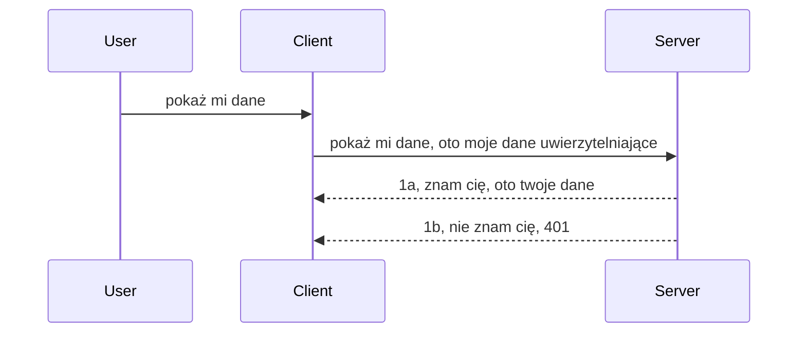

# Prosta autoryzacja

SDK MCP wspierają użycie OAuth 2.1, co jest całkiem złożonym procesem obejmującym takie pojęcia jak serwer autoryzacji, serwer zasobów, wysyłanie poświadczeń, uzyskiwanie kodu, wymianę kodu na token dostępu, aż w końcu możliwość pobrania danych zasobów. Jeśli nie masz doświadczenia z OAuth, który jest świetnym rozwiązaniem do zaimplementowania, dobrze jest zacząć od pewnego podstawowego poziomu autoryzacji i stopniowo przechodzić do coraz lepszego i bezpieczniejszego zabezpieczenia. Dlatego ten rozdział istnieje — by przygotować Cię do bardziej zaawansowanej autoryzacji.

## Autoryzacja, co mamy na myśli?

Auth to skrót od uwierzytelniania i autoryzacji. Chodzi o to, że musimy zrobić dwie rzeczy:

- **Uwierzytelnianie**, czyli proces ustalenia, czy pozwalamy osobie wejść do naszego domu, czy ma prawo być „tutaj”, czyli mieć dostęp do naszego serwera zasobów, gdzie działają funkcje MCP Servera.
- **Autoryzacja**, to proces sprawdzania, czy użytkownik powinien mieć dostęp do konkretnych zasobów, o które pyta, na przykład tych zamówień lub tych produktów, lub czy może tylko czytać zawartość, ale nie usuwać, jako inny przykład.

## Poświadczenia: jak informujemy system, kim jesteśmy

Większość programistów webowych myśli w kategoriach dostarczania serwerowi poświadczenia, zazwyczaj sekretu, który mówi, czy mogą tu być („uwierzytelnianie”). To poświadczenie to zwykle zakodowana w base64 wersja nazwy użytkownika i hasła albo klucz API, który unikalnie identyfikuje konkretnego użytkownika.

Polega to na wysłaniu tego w nagłówku o nazwie „Authorization” w taki sposób:

```json
{ "Authorization": "secret123" }
```

To jest zazwyczaj nazywane autoryzacją podstawową (basic authentication). Cały flow wygląda następująco:


Teraz, gdy rozumiemy jak to działa od strony przepływu, jak to zaimplementować? Większość serwerów webowych ma pojęcie middleware, kawałek kodu, który działa jako część żądania i może zweryfikować poświadczenia, a jeśli są poprawne, pozwala żądaniu przejść dalej. Jeśli żądanie nie ma poprawnych poświadczeń, zwraca błąd autoryzacji. Zobaczmy, jak to można zaimplementować:

**Python**

```python
class AuthMiddleware(BaseHTTPMiddleware):
    async def dispatch(self, request, call_next):

        has_header = request.headers.get("Authorization")
        if not has_header:
            print("-> Missing Authorization header!")
            return Response(status_code=401, content="Unauthorized")

        if not valid_token(has_header):
            print("-> Invalid token!")
            return Response(status_code=403, content="Forbidden")

        print("Valid token, proceeding...")
       
        response = await call_next(request)
        # dodaj dowolne nagłówki klienta lub w inny sposób zmień odpowiedź
        return response


starlette_app.add_middleware(CustomHeaderMiddleware)
```

Tutaj mamy:

- Stworzony middleware o nazwie `AuthMiddleware`, gdzie jego metoda `dispatch` jest wywoływana przez serwer webowy.
- Dodany middleware do serwera webowego:

    ```python
    starlette_app.add_middleware(AuthMiddleware)
    ```

- Napisaną logikę walidacji, która sprawdza czy nagłówek Authorization jest obecny i czy przesyłany sekret jest poprawny:

    ```python
    has_header = request.headers.get("Authorization")
    if not has_header:
        print("-> Missing Authorization header!")
        return Response(status_code=401, content="Unauthorized")

    if not valid_token(has_header):
        print("-> Invalid token!")
        return Response(status_code=403, content="Forbidden")
    ```

    jeśli sekret jest obecny i poprawny, pozwalamy na przejście żądania poprzez wywołanie `call_next` i zwracamy odpowiedź.

    ```python
    response = await call_next(request)
    # dodaj dowolne niestandardowe nagłówki lub zmień odpowiedź w jakiś sposób
    return response
    ```

Działa to tak, że jeśli przychodzi żądanie webowe do serwera, to middleware zostaje wywołany i w oparciu o swoją implementację albo pozwoli żądaniu przejść dalej, albo zwróci błąd wskazujący, że klient nie ma prawa kontynuować.

**TypeScript**

Tutaj tworzymy middleware z popularnym frameworkiem Express i przechwytujemy żądanie zanim dotrze do MCP Servera. Oto kod:

```typescript
function isValid(secret) {
    return secret === "secret123";
}

app.use((req, res, next) => {
    // 1. Nagłówek autoryzacji obecny?
    if(!req.headers["Authorization"]) {
        res.status(401).send('Unauthorized');
    }
    
    let token = req.headers["Authorization"];

    // 2. Sprawdź ważność.
    if(!isValid(token)) {
        res.status(403).send('Forbidden');
    }

   
    console.log('Middleware executed');
    // 3. Przekazuje żądanie do następnego kroku w potoku żądania.
    next();
});
```

W tym kodzie:

1. Sprawdzamy, czy nagłówek Authorization jest obecny na początku, jeśli nie, wysyłamy błąd 401.
2. Sprawdzamy, czy poświadczenie/token jest ważny, jeśli nie, wysyłamy błąd 403.
3. Na koniec przekazujemy dalej żądanie w pipeline i zwracamy żądany zasób.

## Ćwiczenie: Zaimplementuj uwierzytelnianie

Weźmy naszą wiedzę i spróbujmy ją zaimplementować. Oto plan:

Server

- Utwórz serwer webowy i instancję MCP.
- Zaimplementuj middleware dla serwera.

Client

- Wyślij żądanie webowe z poświadczeniem w nagłówku.

### -1- Utwórz serwer webowy i instancję MCP

W pierwszym kroku musimy stworzyć instancję serwera webowego i MCP Servera.

**Python**

Tworzymy instancję MCP Servera, tworzymy aplikację webową starlette i uruchamiamy ją za pomocą uvicorn.

```python
# tworzenie serwera MCP

app = FastMCP(
    name="MCP Resource Server",
    instructions="Resource Server that validates tokens via Authorization Server introspection",
    host=settings["host"],
    port=settings["port"],
    debug=True
)

# tworzenie aplikacji webowej starlette
starlette_app = app.streamable_http_app()

# udostępnianie aplikacji za pomocą uvicorn
async def run(starlette_app):
    import uvicorn
    config = uvicorn.Config(
            starlette_app,
            host=app.settings.host,
            port=app.settings.port,
            log_level=app.settings.log_level.lower(),
        )
    server = uvicorn.Server(config)
    await server.serve()

run(starlette_app)
```

W tym kodzie:

- Tworzymy MCP Servera.
- Konstruujemy aplikację starlette webową z MCP Servera, `app.streamable_http_app()`.
- Hostujemy i serwujemy aplikację webową używając uvicorn `server.serve()`.

**TypeScript**

Tutaj tworzymy instancję MCP Servera.

```typescript
const server = new McpServer({
      name: "example-server",
      version: "1.0.0"
    });

    // ... skonfiguruj zasoby serwera, narzędzia i podpowiedzi ...
```

Tworzenie MCP Servera musi się odbyć wewnątrz definicji trasy POST /mcp, więc bierzemy powyższy kod i przenosimy go tak:

```typescript
import express from "express";
import { randomUUID } from "node:crypto";
import { McpServer } from "@modelcontextprotocol/sdk/server/mcp.js";
import { StreamableHTTPServerTransport } from "@modelcontextprotocol/sdk/server/streamableHttp.js";
import { isInitializeRequest } from "@modelcontextprotocol/sdk/types.js"

const app = express();
app.use(express.json());

// Mapa do przechowywania transportów według ID sesji
const transports: { [sessionId: string]: StreamableHTTPServerTransport } = {};

// Obsługa żądań POST do komunikacji klient-serwer
app.post('/mcp', async (req, res) => {
  // Sprawdź, czy istnieje ID sesji
  const sessionId = req.headers['mcp-session-id'] as string | undefined;
  let transport: StreamableHTTPServerTransport;

  if (sessionId && transports[sessionId]) {
    // Ponowne użycie istniejącego transportu
    transport = transports[sessionId];
  } else if (!sessionId && isInitializeRequest(req.body)) {
    // Nowe żądanie inicjalizacji
    transport = new StreamableHTTPServerTransport({
      sessionIdGenerator: () => randomUUID(),
      onsessioninitialized: (sessionId) => {
        // Przechowaj transport według ID sesji
        transports[sessionId] = transport;
      },
      // Ochrona przed DNS rebinding jest domyślnie wyłączona dla zgodności wstecznej. Jeśli uruchamiasz ten serwer
      // lokalnie, upewnij się, że ustawiłeś:
      // enableDnsRebindingProtection: true,
      // allowedHosts: ['127.0.0.1'],
    });

    // Sprzątaj transport po jego zamknięciu
    transport.onclose = () => {
      if (transport.sessionId) {
        delete transports[transport.sessionId];
      }
    };
    const server = new McpServer({
      name: "example-server",
      version: "1.0.0"
    });

    // ... skonfiguruj zasoby serwera, narzędzia i podpowiedzi ...

    // Połącz z serwerem MCP
    await server.connect(transport);
  } else {
    // Nieprawidłowe żądanie
    res.status(400).json({
      jsonrpc: '2.0',
      error: {
        code: -32000,
        message: 'Bad Request: No valid session ID provided',
      },
      id: null,
    });
    return;
  }

  // Obsłuż żądanie
  await transport.handleRequest(req, res, req.body);
});

// Wielokrotnego użytku obsługa dla żądań GET i DELETE
const handleSessionRequest = async (req: express.Request, res: express.Response) => {
  const sessionId = req.headers['mcp-session-id'] as string | undefined;
  if (!sessionId || !transports[sessionId]) {
    res.status(400).send('Invalid or missing session ID');
    return;
  }
  
  const transport = transports[sessionId];
  await transport.handleRequest(req, res);
};

// Obsługa żądań GET dla powiadomień serwer-do-klienta przez SSE
app.get('/mcp', handleSessionRequest);

// Obsługa żądań DELETE dla zakończenia sesji
app.delete('/mcp', handleSessionRequest);

app.listen(3000);
```

Teraz widzisz, że tworzenie MCP Servera zostało przeniesione do środka `app.post("/mcp")`.

Przejdźmy do kolejnego kroku tworzenia middleware, abyśmy mogli walidować nadchodzące poświadczenia.

### -2- Zaimplementuj middleware dla serwera

Przejdźmy teraz do części middleware. Stworzymy middleware, który szuka poświadczenia w nagłówku `Authorization` i je weryfikuje. Jeśli jest akceptowalne, żądanie przejdzie dalej, by wykonać swoje zadanie (np. listować narzędzia, czytać zasób lub cokolwiek innego, czego klient żąda od MCP).

**Python**

Aby stworzyć middleware, potrzebujemy klasy dziedziczącej z `BaseHTTPMiddleware`. Są dwie ważne rzeczy:

- Żądanie `request`, z którego odczytujemy dane nagłówka.
- `call_next`, callback, który musimy wywołać, jeśli klient dostarczył poświadczenie, które akceptujemy.

Najpierw obsłużmy przypadek, gdy brakuje nagłówka `Authorization`:

```python
has_header = request.headers.get("Authorization")

# brak nagłówka, zwróć błąd 401, w przeciwnym razie kontynuuj.
if not has_header:
    print("-> Missing Authorization header!")
    return Response(status_code=401, content="Unauthorized")
```

Wysyłamy tutaj komunikat 401 unauthorized, bo klient nie przeszedł uwierzytelnienia.

Następnie, jeśli podano poświadczenie, sprawdzamy jego ważność tak:

```python
 if not valid_token(has_header):
    print("-> Invalid token!")
    return Response(status_code=403, content="Forbidden")
```

Zwróć uwagę, że wysyłamy powyżej komunikat 403 forbidden. Zobaczmy pełny middleware implementujący wszystko powyżej:

```python
class AuthMiddleware(BaseHTTPMiddleware):
    async def dispatch(self, request, call_next):

        has_header = request.headers.get("Authorization")
        if not has_header:
            print("-> Missing Authorization header!")
            return Response(status_code=401, content="Unauthorized")

        if not valid_token(has_header):
            print("-> Invalid token!")
            return Response(status_code=403, content="Forbidden")

        print("Valid token, proceeding...")
        print(f"-> Received {request.method} {request.url}")
        response = await call_next(request)
        response.headers['Custom'] = 'Example'
        return response

```

Świetnie, a co z funkcją `valid_token`? Oto ona poniżej:

```python
# NIE używaj do produkcji - ulepsz to !!
def valid_token(token: str) -> bool:
    # usuń prefiks "Bearer "
    if token.startswith("Bearer "):
        token = token[7:]
        return token == "secret-token"
    return False
```

To oczywiście można poprawić.

WAŻNE: Nigdy nie powinno się mieć sekretów w kodzie. Idealnie powinieneś pobrać wartość do weryfikacji z bazy danych albo od dostawcy tożsamości (IDP) lub jeszcze lepiej — pozwolić IDP wykonać walidację.

**TypeScript**

Aby to zrobić w Express, musimy wywołać metodę `use`, która przyjmuje funkcje middleware.

Musimy:

- Sprawdzić w zmiennej żądania poświadczenia przekazywane w własności `Authorization`.
- Zweryfikować poświadczenie i jeśli jest poprawne, pozwolić żądaniu kontynuować oraz wykonać żądanie MCP klienta (np. listowanie narzędzi, odczyt zasobu itp.).

Tutaj sprawdzamy, czy nagłówek `Authorization` jest obecny i jeśli nie, zatrzymujemy żądanie:

```typescript
if(!req.headers["authorization"]) {
    res.status(401).send('Unauthorized');
    return;
}
```

Jeśli nagłówek nie został przesłany, otrzymujesz błąd 401.

Następnie sprawdzamy, czy poświadczenie jest ważne, jeśli nie, zatrzymujemy żądanie z innym komunikatem:

```typescript
if(!isValid(token)) {
    res.status(403).send('Forbidden');
    return;
} 
```

Teraz otrzymujesz błąd 403.

Oto pełny kod:

```typescript
app.use((req, res, next) => {
    console.log('Request received:', req.method, req.url, req.headers);
    console.log('Headers:', req.headers["authorization"]);
    if(!req.headers["authorization"]) {
        res.status(401).send('Unauthorized');
        return;
    }
    
    let token = req.headers["authorization"];

    if(!isValid(token)) {
        res.status(403).send('Forbidden');
        return;
    }  

    console.log('Middleware executed');
    next();
});
```

Skonfigurowaliśmy serwer webowy, by przyjmował middleware do sprawdzania poświadczenia, które klient nam przesyła. A co z samym klientem?

### -3- Wyślij żądanie webowe z poświadczeniem w nagłówku

Musimy upewnić się, że klient przesyła poświadczenie w nagłówku. Ponieważ używamy klienta MCP, musimy dowiedzieć się, jak to zrobić.

**Python**

Dla klienta musimy przekazać nagłówek z naszym poświadczeniem tak:

```python
# NIE umieszczaj wartości na sztywno, miej ją przynajmniej w zmiennej środowiskowej lub bardziej bezpiecznym magazynie
token = "secret-token"

async with streamablehttp_client(
        url = f"http://localhost:{port}/mcp",
        headers = {"Authorization": f"Bearer {token}"}
    ) as (
        read_stream,
        write_stream,
        session_callback,
    ):
        async with ClientSession(
            read_stream,
            write_stream
        ) as session:
            await session.initialize()
      
            # TODO, co chcesz wykonać po stronie klienta, np. listowanie narzędzi, wywoływanie narzędzi itp.
```

Zwróć uwagę, jak wypełniamy własność `headers` w ten sposób ` headers = {"Authorization": f"Bearer {token}"}`.

**TypeScript**

Możemy to zrobić w dwóch krokach:

1. Wypełnić obiekt konfiguracyjny naszym poświadczeniem.
2. Przekazać ten obiekt konfiguracyjny do transportu.

```typescript

// NIE wpisuj wartości na sztywno, jak pokazano tutaj. Przynajmniej trzymaj ją jako zmienną środowiskową i użyj czegoś takiego jak dotenv (w trybie deweloperskim).
let token = "secret123"

// zdefiniuj obiekt opcji transportu klienta
let options: StreamableHTTPClientTransportOptions = {
  sessionId: sessionId,
  requestInit: {
    headers: {
      "Authorization": "secret123"
    }
  }
};

// przekaż obiekt opcji do transportu
async function main() {
   const transport = new StreamableHTTPClientTransport(
      new URL(serverUrl),
      options
   );
```

Tutaj widzisz, jak musieliśmy utworzyć obiekt `options` i umieścić nagłówki pod właściwością `requestInit`.

WAŻNE: Jak to poprawić? Obecny sposób ma pewne wady. Po pierwsze, przesyłanie poświadczeń w ten sposób jest dość ryzykowne, jeśli nie masz przynajmniej HTTPS. Nawet wtedy poświadczenia mogą zostać skradzione, więc potrzebujesz systemu, w którym można łatwo unieważnić token i dodać dodatkowe kontrole, na przykład skąd na świecie pochodzi żądanie, czy nie jest wysyłane zbyt często (zachowanie bota), innymi słowy, jest wiele kwestii do rozważenia.

Należy jednak powiedzieć, że dla bardzo prostych API, gdzie nie chcesz, żeby ktokolwiek wołał Twoje API bez uwierzytelnienia, to dobry start.

Mając to na uwadze, spróbujmy zwiększyć bezpieczeństwo używając standardowego formatu jak JSON Web Token, znanych też jako JWT lub tokeny „JOT”.

## JSON Web Tokens, JWT

Chcemy poprawić sytuację z wysyłaniem bardzo prostych poświadczeń. Jakie są natychmiastowe korzyści z przejścia na JWT?

- **Poprawa bezpieczeństwa**. W podstawowej autoryzacji wysyłasz nazwę użytkownika i hasło jako token zakodowany base64 (lub klucz API) wielokrotnie, co zwiększa ryzyko. Z JWT wysyłasz nazwę użytkownika i hasło i otrzymujesz token, który jest ograniczony czasowo i wygasa. JWT pozwala na łatwe stosowanie kontroli dostępu na poziomie ról, zakresów i uprawnień.
- **Bezstanowość i skalowalność**. JWT są samodzielne, zawierają wszystkie informacje o użytkowniku i eliminują potrzebę przechowywania sesji po stronie serwera. Token można też lokalnie zweryfikować.
- **Interoperacyjność i federacja**. JWT jest centralnym elementem Open ID Connect i używany przy znanych dostawcach tożsamości jak Entra ID, Google Identity i Auth0. Pozwalają na jednokrotne logowanie i wiele innych, co czyni je rozwiązaniami klasy enterprise.
- **Modularność i elastyczność**. JWT działa także z API Gatewayami jak Azure API Management, NGINX i innymi. Wspiera scenariusze uwierzytelniania i komunikacji serwer-serwis, także podszywanie się i delegację.
- **Wydajność i cache'owanie**. JWT można cache’ować po dekodowaniu, co zmniejsza potrzebę parsowania. Pomaga to zwłaszcza w aplikacjach o dużym ruchu, poprawiając przepustowość i redukując obciążenie infrastruktury.
- **Zaawansowane funkcje**. Wspiera też introspekcję (sprawdzanie ważności na serwerze) i unieważnianie (unieważnienie tokena).

Mając te wszystkie zalety, zobaczmy, jak możemy podnieść naszą implementację na wyższy poziom.

## Przekształcenie podstawowej autoryzacji w JWT

Zmiany na wysokim poziomie to:

- **Nauczyć się konstruować token JWT**, gotowy do przesłania z klienta do serwera.
- **Weryfikować token JWT** i jeśli jest poprawny, pozwolić klientowi korzystać z zasobów.
- **Bezpieczne przechowywanie tokenu**. Jak to przechowywać.
- **Zabezpieczyć trasy**. Trzeba chronić trasy, w naszym przypadku trasy i konkretne funkcje MCP.
- **Dodać tokeny odświeżające**. Tworzyć tokeny krótkotrwałe i długotrwałe tokeny odświeżające, które pozwalają pobrać nowe tokeny po wygaśnięciu. Zapewnić endpoint odświeżania i strategię rotacji.

### -1- Utwórz token JWT

Token JWT składa się z następujących części:

- **nagłówek**, algorytm i typ tokenu.
- **ładunek (payload)**, roszczenia, jak sub (użytkownik lub encja, którą reprezentuje token — zwykle id użytkownika), exp (data wygaśnięcia), role (rola)
- **podpis**, podpisany sekretem lub kluczem prywatnym.

Musimy stworzyć nagłówek, ładunek i zakodowany token.

**Python**

```python

import jwt
import jwt
from jwt.exceptions import ExpiredSignatureError, InvalidTokenError
import datetime

# Sekretny klucz używany do podpisywania JWT
secret_key = 'your-secret-key'

header = {
    "alg": "HS256",
    "typ": "JWT"
}

# informacje o użytkowniku oraz jego roszczenia i czas wygaśnięcia
payload = {
    "sub": "1234567890",               # Temat (ID użytkownika)
    "name": "User Userson",                # Niestandardowe roszczenie
    "admin": True,                     # Niestandardowe roszczenie
    "iat": datetime.datetime.utcnow(),# Czas wydania
    "exp": datetime.datetime.utcnow() + datetime.timedelta(hours=1)  # Czas wygaśnięcia
}

# zakoduj to
encoded_jwt = jwt.encode(payload, secret_key, algorithm="HS256", headers=header)
```

W powyższym kodzie:

- Zdefiniowano nagłówek używając HS256 jako algorytmu i typu JWT.
- Skonstruowano ładunek z subject albo id użytkownika, nazwą użytkownika, rolą, czasem wystawienia i wygaśnięcia, implementując tym samym aspekt ograniczenia czasowego.

**TypeScript**

Tu potrzebujemy zależności, które pomogą stworzyć token JWT.

Zależności

```sh

npm install jsonwebtoken
npm install --save-dev @types/jsonwebtoken
```

Mając to, stwórzmy nagłówek, ładunek i zakodowany token.

```typescript
import jwt from 'jsonwebtoken';

const secretKey = 'your-secret-key'; // Użyj zmiennych środowiskowych w produkcji

// Zdefiniuj ładunek
const payload = {
  sub: '1234567890',
  name: 'User usersson',
  admin: true,
  iat: Math.floor(Date.now() / 1000), // Wydany o
  exp: Math.floor(Date.now() / 1000) + 60 * 60 // Wygasa za 1 godzinę
};

// Zdefiniuj nagłówek (opcjonalne, jsonwebtoken ustawia wartości domyślne)
const header = {
  alg: 'HS256',
  typ: 'JWT'
};

// Utwórz token
const token = jwt.sign(payload, secretKey, {
  algorithm: 'HS256',
  header: header
});

console.log('JWT:', token);
```

Token jest:

Podpisany algorytmem HS256  
Ważny przez 1 godzinę  
Zawiera roszczenia jak sub, name, admin, iat i exp.

### -2- Weryfikuj token

Musimy też zweryfikować token, co powinniśmy robić na serwerze, by upewnić się, że to co klient przesyła jest faktycznie poprawne. Należy wykonać wiele kontroli, od struktury po ważność. Zachęcamy też do dodania dodatkowych kontroli, np. czy użytkownik jest w systemie i czy ma deklarowane prawa.

Aby zweryfikować token, musimy go zdekodować i zacząć sprawdzać jego ważność:

**Python**

```python

# Dekoduj i zweryfikuj JWT
try:
    decoded = jwt.decode(token, secret_key, algorithms=["HS256"])
    print("✅ Token is valid.")
    print("Decoded claims:")
    for key, value in decoded.items():
        print(f"  {key}: {value}")
except ExpiredSignatureError:
    print("❌ Token has expired.")
except InvalidTokenError as e:
    print(f"❌ Invalid token: {e}")

```

Tu wywołujemy `jwt.decode` z tokenem, sekretnym kluczem i wcześniej ustalonym algorytmem. Widać konstrukcję try-catch, bo nieudana walidacja powoduje rzucenie błędu.

**TypeScript**

Tutaj wywołujemy `jwt.verify`, by uzyskać zdekodowaną wersję tokenu do dalszej analizy. Jeśli to się nie uda, oznacza to, że struktura tokenu jest niewłaściwa lub token jest nieważny.

```typescript

try {
  const decoded = jwt.verify(token, secretKey);
  console.log('Decoded Payload:', decoded);
} catch (err) {
  console.error('Token verification failed:', err);
}
```

UWAGA: jak wspomniano wcześniej, powinniśmy wykonać dodatkowe kontrole, np. czy token wskazuje użytkownika w naszym systemie i czy użytkownik ma deklarowane prawa.
Następnie przyjrzyjmy się kontroli dostępu opartej na rolach, znanej również jako RBAC.

## Dodawanie kontroli dostępu opartej na rolach

Idea polega na tym, że chcemy wyrazić, że różne role mają różne uprawnienia. Na przykład zakładamy, że administrator może wszystko, zwykły użytkownik może czytać i pisać, a gość może tylko czytać. Dlatego oto kilka możliwych poziomów uprawnień:

- Admin.Write 
- User.Read
- Guest.Read

Spójrzmy, jak możemy zaimplementować taką kontrolę za pomocą middleware. Middleware może być dodawane na poziomie trasy, jak również dla wszystkich tras.

**Python**

```python
from starlette.middleware.base import BaseHTTPMiddleware
from starlette.responses import JSONResponse
import jwt

# NIE trzymaj sekretu w kodzie, to jest tylko do celów demonstracyjnych. Odczytaj go z bezpiecznego miejsca.
SECRET_KEY = "your-secret-key" # umieść to w zmiennej środowiskowej
REQUIRED_PERMISSION = "User.Read"

class JWTPermissionMiddleware(BaseHTTPMiddleware):
    async def dispatch(self, request, call_next):
        auth_header = request.headers.get("Authorization")
        if not auth_header or not auth_header.startswith("Bearer "):
            return JSONResponse({"error": "Missing or invalid Authorization header"}, status_code=401)

        token = auth_header.split(" ")[1]
        try:
            decoded = jwt.decode(token, SECRET_KEY, algorithms=["HS256"])
        except jwt.ExpiredSignatureError:
            return JSONResponse({"error": "Token expired"}, status_code=401)
        except jwt.InvalidTokenError:
            return JSONResponse({"error": "Invalid token"}, status_code=401)

        permissions = decoded.get("permissions", [])
        if REQUIRED_PERMISSION not in permissions:
            return JSONResponse({"error": "Permission denied"}, status_code=403)

        request.state.user = decoded
        return await call_next(request)


```

Istnieje kilka różnych sposobów dodania middleware, jak poniżej:

```python

# Alternatywa 1: dodaj middleware podczas konstrukcji aplikacji starlette
middleware = [
    Middleware(JWTPermissionMiddleware)
]

app = Starlette(routes=routes, middleware=middleware)

# Alternatywa 2: dodaj middleware po tym, jak aplikacja starlette jest już skonstruowana
starlette_app.add_middleware(JWTPermissionMiddleware)

# Alternatywa 3: dodaj middleware dla każdej trasy
routes = [
    Route(
        "/mcp",
        endpoint=..., # obsługujący
        middleware=[Middleware(JWTPermissionMiddleware)]
    )
]
```

**TypeScript**

Możemy użyć `app.use` oraz middleware, które będzie działać dla wszystkich żądań.

```typescript
app.use((req, res, next) => {
    console.log('Request received:', req.method, req.url, req.headers);
    console.log('Headers:', req.headers["authorization"]);

    // 1. Sprawdź, czy nagłówek autoryzacji został wysłany

    if(!req.headers["authorization"]) {
        res.status(401).send('Unauthorized');
        return;
    }
    
    let token = req.headers["authorization"];

    // 2. Sprawdź, czy token jest ważny
    if(!isValid(token)) {
        res.status(403).send('Forbidden');
        return;
    }  

    // 3. Sprawdź, czy użytkownik tokena istnieje w naszym systemie
    if(!isExistingUser(token)) {
        res.status(403).send('Forbidden');
        console.log("User does not exist");
        return;
    }
    console.log("User exists");

    // 4. Zweryfikuj, czy token ma odpowiednie uprawnienia
    if(!hasScopes(token, ["User.Read"])){
        res.status(403).send('Forbidden - insufficient scopes');
    }

    console.log("User has required scopes");

    console.log('Middleware executed');
    next();
});

```

Jest całkiem sporo rzeczy, które możemy pozwolić naszemu middleware robić i które NASZE middleware POWINNO robić, mianowicie:

1. Sprawdzenie, czy nagłówek autoryzacji jest obecny
2. Sprawdzenie, czy token jest ważny, wywołujemy `isValid`, co jest metodą, którą napisaliśmy do sprawdzania integralności i ważności tokena JWT.
3. Weryfikacja, czy użytkownik istnieje w naszym systemie — powinniśmy to sprawdzić.

   ```typescript
    // użytkownicy w bazie danych
   const users = [
     "user1",
     "User usersson",
   ]

   function isExistingUser(token) {
     let decodedToken = verifyToken(token);

     // DO ZROBIENIA, sprawdź czy użytkownik istnieje w bazie danych
     return users.includes(decodedToken?.name || "");
   }
   ```

   Powyżej stworzyliśmy bardzo prostą listę `users`, która oczywiście powinna znajdować się w bazie danych.

4. Dodatkowo powinniśmy też sprawdzić, czy token ma odpowiednie uprawnienia.

   ```typescript
   if(!hasScopes(token, ["User.Read"])){
        res.status(403).send('Forbidden - insufficient scopes');
   }
   ```

   W tym kodzie pochodzącym z middleware sprawdzamy, czy token zawiera uprawnienie User.Read, jeśli nie, wysyłamy błąd 403. Poniżej znajduje się metoda pomocnicza `hasScopes`.

   ```typescript
   function hasScopes(scope: string, requiredScopes: string[]) {
     let decodedToken = verifyToken(scope);
    return requiredScopes.every(scope => decodedToken?.scopes.includes(scope));
  }
   ```

Have a think which additional checks you should be doing, but these are the absolute minimum of checks you should be doing.

Using Express as a web framework is a common choice. There are helpers library when you use JWT so you can write less code.

- `express-jwt`, helper library that provides a middleware that helps decode your token.
- `express-jwt-permissions`, this provides a middleware `guard` that helps check if a certain permission is on the token.

Here's what these libraries can look like when used:

```typescript
const express = require('express');
const jwt = require('express-jwt');
const guard = require('express-jwt-permissions')();

const app = express();
const secretKey = 'your-secret-key'; // put this in env variable

// Decode JWT and attach to req.user
app.use(jwt({ secret: secretKey, algorithms: ['HS256'] }));

// Check for User.Read permission
app.use(guard.check('User.Read'));

// multiple permissions
// app.use(guard.check(['User.Read', 'Admin.Access']));

app.get('/protected', (req, res) => {
  res.json({ message: `Welcome ${req.user.name}` });
});

// Error handler
app.use((err, req, res, next) => {
  if (err.code === 'permission_denied') {
    return res.status(403).send('Forbidden');
  }
  next(err);
});

```

Teraz widziałeś, jak middleware może być używane zarówno do uwierzytelniania, jak i autoryzacji, a co z MCP? Czy zmienia to sposób, w jaki realizujemy auth? Dowiedzmy się w następnej sekcji.

### -3- Dodanie RBAC do MCP

Jak dotąd widziałeś, jak można dodać RBAC za pomocą middleware, jednak dla MCP nie ma łatwego sposobu, aby dodać RBAC dla poszczególnych funkcji MCP, więc co robimy? Po prostu musimy dodać kod, który sprawdza, czy klient ma prawa do wywołania konkretnego narzędzia:

Masz kilka różnych sposobów, aby osiągnąć RBAC na poziomie funkcji, oto niektóre z nich:

- Dodaj sprawdzenie dla każdego narzędzia, zasobu, prompta, gdzie musisz sprawdzić poziom uprawnień.

   **python**

   ```python
   @tool()
   def delete_product(id: int):
      try:
          check_permissions(role="Admin.Write", request)
      catch:
        pass # klient nie uzyskał autoryzacji, zgłoś błąd autoryzacji
   ```

   **typescript**

   ```typescript
   server.registerTool(
    "delete-product",
    {
      title: Delete a product",
      description: "Deletes a product",
      inputSchema: { id: z.number() }
    },
    async ({ id }) => {
      
      try {
        checkPermissions("Admin.Write", request);
        // do zrobienia, wyślij id do productService i zdalnego wejścia
      } catch(Exception e) {
        console.log("Authorization error, you're not allowed");  
      }

      return {
        content: [{ type: "text", text: `Deletected product with id ${id}` }]
      };
    }
   );
   ```


- Użyj zaawansowanego podejścia serwerowego i obsługi żądań, aby zminimalizować miejsca, w których musisz wykonywać sprawdzenie.

   **Python**

   ```python
   
   tool_permission = {
      "create_product": ["User.Write", "Admin.Write"],
      "delete_product": ["Admin.Write"]
   }

   def has_permission(user_permissions, required_permissions) -> bool:
      # user_permissions: lista uprawnień, które posiada użytkownik
      # required_permissions: lista uprawnień wymaganych do narzędzia
      return any(perm in user_permissions for perm in required_permissions)

   @server.call_tool()
   async def handle_call_tool(
     name: str, arguments: dict[str, str] | None
   ) -> list[types.TextContent]:
    # Załóż, że request.user.permissions jest listą uprawnień użytkownika
     user_permissions = request.user.permissions
     required_permissions = tool_permission.get(name, [])
     if not has_permission(user_permissions, required_permissions):
        # Rzuć błąd "Nie masz uprawnienia do wywołania narzędzia {name}"
        raise Exception(f"You don't have permission to call tool {name}")
     # kontynuuj i wywołaj narzędzie
     # ...
   ```   
   

   **TypeScript**

   ```typescript
   function hasPermission(userPermissions: string[], requiredPermissions: string[]): boolean {
       if (!Array.isArray(userPermissions) || !Array.isArray(requiredPermissions)) return false;
       // Zwróć true jeśli użytkownik ma co najmniej jedno wymagane uprawnienie
       
       return requiredPermissions.some(perm => userPermissions.includes(perm));
   }
  
   server.setRequestHandler(CallToolRequestSchema, async (request) => {
      const { params: { name } } = request;
  
      let permissions = request.user.permissions;
  
      if (!hasPermission(permissions, toolPermissions[name])) {
         return new Error(`You don't have permission to call ${name}`);
      }
  
      // kontynuuj..
   });
   ```

   Uwaga, musisz upewnić się, że middleware przypisuje zdekodowany token do właściwości user w żądaniu, aby powyższy kod był prosty.

### Podsumowanie

Teraz, gdy omówiliśmy, jak dodać wsparcie dla RBAC ogólnie i dla MCP w szczególności, nadszedł czas, aby spróbować zaimplementować bezpieczeństwo samodzielnie, aby upewnić się, że zrozumiałeś przedstawione koncepcje.

## Zadanie 1: Zbuduj serwer MCP i klienta MCP używając podstawowej autoryzacji

Tutaj przećwiczysz to, czego nauczyłeś się dotyczącego przesyłania danych uwierzytelniających przez nagłówki.

## Rozwiązanie 1

[Solution 1](./code/basic/README.md)

## Zadanie 2: Ulepsz rozwiązanie z Zadania 1, aby użyć JWT

Weź pierwsze rozwiązanie, ale tym razem popraw je.

Zamiast używać Basic Auth, użyj JWT.

## Rozwiązanie 2

[Solution 2](./solution/jwt-solution/README.md)

## Wyzwanie

Dodaj RBAC dla każdego narzędzia, które opisujemy w sekcji "Dodaj RBAC do MCP".

## Podsumowanie

Mam nadzieję, że wiele nauczyłeś się w tym rozdziale, od braku bezpieczeństwa w ogóle, przez podstawowe zabezpieczenia, po JWT i jak można je dodać do MCP.

Zbudowaliśmy solidną podstawę z niestandardowymi JWT, ale w miarę skalowania przechodzimy do modelu tożsamości opartego na standardach. Przyjęcie dostawcy tożsamości (IdP) takiego jak Entra czy Keycloak pozwala nam przenieść odpowiedzialność za wydawanie tokenów, walidację i zarządzanie cyklem życia do zaufanej platformy — co pozwala nam skupić się na logice aplikacji i doświadczeniu użytkownika.

Do tego mamy bardziej [zaawansowany rozdział o Entra](../../05-AdvancedTopics/mcp-security-entra/README.md)

## Co dalej

- Następnie: [Konfiguracja hostów MCP](../12-mcp-hosts/README.md)

---

<!-- CO-OP TRANSLATOR DISCLAIMER START -->
**Zastrzeżenie**:  
Niniejszy dokument został przetłumaczony przy użyciu automatycznej usługi tłumaczeniowej AI [Co-op Translator](https://github.com/Azure/co-op-translator). Mimo że dokładamy starań, aby tłumaczenie było jak najdokładniejsze, prosimy o uwzględnienie, że tłumaczenia automatyczne mogą zawierać błędy lub niedokładności. Oryginalny dokument w języku źródłowym należy uznać za wersję autorytatywną. W przypadku informacji krytycznych zaleca się skorzystanie z profesjonalnego tłumaczenia wykonanego przez człowieka. Nie ponosimy odpowiedzialności za jakiekolwiek nieporozumienia lub błędne interpretacje wynikające z korzystania z tego tłumaczenia.
<!-- CO-OP TRANSLATOR DISCLAIMER END -->