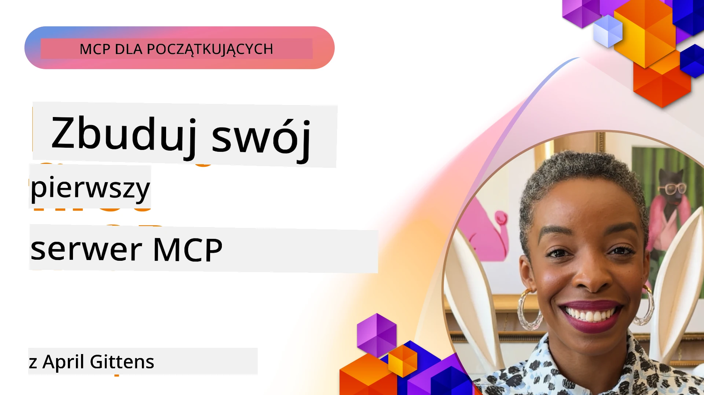

## Rozpoczęcie  

_(Kliknij powyższy obraz, aby obejrzeć wideo z tej lekcji)_

Ta sekcja składa się z kilku lekcji:

- **1 Twój pierwszy serwer**, w tej pierwszej lekcji nauczysz się, jak stworzyć swój pierwszy serwer i zbadać go za pomocą narzędzia inspektora, wartościowego sposobu testowania i debugowania swojego serwera, [do lekcji](01-first-server/README.md)

- **2 Klient**, w tej lekcji nauczysz się, jak napisać klienta, który może połączyć się z twoim serwerem, [do lekcji](02-client/README.md)

- **3 Klient z LLM**, jeszcze lepszym sposobem napisania klienta jest dodanie do niego LLM, aby mógł „negocjować” z twoim serwerem, co ma robić, [do lekcji](03-llm-client/README.md)

- **4 Konsumowanie trybu agenta GitHub Copilot serwera w Visual Studio Code**. Tutaj przyglądamy się uruchamianiu naszego serwera MCP z poziomu Visual Studio Code, [do lekcji](04-vscode/README.md)

- **5 Serwer transportu stdio** transport stdio jest zalecanym standardem do lokalnej komunikacji serwera MCP z klientem, zapewniającym bezpieczną komunikację na bazie procesów potomnych ze wbudowaną izolacją procesów [do lekcji](05-stdio-server/README.md)

- **6 Strumieniowanie HTTP z MCP (Streamable HTTP)**. Poznaj nowoczesny transport strumieniowy HTTP (zalecane podejście dla zdalnych serwerów MCP wg [Specyfikacji MCP 2025-11-25](https://spec.modelcontextprotocol.io/specification/2025-11-25/basic/transports/#streamable-http)), powiadomienia o postępie oraz jak implementować skalowalne, działające w czasie rzeczywistym serwery i klientów MCP używając Streamable HTTP. [do lekcji](06-http-streaming/README.md)

- **7 Wykorzystanie zestawu narzędzi AI dla VSCode** do konsumowania i testowania klientów i serwerów MCP [do lekcji](07-aitk/README.md)

- **8 Testowanie**. Tutaj skupimy się szczególnie na tym, jak możemy testować nasz serwer i klienta na różne sposoby, [do lekcji](08-testing/README.md)

- **9 Wdrażanie**. Ten rozdział omawia różne sposoby wdrażania twoich rozwiązań MCP, [do lekcji](09-deployment/README.md)

- **10 Zaawansowane użycie serwera**. Ten rozdział porusza zaawansowane użycie serwera, [do lekcji](./10-advanced/README.md)

- **11 Uwierzytelnianie**. Ten rozdział omawia, jak dodać proste uwierzytelnianie, od Basic Auth po użycie JWT i RBAC. Zachęcamy do rozpoczęcia tutaj, a następnie zapoznania się z tematami zaawansowanymi w rozdziale 5 oraz dodatkowymi zaleceniami dotyczącymi zabezpieczeń w rozdziale 2, [do lekcji](./11-simple-auth/README.md)

- **12 Hosty MCP**. Konfiguruj i korzystaj z popularnych klientów hostów MCP, w tym Claude Desktop, Cursor, Cline i Windsurf. Poznaj typy transportów i rozwiązywanie problemów, [do lekcji](./12-mcp-hosts/README.md)

- **13 Inspektor MCP**. Debuguj i testuj swoje serwery MCP interaktywnie przy użyciu narzędzia MCP Inspector. Naucz się rozwiązywania problemów, korzystania z zasobów i przesyłania komunikatów protokołu, [do lekcji](./13-mcp-inspector/README.md)

Model Context Protocol (MCP) to otwarty protokół, który standaryzuje sposób, w jaki aplikacje dostarczają kontekst do LLM. Można myśleć o MCP jak o porcie USB-C dla aplikacji AI – zapewnia standaryzowany sposób łączenia modeli AI z różnymi źródłami danych i narzędziami.

## Cele nauki

Na koniec tej lekcji będziesz potrafić:

- Skonfigurować środowiska deweloperskie dla MCP w C#, Java, Python, TypeScript i JavaScript
- Budować i wdrażać podstawowe serwery MCP z niestandardowymi funkcjami (zasoby, prompt’y i narzędzia)
- Tworzyć aplikacje hostów łączące się z serwerami MCP
- Testować i debugować implementacje MCP
- Rozumieć typowe problemy związane z konfiguracją i ich rozwiązania
- Łączyć swoje implementacje MCP z popularnymi usługami LLM

## Konfiguracja środowiska MCP

Zanim zaczniesz pracować z MCP, ważne jest przygotowanie środowiska deweloperskiego i zrozumienie podstawowego przepływu pracy. Ta sekcja przeprowadzi cię przez pierwsze kroki konfiguracji, aby zapewnić płynny start z MCP.

### Wymagania wstępne

Zanim zanurzysz się w rozwój MCP, upewnij się, że masz:

- **Środowisko programistyczne**: dla wybranego języka (C#, Java, Python, TypeScript lub JavaScript)
- **IDE/Edytor**: Visual Studio, Visual Studio Code, IntelliJ, Eclipse, PyCharm lub dowolny nowoczesny edytor kodu
- **Menedżery pakietów**: NuGet, Maven/Gradle, pip lub npm/yarn
- **Klucze API**: dla dowolnych usług AI, których planujesz używać w swoich aplikacjach hostów

### Oficjalne SDK

W nadchodzących rozdziałach zobaczysz rozwiązania zbudowane w Pythonie, TypeScript, Javie i .NET. Oto wszystkie oficjalnie wspierane SDK.

MCP udostępnia oficjalne SDK dla wielu języków (zgodnie z [Specyfikacją MCP 2025-11-25](https://spec.modelcontextprotocol.io/specification/2025-11-25/)):
- [C# SDK](https://github.com/modelcontextprotocol/csharp-sdk) - utrzymywane we współpracy z Microsoft
- [Java SDK](https://github.com/modelcontextprotocol/java-sdk) - utrzymywane we współpracy ze Spring AI
- [TypeScript SDK](https://github.com/modelcontextprotocol/typescript-sdk) - oficjalna implementacja TypeScript
- [Python SDK](https://github.com/modelcontextprotocol/python-sdk) - oficjalna implementacja Python (FastMCP)
- [Kotlin SDK](https://github.com/modelcontextprotocol/kotlin-sdk) - oficjalna implementacja Kotlin
- [Swift SDK](https://github.com/modelcontextprotocol/swift-sdk) - utrzymywane we współpracy z Loopwork AI
- [Rust SDK](https://github.com/modelcontextprotocol/rust-sdk) - oficjalna implementacja Rust
- [Go SDK](https://github.com/modelcontextprotocol/go-sdk) - oficjalna implementacja Go

## Najważniejsze punkty

- Konfiguracja środowiska deweloperskiego MCP jest prosta dzięki SDK dedykowanym dla konkretnych języków
- Tworzenie serwerów MCP polega na tworzeniu i rejestrowaniu narzędzi z jasnymi schematami
- Klienci MCP łączą się z serwerami i modelami, aby korzystać z rozszerzonych możliwości
- Testowanie i debugowanie są niezbędne dla niezawodnych implementacji MCP
- Opcje wdrożeniowe obejmują lokalny rozwój i rozwiązania chmurowe

## Praktyka

Mamy zestaw przykładów uzupełniających ćwiczenia, które zobaczysz we wszystkich rozdziałach tej sekcji. Dodatkowo każdy rozdział ma własne ćwiczenia i zadania.

- [Java Kalkulator](./samples/java/calculator/README.md)
- [.Net Kalkulator](../../../03-GettingStarted/samples/csharp)
- [JavaScript Kalkulator](./samples/javascript/README.md)
- [TypeScript Kalkulator](./samples/typescript/README.md)
- [Python Kalkulator](../../../03-GettingStarted/samples/python)

## Dodatkowe zasoby

- [Buduj agentów za pomocą Model Context Protocol na Azure](https://learn.microsoft.com/azure/developer/ai/intro-agents-mcp)
- [Zdalny MCP z Azure Container Apps (Node.js/TypeScript/JavaScript)](https://learn.microsoft.com/samples/azure-samples/mcp-container-ts/mcp-container-ts/)
- [.NET OpenAI MCP Agent](https://learn.microsoft.com/samples/azure-samples/openai-mcp-agent-dotnet/openai-mcp-agent-dotnet/)

## Co dalej

Rozpocznij od pierwszej lekcji: [Tworzenie twojego pierwszego serwera MCP](01-first-server/README.md)

Po ukończeniu tego modułu, kontynuuj do: [Moduł 4: Praktyczna implementacja](../04-PracticalImplementation/README.md)

---

<!-- CO-OP TRANSLATOR DISCLAIMER START -->
**Zastrzeżenie**:  
Ten dokument został przetłumaczony przy użyciu automatycznej usługi tłumaczeniowej AI [Co-op Translator](https://github.com/Azure/co-op-translator). Mimo że dokładamy starań, aby tłumaczenie było wierne, prosimy pamiętać, że tłumaczenia automatyczne mogą zawierać błędy lub niedokładności. Oryginalny dokument w języku źródłowym należy uważać za źródło wiążące. W przypadku informacji o krytycznym znaczeniu zalecane jest skorzystanie z profesjonalnego tłumaczenia wykonanego przez człowieka. Nie ponosimy odpowiedzialności za jakiekolwiek nieporozumienia lub błędne interpretacje wynikające z użycia tego tłumaczenia.
<!-- CO-OP TRANSLATOR DISCLAIMER END -->