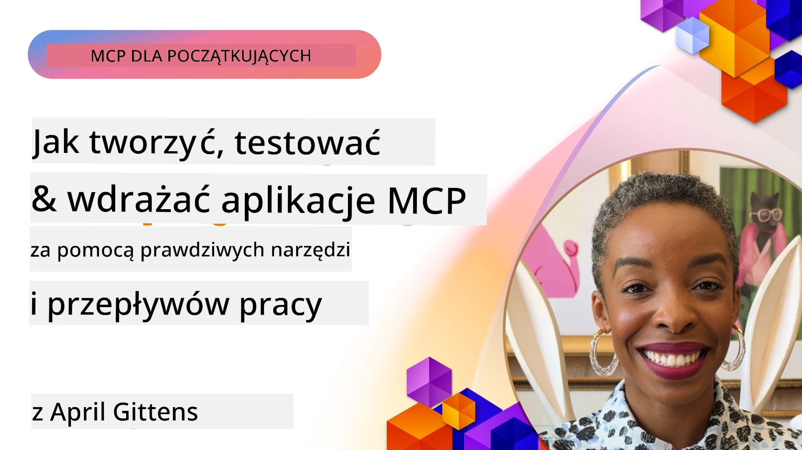
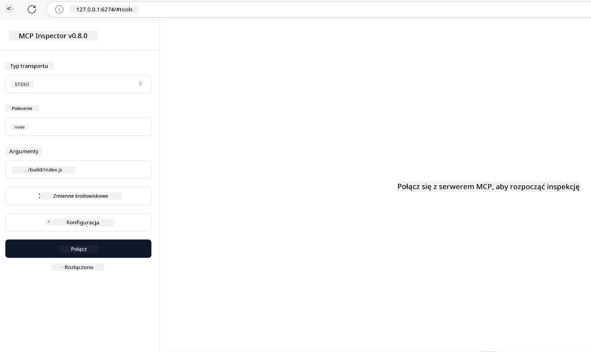

# Praktyczna implementacja

[](https://youtu.be/vCN9-mKBDfQ)

_(Kliknij powyższy obrazek, aby obejrzeć wideo z tej lekcji)_

Praktyczna implementacja to moment, gdy moc Model Context Protocol (MCP) staje się namacalna. Choć zrozumienie teorii i architektury MCP jest ważne, prawdziwa wartość pojawia się, gdy zastosujesz te koncepcje do budowy, testowania i wdrażania rozwiązań rozwiązujących rzeczywiste problemy. Ten rozdział łączy wiedzę koncepcyjną z praktycznym rozwojem, prowadząc Cię przez proces ożywiania aplikacji opartych na MCP.

Niezależnie od tego, czy tworzysz inteligentnych asystentów, integrujesz AI w przepływach pracy biznesowych, czy budujesz niestandardowe narzędzia do przetwarzania danych, MCP zapewnia elastyczną bazę. Jego językowo-neutralny design i oficjalne SDK dla popularnych języków programowania czynią go dostępnym dla szerokiego grona programistów. Wykorzystując te SDK, możesz szybko prototypować, iterować i skalować swoje rozwiązania na różnych platformach i środowiskach.

W kolejnych sekcjach znajdziesz praktyczne przykłady, przykładowy kod i strategie wdrażania, które pokazują, jak zaimplementować MCP w C#, Javie ze Spring, TypeScript, JavaScript i Pythonie. Dowiesz się też, jak debugować i testować swoje serwery MCP, zarządzać API i wdrażać rozwiązania w chmurze przy użyciu Azure. Te praktyczne materiały mają na celu przyspieszyć Twoją naukę i pomóc Ci pewnie tworzyć solidne, gotowe do produkcji aplikacje MCP.

## Przegląd

Ta lekcja koncentruje się na praktycznych aspektach implementacji MCP w wielu językach programowania. Zbadamy, jak używać SDK MCP w C#, Javie ze Spring, TypeScript, JavaScript i Pythonie do budowy solidnych aplikacji, debugowania i testowania serwerów MCP oraz tworzenia wielokrotnego użytku zasobów, promptów i narzędzi.

## Cele nauki

Do końca tej lekcji będziesz potrafił:

- Implementować rozwiązania MCP korzystając z oficjalnych SDK w różnych językach programowania
- Systematycznie debugować i testować serwery MCP
- Tworzyć i używać funkcji serwera (Zasoby, Prompty i Narzędzia)
- Projektować skuteczne przepływy pracy MCP do złożonych zadań
- Optymalizować implementacje MCP pod kątem wydajności i niezawodności

## Oficjalne zasoby SDK

Model Context Protocol oferuje oficjalne SDK dla wielu języków (zgodne z [specyfikacją MCP 2025-11-25](https://spec.modelcontextprotocol.io/specification/2025-11-25/)):

- [C# SDK](https://github.com/modelcontextprotocol/csharp-sdk)
- [Java ze Spring SDK](https://github.com/modelcontextprotocol/java-sdk) **Uwaga:** wymaga zależności od [Project Reactor](https://projectreactor.io). (Zobacz [dyskusję #246](https://github.com/orgs/modelcontextprotocol/discussions/246).)
- [TypeScript SDK](https://github.com/modelcontextprotocol/typescript-sdk)
- [Python SDK](https://github.com/modelcontextprotocol/python-sdk)
- [Kotlin SDK](https://github.com/modelcontextprotocol/kotlin-sdk)
- [Go SDK](https://github.com/modelcontextprotocol/go-sdk)

## Praca z SDK MCP

Ta sekcja dostarcza praktycznych przykładów implementacji MCP w wielu językach programowania. Przykładowy kod znajdziesz w katalogu `samples` uporządkowany wg języków.

### Dostępne przykłady

Repozytorium zawiera [przykładowe implementacje](../../../04-PracticalImplementation/samples) w następujących językach:

- [C#](./samples/csharp/README.md)
- [Java ze Spring](./samples/java/containerapp/README.md)
- [TypeScript](./samples/typescript/README.md)
- [JavaScript](./samples/javascript/README.md)
- [Python](./samples/python/README.md)

Każdy przykład demonstruje kluczowe koncepcje MCP i wzorce implementacji dla danego języka i ekosystemu.

### Praktyczne przewodniki

Dodatkowe przewodniki dotyczące praktycznej implementacji MCP:

- [Paginacja oraz praca z dużymi zestawami wyników](./pagination/README.md) - Obsługa paginacji opartej na kursorze dla narzędzi, zasobów i dużych zbiorów danych

## Podstawowe funkcje serwera

Serwery MCP mogą implementować dowolne połączenie następujących funkcji:

### Zasoby

Zasoby dostarczają kontekst i dane dla użytkownika lub modelu AI do wykorzystania:

- Repozytoria dokumentów
- Bazy wiedzy
- Źródła danych strukturalnych
- Systemy plików

### Prompty

Prompty to szablonowe wiadomości i przepływy pracy dla użytkowników:

- Wstępnie zdefiniowane szablony rozmów
- Prowadzone wzorce interakcji
- Specjalistyczne struktury dialogowe

### Narzędzia

Narzędzia to funkcje, które model AI może wykonać:

- Narzędzia do przetwarzania danych
- Integracje z zewnętrznymi API
- Możliwości obliczeniowe
- Funkcjonalności wyszukiwania

## Przykładowe implementacje: Implementacja w C#

Oficjalne repozytorium C# SDK zawiera kilka przykładowych implementacji demonstrujących różne aspekty MCP:

- **Podstawowy klient MCP**: Prosty przykład pokazujący, jak utworzyć klienta MCP i wywołać narzędzia
- **Podstawowy serwer MCP**: Minimalna implementacja serwera z podstawową rejestracją narzędzi
- **Zaawansowany serwer MCP**: Serwer pełnofunkcyjny z rejestracją narzędzi, uwierzytelnianiem i obsługą błędów
- **Integracja z ASP.NET**: Przykłady integracji z ASP.NET Core
- **Wzorce implementacji narzędzi**: Różne wzorce implementacji narzędzi o różnych stopniach złożoności

SDK MCP w C# jest w fazie podglądu i API mogą się zmieniać. Będziemy na bieżąco aktualizować ten blog wraz z rozwojem SDK.

### Kluczowe funkcje

- [C# MCP Nuget ModelContextProtocol](https://www.nuget.org/packages/ModelContextProtocol)
- Budowa twojego [pierwszego serwera MCP](https://devblogs.microsoft.com/dotnet/build-a-model-context-protocol-mcp-server-in-csharp/).

Pełne przykłady implementacji w C# znajdziesz w [oficjalnym repozytorium przykładów C# SDK](https://github.com/modelcontextprotocol/csharp-sdk)

## Przykładowa implementacja: Implementacja Java ze Spring

SDK Java ze Spring oferuje solidne opcje implementacji MCP z funkcjami na poziomie korporacyjnym.

### Kluczowe funkcje

- Integracja ze Spring Framework
- Silna kontrola typów
- Wsparcie programowania reaktywnego
- Kompleksowa obsługa błędów

Pełny przykład implementacji Java ze Spring znajdziesz w [przykładzie Java ze Spring](samples/java/containerapp/README.md) w katalogu z przykładami.

## Przykładowa implementacja: Implementacja JavaScript

SDK JavaScript oferuje lekki i elastyczny sposób implementacji MCP.

### Kluczowe funkcje

- Wsparcie dla Node.js i przeglądarek
- API oparte na obietnicach (Promise)
- Łatwa integracja z Express i innymi frameworkami
- Wsparcie WebSocket dla strumieniowania

Pełny przykład implementacji JavaScript znajdziesz w [przykładzie JavaScript](samples/javascript/README.md) w katalogu z przykładami.

## Przykładowa implementacja: Implementacja Python

SDK Python oferuje idiomatyczne podejście do implementacji MCP z doskonałą integracją z frameworkami ML.

### Kluczowe funkcje

- Wsparcie async/await za pomocą asyncio
- Integracja z FastAPI``
- Prosta rejestracja narzędzi
- Natychmiastowa integracja z popularnymi bibliotekami ML

Pełny przykład implementacji Python znajdziesz w [przykładzie Python](samples/python/README.md) w katalogu z przykładami.

## Zarządzanie API

Azure API Management to świetne rozwiązanie zabezpieczające serwery MCP. Pomysł polega na umieszczeniu instancji Azure API Management przed twoim serwerem MCP i pozwoleniu, aby obsługiwał funkcje, które prawdopodobnie chcesz mieć, takie jak:

- limitowanie przepustowości
- zarządzanie tokenami
- monitorowanie
- równoważenie obciążenia
- bezpieczeństwo

### Przykład Azure

Oto przykład Azure, który robi dokładnie to, tj. [tworzenie serwera MCP i zabezpieczanie go za pomocą Azure API Management](https://github.com/Azure-Samples/remote-mcp-apim-functions-python).

Zobacz, jak przebiega przepływ autoryzacji na poniższym obrazku:


Na powyższym obrazie ma miejsce:

- Uwierzytelnianie/autoryzacja przy użyciu Microsoft Entra.
- Azure API Management działa jako brama i używa reguł do kierowania i zarządzania ruchem.
- Azure Monitor loguje wszystkie żądania do dalszej analizy.

#### Przepływ autoryzacji

Przyjrzyjmy się przepływowi autoryzacji bardziej szczegółowo:


#### Specyfikacja autoryzacji MCP

Dowiedz się więcej o [specyfikacji autoryzacji MCP](https://spec.modelcontextprotocol.io/specification/2025-11-25/basic/authorization/)

## Wdrażanie zdalnego serwera MCP do Azure

Zobaczmy, czy możemy wdrożyć wspomniany wcześniej przykład:

1. Sklonuj repozytorium

    ```bash
    git clone https://github.com/Azure-Samples/remote-mcp-apim-functions-python.git
    cd remote-mcp-apim-functions-python
    ```

1. Zarejestruj dostawcę zasobów `Microsoft.App`.

   - Jeśli używasz Azure CLI, uruchom `az provider register --namespace Microsoft.App --wait`.
   - Jeśli używasz Azure PowerShell, uruchom `Register-AzResourceProvider -ProviderNamespace Microsoft.App`. Następnie sprawdź po jakimś czasie `(Get-AzResourceProvider -ProviderNamespace Microsoft.App).RegistrationState`, aby zweryfikować, czy rejestracja zakończyła się.

1. Uruchom poniższe polecenie [azd](https://aka.ms/azd), aby przygotować usługę zarządzania API, aplikację funkcji (z kodem) i wszystkie inne potrzebne zasoby Azure

    ```shell
    azd up
    ```

    To polecenie powinno wdrożyć wszystkie zasoby w chmurze na Azure

### Testowanie serwera za pomocą MCP Inspector

1. W **nowym oknie terminala** zainstaluj i uruchom MCP Inspector

    ```shell
    npx @modelcontextprotocol/inspector
    ```

    Powinieneś zobaczyć interfejs podobny do:

    

1. Kliknij CTRL, aby załadować aplikację internetową MCP Inspector z wyświetlonego przez aplikację URL (np. [http://127.0.0.1:6274/#resources](http://127.0.0.1:6274/#resources))
1. Ustaw typ transportu na `SSE`
1. Ustaw URL na swój działający punkt końcowy API Management SSE wyświetlony po `azd up` i **Połącz**:

    ```shell
    https://<apim-servicename-from-azd-output>.azure-api.net/mcp/sse
    ```

1. **Wyświetl narzędzia**. Kliknij na narzędzie i **Uruchom narzędzie**.  

Jeśli wszystkie kroki zakończyły się powodzeniem, teraz powinieneś być połączony z serwerem MCP i udało Ci się wywołać narzędzie.

## Serwery MCP dla Azure

[Remote-mcp-functions](https://github.com/Azure-Samples/remote-mcp-functions-dotnet): Zestaw repozytoriów to szybki szablon startowy do budowania i wdrażania niestandardowych zdalnych serwerów MCP (Model Context Protocol) za pomocą Azure Functions w Python, C# .NET lub Node/TypeScript.

Przykłady dostarczają kompletnych rozwiązań, które pozwalają programistom:

- Budować i uruchamiać lokalnie: rozwijać i debugować serwer MCP na lokalnej maszynie
- Wdrażać do Azure: łatwo wdrażać do chmury za pomocą prostego polecenia azd up
- Łączyć się z klientami: łączyć się z serwerem MCP z różnych klientów, w tym z trybu agenta Copilot w VS Code i z narzędzia MCP Inspector

### Kluczowe funkcje

- Bezpieczeństwo wbudowane: Serwer MCP jest zabezpieczony kluczami i HTTPS
- Opcje uwierzytelniania: Obsługa OAuth przy użyciu wbudowanego uwierzytelniania i/lub API Management
- Izolacja sieciowa: Pozwala na izolację sieci przy pomocy Azure Virtual Networks (VNET)
- Architektura serverless: Wykorzystuje Azure Functions do skalowalnej, zdarzeniowej egzekucji
- Lokalny rozwój: Kompleksowe wsparcie lokalnego rozwoju i debugowania
- Proste wdrożenie: Uproszczony proces wdrażania do Azure

Repozytorium zawiera wszystkie potrzebne pliki konfiguracyjne, kod źródłowy oraz definicje infrastruktury, aby szybko rozpocząć pracę z gotową do produkcji implementacją serwera MCP.

- [Azure Remote MCP Functions Python](https://github.com/Azure-Samples/remote-mcp-functions-python) - Przykładowa implementacja MCP za pomocą Azure Functions z Pythonem

- [Azure Remote MCP Functions .NET](https://github.com/Azure-Samples/remote-mcp-functions-dotnet) - Przykładowa implementacja MCP za pomocą Azure Functions z C# .NET

- [Azure Remote MCP Functions Node/Typescript](https://github.com/Azure-Samples/remote-mcp-functions-typescript) - Przykładowa implementacja MCP za pomocą Azure Functions z Node/TypeScript.

## Najważniejsze wnioski

- SDK MCP dostarczają narzędzia specyficzne dla języka do implementacji solidnych rozwiązań MCP
- Proces debugowania i testowania jest kluczowy dla niezawodnych aplikacji MCP
- Wielokrotnego użytku szablony promptów umożliwiają spójne interakcje AI
- Dobrze zaprojektowane przepływy pracy mogą orkiestrują złożone zadania wykorzystując wiele narzędzi
- Implementacja rozwiązań MCP wymaga uwzględnienia bezpieczeństwa, wydajności i obsługi błędów

## Ćwiczenie

Zaprojektuj praktyczny przepływ pracy MCP, który rozwiązuje rzeczywisty problem w Twojej dziedzinie:

1. Zidentyfikuj 3-4 narzędzia, które byłyby przydatne do rozwiązania tego problemu
2. Stwórz diagram przepływu pracy pokazujący, jak te narzędzia ze sobą współdziałają
3. Zaimplementuj podstawową wersję jednego z narzędzi w wybranym przez siebie języku
4. Stwórz szablon promptu, który pomoże modelowi efektywnie korzystać z Twojego narzędzia

## Dodatkowe zasoby

---

## Co dalej

Następne: [Zaawansowane tematy](../05-AdvancedTopics/README.md)

---

<!-- CO-OP TRANSLATOR DISCLAIMER START -->
**Zastrzeżenie**:
Niniejszy dokument został przetłumaczony za pomocą usługi tłumaczeń AI [Co-op Translator](https://github.com/Azure/co-op-translator). Choć dokładamy wszelkich starań, aby tłumaczenie było jak najdokładniejsze, należy pamiętać, że automatyczne tłumaczenia mogą zawierać błędy lub nieścisłości. Oryginalny dokument w języku źródłowym powinien być traktowany jako źródło wiążące. W przypadku informacji o kluczowym znaczeniu zaleca się skorzystanie z profesjonalnego, ludzkiego tłumaczenia. Nie ponosimy odpowiedzialności za jakiekolwiek nieporozumienia lub błędne interpretacje wynikające z korzystania z tego tłumaczenia.
<!-- CO-OP TRANSLATOR DISCLAIMER END -->