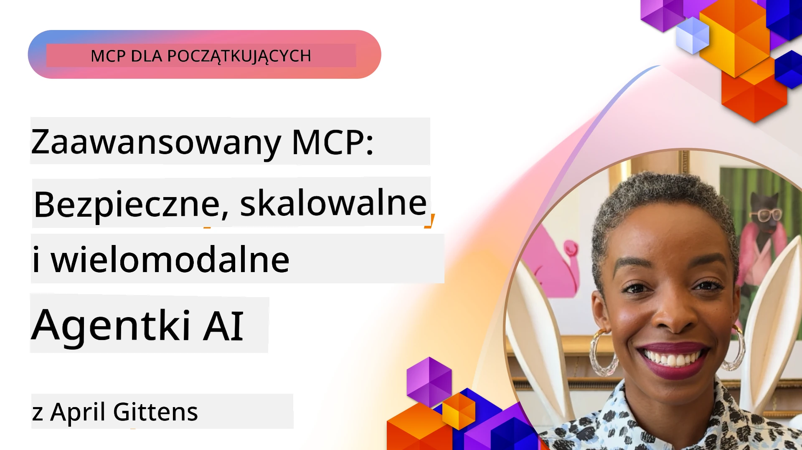

# Zaawansowane tematy w MCP

_(Kliknij obraz powyżej, aby obejrzeć wideo z tej lekcji)_

Ten rozdział obejmuje serię zaawansowanych tematów dotyczących implementacji Model Context Protocol (MCP), w tym integrację multimodalną, skalowalność, najlepsze praktyki bezpieczeństwa oraz integrację korporacyjną. Tematy te są kluczowe dla budowania solidnych i gotowych do produkcji aplikacji MCP, które mogą sprostać wymaganiom nowoczesnych systemów AI.

## Przegląd

Ta lekcja bada zaawansowane koncepcje implementacji Model Context Protocol, koncentrując się na integracji multimodalnej, skalowalności, najlepszych praktykach bezpieczeństwa oraz integracji korporacyjnej. Tematy te są niezbędne do budowania aplikacji MCP na poziomie produkcyjnym, które mogą obsługiwać złożone wymagania w środowiskach korporacyjnych.

## Cele nauki

Pod koniec tej lekcji będziesz potrafił:

- Zaimplementować możliwości multimodalne w ramach MCP
- Projektować skalowalne architektury MCP dla scenariuszy o dużym zapotrzebowaniu
- Stosować najlepsze praktyki bezpieczeństwa zgodne z zasadami MCP
- Integrować MCP z systemami AI i frameworkami korporacyjnymi
- Optymalizować wydajność i niezawodność w środowiskach produkcyjnych

## Lekcje i przykładowe projekty

| Link | Tytuł | Opis |
|------|-------|-------------|
| [5.1 Integracja z Azure](./mcp-integration/README.md) | Integracja z Azure | Naucz się, jak integrować swój serwer MCP na platformie Azure |
| [5.2 Przykład multimodality](./mcp-multi-modality/README.md) | Przykłady MCP multimodalne | Przykłady dla audio, obrazów i odpowiedzi multimodalnych |
| [5.3 Przykład MCP OAuth2](../../../05-AdvancedTopics/mcp-oauth2-demo) | Demo MCP OAuth2 | Minimalna aplikacja Spring Boot pokazująca OAuth2 z MCP, zarówno jako serwer autoryzacji, jak i zasobów. Demonstruje bezpieczne wydawanie tokenów, chronione punktu końcowe, wdrożenie na Azure Container Apps oraz integrację z API Management. |
| [5.4 Konteksty główne](./mcp-root-contexts/README.md) | Konteksty główne | Dowiedz się więcej o kontekście głównym i jak go implementować |
| [5.5 Routing](./mcp-routing/README.md) | Routing | Poznaj różne typy routingu |
| [5.6 Próbkowanie](./mcp-sampling/README.md) | Próbkowanie | Naucz się pracy z próbkowaniem |
| [5.7 Skalowanie](./mcp-scaling/README.md) | Skalowanie | Poznaj zagadnienia skalowania |
| [5.8 Bezpieczeństwo](./mcp-security/README.md) | Bezpieczeństwo | Zabezpiecz swój serwer MCP |
| [5.9 Przykład wyszukiwania w sieci MCP](./web-search-mcp/README.md) | Wyszukiwanie w sieci MCP | Pythonowy serwer i klient MCP integrujący się z SerpAPI do wyszukiwania w czasie rzeczywistym w sieci, wiadomościach, produktach oraz Q&A. Demonstruje orkiestrację wielonarzędziową, integrację zewnętrznych API oraz solidne obsługiwanie błędów. |
| [5.10 Streaming w czasie rzeczywistym](./mcp-realtimestreaming/README.md) | Streaming | Streaming danych w czasie rzeczywistym stał się niezbędny w dzisiejszym świecie napędzanym danymi, gdzie firmy i aplikacje wymagają natychmiastowego dostępu do informacji, aby podejmować pilne decyzje.|
| [5.11 Wyszukiwanie w sieci w czasie rzeczywistym](./mcp-realtimesearch/README.md) | Wyszukiwanie w sieci | Wyszukiwanie w sieci w czasie rzeczywistym i jak MCP przekształca je, zapewniając ustandaryzowane podejście do zarządzania kontekstem między modelami AI, silnikami wyszukiwania i aplikacjami.| 
| [5.12 Uwierzytelnianie Entra ID dla serwerów Model Context Protocol](./mcp-security-entra/README.md) | Uwierzytelnianie Entra ID | Microsoft Entra ID zapewnia solidne rozwiązanie chmurowe do zarządzania tożsamością i dostępem, pomagając zapewnić, że tylko autoryzowani użytkownicy i aplikacje mogą współdziałać z twoim serwerem MCP.|
| [5.13 Integracja agenta Azure AI Foundry](./mcp-foundry-agent-integration/README.md) | Integracja Azure AI Foundry | Dowiedz się, jak integrować serwery Model Context Protocol z agentami Azure AI Foundry, umożliwiając potężną orkiestrację narzędzi i możliwości AI przedsiębiorstwa z ustandaryzowanymi połączeniami z zewnętrznymi źródłami danych.|
| [5.14 Inżynieria kontekstu](./mcp-contextengineering/README.md) | Inżynieria kontekstu | Przyszłe możliwości technik inżynierii kontekstu dla serwerów MCP, w tym optymalizacja kontekstu, dynamiczne zarządzanie kontekstem oraz strategie skutecznego prompt engineering w ramach MCP.|
| [5.15 Niestandardowy transport MCP](./mcp-transport/README.md) | Niestandardowy transport | Naucz się implementować niestandardowe mechanizmy transportowe do wyspecjalizowanych scenariuszy komunikacji MCP.|
| [5.16 Głębokie zanurzenie w funkcje protokołu](./mcp-protocol-features/README.md) | Funkcje protokołu | Opanuj zaawansowane funkcje protokołu, w tym powiadomienia o postępie, anulowanie żądań, szablony zasobów i wzorce obsługi błędów.|

> **Nowość w specyfikacji MCP 2025-11-25**: Specyfikacja zawiera teraz eksperymentalne wsparcie dla **zadań** (długotrwałych operacji z monitorowaniem postępu), **adnotacji narzędzi** (metadanych o zachowaniu narzędzi dla bezpieczeństwa), **trybu URL** (żądania określonej zawartości URL od klientów) oraz rozszerzone **korzenie** (do zarządzania kontekstem przestrzeni roboczej). Zobacz [lista zmian specyfikacji MCP](https://spec.modelcontextprotocol.io/) po szczegóły.

## Dodatkowe źródła

Dla najbardziej aktualnych informacji na temat zaawansowanych tematów MCP, sprawdź:
- [Dokumentacja MCP](https://modelcontextprotocol.io/)
- [Specyfikacja MCP (2025-11-25)](https://spec.modelcontextprotocol.io/specification/2025-11-25/)
- [Repozytorium GitHub](https://github.com/modelcontextprotocol)
- [OWASP MCP Top 10](https://microsoft.github.io/mcp-azure-security-guide/mcp/) - Ryzyka i środki bezpieczeństwa
- [Warsztat MCP Security Summit (Sherpa)](https://azure-samples.github.io/sherpa/) - Praktyczne szkolenie z bezpieczeństwa

## Kluczowe wnioski

- Implementacje MCP multimodalne rozszerzają możliwości AI poza przetwarzanie tekstu
- Skalowalność jest niezbędna dla wdrożeń korporacyjnych i można ją osiągnąć przez skalowanie horyzontalne i wertykalne
- Kompleksowe środki bezpieczeństwa chronią dane i zapewniają prawidłową kontrolę dostępu
- Integracja korporacyjna z platformami takimi jak Azure OpenAI i Microsoft AI Foundry zwiększa możliwości MCP
- Zaawansowane implementacje MCP korzystają z zoptymalizowanych architektur i starannego zarządzania zasobami

## Ćwiczenie

Zaprojektuj wdrożenie MCP na poziomie korporacyjnym dla konkretnego przypadku użycia:

1. Zidentyfikuj wymagania multimodalne dla swojego przypadku użycia
2. Nakreśl środki bezpieczeństwa niezbędne do ochrony danych wrażliwych
3. Zaprojektuj skalowalną architekturę zdolną obsłużyć zmienną obciążalność
4. Zaplanuj punkty integracyjne z systemami AI przedsiębiorstwa
5. Udokumentuj potencjalne wąskie gardła wydajności oraz strategie ich łagodzenia

## Dodatkowe zasoby

- [Dokumentacja Azure OpenAI](https://learn.microsoft.com/en-us/azure/ai-services/openai/)
- [Dokumentacja Microsoft AI Foundry](https://learn.microsoft.com/en-us/ai-services/)

---

## Co dalej

Przeglądaj lekcje w tym module, zaczynając od: [5.1 Integracja MCP](./mcp-integration/README.md)

Po ukończeniu tego modułu kontynuuj: [Moduł 6: Wkład społeczności](../06-CommunityContributions/README.md)

---

<!-- CO-OP TRANSLATOR DISCLAIMER START -->
**Zastrzeżenie**:  
Dokument ten został przetłumaczony przy użyciu usługi tłumaczeniowej AI [Co-op Translator](https://github.com/Azure/co-op-translator). Chociaż dążymy do dokładności, prosimy mieć na uwadze, że automatyczne tłumaczenia mogą zawierać błędy lub nieścisłości. Oryginalny dokument w języku źródłowym powinien być uważany za źródło wiarygodne. W przypadku informacji krytycznych zaleca się skorzystanie z profesjonalnego tłumaczenia przez człowieka. Nie ponosimy odpowiedzialności za jakiekolwiek nieporozumienia lub błędne interpretacje wynikające z korzystania z tego tłumaczenia.
<!-- CO-OP TRANSLATOR DISCLAIMER END -->