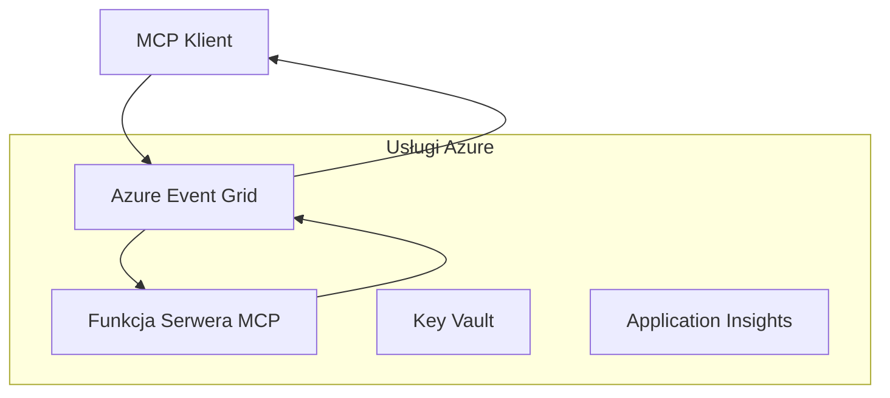
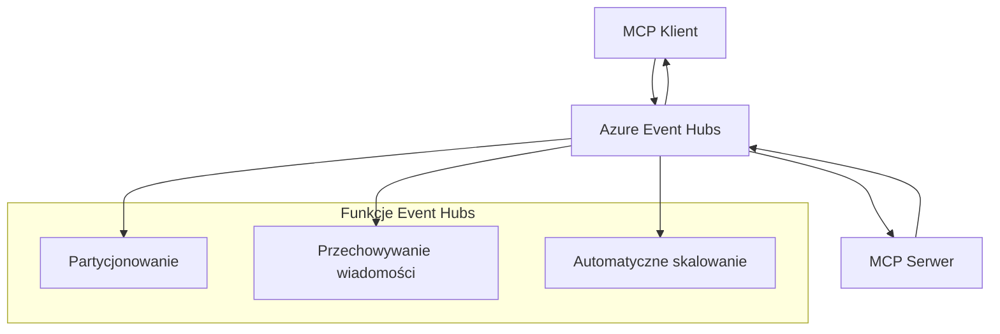

# MCP Custom Transports - Zaawansowany przewodnik po implementacji

Model Context Protocol (MCP) zapewnia elastyczność w mechanizmach transportu, umożliwiając niestandardowe implementacje dla wyspecjalizowanych środowisk korporacyjnych. Ten zaawansowany przewodnik bada niestandardowe implementacje transportu, wykorzystując Azure Event Grid i Azure Event Hubs jako praktyczne przykłady budowania skalowalnych, natywnych dla chmury rozwiązań MCP.

## Wprowadzenie

Chociaż standardowe transporty MCP (stdio i strumieniowanie HTTP) obsługują większość przypadków użycia, środowiska korporacyjne często wymagają wyspecjalizowanych mechanizmów transportu dla lepszej skalowalności, niezawodności i integracji z istniejącą infrastrukturą chmurową. Niestandardowe transporty umożliwiają MCP wykorzystanie natywnych dla chmury usług komunikatów do asynchronicznej komunikacji, architektur zdarzeniowych i przetwarzania rozproszonego.

Ta lekcja bada zaawansowane implementacje transportu oparte na najnowszej specyfikacji MCP (2025-11-25), usługach komunikatów Azure oraz ustalonych wzorcach integracji korporacyjnej.

### **Architektura transportu MCP**

**Z specyfikacji MCP (2025-11-25):**

- **Standardowe transporty**: stdio (zalecane), strumieniowanie HTTP (dla scenariuszy zdalnych)
- **Niestandardowe transporty**: dowolny transport implementujący protokół wymiany wiadomości MCP
- **Format wiadomości**: JSON-RPC 2.0 z rozszerzeniami specyficznymi dla MCP
- **Komunikacja dwukierunkowa**: wymagana pełna komunikacja duplex dla powiadomień i odpowiedzi

## Cele nauki

Po zakończeniu tej zaawansowanej lekcji będziesz potrafił:

- **Zrozumieć wymagania niestandardowego transportu**: implementować protokół MCP na dowolnej warstwie transportowej, zachowując zgodność
- **Zbudować transport Azure Event Grid**: tworzyć serwery MCP oparte na zdarzeniach z użyciem Azure Event Grid dla skalowalności bezserwerowej
- **Implementować transport Azure Event Hubs**: projektować rozwiązania MCP o wysokiej przepustowości z użyciem Azure Event Hubs dla strumieniowania w czasie rzeczywistym
- **Stosować wzorce korporacyjne**: integrować niestandardowe transporty z istniejącą infrastrukturą i modelami bezpieczeństwa Azure
- **Obsługiwać niezawodność transportu**: implementować trwałość wiadomości, kolejność i obsługę błędów dla scenariuszy korporacyjnych
- **Optymalizować wydajność**: projektować rozwiązania transportowe pod kątem wymagań skalowalności, opóźnień i przepustowości

## **Wymagania transportu**

### **Podstawowe wymagania ze specyfikacji MCP (2025-11-25):**

```yaml
Message Protocol:
  format: "JSON-RPC 2.0 with MCP extensions"
  bidirectional: "Full duplex communication required"
  ordering: "Message ordering must be preserved per session"
  
Transport Layer:
  reliability: "Transport MUST handle connection failures gracefully"
  security: "Transport MUST support secure communication"
  identification: "Each session MUST have unique identifier"
  
Custom Transport:
  compliance: "MUST implement complete MCP message exchange"
  extensibility: "MAY add transport-specific features"
  interoperability: "MUST maintain protocol compatibility"
```

## **Implementacja transportu Azure Event Grid**

Azure Event Grid zapewnia bezserwerową usługę routingu zdarzeń idealną dla architektur MCP opartych na zdarzeniach. Ta implementacja demonstruje, jak budować skalowalne, luźno powiązane systemy MCP.

### **Przegląd architektury**


### **Implementacja w C# - transport Event Grid**

```csharp
using Azure.Messaging.EventGrid;
using Microsoft.Extensions.Azure;
using System.Text.Json;

public class EventGridMcpTransport : IMcpTransport
{
    private readonly EventGridPublisherClient _publisher;
    private readonly string _topicEndpoint;
    private readonly string _clientId;
    
    public EventGridMcpTransport(string topicEndpoint, string accessKey, string clientId)
    {
        _publisher = new EventGridPublisherClient(
            new Uri(topicEndpoint), 
            new AzureKeyCredential(accessKey));
        _topicEndpoint = topicEndpoint;
        _clientId = clientId;
    }
    
    public async Task SendMessageAsync(McpMessage message)
    {
        var eventGridEvent = new EventGridEvent(
            subject: $"mcp/{_clientId}",
            eventType: "MCP.MessageReceived",
            dataVersion: "1.0",
            data: JsonSerializer.Serialize(message))
        {
            Id = Guid.NewGuid().ToString(),
            EventTime = DateTimeOffset.UtcNow
        };
        
        await _publisher.SendEventAsync(eventGridEvent);
    }
    
    public async Task<McpMessage> ReceiveMessageAsync(CancellationToken cancellationToken)
    {
        // Event Grid is push-based, so implement webhook receiver
        // This would typically be handled by Azure Functions trigger
        throw new NotImplementedException("Use EventGridTrigger in Azure Functions");
    }
}

// Azure Function for receiving Event Grid events
[FunctionName("McpEventGridReceiver")]
public async Task<IActionResult> HandleEventGridMessage(
    [EventGridTrigger] EventGridEvent eventGridEvent,
    ILogger log)
{
    try
    {
        var mcpMessage = JsonSerializer.Deserialize<McpMessage>(
            eventGridEvent.Data.ToString());
        
        // Process MCP message
        var response = await _mcpServer.ProcessMessageAsync(mcpMessage);
        
        // Send response back via Event Grid
        await _transport.SendMessageAsync(response);
        
        return new OkResult();
    }
    catch (Exception ex)
    {
        log.LogError(ex, "Error processing Event Grid MCP message");
        return new BadRequestResult();
    }
}
```

### **Implementacja w TypeScript - transport Event Grid**

```typescript
import { EventGridPublisherClient, AzureKeyCredential } from "@azure/eventgrid";
import { McpTransport, McpMessage } from "./mcp-types";

export class EventGridMcpTransport implements McpTransport {
    private publisher: EventGridPublisherClient;
    private clientId: string;
    
    constructor(
        private topicEndpoint: string,
        private accessKey: string,
        clientId: string
    ) {
        this.publisher = new EventGridPublisherClient(
            topicEndpoint,
            new AzureKeyCredential(accessKey)
        );
        this.clientId = clientId;
    }
    
    async sendMessage(message: McpMessage): Promise<void> {
        const event = {
            id: crypto.randomUUID(),
            source: `mcp-client-${this.clientId}`,
            type: "MCP.MessageReceived",
            time: new Date(),
            data: message
        };
        
        await this.publisher.sendEvents([event]);
    }
    
    // Odbiór zdarzeń oparty na zdarzeniach za pomocą Azure Functions
    onMessage(handler: (message: McpMessage) => Promise<void>): void {
        // Implementacja będzie używać wyzwalacza Event Grid w Azure Functions
        // To jest koncepcyjny interfejs odbiornika webhooka
    }
}

// Implementacja Azure Functions
import { app, InvocationContext, EventGridEvent } from "@azure/functions";

app.eventGrid("mcpEventGridHandler", {
    handler: async (event: EventGridEvent, context: InvocationContext) => {
        try {
            const mcpMessage = event.data as McpMessage;
            
            // Przetwórz wiadomość MCP
            const response = await mcpServer.processMessage(mcpMessage);
            
            // Wyślij odpowiedź za pomocą Event Grid
            await transport.sendMessage(response);
            
        } catch (error) {
            context.error("Error processing MCP message:", error);
            throw error;
        }
    }
});
```

### **Implementacja w Python - transport Event Grid**

```python
from azure.eventgrid import EventGridPublisherClient, EventGridEvent
from azure.core.credentials import AzureKeyCredential
import asyncio
import json
from typing import Callable, Optional
import uuid
from datetime import datetime

class EventGridMcpTransport:
    def __init__(self, topic_endpoint: str, access_key: str, client_id: str):
        self.client = EventGridPublisherClient(
            topic_endpoint, 
            AzureKeyCredential(access_key)
        )
        self.client_id = client_id
        self.message_handler: Optional[Callable] = None
    
    async def send_message(self, message: dict) -> None:
        """Send MCP message via Event Grid"""
        event = EventGridEvent(
            data=message,
            subject=f"mcp/{self.client_id}",
            event_type="MCP.MessageReceived",
            data_version="1.0"
        )
        
        await self.client.send(event)
    
    def on_message(self, handler: Callable[[dict], None]) -> None:
        """Register message handler for incoming events"""
        self.message_handler = handler

# Implementacja Azure Functions
import azure.functions as func
import logging

def main(event: func.EventGridEvent) -> None:
    """Azure Functions Event Grid trigger for MCP messages"""
    try:
        # Parsuj wiadomość MCP z zdarzenia Event Grid
        mcp_message = json.loads(event.get_body().decode('utf-8'))
        
        # Przetwórz wiadomość MCP
        response = process_mcp_message(mcp_message)
        
        # Wyślij odpowiedź z powrotem przez Event Grid
        # (Implementacja utworzy nowego klienta Event Grid)
        
    except Exception as e:
        logging.error(f"Error processing MCP Event Grid message: {e}")
        raise
```

## **Implementacja transportu Azure Event Hubs**

Azure Event Hubs zapewnia możliwości strumieniowania w czasie rzeczywistym o wysokiej przepustowości dla scenariuszy MCP wymagających niskich opóźnień i dużej liczby wiadomości.

### **Przegląd architektury**


### **Implementacja w C# - transport Event Hubs**

```csharp
using Azure.Messaging.EventHubs;
using Azure.Messaging.EventHubs.Producer;
using Azure.Messaging.EventHubs.Consumer;
using System.Text;

public class EventHubsMcpTransport : IMcpTransport, IDisposable
{
    private readonly EventHubProducerClient _producer;
    private readonly EventHubConsumerClient _consumer;
    private readonly string _consumerGroup;
    private readonly CancellationTokenSource _cancellationTokenSource;
    
    public EventHubsMcpTransport(
        string connectionString, 
        string eventHubName,
        string consumerGroup = "$Default")
    {
        _producer = new EventHubProducerClient(connectionString, eventHubName);
        _consumer = new EventHubConsumerClient(
            consumerGroup, 
            connectionString, 
            eventHubName);
        _consumerGroup = consumerGroup;
        _cancellationTokenSource = new CancellationTokenSource();
    }
    
    public async Task SendMessageAsync(McpMessage message)
    {
        var messageBody = JsonSerializer.Serialize(message);
        var eventData = new EventData(Encoding.UTF8.GetBytes(messageBody));
        
        // Add MCP-specific properties
        eventData.Properties.Add("MessageType", message.Method ?? "response");
        eventData.Properties.Add("MessageId", message.Id);
        eventData.Properties.Add("Timestamp", DateTimeOffset.UtcNow);
        
        await _producer.SendAsync(new[] { eventData });
    }
    
    public async Task StartReceivingAsync(
        Func<McpMessage, Task> messageHandler)
    {
        await foreach (PartitionEvent partitionEvent in _consumer.ReadEventsAsync(
            _cancellationTokenSource.Token))
        {
            try
            {
                var messageBody = Encoding.UTF8.GetString(
                    partitionEvent.Data.EventBody.ToArray());
                var mcpMessage = JsonSerializer.Deserialize<McpMessage>(messageBody);
                
                await messageHandler(mcpMessage);
            }
            catch (Exception ex)
            {
                // Handle deserialization or processing errors
                Console.WriteLine($"Error processing message: {ex.Message}");
            }
        }
    }
    
    public void Dispose()
    {
        _cancellationTokenSource?.Cancel();
        _producer?.DisposeAsync().AsTask().Wait();
        _consumer?.DisposeAsync().AsTask().Wait();
        _cancellationTokenSource?.Dispose();
    }
}
```

### **Implementacja w TypeScript - transport Event Hubs**

```typescript
import { 
    EventHubProducerClient, 
    EventHubConsumerClient, 
    EventData 
} from "@azure/event-hubs";

export class EventHubsMcpTransport implements McpTransport {
    private producer: EventHubProducerClient;
    private consumer: EventHubConsumerClient;
    private isReceiving = false;
    
    constructor(
        private connectionString: string,
        private eventHubName: string,
        private consumerGroup: string = "$Default"
    ) {
        this.producer = new EventHubProducerClient(
            connectionString, 
            eventHubName
        );
        this.consumer = new EventHubConsumerClient(
            consumerGroup,
            connectionString,
            eventHubName
        );
    }
    
    async sendMessage(message: McpMessage): Promise<void> {
        const eventData: EventData = {
            body: JSON.stringify(message),
            properties: {
                messageType: message.method || "response",
                messageId: message.id,
                timestamp: new Date().toISOString()
            }
        };
        
        await this.producer.sendBatch([eventData]);
    }
    
    async startReceiving(
        messageHandler: (message: McpMessage) => Promise<void>
    ): Promise<void> {
        if (this.isReceiving) return;
        
        this.isReceiving = true;
        
        const subscription = this.consumer.subscribe({
            processEvents: async (events, context) => {
                for (const event of events) {
                    try {
                        const messageBody = event.body as string;
                        const mcpMessage: McpMessage = JSON.parse(messageBody);
                        
                        await messageHandler(mcpMessage);
                        
                        // Zaktualizuj punkt kontrolny dla dostarczania co najmniej raz
                        await context.updateCheckpoint(event);
                    } catch (error) {
                        console.error("Error processing Event Hubs message:", error);
                    }
                }
            },
            processError: async (err, context) => {
                console.error("Event Hubs error:", err);
            }
        });
    }
    
    async close(): Promise<void> {
        this.isReceiving = false;
        await this.producer.close();
        await this.consumer.close();
    }
}
```

### **Implementacja w Python - transport Event Hubs**

```python
from azure.eventhub import EventHubProducerClient, EventHubConsumerClient
from azure.eventhub import EventData
import json
import asyncio
from typing import Callable, Dict, Any
import logging

class EventHubsMcpTransport:
    def __init__(
        self, 
        connection_string: str, 
        eventhub_name: str,
        consumer_group: str = "$Default"
    ):
        self.producer = EventHubProducerClient.from_connection_string(
            connection_string, 
            eventhub_name=eventhub_name
        )
        self.consumer = EventHubConsumerClient.from_connection_string(
            connection_string,
            consumer_group=consumer_group,
            eventhub_name=eventhub_name
        )
        self.is_receiving = False
    
    async def send_message(self, message: Dict[str, Any]) -> None:
        """Send MCP message via Event Hubs"""
        event_data = EventData(json.dumps(message))
        
        # Dodaj właściwości specyficzne dla MCP
        event_data.properties = {
            "messageType": message.get("method", "response"),
            "messageId": message.get("id"),
            "timestamp": "2025-01-14T10:30:00Z"  # Użyj rzeczywistego znacznika czasu
        }
        
        async with self.producer:
            event_data_batch = await self.producer.create_batch()
            event_data_batch.add(event_data)
            await self.producer.send_batch(event_data_batch)
    
    async def start_receiving(
        self, 
        message_handler: Callable[[Dict[str, Any]], None]
    ) -> None:
        """Start receiving MCP messages from Event Hubs"""
        if self.is_receiving:
            return
        
        self.is_receiving = True
        
        async with self.consumer:
            await self.consumer.receive(
                on_event=self._on_event_received(message_handler),
                starting_position="-1"  # Zacznij od początku
            )
    
    def _on_event_received(self, handler: Callable):
        """Internal event handler wrapper"""
        async def handle_event(partition_context, event):
            try:
                # Parsuj wiadomość MCP z zdarzenia Event Hubs
                message_body = event.body_as_str(encoding='UTF-8')
                mcp_message = json.loads(message_body)
                
                # Przetwórz wiadomość MCP
                await handler(mcp_message)
                
                # Zaktualizuj punkt kontrolny dla dostarczenia co najmniej raz
                await partition_context.update_checkpoint(event)
                
            except Exception as e:
                logging.error(f"Error processing Event Hubs message: {e}")
        
        return handle_event
    
    async def close(self) -> None:
        """Clean up transport resources"""
        self.is_receiving = False
        await self.producer.close()
        await self.consumer.close()
```

## **Zaawansowane wzorce transportu**

### **Trwałość i niezawodność wiadomości**

```csharp
// Implementing message durability with retry logic
public class ReliableTransportWrapper : IMcpTransport
{
    private readonly IMcpTransport _innerTransport;
    private readonly RetryPolicy _retryPolicy;
    
    public async Task SendMessageAsync(McpMessage message)
    {
        await _retryPolicy.ExecuteAsync(async () =>
        {
            try
            {
                await _innerTransport.SendMessageAsync(message);
            }
            catch (TransportException ex) when (ex.IsRetryable)
            {
                // Log and retry
                throw;
            }
        });
    }
}
```

### **Integracja bezpieczeństwa transportu**

```csharp
// Integrating Azure Key Vault for transport security
public class SecureTransportFactory
{
    private readonly SecretClient _keyVaultClient;
    
    public async Task<IMcpTransport> CreateEventGridTransportAsync()
    {
        var accessKey = await _keyVaultClient.GetSecretAsync("EventGridAccessKey");
        var topicEndpoint = await _keyVaultClient.GetSecretAsync("EventGridTopic");
        
        return new EventGridMcpTransport(
            topicEndpoint.Value.Value,
            accessKey.Value.Value,
            Environment.MachineName
        );
    }
}
```

### **Monitorowanie i obserwowalność transportu**

```csharp
// Adding telemetry to custom transports
public class ObservableTransport : IMcpTransport
{
    private readonly IMcpTransport _transport;
    private readonly ILogger _logger;
    private readonly TelemetryClient _telemetryClient;
    
    public async Task SendMessageAsync(McpMessage message)
    {
        using var activity = Activity.StartActivity("MCP.Transport.Send");
        activity?.SetTag("transport.type", "EventGrid");
        activity?.SetTag("message.method", message.Method);
        
        var stopwatch = Stopwatch.StartNew();
        
        try
        {
            await _transport.SendMessageAsync(message);
            
            _telemetryClient.TrackDependency(
                "EventGrid",
                "SendMessage",
                DateTime.UtcNow.Subtract(stopwatch.Elapsed),
                stopwatch.Elapsed,
                true
            );
        }
        catch (Exception ex)
        {
            _telemetryClient.TrackException(ex);
            throw;
        }
    }
}
```

## **Scenariusze integracji korporacyjnej**

### **Scenariusz 1: Rozproszone przetwarzanie MCP**

Wykorzystanie Azure Event Grid do dystrybucji żądań MCP pomiędzy wieloma węzłami przetwarzającymi:

```yaml
Architecture:
  - MCP Client sends requests to Event Grid topic
  - Multiple Azure Functions subscribe to process different tool types
  - Results aggregated and returned via separate response topic
  
Benefits:
  - Horizontal scaling based on message volume
  - Fault tolerance through redundant processors
  - Cost optimization with serverless compute
```

### **Scenariusz 2: Strumieniowanie MCP w czasie rzeczywistym**

Wykorzystanie Azure Event Hubs do interakcji MCP o wysokiej częstotliwości:

```yaml
Architecture:
  - MCP Client streams continuous requests via Event Hubs
  - Stream Analytics processes and routes messages
  - Multiple consumers handle different aspect of processing
  
Benefits:
  - Low latency for real-time scenarios
  - High throughput for batch processing
  - Built-in partitioning for parallel processing
```

### **Scenariusz 3: Hybrydowa architektura transportu**

Łączenie wielu transportów dla różnych przypadków użycia:

```csharp
public class HybridMcpTransport : IMcpTransport
{
    private readonly IMcpTransport _realtimeTransport; // Event Hubs
    private readonly IMcpTransport _batchTransport;    // Event Grid
    private readonly IMcpTransport _fallbackTransport; // HTTP Streaming
    
    public async Task SendMessageAsync(McpMessage message)
    {
        // Route based on message characteristics
        var transport = message.Method switch
        {
            "tools/call" when IsRealtime(message) => _realtimeTransport,
            "resources/read" when IsBatch(message) => _batchTransport,
            _ => _fallbackTransport
        };
        
        await transport.SendMessageAsync(message);
    }
}
```

## **Optymalizacja wydajności**

### **Grupowanie wiadomości dla Event Grid**

```csharp
public class BatchingEventGridTransport : IMcpTransport
{
    private readonly List<McpMessage> _messageBuffer = new();
    private readonly Timer _flushTimer;
    private const int MaxBatchSize = 100;
    
    public async Task SendMessageAsync(McpMessage message)
    {
        lock (_messageBuffer)
        {
            _messageBuffer.Add(message);
            
            if (_messageBuffer.Count >= MaxBatchSize)
            {
                _ = Task.Run(FlushMessages);
            }
        }
    }
    
    private async Task FlushMessages()
    {
        List<McpMessage> toSend;
        lock (_messageBuffer)
        {
            toSend = new List<McpMessage>(_messageBuffer);
            _messageBuffer.Clear();
        }
        
        if (toSend.Any())
        {
            var events = toSend.Select(CreateEventGridEvent);
            await _publisher.SendEventsAsync(events);
        }
    }
}
```

### **Strategia partycjonowania dla Event Hubs**

```csharp
public class PartitionedEventHubsTransport : IMcpTransport
{
    public async Task SendMessageAsync(McpMessage message)
    {
        // Partition by client ID for session affinity
        var partitionKey = ExtractClientId(message);
        
        var eventData = new EventData(JsonSerializer.SerializeToUtf8Bytes(message))
        {
            PartitionKey = partitionKey
        };
        
        await _producer.SendAsync(new[] { eventData });
    }
}
```

## **Testowanie niestandardowych transportów**

### **Testy jednostkowe z użyciem dublerów**

```csharp
[Test]
public async Task EventGridTransport_SendMessage_PublishesCorrectEvent()
{
    // Arrange
    var mockPublisher = new Mock<EventGridPublisherClient>();
    var transport = new EventGridMcpTransport(mockPublisher.Object);
    var message = new McpMessage { Method = "tools/list", Id = "test-123" };
    
    // Act
    await transport.SendMessageAsync(message);
    
    // Assert
    mockPublisher.Verify(
        x => x.SendEventAsync(
            It.Is<EventGridEvent>(e => 
                e.EventType == "MCP.MessageReceived" &&
                e.Subject == "mcp/test-client"
            )
        ),
        Times.Once
    );
}
```

### **Testy integracyjne z Azure Test Containers**

```csharp
[Test]
public async Task EventHubsTransport_IntegrationTest()
{
    // Using Testcontainers for integration testing
    var eventHubsContainer = new EventHubsContainer()
        .WithEventHub("test-hub");
    
    await eventHubsContainer.StartAsync();
    
    var transport = new EventHubsMcpTransport(
        eventHubsContainer.GetConnectionString(),
        "test-hub"
    );
    
    // Test message round-trip
    var sentMessage = new McpMessage { Method = "test", Id = "123" };
    McpMessage receivedMessage = null;
    
    await transport.StartReceivingAsync(msg => {
        receivedMessage = msg;
        return Task.CompletedTask;
    });
    
    await transport.SendMessageAsync(sentMessage);
    await Task.Delay(1000); // Allow for message processing
    
    Assert.That(receivedMessage?.Id, Is.EqualTo("123"));
}
```

## **Najlepsze praktyki i wytyczne**

### **Zasady projektowania transportu**

1. **Idempotentność**: zapewnij idempotentne przetwarzanie wiadomości, aby obsłużyć duplikaty
2. **Obsługa błędów**: implementuj kompleksową obsługę błędów i kolejki martwych listów
3. **Monitorowanie**: dodaj szczegółową telemetrię i kontrole stanu
4. **Bezpieczeństwo**: używaj zarządzanych tożsamości i dostępu o minimalnych uprawnieniach
5. **Wydajność**: projektuj pod kątem specyficznych wymagań dotyczących opóźnień i przepustowości

### **Zalecenia specyficzne dla Azure**

1. **Używaj zarządzanej tożsamości**: unikaj łańcuchów połączeń w środowisku produkcyjnym
2. **Implementuj wyłączniki obwodu**: chroń przed awariami usług Azure
3. **Monitoruj koszty**: śledź wolumen wiadomości i koszty przetwarzania
4. **Planuj skalowanie**: projektuj strategie partycjonowania i skalowania wcześnie
5. **Testuj dokładnie**: korzystaj z Azure DevTest Labs do kompleksowego testowania

## **Podsumowanie**

Niestandardowe transporty MCP umożliwiają potężne scenariusze korporacyjne z wykorzystaniem usług komunikatów Azure. Implementując transporty Event Grid lub Event Hubs, możesz budować skalowalne, niezawodne rozwiązania MCP, które integrują się bezproblemowo z istniejącą infrastrukturą Azure.

Dostarczone przykłady demonstrują wzorce gotowe do produkcji dla implementacji niestandardowych transportów, zachowując zgodność z protokołem MCP i najlepszymi praktykami Azure.

## **Dodatkowe zasoby**

- [Specyfikacja MCP 2025-06-18](https://spec.modelcontextprotocol.io/specification/2025-06-18/)
- [Dokumentacja Azure Event Grid](https://docs.microsoft.com/azure/event-grid/)
- [Dokumentacja Azure Event Hubs](https://docs.microsoft.com/azure/event-hubs/)
- [Azure Functions Event Grid Trigger](https://docs.microsoft.com/azure/azure-functions/functions-bindings-event-grid)
- [Azure SDK dla .NET](https://github.com/Azure/azure-sdk-for-net)
- [Azure SDK dla TypeScript](https://github.com/Azure/azure-sdk-for-js)
- [Azure SDK dla Python](https://github.com/Azure/azure-sdk-for-python)

---

> *Ten przewodnik koncentruje się na praktycznych wzorcach implementacji dla produkcyjnych systemów MCP. Zawsze weryfikuj implementacje transportu względem swoich specyficznych wymagań i limitów usług Azure.*
> **Aktualny standard**: Ten przewodnik odzwierciedla [specyfikację MCP 2025-06-18](https://spec.modelcontextprotocol.io/specification/2025-06-18/) wymagania transportowe oraz zaawansowane wzorce transportu dla środowisk korporacyjnych.


## Co dalej
- [6. Wkład społeczności](../../06-CommunityContributions/README.md)

---

<!-- CO-OP TRANSLATOR DISCLAIMER START -->
**Zastrzeżenie**:  
Niniejszy dokument został przetłumaczony za pomocą usługi tłumaczenia AI [Co-op Translator](https://github.com/Azure/co-op-translator). Mimo że dokładamy starań, aby tłumaczenie było jak najbardziej precyzyjne, prosimy mieć na uwadze, że automatyczne tłumaczenia mogą zawierać błędy lub nieścisłości. Oryginalny dokument w języku źródłowym należy traktować jako źródło wiarygodne i autorytatywne. W przypadku informacji o kluczowym znaczeniu zalecane jest skorzystanie z profesjonalnego tłumaczenia wykonanego przez człowieka. Nie ponosimy odpowiedzialności za jakiekolwiek nieporozumienia lub błędne interpretacje wynikające z korzystania z tego tłumaczenia.
<!-- CO-OP TRANSLATOR DISCLAIMER END -->