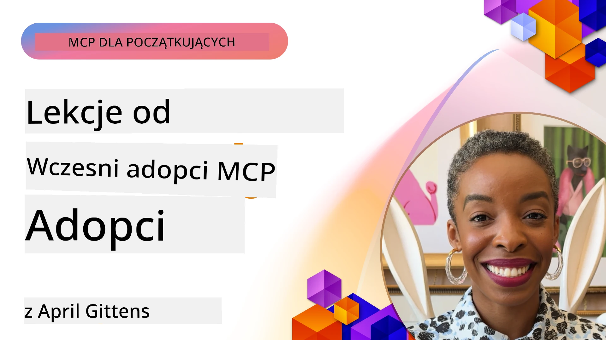

# 🌟 Lekcje od Wczesnych Użytkowników

[](https://youtu.be/jds7dSmNptE)

_(Kliknij powyższy obraz, aby obejrzeć wideo z tej lekcji)_

## 🎯 Co obejmuje ten moduł

Ten moduł bada, jak prawdziwe organizacje i deweloperzy wykorzystują Model Context Protocol (MCP), aby rozwiązywać rzeczywiste wyzwania i napędzać innowacje. Dzięki szczegółowym studiom przypadków, praktycznym projektom i konkretnym przykładom odkryjesz, jak MCP umożliwia bezpieczną, skalowalną integrację AI, która łączy modele językowe, narzędzia i dane przedsiębiorstwa.

### 📚 Zobacz MCP w akcji

Chcesz zobaczyć te zasady zastosowane w narzędziach gotowych do produkcji? Sprawdź nasz [**10 Microsoft MCP Servers That Are Transforming Developer Productivity**](microsoft-mcp-servers.md), który prezentuje prawdziwe serwery MCP Microsoft, których możesz używać już dziś.

## Przegląd

Ta lekcja bada, jak wczesni użytkownicy wykorzystali Model Context Protocol (MCP) do rozwiązywania rzeczywistych wyzwań i napędzania innowacji w różnych branżach. Poprzez szczegółowe studia przypadków i praktyczne projekty zobaczysz, jak MCP umożliwia standardyzowaną, bezpieczną i skalowalną integrację AI — łącząc duże modele językowe, narzędzia oraz dane przedsiębiorstwa w zintegrowanym systemie. Zdobyjesz praktyczne doświadczenie w projektowaniu i budowaniu rozwiązań opartych na MCP, poznasz sprawdzone wzorce implementacji oraz najlepsze praktyki wdrażania MCP w środowiskach produkcyjnych. Lekcja również podkreśla pojawiające się trendy, przyszłe kierunki rozwoju oraz zasoby open source, które pomogą Ci pozostać na czele technologii MCP i jej rozwijającego się ekosystemu.

## Cele nauki

- Analizować rzeczywiste implementacje MCP w różnych branżach
- Projektować i budować kompletne aplikacje oparte na MCP
- Poznawać pojawiające się trendy i przyszłe kierunki technologii MCP
- Stosować najlepsze praktyki w rzeczywistych scenariuszach rozwojowych

## Rzeczywiste implementacje MCP

### Studium przypadku 1: Automatyzacja wsparcia klienta w przedsiębiorstwie

Międzynarodowa korporacja wdrożyła rozwiązanie oparte na MCP, aby standaryzować interakcje AI w swoich systemach wsparcia klienta. Pozwoliło to na:

- Stworzenie zunifikowanego interfejsu dla wielu dostawców LLM
- Utrzymanie spójnego zarządzania promptami w działach
- Wdrożenie solidnych mechanizmów bezpieczeństwa i zgodności
- Łatwe przełączanie między różnymi modelami AI w zależności od potrzeb

**Techniczna implementacja:**

```python
# Implementacja serwera MCP w Pythonie dla obsługi klienta
import logging
import asyncio
from modelcontextprotocol import create_server, ServerConfig
from modelcontextprotocol.server import MCPServer
from modelcontextprotocol.transports import create_http_transport
from modelcontextprotocol.resources import ResourceDefinition
from modelcontextprotocol.prompts import PromptDefinition
from modelcontextprotocol.tool import ToolDefinition

# Konfiguracja logowania
logging.basicConfig(level=logging.INFO)

async def main():
    # Utwórz konfigurację serwera
    config = ServerConfig(
        name="Enterprise Customer Support Server",
        version="1.0.0",
        description="MCP server for handling customer support inquiries"
    )
    
    # Inicjalizuj serwer MCP
    server = create_server(config)
    
    # Zarejestruj zasoby bazy wiedzy
    server.resources.register(
        ResourceDefinition(
            name="customer_kb",
            description="Customer knowledge base documentation"
        ),
        lambda params: get_customer_documentation(params)
    )
    
    # Zarejestruj szablony promptów
    server.prompts.register(
        PromptDefinition(
            name="support_template",
            description="Templates for customer support responses"
        ),
        lambda params: get_support_templates(params)
    )
    
    # Zarejestruj narzędzia wsparcia
    server.tools.register(
        ToolDefinition(
            name="ticketing",
            description="Create and update support tickets"
        ),
        handle_ticketing_operations
    )
    
    # Uruchom serwer z transportem HTTP
    transport = create_http_transport(port=8080)
    await server.run(transport)

if __name__ == "__main__":
    asyncio.run(main())
```
  
**Wyniki:** 30% redukcja kosztów modeli, 45% poprawa spójności odpowiedzi oraz zwiększona zgodność w globalnych operacjach.

### Studium przypadku 2: Asystent diagnostyczny w opiece zdrowotnej

Dostawca usług zdrowotnych opracował infrastrukturę MCP do integracji wielu specjalistycznych medycznych modeli AI, jednocześnie zapewniając ochronę wrażliwych danych pacjentów:

- Płynne przełączanie między modelami ogólnymi a specjalistycznymi
- Ścisła kontrola prywatności i ślady audytu
- Integracja z istniejącymi systemami Elektronicznej Dokumentacji Medycznej (EHR)
- Spójne inżynieria promptów dla terminologii medycznej

**Techniczna implementacja:**

```csharp
// C# MCP host application implementation in healthcare application
using Microsoft.Extensions.DependencyInjection;
using ModelContextProtocol.SDK.Client;
using ModelContextProtocol.SDK.Security;
using ModelContextProtocol.SDK.Resources;

public class DiagnosticAssistant
{
    private readonly MCPHostClient _mcpClient;
    private readonly PatientContext _patientContext;
    
    public DiagnosticAssistant(PatientContext patientContext)
    {
        _patientContext = patientContext;
        
        // Configure MCP client with healthcare-specific settings
        var clientOptions = new ClientOptions
        {
            Name = "Healthcare Diagnostic Assistant",
            Version = "1.0.0",
            Security = new SecurityOptions
            {
                Encryption = EncryptionLevel.Medical,
                AuditEnabled = true
            }
        };
        
        _mcpClient = new MCPHostClientBuilder()
            .WithOptions(clientOptions)
            .WithTransport(new HttpTransport("https://healthcare-mcp.example.org"))
            .WithAuthentication(new HIPAACompliantAuthProvider())
            .Build();
    }
    
    public async Task<DiagnosticSuggestion> GetDiagnosticAssistance(
        string symptoms, string patientHistory)
    {
        // Create request with appropriate resources and tool access
        var resourceRequest = new ResourceRequest
        {
            Name = "patient_records",
            Parameters = new Dictionary<string, object>
            {
                ["patientId"] = _patientContext.PatientId,
                ["requestingProvider"] = _patientContext.ProviderId
            }
        };
        
        // Request diagnostic assistance using appropriate prompt
        var response = await _mcpClient.SendPromptRequestAsync(
            promptName: "diagnostic_assistance",
            parameters: new Dictionary<string, object>
            {
                ["symptoms"] = symptoms,
                patientHistory = patientHistory,
                relevantGuidelines = _patientContext.GetRelevantGuidelines()
            });
            
        return DiagnosticSuggestion.FromMCPResponse(response);
    }
}
```
  
**Wyniki:** Ulepszone sugestie diagnostyczne dla lekarzy przy pełnej zgodności z HIPAA oraz znacząca redukcja przełączania kontekstu między systemami.

### Studium przypadku 3: Analiza ryzyka w sektorze finansowym

Instytucja finansowa wdrożyła MCP w celu standaryzacji procesów analizy ryzyka w różnych działach:

- Stworzono zunifikowany interfejs dla modeli ryzyka kredytowego, wykrywania nadużyć i ryzyka inwestycyjnego
- Wdrożono ścisłe kontrole dostępu i wersjonowanie modeli
- Zapewniono audytowalność wszystkich rekomendacji AI
- Zachowano spójne formatowanie danych w zróżnicowanych systemach

**Techniczna implementacja:**

```java
// Serwer Java MCP do oceny ryzyka finansowego
import org.mcp.server.*;
import org.mcp.security.*;

public class FinancialRiskMCPServer {
    public static void main(String[] args) {
        // Utwórz serwer MCP z funkcjami zgodności finansowej
        MCPServer server = new MCPServerBuilder()
            .withModelProviders(
                new ModelProvider("risk-assessment-primary", new AzureOpenAIProvider()),
                new ModelProvider("risk-assessment-audit", new LocalLlamaProvider())
            )
            .withPromptTemplateDirectory("./compliance/templates")
            .withAccessControls(new SOCCompliantAccessControl())
            .withDataEncryption(EncryptionStandard.FINANCIAL_GRADE)
            .withVersionControl(true)
            .withAuditLogging(new DatabaseAuditLogger())
            .build();
            
        server.addRequestValidator(new FinancialDataValidator());
        server.addResponseFilter(new PII_RedactionFilter());
        
        server.start(9000);
        
        System.out.println("Financial Risk MCP Server running on port 9000");
    }
}
```
  
**Wyniki:** Zwiększona zgodność regulacyjna, 40% szybsze cykle wdrażania modeli oraz poprawiona spójność oceny ryzyka w działach.

### Studium przypadku 4: Microsoft Playwright MCP Server dla automatyzacji przeglądarki

Microsoft opracował [Playwright MCP server](https://github.com/microsoft/playwright-mcp), który umożliwia bezpieczną, standaryzowaną automatyzację przeglądarki przez Model Context Protocol. Ten gotowy do produkcji serwer pozwala agentom AI i LLM na interakcję z przeglądarkami internetowymi w kontrolowany, audytowalny i rozszerzalny sposób — umożliwiając przypadki użycia takie jak automatyczne testowanie stron, ekstrakcja danych i pełne przepływy pracy.

> **🎯 Narzędzie gotowe do produkcji**
> 
> To studium przypadku pokazuje prawdziwy serwer MCP, którego możesz używać już dziś! Dowiedz się więcej o Playwright MCP Server i 9 innych serwerach MCP Microsoft w naszym [**Microsoft MCP Servers Guide**](microsoft-mcp-servers.md#8--playwright-mcp-server).

**Kluczowe cechy:**  
- Udostępnia funkcje automatyzacji przeglądarki (nawigacja, wypełnianie formularzy, robienie zrzutów ekranu itd.) jako narzędzia MCP  
- Wdrożono ścisłe kontrole dostępu i sandboxing, aby zapobiec nieautoryzowanym działaniom  
- Zapewnia szczegółowe logi audytu dla wszystkich interakcji z przeglądarką  
- Wspiera integrację z Azure OpenAI i innymi dostawcami LLM do automatyzacji sterowanej agentem  
- Napędza funkcje kodowania agenta GitHub Copilot z możliwościami przeglądania WWW  

**Techniczna implementacja:**

```typescript
// TypeScript: Rejestrowanie narzędzi automatyzacji przeglądarki Playwright w serwerze MCP
import { createServer, ToolDefinition } from 'modelcontextprotocol';
import { launch } from 'playwright';

const server = createServer({
  name: 'Playwright MCP Server',
  version: '1.0.0',
  description: 'MCP server for browser automation using Playwright'
});

// Zarejestruj narzędzie do nawigacji do URL i wykonywania zrzutu ekranu
server.tools.register(
  new ToolDefinition({
    name: 'navigate_and_screenshot',
    description: 'Navigate to a URL and capture a screenshot',
    parameters: {
      url: { type: 'string', description: 'The URL to visit' }
    }
  }),
  async ({ url }) => {
    const browser = await launch();
    const page = await browser.newPage();
    await page.goto(url);
    const screenshot = await page.screenshot();
    await browser.close();
    return { screenshot };
  }
);

// Uruchom serwer MCP
server.listen(8080);
```
  
**Wyniki:**  

- Umożliwiono bezpieczną, programową automatyzację przeglądarki dla agentów AI i LLM  
- Zredukowano wysiłek testowania manualnego i poprawiono pokrycie testowe aplikacji webowych  
- Zapewniono wielokrotnego użytku, rozszerzalne ramy dla integracji narzędzi opartych na przeglądarce w środowiskach korporacyjnych  
- Napędza możliwości przeglądania sieci GitHub Copilot  

**Referencje:**  

- [Playwright MCP Server GitHub Repository](https://github.com/microsoft/playwright-mcp)  
- [Microsoft AI and Automation Solutions](https://azure.microsoft.com/en-us/products/ai-services/)

### Studium przypadku 5: Azure MCP – Model Context Protocol klasy enterprise jako usługa

Azure MCP Server ([https://aka.ms/azmcp](https://aka.ms/azmcp)) to zarządzana, klasy enterprise implementacja Model Context Protocol firmy Microsoft, zaprojektowana, aby zapewnić skalowalne, bezpieczne i zgodne możliwości serwera MCP jako usługi w chmurze. Azure MCP umożliwia organizacjom szybkie wdrażanie, zarządzanie i integrację serwerów MCP z usługami Azure AI, danymi i bezpieczeństwem, zmniejszając koszty operacyjne i przyspieszając adopcję AI.

> **🎯 Narzędzie gotowe do produkcji**
> 
> To prawdziwy serwer MCP, którego możesz używać już dziś! Dowiedz się więcej o Azure AI Foundry MCP Server w naszym [**Microsoft MCP Servers Guide**](microsoft-mcp-servers.md).

- W pełni zarządzany hosting serwera MCP z wbudowanym skalowaniem, monitoringiem i bezpieczeństwem  
- Natywna integracja z Azure OpenAI, Azure AI Search i innymi usługami Azure  
- Uwierzytelnianie i autoryzacja klasy enterprise przez Microsoft Entra ID  
- Wsparcie dla niestandardowych narzędzi, szablonów promptów i konektorów zasobów  
- Zgodność ze standardami bezpieczeństwa i regulacjami klasy enterprise  

**Techniczna implementacja:**

```yaml
# Example: Azure MCP server deployment configuration (YAML)
apiVersion: mcp.microsoft.com/v1
kind: McpServer
metadata:
  name: enterprise-mcp-server
spec:
  modelProviders:
    - name: azure-openai
      type: AzureOpenAI
      endpoint: https://<your-openai-resource>.openai.azure.com/
      apiKeySecret: <your-azure-keyvault-secret>
  tools:
    - name: document_search
      type: AzureAISearch
      endpoint: https://<your-search-resource>.search.windows.net/
      apiKeySecret: <your-azure-keyvault-secret>
  authentication:
    type: EntraID
    tenantId: <your-tenant-id>
  monitoring:
    enabled: true
    logAnalyticsWorkspace: <your-log-analytics-id>
```
  
**Wyniki:**  
- Skrócenie czasu osiągnięcia wartości w projektach AI klasy enterprise dzięki gotowej do użycia, zgodnej platformie serwera MCP  
- Uproszczenie integracji LLM, narzędzi i źródeł danych przedsiębiorstwa  
- Zwiększone bezpieczeństwo, obserwowalność i efektywność operacyjna dla obciążeń MCP  
- Poprawiona jakość kodu dzięki najlepszym praktykom SDK Azure i aktualnym wzorcom uwierzytelniania  

**Referencje:**  
- [Dokumentacja Azure MCP](https://aka.ms/azmcp)  
- [Azure MCP Server GitHub Repository](https://github.com/Azure/azure-mcp)  
- [Usługi Azure AI](https://azure.microsoft.com/en-us/products/ai-services/)  
- [Microsoft MCP Center](https://mcp.azure.com)

## Studium przypadku 6: NLWeb  
MCP (Model Context Protocol) to pojawiający się protokół dla chatbotów i asystentów AI do interakcji z narzędziami. Każda instancja NLWeb jest także serwerem MCP, wspierającym jedną podstawową metodę ask, która służy do zadawania pytań stronom internetowym w języku naturalnym. Zwracana odpowiedź wykorzystuje schema.org, powszechnie używany słownik do opisywania danych internetowych. Mówiąc luźno, MCP jest jak NLWeb w stosunku do Http dla HTML. NLWeb łączy protokoły, formaty Schema.org i przykładowy kod, aby pomóc stronom szybko tworzyć takie punkty końcowe, przynosząc korzyści zarówno ludziom przez konwersacyjne interfejsy, jak i maszynom dzięki naturalnej interakcji agent-agent.

NLWeb składa się z dwóch odrębnych komponentów:  
- Protokół, bardzo prosty na początek, do komunikacji z witryną w języku naturalnym i format, wykorzystujący json i schema.org dla zwracanej odpowiedzi. Zobacz dokumentację REST API, aby poznać szczegóły.  
- Prosta implementacja (1), która wykorzystuje istniejące znaczniki, dla stron, które dają się zredukować do list elementów (produkty, przepisy, atrakcje, recenzje itp.). Razem z zestawem widżetów interfejsu użytkownika, strony mogą łatwo oferować konwersacyjne interfejsy do swoich treści. Zobacz dokumentację Life of a chat query, aby dowiedzieć się więcej o działaniu.  

**Referencje:**  
- [Dokumentacja Azure MCP](https://aka.ms/azmcp)  
- [NLWeb](https://github.com/microsoft/NlWeb)

### Studium przypadku 7: Azure AI Foundry MCP Server – Integracja agentów AI klasy enterprise

Serwery Azure AI Foundry MCP demonstrują, jak MCP może być używany do orkiestracji i zarządzania agentami AI oraz przepływami pracy w środowiskach przedsiębiorstw. Integrując MCP z Azure AI Foundry, organizacje mogą standaryzować interakcje agentów, wykorzystywać zarządzanie przepływem pracy Foundry oraz zapewnić bezpieczne, skalowalne wdrożenia.

> **🎯 Narzędzie gotowe do produkcji**
> 
> To prawdziwy serwer MCP, którego możesz używać już dziś! Dowiedz się więcej o Azure AI Foundry MCP Server w naszym [**Microsoft MCP Servers Guide**](microsoft-mcp-servers.md#9--azure-ai-foundry-mcp-server).

**Kluczowe cechy:**  
- Kompletna dostępność do ekosystemu AI Azure, w tym katalogów modeli i zarządzanie wdrożeniami  
- Indeksowanie wiedzy z Azure AI Search do zastosowań RAG  
- Narzędzia oceny wydajności modeli AI i zapewnienia jakości  
- Integracja z Azure AI Foundry Catalog i Labs dla nowoczesnych modeli badawczych  
- Zarządzanie agentami i ocena w scenariuszach produkcyjnych  

**Wyniki:**  
- Szybkie prototypowanie i solidny monitoring przepływów pracy agentów AI  
- Płynna integracja z usługami Azure AI dla zaawansowanych scenariuszy  
- Zunifikowany interfejs do budowy, wdrażania i monitorowania potoków agentów  
- Poprawione bezpieczeństwo, zgodność i efektywność operacyjna dla przedsiębiorstw  
- Przyspieszona adopcja AI przy zachowaniu kontroli nad złożonymi procesami sterowanymi agentami  

**Referencje:**  
- [Azure AI Foundry MCP Server GitHub Repository](https://github.com/azure-ai-foundry/mcp-foundry)  
- [Integracja agentów Azure AI z MCP (Microsoft Foundry Blog)](https://devblogs.microsoft.com/foundry/integrating-azure-ai-agents-mcp/)

### Studium przypadku 8: Foundry MCP Playground – Eksperymenty i prototypowanie

Foundry MCP Playground oferuje środowisko gotowe do użycia do eksperymentowania z serwerami MCP i integracjami Azure AI Foundry. Deweloperzy mogą szybko prototypować, testować i oceniać modele AI oraz przepływy pracy agentów, korzystając z zasobów katalogu i laboratoriów Azure AI Foundry. Playground upraszcza konfigurację, dostarcza przykładowe projekty i wspiera współpracę, ułatwiając eksplorację najlepszych praktyk i nowych scenariuszy przy minimalnym nakładzie. Jest szczególnie przydatny dla zespołów chcących weryfikować pomysły, dzielić się eksperymentami i przyspieszać naukę bez potrzeby skomplikowanej infrastruktury. Obniżając próg wejścia, pomaga wspierać innowacje i wkład społeczności w ekosystem MCP i Azure AI Foundry.

**Referencje:**  

- [Foundry MCP Playground GitHub Repository](https://github.com/azure-ai-foundry/foundry-mcp-playground)

### Studium przypadku 9: Microsoft Learn Docs MCP Server – Dostęp do dokumentacji zasilany AI

Microsoft Learn Docs MCP Server to usługa hostowana w chmurze, która zapewnia asystentom AI dostęp w czasie rzeczywistym do oficjalnej dokumentacji Microsoft przez Model Context Protocol. Ten serwer gotowy do produkcji łączy się z rozbudowanym ekosystemem Microsoft Learn i umożliwia semantyczne wyszukiwanie w całych oficjalnych źródłach Microsoft.

> **🎯 Narzędzie gotowe do produkcji**
> 
> To prawdziwy serwer MCP, którego możesz używać już dziś! Dowiedz się więcej o Microsoft Learn Docs MCP Server w naszym [**Microsoft MCP Servers Guide**](microsoft-mcp-servers.md#1--microsoft-learn-docs-mcp-server).

**Kluczowe cechy:**  
- Dostęp w czasie rzeczywistym do oficjalnej dokumentacji Microsoft, dokumentacji Azure i Microsoft 365  
- Zaawansowane możliwości wyszukiwania semantycznego rozumiejące kontekst i intencję  
- Zawsze aktualne informacje dzięki publikacjom na Microsoft Learn  
- Kompleksowe pokrycie Microsoft Learn, dokumentacji Azure i źródeł Microsoft 365  
- Zwraca do 10 wysokiej jakości fragmentów treści z tytułami artykułów i adresami URL  

**Dlaczego to ważne:**  
- Rozwiązuje problem „przestarzałej wiedzy AI” o technologiach Microsoft  
- Zapewnia, że asystenci AI mają dostęp do najnowszych funkcji .NET, C#, Azure i Microsoft 365  
- Dostarcza autorytatywne, pierwszorzędne informacje dla precyzyjnego generowania kodu  
- Niezbędne dla deweloperów pracujących z szybko zmieniającymi się technologiami Microsoft  

**Wyniki:**  
- Drastycznie poprawiona dokładność kodu generowanego przez AI dla technologii Microsoft  
- Skrócon czas poszukiwania aktualnej dokumentacji i najlepszych praktyk  
- Zwiększona produktywność deweloperów dzięki kontekstowemu pobieraniu dokumentacji  
- Płynna integracja z procesami rozwoju bez opuszczania IDE  

**Referencje:**  
- [Microsoft Learn Docs MCP Server GitHub Repository](https://github.com/MicrosoftDocs/mcp)  
- [Microsoft Learn Dokumentacja](https://learn.microsoft.com/)

## Projekty praktyczne

### Projekt 1: Budowa serwera MCP multi-dostawcy

**Cel:** Stwórz serwer MCP, który może kierować zapytania do wielu dostawców modeli AI na podstawie określonych kryteriów.

**Wymagania:**

- Obsługa co najmniej trzech różnych dostawców modeli (np. OpenAI, Anthropic, modele lokalne)  
- Implementacja mechanizmu routingu opartego na metadanych zapytania  
- Stworzenie systemu konfiguracji do zarządzania poświadczeniami dostawców  
- Dodanie buforowania w celu optymalizacji wydajności i kosztów  
- Budowa prostego panelu do monitorowania użycia  

**Kroki realizacji:**

1. Konfiguracja podstawowej infrastruktury serwera MCP  
2. Implementacja adapterów dla każdego dostawcy modeli AI  
3. Stworzenie logiki routingu opartej na atrybutach zapytań  
4. Dodanie mechanizmów buforowania dla częstych zapytań  
5. Opracowanie panelu monitorowania  
6. Testowanie z różnymi wzorcami zapytań  

**Technologie:** Wybierz spośród Pythona (.NET/Java/Python według preferencji), Redis do buforowania oraz prosty framework webowy dla panelu.

### Projekt 2: System zarządzania promptami klasy enterprise
**Cel:** Opracowanie systemu opartego na MCP do zarządzania, wersjonowania i wdrażania szablonów promptów w całej organizacji.

**Wymagania:**

- Utworzenie scentralizowanego repozytorium dla szablonów promptów
- Wdrożenie wersjonowania i procesów zatwierdzania
- Budowa możliwości testowania szablonów z przykładowymi danymi wejściowymi
- Opracowanie kontroli dostępu opartej na rolach
- Stworzenie API do pobierania i wdrażania szablonów

**Etapy wdrożenia:**

1. Zaprojektowanie schematu bazy danych do przechowywania szablonów
2. Stworzenie podstawowego API do operacji CRUD na szablonach
3. Wdrożenie systemu wersjonowania
4. Budowa procesu zatwierdzania
5. Opracowanie frameworku do testowania
6. Stworzenie prostej interfejsu webowego do zarządzania
7. Integracja z serwerem MCP

**Technologie:** Wybrany przez Ciebie framework backendowy, baza danych SQL lub NoSQL oraz framework frontendowy do interfejsu zarządzania.

### Projekt 3: Platforma generowania treści oparta na MCP

**Cel:** Zbudowanie platformy generującej treści, która wykorzystuje MCP, aby zapewnić spójne wyniki dla różnych typów treści.

**Wymagania:**

- Obsługa wielu formatów treści (posty na bloga, social media, teksty marketingowe)
- Wdrożenie generowania opartego na szablonach z opcjami personalizacji
- Stworzenie systemu przeglądu i opinii na temat treści
- Śledzenie metryk wydajności treści
- Obsługa wersjonowania i iteracji treści

**Etapy wdrożenia:**

1. Uruchomienie infrastruktury klienta MCP
2. Stworzenie szablonów dla różnych typów treści
3. Budowa pipeline’u generowania treści
4. Wdrożenie systemu przeglądu
5. Opracowanie systemu śledzenia metryk
6. Stworzenie interfejsu użytkownika do zarządzania szablonami i generowania treści

**Technologie:** Preferowany język programowania, framework webowy oraz system bazy danych.

## Kierunki rozwoju technologii MCP

### Pojawiające się trendy

1. **Multi-modalny MCP**
   - Rozszerzenie MCP o standaryzację interakcji z modelami obrazów, dźwięku i wideo
   - Rozwój zdolności wnioskowania międzymodalnego
   - Standaryzowane formaty promptów dla różnych modalności

2. **Federacyjna infrastruktura MCP**
   - Rozproszone sieci MCP zdolne do współdzielenia zasobów między organizacjami
   - Standaryzowane protokoły do bezpiecznego udostępniania modeli
   - Techniki obliczeń zachowujących prywatność

3. **Rynki MCP**
   - Ekosystemy do udostępniania i monetyzacji szablonów oraz wtyczek MCP
   - Procesy zapewniania jakości i certyfikacji
   - Integracja z rynkami modeli

4. **MCP dla edge computingu**
   - Adaptacja standardów MCP dla urządzeń brzegowych o ograniczonych zasobach
   - Optymalizowane protokoły dla środowisk o niskiej przepustowości
   - Specjalistyczne implementacje MCP dla ekosystemów IoT

5. **Ramowe regulacje prawne**
   - Opracowanie rozszerzeń MCP dla zgodności regulacyjnej
   - Standaryzowane ścieżki audytu i interfejsy wyjaśnialności
   - Integracja z powstającymi ramami zarządzania AI

### Rozwiązania MCP od Microsoft

Microsoft i Azure stworzyły kilka repozytoriów open-source, które pomagają programistom wdrażać MCP w różnych scenariuszach:

#### Organizacja Microsoft

1. [playwright-mcp](https://github.com/microsoft/playwright-mcp) – serwer MCP Playwright do automatyzacji i testowania przeglądarki
2. [files-mcp-server](https://github.com/microsoft/files-mcp-server) – implementacja serwera MCP OneDrive do testów lokalnych i wkładu społeczności
3. [NLWeb](https://github.com/microsoft/NlWeb) – zbiór otwartych protokołów i narzędzi open source koncentrujący się na stworzeniu fundamentu dla AI Web

#### Organizacja Azure-Samples

1. [mcp](https://github.com/Azure-Samples/mcp) – linki do przykładów, narzędzi i zasobów do tworzenia i integracji serwerów MCP na Azure w różnych językach
2. [mcp-auth-servers](https://github.com/Azure-Samples/mcp-auth-servers) – wzorcowe serwery MCP demonstrujące uwierzytelnianie wg aktualnej specyfikacji Model Context Protocol
3. [remote-mcp-functions](https://github.com/Azure-Samples/remote-mcp-functions) – strona startowa implementacji zdalnych serwerów MCP w Azure Functions z linkami do repozytoriów językowych
4. [remote-mcp-functions-python](https://github.com/Azure-Samples/remote-mcp-functions-python) – szablon szybkiego startu do budowy i wdrażania niestandardowych zdalnych serwerów MCP z użyciem Azure Functions w Pythonie
5. [remote-mcp-functions-dotnet](https://github.com/Azure-Samples/remote-mcp-functions-dotnet) – szablon szybkiego startu do budowy i wdrażania niestandardowych zdalnych serwerów MCP z użyciem Azure Functions w .NET/C#
6. [remote-mcp-functions-typescript](https://github.com/Azure-Samples/remote-mcp-functions-typescript) – szablon szybkiego startu do budowy i wdrażania niestandardowych zdalnych serwerów MCP z użyciem Azure Functions w TypeScript
7. [remote-mcp-apim-functions-python](https://github.com/Azure-Samples/remote-mcp-apim-functions-python) – Azure API Management jako AI Gateway do zdalnych serwerów MCP w Pythonie
8. [AI-Gateway](https://github.com/Azure-Samples/AI-Gateway) – eksperymenty APIM ❤️ AI w tym możliwości MCP, integracja z Azure OpenAI i AI Foundry

Te repozytoria oferują różnorodne implementacje, szablony i zasoby do pracy z Model Context Protocol w różnych językach programowania i usługach Azure. Pokrywają szeroki zakres zastosowań od podstawowych implementacji serwerów po uwierzytelnianie, wdrażanie w chmurze i scenariusze integracji korporacyjnej.

#### Katalog zasobów MCP

[Katalog zasobów MCP](https://github.com/microsoft/mcp/tree/main/Resources) w oficjalnym repozytorium Microsoft MCP udostępnia wyselekcjonowane przykłady zasobów, szablonów promptów i definicji narzędzi do używania z serwerami Model Context Protocol. Ten katalog ma na celu ułatwienie programistom szybkiego startu z MCP poprzez oferowanie wielokrotnego użycia bloków konstrukcyjnych i przykładów najlepszych praktyk, takich jak:

- **Szablony promptów:** Gotowe do użycia szablony promptów dla powszechnych zadań AI i scenariuszy, które można dostosować do własnych implementacji serwerów MCP.
- **Definicje narzędzi:** Przykładowe schematy narzędzi i metadane do standaryzacji integracji i wywoływania narzędzi na różnych serwerach MCP.
- **Próbki zasobów:** Przykładowe definicje zasobów do łączenia z źródłami danych, API i usługami zewnętrznymi w ramach platformy MCP.
- **Referencyjne implementacje:** Praktyczne przykłady pokazujące jak strukturyzować i organizować zasoby, prompty i narzędzia w rzeczywistych projektach MCP.

Te zasoby przyspieszają rozwój, promują standaryzację i pomagają zapewnić najlepsze praktyki podczas budowy i wdrażania rozwiązań opartych na MCP.

#### Katalog zasobów MCP

- [Zasoby MCP (Przykładowe prompt, narzędzia i definicje zasobów)](https://github.com/microsoft/mcp/tree/main/Resources)

### Możliwości badawcze

- Efektywne techniki optymalizacji promptów w ramach MCP
- Modele bezpieczeństwa dla wielodostępowych wdrożeń MCP
- Benchmarking wydajności różnych implementacji MCP
- Metody formalnej weryfikacji serwerów MCP

## Podsumowanie

Model Context Protocol (MCP) dynamicznie kształtuje przyszłość standaryzowanej, bezpiecznej i interoperacyjnej integracji AI w różnych branżach. Przez studia przypadków i projekty praktyczne w tej lekcji mogliście zobaczyć, jak pierwsi użytkownicy — w tym Microsoft i Azure — wykorzystują MCP do rozwiązywania rzeczywistych wyzwań, przyspieszania adopcji AI oraz zapewniania zgodności, bezpieczeństwa i skalowalności. Modułowe podejście MCP pozwala organizacjom na łączenie dużych modeli językowych, narzędzi i korporacyjnych danych w jednolitym, audytowalnym środowisku. W miarę jak MCP będzie się rozwijać, kluczowe będzie utrzymywanie kontaktu ze społecznością, eksploracja zasobów open-source i stosowanie najlepszych praktyk, aby budować solidne, gotowe na przyszłość rozwiązania AI.

## Dodatkowe zasoby

- [Repozytorium MCP Foundry na GitHub](https://github.com/azure-ai-foundry/mcp-foundry)
- [Foundry MCP Playground](https://github.com/azure-ai-foundry/foundry-mcp-playground)
- [Integracja agentów Azure AI z MCP (Microsoft Foundry Blog)](https://devblogs.microsoft.com/foundry/integrating-azure-ai-agents-mcp/)
- [Repozytorium MCP na GitHub (Microsoft)](https://github.com/microsoft/mcp)
- [Katalog zasobów MCP (Przykładowe prompt, narzędzia i definicje zasobów)](https://github.com/microsoft/mcp/tree/main/Resources)
- [Społeczność i dokumentacja MCP](https://modelcontextprotocol.io/introduction)
- [Specyfikacja MCP (2025-11-25)](https://spec.modelcontextprotocol.io/specification/2025-11-25/)
- [Dokumentacja Azure MCP](https://aka.ms/azmcp)
- [OWASP MCP Top 10](https://microsoft.github.io/mcp-azure-security-guide/mcp/) – najlepsze praktyki bezpieczeństwa
- [Repozytorium Playwright MCP Server na GitHub](https://github.com/microsoft/playwright-mcp)
- [Files MCP Server (OneDrive)](https://github.com/microsoft/files-mcp-server)
- [Repozytorium Azure-Samples MCP](https://github.com/Azure-Samples/mcp)
- [MCP Auth Servers (Azure-Samples)](https://github.com/Azure-Samples/mcp-auth-servers)
- [Remote MCP Functions (Azure-Samples)](https://github.com/Azure-Samples/remote-mcp-functions)
- [Remote MCP Functions Python (Azure-Samples)](https://github.com/Azure-Samples/remote-mcp-functions-python)
- [Remote MCP Functions .NET (Azure-Samples)](https://github.com/Azure-Samples/remote-mcp-functions-dotnet)
- [Remote MCP Functions TypeScript (Azure-Samples)](https://github.com/Azure-Samples/remote-mcp-functions-typescript)
- [Remote MCP APIM Functions Python (Azure-Samples)](https://github.com/Azure-Samples/remote-mcp-apim-functions-python)
- [AI-Gateway (Azure-Samples)](https://github.com/Azure-Samples/AI-Gateway)
- [Microsoft AI and Automation Solutions](https://azure.microsoft.com/en-us/products/ai-services/)

## Ćwiczenia

1. Przeanalizuj jedno ze studiów przypadków i zaproponuj alternatywne podejście do implementacji.
2. Wybierz jeden z pomysłów na projekt i przygotuj szczegółową specyfikację techniczną.
3. Zbadaj branżę niezawartą w studiach przypadków i nakreśl, jak MCP może rozwiązać jej specyficzne wyzwania.
4. Zbadaj jeden z kierunków rozwoju i przygotuj koncepcję nowego rozszerzenia MCP wspierającego ten obszar.

## Co dalej

Poznaj więcej: [Microsoft MCP Servers](./microsoft-mcp-servers.md)

Kontynuuj do: [Moduł 8: Najlepsze praktyki](../08-BestPractices/README.md)

---

<!-- CO-OP TRANSLATOR DISCLAIMER START -->
**Zastrzeżenie**:
Niniejszy dokument został przetłumaczony za pomocą usługi tłumaczeń AI [Co-op Translator](https://github.com/Azure/co-op-translator). Chociaż staramy się zapewnić dokładność, prosimy pamiętać, że tłumaczenia automatyczne mogą zawierać błędy lub nieścisłości. Oryginalny dokument w języku źródłowym powinien być uznawany za autorytatywne źródło. W przypadku informacji krytycznych zaleca się skorzystanie z profesjonalnego tłumaczenia wykonanego przez człowieka. Nie ponosimy odpowiedzialności za jakiekolwiek nieporozumienia lub błędne interpretacje wynikające z korzystania z tego tłumaczenia.
<!-- CO-OP TRANSLATOR DISCLAIMER END -->