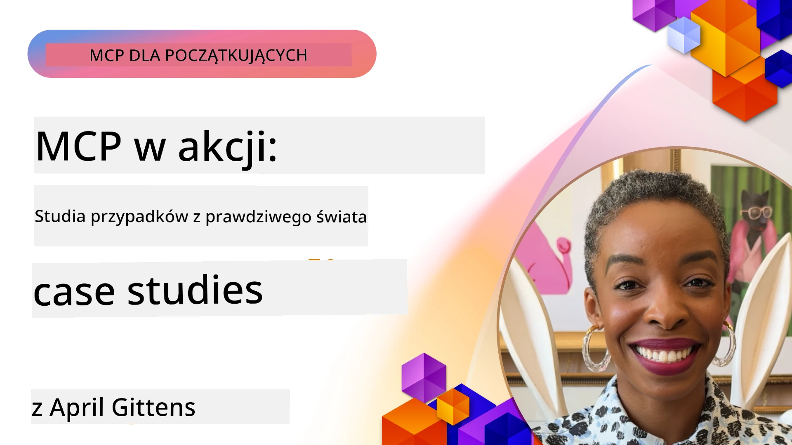

# MCP w działaniu: Studium przypadków z rzeczywistego świata

_(Kliknij powyższy obraz, aby obejrzeć wideo z tej lekcji)_

Model Context Protocol (MCP) zmienia sposób, w jaki aplikacje AI współpracują z danymi, narzędziami i usługami. W tej sekcji przedstawiono studia przypadków z rzeczywistego świata, które demonstrują praktyczne zastosowania MCP w różnych scenariuszach biznesowych.

## Przegląd

Ta sekcja prezentuje konkretne przykłady wdrożeń MCP, podkreślając, jak organizacje wykorzystują ten protokół do rozwiązywania złożonych wyzwań biznesowych. Analizując te studia przypadków, zdobędziesz wgląd w wszechstronność, skalowalność oraz praktyczne korzyści MCP w rzeczywistych sytuacjach.

## Kluczowe cele nauki

Analizując te studia przypadków, dowiesz się:

- Jak MCP może być stosowany do rozwiązywania konkretnych problemów biznesowych
- O różnych wzorcach integracji i podejściach architektonicznych
- Najlepszych praktyk wdrażania MCP w środowiskach korporacyjnych
- Jakie wyzwania i rozwiązania napotykano podczas rzeczywistych wdrożeń
- Gdzie można zastosować podobne wzorce w swoich projektach

## Prezentowane studia przypadków

### 1. [Azure AI Travel Agents – Wdrożenie referencyjne](./travelagentsample.md)

To studium przypadku analizuje kompleksowe rozwiązanie referencyjne Microsoft, które pokazuje, jak zbudować aplikację do planowania podróży opartą na wielu agentach AI z użyciem MCP, Azure OpenAI oraz Azure AI Search. Projekt demonstruje:

- Orkiestrację wielu agentów przez MCP
- Integrację danych przedsiębiorstwa z Azure AI Search
- Bezpieczną, skalowalną architekturę wykorzystującą usługi Azure
- Rozszerzalne narzędzia z wielokrotnego użytku komponentami MCP
- Konwersacyjne doświadczenie użytkownika zasilane przez Azure OpenAI

Architektura i szczegóły implementacji dostarczają cennych wskazówek do budowy złożonych systemów wieloagentowych z MCP jako warstwą koordynacyjną.

### 2. [Aktualizacja elementów Azure DevOps na podstawie danych z YouTube](./UpdateADOItemsFromYT.md)

To studium przypadku pokazuje praktyczne zastosowanie MCP do automatyzacji procesów roboczych. Prezentuje, jak narzędzia MCP mogą być użyte do:

- Wydobycia danych z platform internetowych (YouTube)
- Aktualizacji elementów pracy w systemach Azure DevOps
- Tworzenia powtarzalnych przepływów automatyzacji
- Integracji danych między różnymi systemami

Ten przykład ilustruje, jak nawet stosunkowo proste wdrożenia MCP mogą przynieść znaczące zyski efektywności przez automatyzację rutynowych zadań i poprawę spójności danych między systemami.

### 3. [Pobieranie dokumentacji w czasie rzeczywistym z MCP](./docs-mcp/README.md)

To studium przypadku prowadzi cię przez podłączenie konsolowego klienta Python do serwera Model Context Protocol (MCP) w celu pobierania oraz logowania dokumentacji Microsoft uwzględniającej kontekst w czasie rzeczywistym. Nauczysz się:

- Łączenia z serwerem MCP za pomocą klienta Python oraz oficjalnego SDK MCP
- Wykorzystywania strumieniujących klientów HTTP do efektywnego, rzeczywistego pobierania danych
- Wywoływania narzędzi dokumentacyjnych na serwerze i bezpośredniego logowania odpowiedzi na konsolę
- Integracji aktualnej dokumentacji Microsoft w swoim workflow bez wychodzenia z terminalu

Rozdział zawiera praktyczne zadanie, minimalny działający przykład kodu i linki do dodatkowych zasobów do głębszej nauki. Zobacz pełną prezentację i kod w załączonym rozdziale, aby zrozumieć, jak MCP może zrewolucjonizować dostęp do dokumentacji i produktywność programistów w środowisku konsolowym.

### 4. [Interaktywna aplikacja webowa generator planów nauki z MCP](./docs-mcp/README.md)

To studium przypadku demonstruje, jak zbudować interaktywną aplikację webową używając Chainlit oraz Model Context Protocol (MCP) do generowania spersonalizowanych planów nauki dla dowolnego tematu. Użytkownicy mogą określić przedmiot (np. "certyfikat AI-900") oraz czas nauki (np. 8 tygodni), a aplikacja dostarczy szczegółowy podział treści na tygodnie. Chainlit umożliwia konwersacyjny interfejs czatu, czyniąc doświadczenie angażującym i adaptacyjnym.

- Konwersacyjna aplikacja webowa zasilana przez Chainlit
- Zapytania użytkownika o temat i czas trwania
- Cotygodniowe rekomendacje treści za pomocą MCP
- Rzeczywiste, adaptacyjne odpowiedzi w interfejsie czatu

Projekt pokazuje, jak AI konwersacyjne i MCP mogą współdziałać, tworząc dynamiczne, napędzane przez użytkownika narzędzia edukacyjne w nowoczesnym środowisku webowym.

### 5. [Dokumentacja w edytorze z MCP Server w VS Code](./docs-mcp/README.md)

To studium przypadku pokazuje, jak możesz przenieść Microsoft Learn Docs bezpośrednio do swojego środowiska VS Code za pomocą serwera MCP — koniec z przełączaniem zakładek w przeglądarce! Zobaczysz, jak:

- Natychmiast wyszukiwać i czytać dokumentację wewnątrz VS Code, używając panelu MCP lub palety poleceń
- Odwoływać się do dokumentacji i wstawiać linki bezpośrednio do plików README lub kursowych markdown
- Używać GitHub Copilot i MCP razem dla płynnych, wspieranych AI workflow dokumentacyjnych i kodowych
- Weryfikować i ulepszać dokumentację z użyciem informacji zwrotnych w czasie rzeczywistym i dokładności dostarczanej przez Microsoft
- Integrować MCP z workflow GitHub dla ciągłej walidacji dokumentacji

Implementacja obejmuje:

- Przykładową konfigurację `.vscode/mcp.json` do łatwej instalacji
- Przewodniki oparte na zrzutach ekranu z doświadczenia w edytorze
- Wskazówki dotyczące łączenia Copilota i MCP dla maksymalnej produktywności

Ten scenariusz jest idealny dla autorów kursów, twórców dokumentacji i deweloperów, którzy chcą pozostać skupieni w edytorze podczas pracy z dokumentacją, Copilotem i narzędziami weryfikacyjnymi — wszystko zasilane przez MCP.

### 6. [Tworzenie serwera MCP w APIM](./apimsample.md)

To studium przypadku zawiera przewodnik krok po kroku, jak stworzyć serwer MCP korzystając z Azure API Management (APIM). Obejmuje:

- Konfigurację serwera MCP w Azure API Management
- Udostępnianie operacji API jako narzędzi MCP
- Konfigurowanie zasad limitowania oraz zabezpieczeń
- Testowanie serwera MCP z użyciem Visual Studio Code i GitHub Copilot

Ten przykład pokazuje, jak wykorzystać możliwości Azure do stworzenia solidnego serwera MCP, który może być używany w różnych aplikacjach, zwiększając integrację systemów AI z korporacyjnymi API.

### 7. [Rejestr MCP GitHub — Przyspieszanie integracji agentów](https://github.com/mcp)

To studium przypadku analizuje, jak GitHub MCP Registry, uruchomiony we wrześniu 2025 roku, rozwiązuje kluczowe wyzwanie w ekosystemie AI: rozproszony sposób odkrywania i wdrażania serwerów Model Context Protocol (MCP).

#### Przegląd
**MCP Registry** rozwiązuje rosnący problem rozproszenia serwerów MCP w różnych repozytoriach i rejestrach, co wcześniej spowalniało integrację i wprowadzało błędy. Serwery te pozwalają agentom AI na interakcję z systemami zewnętrznymi, takimi jak API, bazy danych i źródła dokumentacji.

#### Problem
Deweloperzy tworzący agentowe workflow napotykali liczne problemy:
- **Słaba wykrywalność** serwerów MCP w różnych platformach
- **Powtarzające się pytania konfiguracyjne** rozproszone po forach i dokumentacji
- **Ryzyka bezpieczeństwa** wynikające z niezweryfikowanych i nieufnych źródeł
- **Brak standaryzacji** jakości i kompatybilności serwerów

#### Architektura rozwiązania
GitHub MCP Registry centralizuje zaufane serwery MCP, oferując kluczowe funkcje:
- **Instalacja jednorazowym kliknięciem** z poziomu VS Code dla uproszczonej konfiguracji
- **Sortowanie sygnału nad szumem** według gwiazdek, aktywności i walidacji społeczności
- **Bezpośrednia integracja** z GitHub Copilot i innymi narzędziami kompatybilnymi z MCP
- **Model otwartych wkładów** umożliwiający uczestnictwo społeczności i partnerów korporacyjnych

#### Wpływ biznesowy
Rejestr przyniósł wymierne korzyści:
- **Szybsze wdrożenia** dla deweloperów korzystających z narzędzi takich jak Microsoft Learn MCP Server, który strumieniuje oficjalną dokumentację bezpośrednio do agentów
- **Zwiększona produktywność** dzięki wyspecjalizowanym serwerom, np. `github-mcp-server`, pozwalającym na automatyzację GitHub w języku naturalnym (tworzenie PR, powtarzanie CI, skanowanie kodu)
- **Większe zaufanie ekosystemu** dzięki kuratorowanym listom i przejrzystym standardom konfiguracyjnym

#### Wartość strategiczna
Dla specjalistów zajmujących się zarządzaniem cyklem życia agentów i powtarzalnymi workflow, MCP Registry zapewnia:
- **Modularne wdrażanie agentów** z ustandaryzowanymi komponentami
- **Pipeliny ewaluacyjne z wykorzystaniem rejestru** dla spójnego testowania i walidacji
- **Interoperacyjność między narzędziami** umożliwiającą płynną integrację na wielu platformach AI

To studium przypadku pokazuje, że MCP Registry to nie tylko katalog — to fundamentalna platforma dla skalowalnej, rzeczywistej integracji modeli i wdrażania systemów agentowych.

## Podsumowanie

Te siedem kompleksowych studiów przypadków pokazuje niezwykłą wszechstronność i praktyczne zastosowania Model Context Protocol w różnorodnych rzeczywistych scenariuszach. Od złożonych systemów planowania podróży wieloagentowych i zarządzania API przedsiębiorstwa, po usprawnione workflow dokumentacyjne oraz rewolucyjny GitHub MCP Registry, te przykłady demonstrują, jak MCP zapewnia ustandaryzowany, skalowalny sposób łączenia systemów AI z narzędziami, danymi i usługami niezbędnymi do dostarczania wyjątkowej wartości.

Studia przypadków obejmują wiele wymiarów wdrożeń MCP:
- **Integracja korporacyjna**: Azure API Management i automatyzacja Azure DevOps
- **Orkiestracja wieloagentowa**: planowanie podróży z koordynowanymi agentami AI
- **Produktywność programistów**: integracja VS Code i dostęp do dokumentacji w czasie rzeczywistym
- **Rozwój ekosystemu**: GitHub MCP Registry jako platforma fundamentalna
- **Zastosowania edukacyjne**: interaktywne generatory planów nauki i interfejsy konwersacyjne

Analiza tych wdrożeń dostarcza kluczową wiedzę na temat:
- **Wzorców architektonicznych** dla różnych skal i zastosowań
- **Strategii implementacyjnych** łączących funkcjonalność z łatwością utrzymania
- **Aspektów bezpieczeństwa i skalowalności** dla produkcyjnych wdrożeń
- **Najlepszych praktyk** tworzenia serwerów MCP i integracji klientów
- **Myślenia ekosystemowego** dla budowania powiązanych rozwiązań AI

Te przykłady razem dowodzą, że MCP nie jest jedynie teoretycznym modelem, lecz dojrzałym, gotowym do produkcji protokołem umożliwiającym praktyczne rozwiązania złożonych wyzwań biznesowych. Niezależnie, czy tworzysz proste narzędzia automatyzacji, czy skomplikowane systemy wieloagentowe, wzorce i podejścia zaprezentowane tutaj stanowią solidną podstawę dla twoich własnych projektów MCP.

## Dodatkowe zasoby

- [Azure AI Travel Agents GitHub Repository](https://github.com/Azure-Samples/azure-ai-travel-agents)
- [Azure DevOps MCP Tool](https://github.com/microsoft/azure-devops-mcp)
- [Playwright MCP Tool](https://github.com/microsoft/playwright-mcp)
- [Microsoft Docs MCP Server](https://github.com/MicrosoftDocs/mcp)
- [GitHub MCP Registry — Przyspieszanie integracji agentów](https://github.com/mcp)
- [Przykłady społeczności MCP](https://github.com/microsoft/mcp)

## Co dalej

- Poprzedni: [Moduł 8: Najlepsze praktyki](../08-BestPractices/README.md)
- Następny: [Moduł 10: Usprawnianie przepływów pracy AI: Budowanie serwera MCP z AI Toolkit](../10-StreamliningAIWorkflowsBuildingAnMCPServerWithAIToolkit/README.md)

---

<!-- CO-OP TRANSLATOR DISCLAIMER START -->
**Oświadczenie**:
Niniejszy dokument został przetłumaczony przy użyciu automatycznej usługi tłumaczeniowej AI [Co-op Translator](https://github.com/Azure/co-op-translator). Chociaż dokładamy starań, aby tłumaczenie było jak najdokładniejsze, prosimy pamiętać, że automatyczne tłumaczenia mogą zawierać błędy lub niedokładności. Oryginalny dokument w języku macierzystym należy uznać za źródło autorytatywne. W przypadku informacji o kluczowym znaczeniu zaleca się skorzystanie z profesjonalnego tłumaczenia wykonanego przez człowieka. Nie ponosimy odpowiedzialności za jakiekolwiek nieporozumienia lub błędne interpretacje wynikające z korzystania z tego tłumaczenia.
<!-- CO-OP TRANSLATOR DISCLAIMER END -->