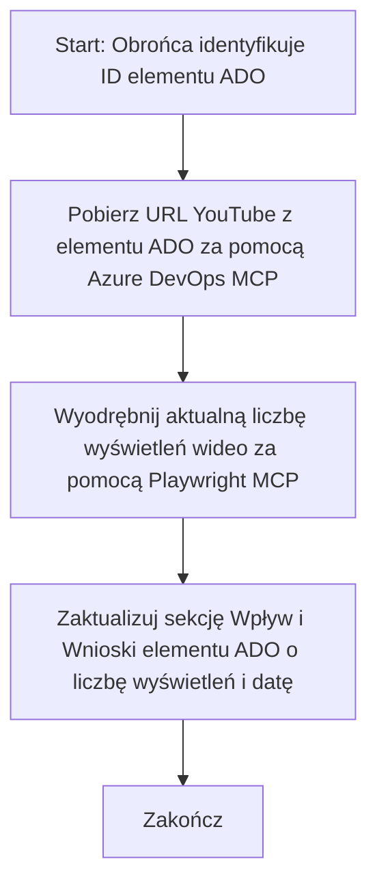

# Studium przypadku: Aktualizacja elementów Azure DevOps danymi z YouTube za pomocą MCP

> **Zastrzeżenie:** Istnieją gotowe narzędzia online i raporty, które mogą automatyzować proces aktualizacji elementów Azure DevOps danymi z platform takich jak YouTube. Poniższy scenariusz jest udostępniony wyłącznie jako przykładowy przypadek użycia, pokazujący, jak narzędzia MCP mogą być stosowane do automatyzacji i integracji.

## Przegląd

W tym studium przypadku pokazano jeden przykład, jak Model Context Protocol (MCP) i jego narzędzia mogą być wykorzystane do automatyzacji procesu aktualizacji elementów pracy Azure DevOps (ADO) informacjami pochodzącymi z platform online, takich jak YouTube. Opisany scenariusz jest tylko ilustracją szerszych możliwości tych narzędzi, które mogą zostać zaadaptowane do wielu podobnych potrzeb automatyzacji.

W tym przykładzie osoba odpowiedzialna (Advocate) śledzi sesje online za pomocą elementów ADO, gdzie każdy element zawiera adres URL do filmu na YouTube. Dzięki wykorzystaniu narzędzi MCP, Advocate może utrzymywać elementy ADO na bieżąco z najnowszymi metrykami wideo, takimi jak liczba wyświetleń, w sposób powtarzalny i zautomatyzowany. To podejście można uogólnić na inne przypadki, gdzie informacje z źródeł online muszą być integrowane z ADO lub innymi systemami.

## Scenariusz

Advocate odpowiada za śledzenie wpływu sesji online i zaangażowania społeczności. Każda sesja jest rejestrowana jako element pracy ADO w projekcie 'DevRel', a element pracy zawiera pole na adres URL filmu z YouTube. Aby dokładnie raportować zasięg sesji, Advocate musi zaktualizować element ADO o aktualną liczbę wyświetleń filmu oraz datę pobrania tych informacji.

## Użyte narzędzia

- [Azure DevOps MCP](https://github.com/microsoft/azure-devops-mcp): Umożliwia programowy dostęp i aktualizacje elementów pracy ADO przez MCP.
- [Playwright MCP](https://github.com/microsoft/playwright-mcp): Automatyzuje działania w przeglądarce, aby pozyskać dane w czasie rzeczywistym ze stron internetowych, takich jak statystyki filmów na YouTube.

## Przebieg krok po kroku

1. **Identyfikacja elementu ADO**: Rozpocznij od ID elementu pracy ADO (np. 1234) w projekcie 'DevRel'.
2. **Pobranie adresu YouTube**: Użyj narzędzia Azure DevOps MCP, aby pobrać URL YouTube z elementu pracy.
3. **Pozyskanie liczby wyświetleń**: Użyj narzędzia Playwright MCP, aby przejść na URL YouTube i wydobyć aktualną liczbę wyświetleń.
4. **Aktualizacja elementu ADO**: Zapisz najnowszą liczbę wyświetleń oraz datę pobrania w sekcji „Wpływ i nauka” elementu pracy ADO, korzystając z narzędzia Azure DevOps MCP.

## Przykładowy prompt

```bash
- Work with the ADO Item ID: 1234
- The project is '2025-Awesome'
- Get the YouTube URL for the ADO item
- Use Playwright to get the current views from the YouTube video
- Update the ADO item with the current video views and the updated date of the information
```

## Diagram Mermaid


## Implementacja techniczna

- **Orkiestracja MCP**: Przebieg pracy jest zarządzany przez serwer MCP, który koordynuje wykorzystanie narzędzi Azure DevOps MCP i Playwright MCP.
- **Automatyzacja**: Proces może być wywoływany ręcznie lub zaplanowany do cyklicznego uruchamiania, aby utrzymywać aktualność elementów ADO.
- **Rozszerzalność**: Ten sam wzorzec można rozszerzyć o aktualizacje elementów ADO o inne metryki online (np. polubienia, komentarze) lub z innych platform.

## Wyniki i wpływ

- **Efektywność**: Redukuje ręczną pracę Advocate’ów przez automatyzację pobierania i aktualizacji metryk wideo.
- **Dokładność**: Zapewnia, że elementy ADO odzwierciedlają najświeższe dostępne dane z źródeł online.
- **Powtarzalność**: Dostarcza powtarzalny i wielokrotnego użytku przebieg pracy dla podobnych scenariuszy z innymi źródłami danych lub metrykami.

## Źródła

- [Azure DevOps MCP](https://github.com/microsoft/azure-devops-mcp)
- [Playwright MCP](https://github.com/microsoft/playwright-mcp)
- [Model Context Protocol (MCP)](https://modelcontextprotocol.io/)

## Co dalej

- Powrót do: [Przegląd studiów przypadków](./README.md)
- Dalej: [Pobieranie dokumentacji w czasie rzeczywistym z MCP](./docs-mcp/README.md)

---

<!-- CO-OP TRANSLATOR DISCLAIMER START -->
**Zastrzeżenie**:  
Dokument ten został przetłumaczony przy użyciu usługi tłumaczeniowej AI [Co-op Translator](https://github.com/Azure/co-op-translator). Mimo że dokładamy wszelkich starań, aby tłumaczenie było jak najdokładniejsze, należy pamiętać, że automatyczne tłumaczenia mogą zawierać błędy lub nieścisłości. Oryginalny dokument w języku źródłowym powinien być traktowany jako źródło autorytatywne. W przypadku informacji krytycznych rekomendowane jest skorzystanie z profesjonalnego tłumaczenia wykonanego przez człowieka. Nie ponosimy odpowiedzialności za jakiekolwiek nieporozumienia lub błędne interpretacje wynikające z korzystania z tego tłumaczenia.
<!-- CO-OP TRANSLATOR DISCLAIMER END -->