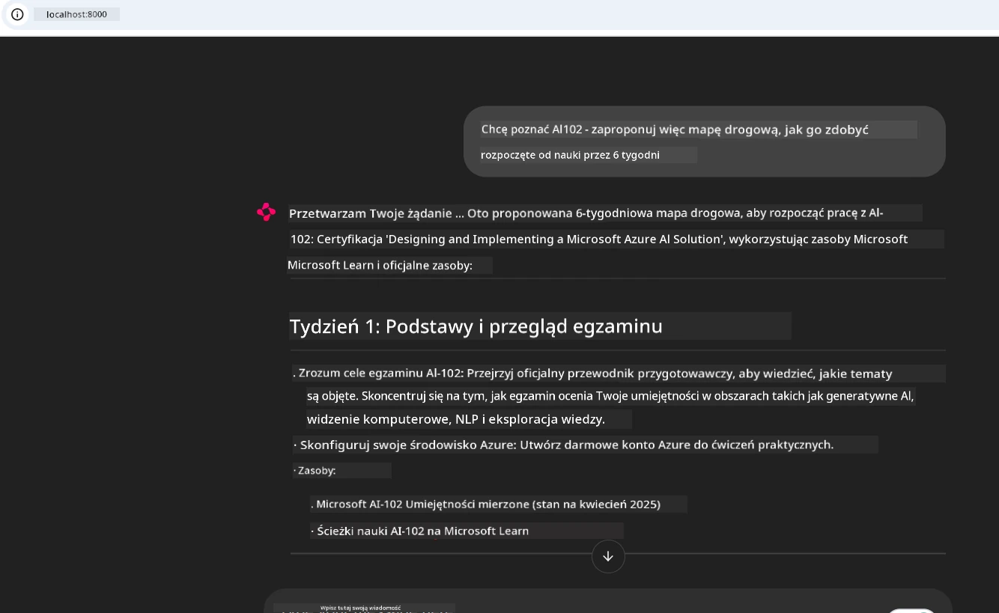
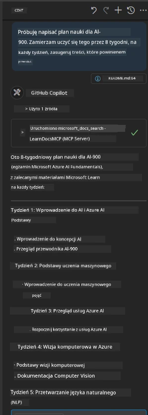

# Studium przypadku: Łączenie się z serwerem Microsoft Learn Docs MCP z klienta

Czy zdarzyło Ci się kiedyś przełączać między stronami dokumentacji, Stack Overflow i niezliczonymi kartami w wyszukiwarce, próbując rozwiązać problem w swoim kodzie? Może masz drugi monitor tylko do dokumentacji lub ciągle przełączasz się między IDE a przeglądarką. Czy nie lepiej byłoby mieć dokumentację bezpośrednio w swoim przepływie pracy—zintegrowaną z aplikacjami, IDE lub własnymi narzędziami? W tym studium przypadku pokażemy, jak to zrobić, łącząc się bezpośrednio z serwerem Microsoft Learn Docs MCP z własnej aplikacji klienckiej.

## Przegląd

Nowoczesny rozwój to coś więcej niż tylko pisanie kodu—chodzi o znalezienie właściwej informacji we właściwym czasie. Dokumentacja jest wszędzie, ale rzadko tam, gdzie jest najbardziej potrzebna: wewnątrz Twoich narzędzi i przepływów pracy. Integrując pobieranie dokumentacji bezpośrednio w aplikacjach, możesz zaoszczędzić czas, zmniejszyć przełączanie kontekstu i zwiększyć produktywność. W tej sekcji pokażemy, jak połączyć klienta z serwerem Microsoft Learn Docs MCP, aby uzyskać dostęp do dokumentacji w czasie rzeczywistym, dostosowanej do kontekstu, bez opuszczania aplikacji.

Przeprowadzimy Cię przez proces nawiązania połączenia, wysłania zapytania i efektywnego obsługiwania odpowiedzi strumieniowych. Takie podejście nie tylko usprawnia Twój przepływ pracy, ale również otwiera drzwi do budowania inteligentniejszych, bardziej pomocnych narzędzi dla programistów.

## Cele nauki

Dlaczego to robimy? Ponieważ najlepsze doświadczenia programistyczne to te, które eliminują przeszkody. Wyobraź sobie świat, w którym Twój edytor kodu, chatbot lub aplikacja webowa może natychmiast odpowiadać na pytania dotyczące dokumentacji, korzystając z najnowszej zawartości Microsoft Learn. Po zakończeniu tego rozdziału będziesz potrafił:

- Zrozumieć podstawy komunikacji klient-serwer MCP dla dokumentacji
- Zaimplementować aplikację konsolową lub webową łączącą się z serwerem Microsoft Learn Docs MCP
- Używać strumieniowych klientów HTTP do pobierania dokumentacji w czasie rzeczywistym
- Rejestrować i interpretować odpowiedzi z dokumentacji w swojej aplikacji

Zobaczysz, jak te umiejętności mogą pomóc Ci tworzyć narzędzia, które nie tylko reagują, ale są naprawdę interaktywne i świadome kontekstu.

## Scenariusz 1 - Pobieranie dokumentacji w czasie rzeczywistym z MCP

W tym scenariuszu pokażemy, jak połączyć klienta z serwerem Microsoft Learn Docs MCP, umożliwiając dostęp do dokumentacji w czasie rzeczywistym, dostosowanej do kontekstu, bez opuszczania aplikacji.

Przejdźmy do praktyki. Twoim zadaniem jest napisanie aplikacji, która łączy się z serwerem Microsoft Learn Docs MCP, wywołuje narzędzie `microsoft_docs_search` i rejestruje odpowiedź strumieniową w konsoli.

### Dlaczego takie podejście?
Bo to podstawa budowania bardziej zaawansowanych integracji—niezależnie czy chcesz zasilać chatbota, rozszerzenie IDE czy panel webowy.

Kod i instrukcje dla tego scenariusza znajdziesz w folderze [`solution`](./solution/README.md) w ramach tego studium przypadku. Kroki przeprowadzą Cię przez konfigurację połączenia:
- Użyj oficjalnego SDK MCP i klienta HTTP obsługującego strumienie do połączenia
- Wywołaj narzędzie `microsoft_docs_search` z parametrem zapytania, aby pobrać dokumentację
- Zaimplementuj poprawne logowanie i obsługę błędów
- Stwórz interaktywny interfejs konsoli umożliwiający użytkownikom wpisywanie wielu zapytań

Ten scenariusz pokazuje jak:
- Połączyć się z serwerem Docs MCP
- Wysłać zapytanie
- Sparsować i wyświetlić wyniki

Tak może wyglądać uruchomienie rozwiązania:

```
Prompt> What is Azure Key Vault?
Answer> Azure Key Vault is a cloud service for securely storing and accessing secrets. ...
```

Poniżej znajduje się minimalny przykładowy kod rozwiązania. Pełny kod i szczegóły są dostępne w folderze rozwiązania.

<details>
<summary>Python</summary>

```python
import asyncio
from mcp.client.streamable_http import streamablehttp_client
from mcp import ClientSession

async def main():
    async with streamablehttp_client("https://learn.microsoft.com/api/mcp") as (read_stream, write_stream, _):
        async with ClientSession(read_stream, write_stream) as session:
            await session.initialize()
            result = await session.call_tool("microsoft_docs_search", {"query": "Azure Functions best practices"})
            print(result.content)

if __name__ == "__main__":
    asyncio.run(main())
```

- Aby zobaczyć pełną implementację i logowanie, zajrzyj do [`scenario1.py`](../../../../09-CaseStudy/docs-mcp/solution/python/scenario1.py).
- Instrukcje instalacji i użytkowania znajdziesz w pliku [`README.md`](./solution/python/README.md) w tym samym folderze.
</details>


## Scenariusz 2 - Interaktywna aplikacja webowa generatora planu nauki z MCP

W tym scenariuszu nauczysz się, jak zintegrować Docs MCP w projekcie webowym. Celem jest umożliwienie użytkownikom wyszukiwania dokumentacji Microsoft Learn bezpośrednio z poziomu interfejsu webowego, co sprawia, że dokumentacja jest natychmiast dostępna w Twojej aplikacji lub witrynie.

Zobaczysz, jak:
- Skonfigurować aplikację webową
- Połączyć się z serwerem Docs MCP
- Obsłużyć dane wejściowe użytkownika i wyświetlić wyniki

Tak może wyglądać uruchomienie rozwiązania:

```
User> I want to learn about AI102 - so suggest the roadmap to get it started from learn for 6 weeks

Assistant> Here’s a detailed 6-week roadmap to start your preparation for the AI-102: Designing and Implementing a Microsoft Azure AI Solution certification, using official Microsoft resources and focusing on exam skills areas:

---
## Week 1: Introduction & Fundamentals
- **Understand the Exam**: Review the [AI-102 exam skills outline](https://learn.microsoft.com/en-us/credentials/certifications/exams/ai-102/).
- **Set up Azure**: Sign up for a free Azure account if you don't have one.
- **Learning Path**: [Introduction to Azure AI services](https://learn.microsoft.com/en-us/training/modules/intro-to-azure-ai/)
- **Focus**: Get familiar with Azure portal, AI capabilities, and necessary tools.

....more weeks of the roadmap...

Let me know if you want module-specific recommendations or need more customized weekly tasks!
```

Poniżej znajduje się minimalny przykładowy kod rozwiązania. Pełny kod i szczegóły są dostępne w folderze rozwiązania.



<details>
<summary>Python (Chainlit)</summary>

Chainlit to framework do tworzenia konwersacyjnych aplikacji webowych AI. Umożliwia łatwe tworzenie interaktywnych chatbotów i asystentów, którzy mogą wywoływać narzędzia MCP i wyświetlać wyniki w czasie rzeczywistym. Idealny do szybkiego prototypowania i przyjaznych interfejsów użytkownika.

```python
import chainlit as cl
import requests

MCP_URL = "https://learn.microsoft.com/api/mcp"

@cl.on_message
def handle_message(message):
    query = {"question": message}
    response = requests.post(MCP_URL, json=query)
    if response.ok:
        result = response.json()
        cl.Message(content=result.get("answer", "No answer found.")).send()
    else:
        cl.Message(content="Error: " + response.text).send()
```

- Aby zobaczyć pełną implementację, zajrzyj do [`scenario2.py`](../../../../09-CaseStudy/docs-mcp/solution/python/scenario2.py).
- Instrukcje konfiguracji i uruchomienia znajdziesz w [`README.md`](./solution/python/README.md).
</details>


## Scenariusz 3: Dokumentacja w edytorze z serwerem MCP w VS Code

Jeśli chcesz mieć Microsoft Learn Docs bezpośrednio w VS Code (zamiast przełączać się na karty przeglądarki), możesz użyć serwera MCP w swoim edytorze. Pozwala to:
- Przeszukiwać i czytać dokumentację w VS Code bez opuszczania środowiska kodowania.
- Odwoływać się do dokumentacji i wstawiać linki bezpośrednio do plików README lub kursów.
- Wykorzystać GitHub Copilot oraz MCP razem dla płynnego, wspieranego AI przepływu pracy z dokumentacją.

**Dowiesz się, jak:**
- Dodać ważny plik `.vscode/mcp.json` do katalogu głównego swojego workspace (przykład poniżej).
- Otworzyć panel MCP lub użyć palety poleceń w VS Code, aby wyszukiwać i wstawiać dokumenty.
- Odwoływać się do dokumentacji bezpośrednio w plikach markdown podczas pracy.
- Połączyć ten przepływ z GitHub Copilot dla jeszcze większej wydajności.

Oto przykład konfiguracji serwera MCP w VS Code:

```json
{
  "servers": {
    "LearnDocsMCP": {
      "url": "https://learn.microsoft.com/api/mcp"
    }
  }
}
```

</details>

> Aby uzyskać szczegółowy przewodnik z zrzutami ekranu i krok po kroku, zobacz [`README.md`](./solution/scenario3/README.md).



To podejście jest idealne dla wszystkich, którzy tworzą kursy techniczne, piszą dokumentację lub rozwijają kod wymagający częstych odwołań.

## Kluczowe wnioski

Integracja dokumentacji bezpośrednio w narzędziach to nie tylko wygoda—to zmieniacz gry w produktywności. Łącząc się z serwerem Microsoft Learn Docs MCP z klienta, możesz:

- Wyeliminować przełączanie kontekstu między kodem a dokumentacją
- Pobierać aktualne, dostosowane do kontekstu dokumenty w czasie rzeczywistym
- Budować inteligentniejsze, bardziej interaktywne narzędzia dla programistów

Te umiejętności pomogą Ci tworzyć rozwiązania nie tylko wydajne, lecz także przyjemne w użyciu.

## Dodatkowe zasoby

Aby pogłębić wiedzę, zapoznaj się z oficjalnymi źródłami:

- [Microsoft Learn Docs MCP Server (GitHub)](https://github.com/MicrosoftDocs/mcp)
- [Rozpocznij pracę z Azure MCP Server (mcp-python)](https://learn.microsoft.com/en-us/azure/developer/azure-mcp-server/get-started#create-the-python-app)
- [Czym jest Azure MCP Server?](https://learn.microsoft.com/en-us/azure/developer/azure-mcp-server/)
- [Wprowadzenie do Model Context Protocol (MCP)](https://modelcontextprotocol.io/introduction)
- [Dodawanie wtyczek z serwera MCP (Python)](https://learn.microsoft.com/en-us/semantic-kernel/concepts/plugins/adding-mcp-plugins)

## Co dalej

- Powrót do: [Przegląd studiów przypadków](../README.md)
- Kontynuuj do: [Moduł 10: Usprawnianie przepływów pracy AI z AI Toolkit](../../10-StreamliningAIWorkflowsBuildingAnMCPServerWithAIToolkit/README.md)

---

<!-- CO-OP TRANSLATOR DISCLAIMER START -->
**Zastrzeżenie**:  
Niniejszy dokument został przetłumaczony za pomocą usługi tłumaczenia AI [Co-op Translator](https://github.com/Azure/co-op-translator). Chociaż dokładamy wszelkich starań, aby tłumaczenie było precyzyjne, prosimy pamiętać, że automatyczne przekłady mogą zawierać błędy lub nieścisłości. Oryginalny dokument w języku źródłowym należy traktować jako źródło nadrzędne. W przypadku informacji o kluczowym znaczeniu zalecane jest skorzystanie z profesjonalnego tłumaczenia wykonanego przez człowieka. Nie ponosimy odpowiedzialności za jakiekolwiek nieporozumienia lub błędne interpretacje wynikające z korzystania z tego tłumaczenia.
<!-- CO-OP TRANSLATOR DISCLAIMER END -->