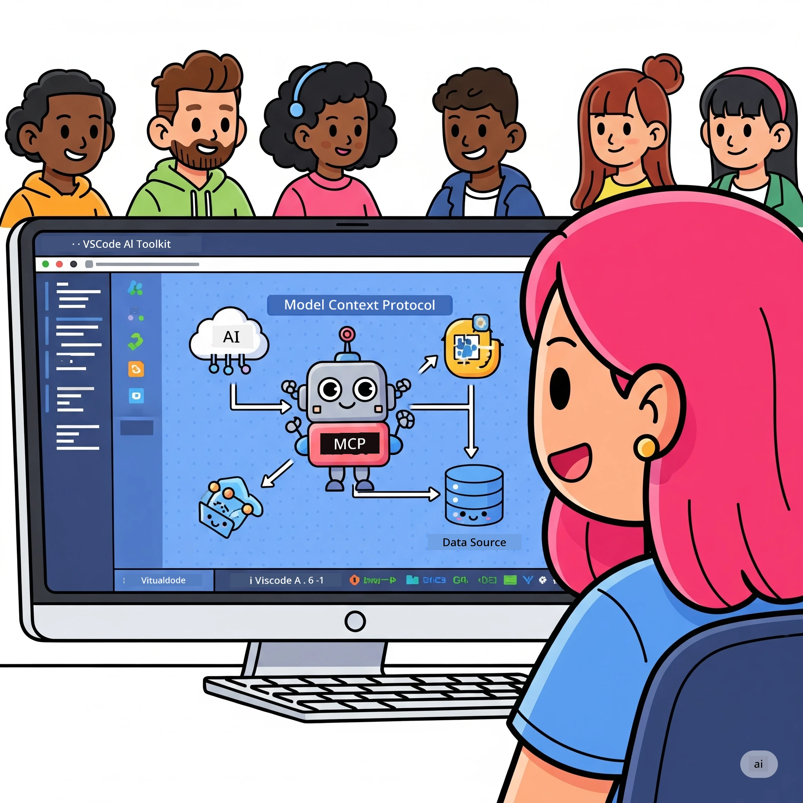
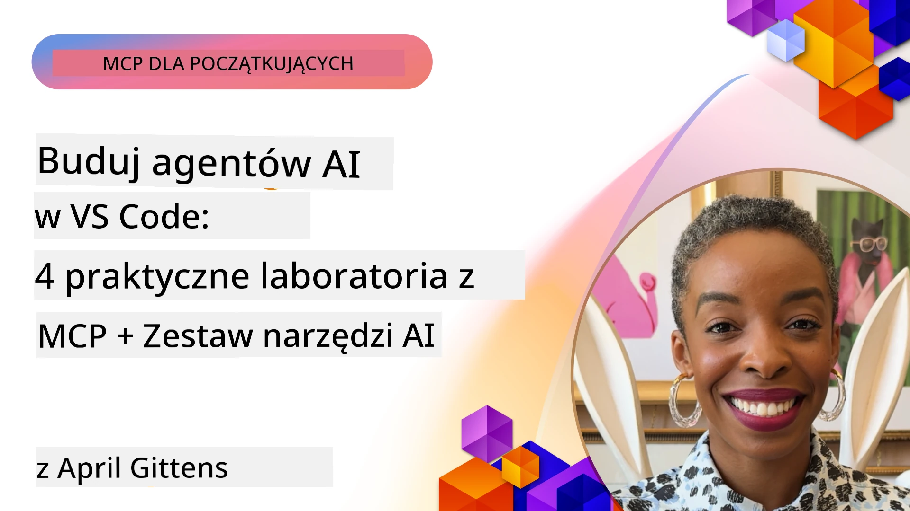

# Usprawnianie przepływów pracy AI: Budowa serwera MCP z AI Toolkit

## 🎯 Przegląd

_(Kliknij powyższy obraz, aby obejrzeć wideo z tej lekcji)_

Witamy na **Warsztatach Model Context Protocol (MCP)**! Ten kompleksowy warsztat praktyczny łączy dwie przełomowe technologie, które zrewolucjonizują rozwój aplikacji AI:

- **🔗 Model Context Protocol (MCP)**: Otwarty standard do bezproblemowej integracji narzędzi AI
- **🛠️ AI Toolkit dla Visual Studio Code (AITK)**: Potężne rozszerzenie AI firmy Microsoft

### 🎓 Czego się nauczysz

Na koniec tych warsztatów opanujesz sztukę budowania inteligentnych aplikacji, które łączą modele AI z rzeczywistymi narzędziami i usługami. Od automatycznych testów po niestandardowe integracje API, zdobędziesz praktyczne umiejętności rozwiązywania złożonych wyzwań biznesowych.

## 🏗️ Stos technologiczny

### 🔌 Model Context Protocol (MCP)

MCP to **„USB-C dla AI”** – uniwersalny standard łączący modele AI z zewnętrznymi narzędziami i źródłami danych.

**✨ Kluczowe cechy:**

- 🔄 **Standaryzowana integracja**: Uniwersalny interfejs do łączenia narzędzi AI
- 🏛️ **Elastyczna architektura**: Serwery lokalne i zdalne przez transport stdio/SSE
- 🧰 **Bogaty ekosystem**: Narzędzia, podpowiedzi i zasoby w jednym protokole
- 🔒 **Gotowość korporacyjna**: Wbudowane bezpieczeństwo i niezawodność

**🎯 Dlaczego MCP jest ważny:**
Podobnie jak USB-C wyeliminowało bałagan z kablami, MCP upraszcza integracje AI. Jeden protokół, nieskończone możliwości.

### 🤖 AI Toolkit dla Visual Studio Code (AITK)

Flagowe rozszerzenie Microsoft do rozwoju AI, które przemienia VS Code w potęgę AI.

**🚀 Główne możliwości:**

- 📦 **Katalog modeli**: Dostęp do modeli z Azure AI, GitHub, Hugging Face, Ollama
- ⚡ **Lokalne wnioskowanie**: Optymalizacja ONNX na CPU/GPU/NPU
- 🏗️ **Agent Builder**: Wizualne tworzenie agentów AI z integracją MCP
- 🎭 **Multi-modalność**: Obsługa tekstu, wizji i rezultatów strukturalnych

**💡 Korzyści dla deweloperów:**

- Wdrożenie modeli bez konfiguracji
- Wizualne tworzenie podpowiedzi
- Testy w czasie rzeczywistym
- Bezproblemowa integracja serwera MCP

## 📚 Plan nauki

### [🚀 Moduł 1: Podstawy AI Toolkit](./lab1/README.md)

**Czas trwania**: 15 minut

- 🛠️ Instalacja i konfiguracja AI Toolkit dla VS Code
- 🗂️ Eksploracja Katalogu Modeli (ponad 100 modeli z GitHub, ONNX, OpenAI, Anthropic, Google)
- 🎮 Opanowanie Interaktywnego Place – place dla testów modeli w czasie rzeczywistym
- 🤖 Stworzenie pierwszego agenta AI za pomocą Agent Builder
- 📊 Ewaluacja wydajności modeli z wbudowanymi metrykami (F1, trafność, podobieństwo, spójność)
- ⚡ Poznanie przetwarzania wsadowego i obsługi multi-modalnej

**🎯 Efekt nauki**: Utworzenie funkcjonalnego agenta AI z pełnym zrozumieniem możliwości AITK

### [🌐 Moduł 2: MCP z AI Toolkit - podstawy](./lab2/README.md)

**Czas trwania**: 20 minut

- 🧠 Opanowanie architektury i podstaw Model Context Protocol (MCP)
- 🌐 Poznanie ekosystemu serwerów MCP Microsoftu
- 🤖 Budowa agenta automatyzującego przeglądarkę z użyciem Playwright MCP Server
- 🔧 Integracja serwerów MCP z Agent Builder AI Toolkit
- 📊 Konfiguracja i testowanie narzędzi MCP w agentach
- 🚀 Eksport i wdrożenie agentów napędzanych MCP do produkcji

**🎯 Efekt nauki**: Wdrożenie agenta AI wzbogaconego o narzędzia zewnętrzne za pomocą MCP

### [🔧 Moduł 3: Zaawansowany rozwój MCP z AI Toolkit](./lab3/README.md)

**Czas trwania**: 20 minut

- 💻 Tworzenie niestandardowych serwerów MCP z AI Toolkit
- 🐍 Konfiguracja i korzystanie z najnowszego MCP Python SDK (v1.9.3)
- 🔍 Ustawienie i użycie MCP Inspector do debugowania
- 🛠️ Budowa serwera Weather MCP z profesjonalnymi workflow debugowania
- 🧪 Debugowanie serwerów MCP w Agent Builder i Inspector

**🎯 Efekt nauki**: Tworzenie i debugowanie niestandardowych serwerów MCP z nowoczesnymi narzędziami

### [🐙 Moduł 4: Praktyczny rozwój MCP – niestandardowy serwer GitHub Clone](./lab4/README.md)

**Czas trwania**: 30 minut

- 🏗️ Budowa rzeczywistego serwera GitHub Clone MCP dla workflow programistycznych
- 🔄 Implementacja inteligentnego klonowania repozytoriów z walidacją i obsługą błędów
- 📁 Tworzenie inteligentnego zarządzania katalogami i integracja z VS Code
- 🤖 Korzystanie z trybu GitHub Copilot Agent z niestandardowymi narzędziami MCP
- 🛡️ Zapewnienie niezawodności produkcyjnej i kompatybilności międzyplatformowej

**🎯 Efekt nauki**: Wdrożenie produkcyjnego serwera MCP, który usprawni realne workflow developerskie

## 💡 Praktyczne zastosowania i wpływ

### 🏢 Zastosowania korporacyjne

#### 🔄 Automatyzacja DevOps

Przekształć swój workflow deweloperski dzięki inteligentnej automatyzacji:

- **Inteligentne zarządzanie repozytoriami**: Przegląd kodu i decyzje o scalaniu napędzane AI
- **Inteligentne CI/CD**: Automatyczna optymalizacja pipeline na bazie zmian w kodzie
- **Triage zgłoszeń**: Automatyczna klasyfikacja i przydzielanie błędów

#### 🧪 Rewolucja w zapewnieniu jakości

Podnieś testy dzięki automatyzacji napędzanej AI:

- **Inteligentne generowanie testów**: Automatyczne tworzenie kompleksowych zestawów testów
- **Testy regresji wizualnej**: Wykrywanie zmian UI z wykorzystaniem AI
- **Monitorowanie wydajności**: Proaktywne wykrywanie i rozwiązywanie problemów

#### 📊 Inteligencja przepływu danych

Buduj inteligentniejsze procesy przetwarzania danych:

- **Adaptacyjne procesy ETL**: Samooptymalizujące się transformacje danych
- **Wykrywanie anomalii**: Monitorowanie jakości danych w czasie rzeczywistym
- **Inteligentne trasowanie**: Zarządzanie przepływem danych

#### 🎧 Zwiększenie satysfakcji klienta

Twórz wyjątkowe interakcje z klientem:

- **Wsparcie kontekstowe**: Agenci AI z dostępem do historii klienta
- **Proaktywne rozwiązywanie problemów**: Predykcyjna obsługa klienta
- **Integracja wielokanałowa**: Spójne doświadczenia AI na różnych platformach

## 🛠️ Wymagania wstępne i konfiguracja

### 💻 Wymagania systemowe

| Komponent | Wymaganie | Uwagi |
|-----------|-----------|-------|
| **System operacyjny** | Windows 10+, macOS 10.15+, Linux | Dowolny nowoczesny system |
| **Visual Studio Code** | Najnowsza stabilna wersja | Wymagane dla AITK |
| **Node.js** | v18.0+ oraz npm | Do rozwoju serwerów MCP |
| **Python** | 3.10+ | Opcjonalny dla serwerów MCP w Pythonie |
| **Pamięć** | Minimum 8GB RAM | Zalecane 16GB dla modeli lokalnych |

### 🔧 Środowisko deweloperskie

#### Polecane rozszerzenia VS Code

- **AI Toolkit** (ms-windows-ai-studio.windows-ai-studio)
- **Python** (ms-python.python)
- **Python Debugger** (ms-python.debugpy)
- **GitHub Copilot** (GitHub.copilot) - Opcjonalny, ale pomocny

#### Narzędzia opcjonalne

- **uv**: Nowoczesny menedżer pakietów Python
- **MCP Inspector**: Narzędzie do wizualnego debugowania serwerów MCP
- **Playwright**: Do przykładów automatyzacji webowej

## 🎖️ Efekty nauki i ścieżka certyfikacji

### 🏆 Lista umiejętności do opanowania

Po ukończeniu warsztatów osiągniesz biegłość w:

#### 🎯 Kluczowe kompetencje

- [ ] **Mistrzostwo protokołu MCP**: Głębokie zrozumienie architektury i wzorców implementacji
- [ ] **Biegłość w AITK**: Ekspercka znajomość AI Toolkit dla szybkiego rozwoju
- [ ] **Rozwój niestandardowych serwerów**: Tworzenie, wdrażanie i utrzymanie produkcyjnych serwerów MCP
- [ ] **Doskonałość integracji narzędzi**: Bezproblemowe łączenie AI z istniejącymi workflow
- [ ] **Stosowanie rozwiązań problemów**: Wykorzystanie nabytych umiejętności w realnych wyzwaniach biznesowych

#### 🔧 Umiejętności techniczne

- [ ] Konfiguracja i ustawienie AI Toolkit w VS Code
- [ ] Projektowanie i implementacja niestandardowych serwerów MCP
- [ ] Integracja modeli GitHub z architekturą MCP
- [ ] Budowa automatycznych workflow testowych z Playwright
- [ ] Wdrażanie agentów AI do produkcji
- [ ] Debugowanie i optymalizacja wydajności serwerów MCP

#### 🚀 Zaawansowane możliwości

- [ ] Projektowanie wdrożeń AI na skalę korporacyjną
- [ ] Implementacja najlepszych praktyk bezpieczeństwa dla aplikacji AI
- [ ] Projektowanie skalowalnej architektury serwerów MCP
- [ ] Tworzenie niestandardowych łańcuchów narzędzi dla specyficznych dziedzin
- [ ] Mentorowanie innych w rozwoju AI-native

## 📖 Dodatkowe zasoby

- [Specyfikacja MCP (2025-11-25)](https://spec.modelcontextprotocol.io/specification/2025-11-25/)
- [Repozytorium AI Toolkit na GitHub](https://github.com/microsoft/vscode-ai-toolkit)
- [Kolekcja przykładowych serwerów MCP](https://github.com/modelcontextprotocol/servers)
- [Poradnik najlepszych praktyk](https://modelcontextprotocol.io/docs/best-practices)
- [OWASP MCP Top 10](https://microsoft.github.io/mcp-azure-security-guide/mcp/) - Najlepsze praktyki bezpieczeństwa

---

**🚀 Gotowy, by zrewolucjonizować swój workflow rozwoju AI?**

Zbudujmy razem przyszłość inteligentnych aplikacji z MCP i AI Toolkit!

## Co dalej

Kontynuuj do: [Moduł 11: Warsztaty praktyczne z serwerem MCP](../11-MCPServerHandsOnLabs/README.md)

---

<!-- CO-OP TRANSLATOR DISCLAIMER START -->
**Zastrzeżenie**:  
Dokument ten został przetłumaczony za pomocą usługi tłumaczeniowej AI [Co-op Translator](https://github.com/Azure/co-op-translator). Chociaż dokładamy starań, aby tłumaczenie było precyzyjne, prosimy pamiętać, że automatyczne tłumaczenia mogą zawierać błędy lub nieścisłości. Oryginalny dokument w języku źródłowym należy traktować jako wersję autorytatywną. W przypadku informacji o kluczowym znaczeniu zalecane jest skorzystanie z profesjonalnego tłumaczenia wykonanego przez człowieka. Nie ponosimy odpowiedzialności za jakiekolwiek nieporozumienia lub błędne interpretacje wynikające z korzystania z tego tłumaczenia.
<!-- CO-OP TRANSLATOR DISCLAIMER END -->