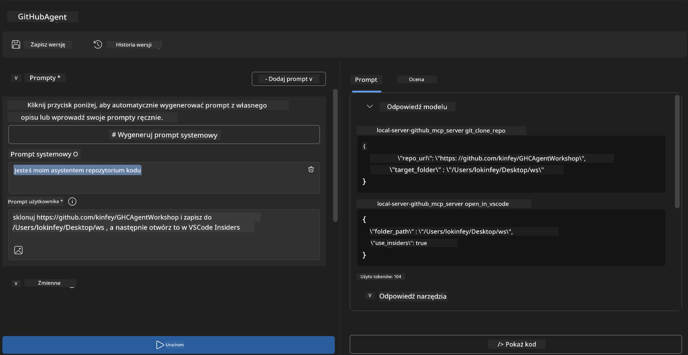
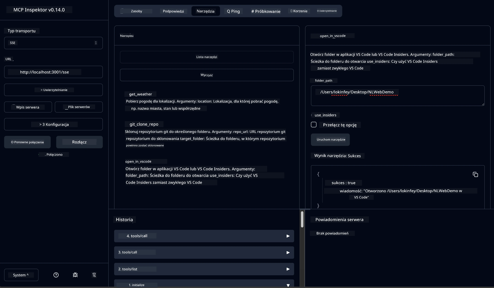

# 🐙 Moduł 4: Praktyczny rozwój MCP – niestandardowy serwer klonujący GitHub


> **⚡ Szybki start:** Zbuduj produkcyjny serwer MCP, który automatyzuje klonowanie repozytoriów GitHub i integrację z VS Code w zaledwie 30 minut!

## 🎯 Cele nauki

Po ukończeniu tego laboratorium będziesz mógł:

- ✅ Stworzyć niestandardowy serwer MCP do rzeczywistych przepływów pracy programistycznej
- ✅ Implementować funkcjonalność klonowania repozytoriów GitHub poprzez MCP
- ✅ Zintegrować niestandardowe serwery MCP z VS Code i Agent Builder
- ✅ Korzystać z trybu agenta GitHub Copilot z niestandardowymi narzędziami MCP
- ✅ Testować i wdrażać niestandardowe serwery MCP w środowiskach produkcyjnych

## 📋 Wymagania wstępne

- Ukończenie laboratoriów 1-3 (podstawy MCP i zaawansowany rozwój)
- Subskrypcja GitHub Copilot ([dostępna darmowa rejestracja](https://github.com/github-copilot/signup))
- VS Code z rozszerzeniami AI Toolkit i GitHub Copilot
- Zainstalowany i skonfigurowany interfejs Git CLI

## 🏗️ Przegląd projektu

### **Rzeczywiste wyzwanie programistyczne**
Jako programiści często korzystamy z GitHub, aby klonować repozytoria i otwierać je w VS Code lub VS Code Insiders. Ten manualny proces obejmuje:
1. Otworzenie terminala/wiersza poleceń
2. Nawigację do wybranego katalogu
3. Uruchomienie polecenia `git clone`
4. Otwarcie VS Code w sklonowanym katalogu

**Nasze rozwiązanie MCP upraszcza to do jednej inteligentnej komendy!**

### **Co zbudujesz**
**Serwer MCP klonowania GitHub** (`git_mcp_server`), który oferuje:

| Funkcja | Opis | Korzyść |
|---------|-------------|---------|
| 🔄 **Inteligentne klonowanie repozytoriów** | Klonowanie repozytoriów GitHub z walidacją | Automatyczne sprawdzanie błędów |
| 📁 **Inteligentne zarządzanie katalogami** | Sprawdzanie i bezpieczne tworzenie katalogów | Zapobiega nadpisywaniu |
| 🚀 **Wieloplatformowa integracja z VS Code** | Otwarcie projektów w VS Code/Insiders | Płynne przejście w przepływie pracy |
| 🛡️ **Solidne obsługiwanie błędów** | Obsługa problemów z siecią, uprawnieniami i ścieżkami | Gotowość produkcyjna |

---

## 📖 Implementacja krok po kroku

### Krok 1: Utwórz agenta GitHub w Agent Builder

1. **Uruchom Agent Builder** przez rozszerzenie AI Toolkit
2. **Utwórz nowego agenta** z następującą konfiguracją:
   ```
   Agent Name: GitHubAgent
   ```

3. **Zainicjuj niestandardowy serwer MCP:**
   - Przejdź do **Narzędzia** → **Dodaj narzędzie** → **Serwer MCP**
   - Wybierz **"Utwórz nowy serwer MCP"**
   - Wybierz **szablon Pythona** dla maksymalnej elastyczności
   - **Nazwa serwera:** `git_mcp_server`

### Krok 2: Skonfiguruj tryb agenta GitHub Copilot

1. **Otwórz GitHub Copilot** w VS Code (Ctrl/Cmd + Shift + P → "GitHub Copilot: Open")
2. **Wybierz model agenta** w interfejsie Copilot
3. **Wybierz model Claude 3.7** dla zaawansowanych zdolności rozumowania
4. **Włącz integrację MCP** dla dostępu do narzędzi

> **💡 Wskazówka:** Claude 3.7 zapewnia lepsze zrozumienie przepływów pracy programistycznej oraz wzorców obsługi błędów.

### Krok 3: Implementuj podstawową funkcjonalność serwera MCP

**Użyj poniższego szczegółowego promptu z trybem agenta GitHub Copilot:**

```
Create two MCP tools with the following comprehensive requirements:

🔧 TOOL A: clone_repository
Requirements:
- Clone any GitHub repository to a specified local folder
- Return the absolute path of the successfully cloned project
- Implement comprehensive validation:
  ✓ Check if target directory already exists (return error if exists)
  ✓ Validate GitHub URL format (https://github.com/user/repo)
  ✓ Verify git command availability (prompt installation if missing)
  ✓ Handle network connectivity issues
  ✓ Provide clear error messages for all failure scenarios

🚀 TOOL B: open_in_vscode
Requirements:
- Open specified folder in VS Code or VS Code Insiders
- Cross-platform compatibility (Windows/Linux/macOS)
- Use direct application launch (not terminal commands)
- Auto-detect available VS Code installations
- Handle cases where VS Code is not installed
- Provide user-friendly error messages

Additional Requirements:
- Follow MCP 1.9.3 best practices
- Include proper type hints and documentation
- Implement logging for debugging purposes
- Add input validation for all parameters
- Include comprehensive error handling
```

### Krok 4: Przetestuj swój serwer MCP

#### 4a. Test w Agent Builder

1. **Uruchom konfigurację debugowania** dla Agent Builder
2. **Skonfiguruj agenta z następującym podpowiedzią systemową:**

```
SYSTEM_PROMPT:
You are my intelligent coding repository assistant. You help developers efficiently clone GitHub repositories and set up their development environment. Always provide clear feedback about operations and handle errors gracefully.
```

3. **Testuj z realistycznymi scenariuszami użytkownika:**

```
USER_PROMPT EXAMPLES:

Scenario : Basic Clone and Open
"Clone {Your GitHub Repo link such as https://github.com/kinfey/GHCAgentWorkshop
 } and save to {The global path you specify}, then open it with VS Code Insiders"
```



**Oczekiwane wyniki:**
- ✅ Pomyślne klonowanie z potwierdzeniem ścieżki
- ✅ Automatyczne uruchomienie VS Code
- ✅ Jasne komunikaty o błędach przy nieprawidłowych scenariuszach
- ✅ Poprawna obsługa sytuacji brzegowych

#### 4b. Test w MCP Inspector




---


**🎉 Gratulacje!** Udało Ci się stworzyć praktyczny, gotowy do produkcji serwer MCP, który rozwiązuje rzeczywiste wyzwania przepływu pracy programistycznej. Twój niestandardowy serwer klonujący GitHub pokazuje moc MCP do automatyzacji i zwiększania produktywności programistów.

### 🏆 Odblokowane osiągnięcia:
- ✅ **Programista MCP** – Utworzono niestandardowy serwer MCP
- ✅ **Automatyzator przepływu pracy** – Uproszczono procesy rozwoju  
- ✅ **Ekspert integracji** – Połączono wiele narzędzi deweloperskich
- ✅ **Gotowość produkcyjna** – Zbudowano rozwiązania gotowe do wdrożenia

---

## 🎓 Ukończenie warsztatu: Twoja droga z Model Context Protocol

**Drogi Uczestniku Warsztatu,**

Gratulacje z okazji ukończenia wszystkich czterech modułów warsztatu Model Context Protocol! Przeszedłeś długą drogę od zrozumienia podstaw AI Toolkit do tworzenia produkcyjnych serwerów MCP rozwiązujących rzeczywiste wyzwania programistyczne.

### 🚀 Podsumowanie ścieżki nauki:

**[Moduł 1](../lab1/README.md)**: Zacząłeś od eksploracji podstaw AI Toolkit, testowania modeli oraz tworzenia pierwszego agenta AI.

**[Moduł 2](../lab2/README.md)**: Poznałeś architekturę MCP, zintegrowałeś Playwright MCP i zbudowałeś pierwszego agenta automatyzującego przeglądarkę.

**[Moduł 3](../lab3/README.md)**: Posunąłeś się dalej w rozwoju niestandardowych serwerów MCP z serwerem Weather MCP i opanowałeś narzędzia debugowania.

**[Moduł 4](../lab4/README.md)**: Teraz zastosowałeś wszystko, aby stworzyć praktyczne narzędzie automatyzujące przepływ pracy z repozytoriami GitHub.

### 🌟 Co opanowałeś:

- ✅ **Ekosystem AI Toolkit**: modele, agenty i wzorce integracji
- ✅ **Architektura MCP**: projekt klient-serwer, protokoły transportowe i bezpieczeństwo
- ✅ **Narzędzia deweloperskie**: od Playground, przez Inspector, do wdrożenia produkcyjnego
- ✅ **Niestandardowy rozwój**: budowę, testowanie i wdrażanie własnych serwerów MCP
- ✅ **Praktyczne zastosowania**: rozwiązywanie rzeczywistych wyzwań workflow za pomocą AI

### 🔮 Twoje kolejne kroki:

1. **Zbuduj własny serwer MCP**: zastosuj te umiejętności, aby zautomatyzować swoje unikalne przepływy pracy
2. **Dołącz do społeczności MCP**: dziel się swoimi projektami i ucz się od innych
3. **Poznaj zaawansowaną integrację**: łącz serwery MCP z systemami korporacyjnymi
4. **Wspieraj open source**: pomagaj ulepszać narzędzia i dokumentację MCP

Pamiętaj, ten warsztat to dopiero początek. Ekosystem Model Context Protocol szybko się rozwija, a Ty jesteś teraz gotów, by być na czele narzędzi programistycznych napędzanych AI.

**Dziękujemy za udział i zaangażowanie w naukę!**

Mamy nadzieję, że warsztat zainspirował Cię do tworzenia nowych sposobów budowania i korzystania z narzędzi AI w Twojej pracy programistycznej.

**Szczęśliwego kodowania!**

---

## Co dalej

Gratulacje za ukończenie wszystkich laboratoriów w Module 10!

- Wróć do: [Przegląd modułu 10](../README.md)
- Kontynuuj do: [Moduł 11: Ćwiczenia praktyczne serwera MCP](../../11-MCPServerHandsOnLabs/README.md)

---

<!-- CO-OP TRANSLATOR DISCLAIMER START -->
**Zastrzeżenie**:  
Niniejszy dokument został przetłumaczony przy użyciu automatycznego serwisu tłumaczeniowego AI [Co-op Translator](https://github.com/Azure/co-op-translator). Mimo że dokładamy wszelkich starań, aby tłumaczenie było precyzyjne, prosimy pamiętać, że automatyczne przekłady mogą zawierać błędy lub niedokładności. Za źródło autorytatywne należy uważać oryginalny dokument w jego języku źródłowym. W przypadku informacji krytycznych zaleca się skorzystanie z usług profesjonalnego tłumacza. Nie ponosimy odpowiedzialności za jakiekolwiek nieporozumienia lub błędne interpretacje wynikające z korzystania z tego tłumaczenia.
<!-- CO-OP TRANSLATOR DISCLAIMER END -->