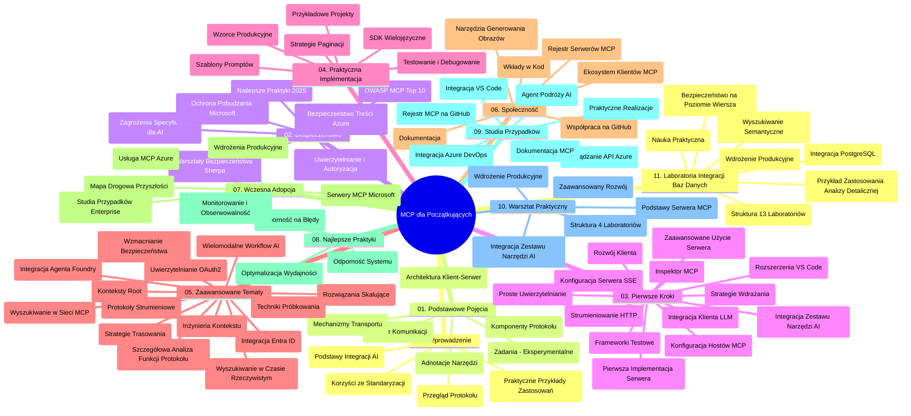

# Model Context Protocol (MCP) dla początkujących - przewodnik nauki

Ten przewodnik nauki zawiera przegląd struktury i zawartości repozytorium dla kursu "Model Context Protocol (MCP) dla początkujących". Użyj tego przewodnika, aby efektywnie poruszać się po repozytorium i w pełni wykorzystać dostępne zasoby.

## Przegląd repozytorium

Model Context Protocol (MCP) to standardowy framework do interakcji między modelami AI a aplikacjami klienckimi. Początkowo stworzony przez Anthropic, MCP jest obecnie utrzymywany przez szerszą społeczność MCP poprzez oficjalną organizację na GitHub. To repozytorium oferuje kompleksowy program nauczania z praktycznymi przykładami kodu w C#, Java, JavaScript, Python oraz TypeScript, zaprojektowany dla deweloperów AI, architektów systemów i inżynierów oprogramowania.

## Wizualna mapa programu nauczania

## Struktura repozytorium

Repozytorium jest zorganizowane w jedenaście głównych sekcji, z których każda skupia się na różnych aspektach MCP:

1. **Wprowadzenie (00-Introduction/)**
   - Przegląd Model Context Protocol
   - Dlaczego standaryzacja ma znaczenie w pipeline'ach AI
   - Praktyczne zastosowania i korzyści

2. **Podstawowe pojęcia (01-CoreConcepts/)**
   - Architektura klient-serwer
   - Kluczowe elementy protokołu
   - Wzorce przesyłania wiadomości w MCP

3. **Bezpieczeństwo (02-Security/)**
   - Zagrożenia bezpieczeństwa w systemach opartych na MCP
   - Najlepsze praktyki zabezpieczania implementacji
   - Strategie uwierzytelniania i autoryzacji
   - **Obszerna dokumentacja bezpieczeństwa**:
     - Najlepsze praktyki bezpieczeństwa MCP 2025
     - Przewodnik po implementacji Azure Content Safety
     - Kontrole i techniki bezpieczeństwa MCP
     - Szybka ściąga najlepszych praktyk MCP
   - **Kluczowe tematy bezpieczeństwa**:
     - Ataki polegające na wstrzykiwaniu promptów i zatruwaniu narzędzi
     - Przejęcie sesji i problemy z „confused deputy”
     - Luki związane z przekazywaniem tokenów
     - Nadmierne uprawnienia i kontrola dostępu
     - Bezpieczeństwo łańcucha dostaw komponentów AI
     - Integracja Microsoft Prompt Shields

4. **Pierwsze kroki (03-GettingStarted/)**
   - Konfiguracja środowiska
   - Tworzenie podstawowych serwerów i klientów MCP
   - Integracja z istniejącymi aplikacjami
   - Sekcje obejmujące:
     - Pierwsza implementacja serwera
     - Rozwój klienta
     - Integracja klienta LLM
     - Integracja z VS Code
     - Serwer Server-Sent Events (SSE)
     - Zaawansowane użycie serwera
     - Strumieniowanie HTTP
     - Integracja z AI Toolkit
     - Strategie testowania
     - Wytyczne do wdrożenia

5. **Praktyczna implementacja (04-PracticalImplementation/)**
   - Używanie SDK w różnych językach programowania
   - Techniki debugowania, testowania i walidacji
   - Tworzenie wielokrotnego użytku szablonów promptów i przepływów pracy
   - Przykładowe projekty z przykładami implementacji

6. **Tematy zaawansowane (05-AdvancedTopics/)**
   - Techniki inżynierii kontekstu
   - Integracja agenta Foundry
   - Wielomodalne przepływy AI
   - Demos uwierzytelniania OAuth2
   - Wyszukiwanie w czasie rzeczywistym
   - Strumieniowanie w czasie rzeczywistym
   - Implementacja root contextów
   - Strategie routingu
   - Techniki próbkowania
   - Metody skalowania
   - Rozważania dotyczące bezpieczeństwa
   - Integracja zabezpieczeń Entra ID
   - Integracja wyszukiwania internetowego

7. **Wkład społeczności (06-CommunityContributions/)**
   - Jak wnosić wkład do kodu i dokumentacji
   - Współpraca przez GitHub
   - Ulepszenia i opinie napędzane przez społeczność
   - Używanie różnych klientów MCP (Claude Desktop, Cline, VSCode)
   - Praca z popularnymi serwerami MCP, w tym generowaniem obrazów

8. **Lekcje z wczesnej adopcji (07-LessonsfromEarlyAdoption/)**
   - Implementacje w rzeczywistych zastosowaniach i historie sukcesu
   - Budowanie i wdrażanie rozwiązań opartych na MCP
   - Trendy i przyszła mapa drogowa
   - **Przewodnik po serwerach Microsoft MCP**: Kompleksowy przewodnik po 10 produkcyjnych serwerach Microsoft MCP, w tym:
     - Microsoft Learn Docs MCP Server
     - Azure MCP Server (15+ specjalizowanych konektorów)
     - GitHub MCP Server
     - Azure DevOps MCP Server
     - MarkItDown MCP Server
     - SQL Server MCP Server
     - Playwright MCP Server
     - Dev Box MCP Server
     - Azure AI Foundry MCP Server
     - Microsoft 365 Agents Toolkit MCP Server

9. **Najlepsze praktyki (08-BestPractices/)**
   - Optymalizacja wydajności i strojenie
   - Projektowanie odpornych systemów MCP
   - Strategie testowania i odporności

10. **Studia przypadków (09-CaseStudy/)**
    - **Siedem kompleksowych studiów przypadków** pokazujących wszechstronność MCP w różnych scenariuszach:
    - **Azure AI Travel Agents**: Orkiestracja wielu agentów z Azure OpenAI i AI Search
    - **Integracja Azure DevOps**: Automatyzacja procesów workflow z aktualizacjami danych YouTube
    - **Pobieranie dokumentacji w czasie rzeczywistym**: Klient konsolowy Python z strumieniowaniem HTTP
    - **Interaktywny generator planów nauki**: Aplikacja webowa Chainlit z konwersacyjną AI
    - **Dokumentacja w edytorze**: Integracja VS Code z przepływami pracy GitHub Copilot
    - **Zarządzanie API Azure**: Integracja korporacyjnego API z tworzeniem serwera MCP
    - **Rejestr MCP GitHub**: Platforma rozwoju ekosystemu i integracji agentów
    - Przykłady implementacji obejmujące integrację korporacyjną, zwiększanie produktywności deweloperów i rozwój ekosystemu

11. **Warsztaty praktyczne (10-StreamliningAIWorkflowsBuildingAnMCPServerWithAIToolkit/)**
    - Kompleksowe warsztaty praktyczne łączące MCP z AI Toolkit
    - Budowanie inteligentnych aplikacji łączących modele AI z narzędziami rzeczywistymi
    - Praktyczne moduły obejmujące podstawy, tworzenie niestandardowych serwerów i strategie produkcyjnego wdrożenia
    - **Struktura laboratorium**:
      - Laboratorium 1: Podstawy serwera MCP
      - Laboratorium 2: Zaawansowany rozwój serwera MCP
      - Laboratorium 3: Integracja AI Toolkit
      - Laboratorium 4: Produkcyjne wdrożenie i skalowanie
    - Nauka oparta na laboratoriach z instrukcjami krok po kroku

12. **Labs integracji bazy danych serwera MCP (11-MCPServerHandsOnLabs/)**
    - **Kompleksowa ścieżka uczenia się z 13 laboratoriami** do budowy produkcyjnych serwerów MCP z integracją PostgreSQL
    - **Implementacja analityki retail w realnym świecie** na przykładzie przypadku użycia Zava Retail
    - **Wzorce korporacyjne** obejmujące Row Level Security (RLS), wyszukiwanie semantyczne i wielosenantowy dostęp do danych
    - **Pełna struktura laboratoriów**:
      - **Laboratoria 00-03: Fundamenty** - Wprowadzenie, Architektura, Bezpieczeństwo, Konfiguracja środowiska
      - **Laboratoria 04-06: Budowa serwera MCP** - Projekt bazy danych, implementacja serwera MCP, rozwój narzędzi
      - **Laboratoria 07-09: Funkcje zaawansowane** - Wyszukiwanie semantyczne, testowanie i debugowanie, integracja z VS Code
      - **Laboratoria 10-12: Produkcja i najlepsze praktyki** - Wdrożenie, monitorowanie, optymalizacja
    - **Technologie**: framework FastMCP, PostgreSQL, Azure OpenAI, Azure Container Apps, Application Insights
    - **Efekty nauczania**: produkcyjne serwery MCP, wzorce integracji baz danych, analizowanie wspomagane AI, bezpieczeństwo korporacyjne

## Dodatkowe zasoby

Repozytorium zawiera zasoby wspierające:

- **Folder Images**: Zawiera diagramy i ilustracje używane w całym programie nauczania
- **Tłumaczenia**: Wsparcie wielojęzyczne z automatycznymi tłumaczeniami dokumentacji
- **Oficjalne zasoby MCP**:
  - [MCP Documentation](https://modelcontextprotocol.io/)
  - [MCP Specification](https://spec.modelcontextprotocol.io/)
  - [MCP GitHub Repository](https://github.com/modelcontextprotocol)

## Jak używać tego repozytorium

1. **Nauka sekwencyjna**: Przechodź przez rozdziały po kolei (od 00 do 11) dla uporządkowanej nauki.
2. **Skupienie na konkretnym języku**: Jeśli interesuje Cię konkretny język programowania, eksploruj katalogi sample dla implementacji w wybranym języku.
3. **Praktyczna implementacja**: Zacznij od sekcji "Pierwsze kroki", aby skonfigurować środowisko i stworzyć pierwszy serwer i klient MCP.
4. **Zaawansowane zgłębianie**: Po opanowaniu podstaw przejdź do tematów zaawansowanych, by rozszerzyć wiedzę.
5. **Zaangażowanie społeczności**: Dołącz do społeczności MCP poprzez dyskusje na GitHub i kanały Discord, aby łączyć się z ekspertami i innymi deweloperami.

## Klienci i narzędzia MCP

Program nauczania obejmuje różne klientów i narzędzia MCP:

1. **Oficjalni klienci**:
   - Visual Studio Code 
   - MCP w Visual Studio Code
   - Claude Desktop
   - Claude w VSCode 
   - Claude API

2. **Klienci społecznościowi**:
   - Cline (terminalowy)
   - Cursor (edytor kodu)
   - ChatMCP
   - Windsurf

3. **Narzędzia zarządzające MCP**:
   - MCP CLI
   - MCP Manager
   - MCP Linker
   - MCP Router

## Popularne serwery MCP

Repozytorium przedstawia różne serwery MCP, w tym:

1. **Oficjalne serwery Microsoft MCP**:
   - Microsoft Learn Docs MCP Server
   - Azure MCP Server (15+ specjalizowanych konektorów)
   - GitHub MCP Server
   - Azure DevOps MCP Server
   - MarkItDown MCP Server
   - SQL Server MCP Server
   - Playwright MCP Server
   - Dev Box MCP Server
   - Azure AI Foundry MCP Server
   - Microsoft 365 Agents Toolkit MCP Server

2. **Oficjalne serwery referencyjne**:
   - Filesystem
   - Fetch
   - Memory
   - Sequential Thinking

3. **Generowanie obrazów**:
   - Azure OpenAI DALL-E 3
   - Stable Diffusion WebUI
   - Replicate

4. **Narzędzia deweloperskie**:
   - Git MCP
   - Terminal Control
   - Code Assistant

5. **Serwery specjalistyczne**:
   - Salesforce
   - Microsoft Teams
   - Jira & Confluence

## Wkład w projekt

To repozytorium zaprasza społeczność do współpracy. Zobacz sekcję Wkład społeczności, aby poznać wskazówki, jak efektywnie współtworzyć ekosystem MCP.

----

*Ten przewodnik nauki został ostatnio zaktualizowany 5 lutego 2026 r., uwzględniając najnowszą specyfikację MCP 2025-11-25 oraz przedstawia stan repozytorium na ten dzień. Zawartość repozytorium może być aktualizowana po tej dacie.*

---

<!-- CO-OP TRANSLATOR DISCLAIMER START -->
**Zastrzeżenie**:  
Niniejszy dokument został przetłumaczony za pomocą usługi tłumaczeń AI [Co-op Translator](https://github.com/Azure/co-op-translator). Chociaż dążymy do dokładności, prosimy mieć na uwadze, że tłumaczenia automatyczne mogą zawierać błędy lub nieścisłości. Oryginalny dokument w języku źródłowym powinien być traktowany jako wiarygodne źródło informacji. W przypadku informacji krytycznych zalecane jest skorzystanie z profesjonalnego tłumaczenia wykonanego przez człowieka. Nie ponosimy odpowiedzialności za jakiekolwiek nieporozumienia lub błędną interpretację wynikającą z korzystania z tego tłumaczenia.
<!-- CO-OP TRANSLATOR DISCLAIMER END -->