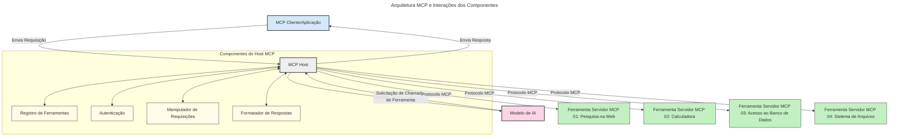

# Introdução ao Protocolo de Contexto do Modelo (MCP): Por Que Ele Importa para Aplicações de IA Escaláveis

[](https://youtu.be/agBbdiOPLQA)

_(Clique na imagem acima para assistir ao vídeo desta lição)_

Aplicações de IA generativa representam um grande avanço, pois frequentemente permitem que o usuário interaja com o aplicativo usando comandos em linguagem natural. No entanto, à medida que mais tempo e recursos são investidos nessas aplicações, você quer garantir que seja fácil integrar funcionalidades e recursos de modo que seja simples estender, que seu aplicativo possa atender a mais de um modelo sendo utilizado, e gerenciar as diversas complexidades dos modelos. Em resumo, construir aplicações de IA generativa é fácil de começar, mas à medida que crescem e se tornam mais complexas, é necessário começar a definir uma arquitetura e provavelmente depender de um padrão para garantir que seus aplicativos sejam construídos de forma consistente. É aqui que o MCP entra para organizar as coisas e fornecer um padrão.

---

## **🔍 O que é o Protocolo de Contexto do Modelo (MCP)?**

O **Protocolo de Contexto do Modelo (MCP)** é uma **interface padronizada e aberta** que permite que Grandes Modelos de Linguagem (LLMs) interajam perfeitamente com ferramentas externas, APIs e fontes de dados. Ele fornece uma arquitetura consistente para aprimorar a funcionalidade do modelo de IA além dos seus dados de treinamento, possibilitando sistemas de IA mais inteligentes, escaláveis e responsivos.

---

## **🎯 Por Que a Padronização em IA é Importante**

À medida que as aplicações de IA generativa se tornam mais complexas, é essencial adotar padrões que garantam **escalabilidade, extensibilidade, manutenção** e **evitem o aprisionamento ao fornecedor**. O MCP atende a essas necessidades ao:

- Unificar integrações modelo-ferramenta
- Reduzir soluções personalizadas frágeis e pontuais
- Permitir que múltiplos modelos de diferentes fornecedores coexistam dentro de um único ecossistema

**Nota:** Embora o MCP se autodenomine um padrão aberto, não há planos para padronizá-lo através de órgãos de padronização existentes como IEEE, IETF, W3C, ISO ou qualquer outro órgão.

---

## **📚 Objetivos de Aprendizagem**

Ao final deste artigo, você será capaz de:

- Definir o **Protocolo de Contexto do Modelo (MCP)** e seus casos de uso
- Entender como o MCP padroniza a comunicação modelo-ferramenta
- Identificar os componentes principais da arquitetura MCP
- Explorar aplicações práticas do MCP em contextos empresariais e de desenvolvimento

---

## **💡 Por Que o Protocolo de Contexto do Modelo (MCP) é um Marco**

### **🔗 MCP Resolve a Fragmentação nas Interações de IA**

Antes do MCP, integrar modelos com ferramentas exigia:

- Código personalizado para cada par modelo-ferramenta
- APIs não padronizadas para cada fornecedor
- Quebras frequentes devido a atualizações
- Baixa escalabilidade conforme mais ferramentas eram adicionadas

### **✅ Benefícios da Padronização MCP**

| **Benefício**           | **Descrição**                                                                 |
|-------------------------|-------------------------------------------------------------------------------|
| Interoperabilidade       | LLMs funcionam perfeitamente com ferramentas de diferentes fornecedores       |
| Consistência            | Comportamento uniforme entre plataformas e ferramentas                        |
| Reutilização            | Ferramentas construídas uma vez podem ser usadas em vários projetos e sistemas|
| Desenvolvimento Ágil    | Redução do tempo de desenvolvimento usando interfaces padronizadas plug-and-play|

---

## **🧱 Visão Geral da Arquitetura MCP de Alto Nível**

O MCP segue um **modelo cliente-servidor**, onde:

- **Hosts MCP** executam os modelos de IA
- **Clientes MCP** iniciam solicitações
- **Servidores MCP** fornecem contexto, ferramentas e capacidades

### **Componentes Principais:**

- **Recursos** – Dados estáticos ou dinâmicos para os modelos  
- **Prompts** – Fluxos de trabalho pré-definidos para geração guiada  
- **Ferramentas** – Funções executáveis como busca, cálculos  
- **Amostragem** – Comportamento agente via interações recursivas  
- **Elicitação** – Solicitações iniciadas pelo servidor para entrada do usuário  
- **Roots** – Limites de sistema de arquivos para controle de acesso do servidor  

### **Arquitetura do Protocolo:**

O MCP utiliza uma arquitetura em duas camadas:
- **Camada de Dados**: Comunicação baseada em JSON-RPC 2.0 com gerenciamento de ciclo de vida e primitivas
- **Camada de Transporte**: Comunicação via STDIO (local) e HTTP Streamable com SSE (remoto)

---

## Como Funcionam os Servidores MCP

Os servidores MCP operam da seguinte maneira:

- **Fluxo da Solicitação**:
    1. Uma solicitação é iniciada por um usuário final ou software atuando em seu nome.
    2. O **Cliente MCP** envia a solicitação para um **Host MCP**, que gerencia o tempo de execução do Modelo de IA.
    3. O **Modelo de IA** recebe o prompt do usuário e pode solicitar acesso a ferramentas externas ou dados por meio de uma ou mais chamadas de ferramentas.
    4. O **Host MCP**, e não o modelo diretamente, comunica-se com os **Servidores MCP** apropriados usando o protocolo padronizado.
- **Funcionalidade do Host MCP**:
    - **Registro de Ferramentas**: Mantém um catálogo das ferramentas disponíveis e suas capacidades.
    - **Autenticação**: Verifica permissões para acesso às ferramentas.
    - **Manipulador de Solicitações**: Processa solicitações de ferramentas provenientes do modelo.
    - **Formatador de Respostas**: Estrutura a saída das ferramentas em um formato compreensível para o modelo.
- **Execução do Servidor MCP**:
    - O **Host MCP** direciona as chamadas de ferramenta para um ou mais **Servidores MCP**, cada um expondo funções especializadas (ex: busca, cálculos, consultas a banco de dados).
    - Os **Servidores MCP** executam suas operações respectivas e retornam os resultados ao **Host MCP** em formato consistente.
    - O **Host MCP** formata e encaminha esses resultados para o **Modelo de IA**.
- **Conclusão da Resposta**:
    - O **Modelo de IA** incorpora as saídas das ferramentas em uma resposta final.
    - O **Host MCP** envia essa resposta de volta para o **Cliente MCP**, que a entrega ao usuário final ou software solicitante.
    


## 👨‍💻 Como Construir um Servidor MCP (Com Exemplos)

Servidores MCP permitem estender as capacidades dos LLMs provendo dados e funcionalidades.

Pronto para experimentar? Aqui estão SDKs específicos por linguagem e/ou stack com exemplos de criação de servidores MCP simples em diferentes linguagens/stacks:

- **SDK Python**: https://github.com/modelcontextprotocol/python-sdk

- **SDK TypeScript**: https://github.com/modelcontextprotocol/typescript-sdk

- **SDK Java**: https://github.com/modelcontextprotocol/java-sdk

- **SDK C#/.NET**: https://github.com/modelcontextprotocol/csharp-sdk


## 🌍 Casos de Uso Reais para MCP

O MCP possibilita uma ampla gama de aplicações estendendo as capacidades da IA:

| **Aplicação**               | **Descrição**                                                                   |
|-----------------------------|---------------------------------------------------------------------------------|
| Integração de Dados Corporativos | Conecta LLMs a bancos de dados, CRMs ou ferramentas internas                   |
| Sistemas Autônomos de IA     | Permite agentes autônomos com acesso a ferramentas e fluxos de decisão          |
| Aplicações Multimodais       | Combina ferramentas de texto, imagem e áudio numa única aplicação unificada de IA |
| Integração de Dados em Tempo Real | Traz dados ao vivo para interações de IA garantindo saídas mais precisas e atuais|

### 🧠 MCP = Padrão Universal para Interações de IA

O Protocolo de Contexto do Modelo (MCP) funciona como um padrão universal para interações de IA, assim como o USB-C padronizou conexões físicas para dispositivos. No mundo da IA, o MCP fornece uma interface consistente, permitindo que modelos (clientes) se integrem perfeitamente com ferramentas externas e provedores de dados (servidores). Isso elimina a necessidade de múltiplos protocolos personalizados para cada API ou fonte de dados.

Sob o MCP, uma ferramenta compatível (referida como servidor MCP) segue um padrão unificado. Esses servidores podem listar as ferramentas ou ações que oferecem e executar essas ações quando solicitadas por um agente de IA. Plataformas de agentes de IA que suportam MCP são capazes de descobrir as ferramentas disponíveis dos servidores e invocá-las por meio desse protocolo padrão.

### 💡 Facilita o acesso ao conhecimento

Além de oferecer ferramentas, o MCP também facilita o acesso ao conhecimento. Ele permite que aplicações forneçam contexto aos grandes modelos de linguagem (LLMs) conectando-os a diversas fontes de dados. Por exemplo, um servidor MCP pode representar um repositório documental de uma empresa, permitindo que agentes recuperem informações relevantes sob demanda. Outro servidor poderia lidar com ações específicas, como enviar e-mails ou atualizar registros. Na perspectiva do agente, essas são simplesmente ferramentas que ele pode usar — algumas retornam dados (contexto de conhecimento), enquanto outras executam ações. O MCP gerencia ambos eficientemente.

Um agente conectado a um servidor MCP aprende automaticamente as capacidades disponíveis do servidor e os dados acessíveis por meio de um formato padrão. Essa padronização possibilita a disponibilidade dinâmica de ferramentas. Por exemplo, adicionar um novo servidor MCP ao sistema de um agente torna suas funções imediatamente utilizáveis sem necessidade de novas customizações nas instruções do agente.

Essa integração simplificada alinha-se ao fluxo representado no diagrama a seguir, onde servidores fornecem tanto ferramentas quanto conhecimento, garantindo colaboração fluida entre sistemas.

### 👉 Exemplo: Solução de Agente Escalável

```mermaid
---
title: Solução de Agente Escalável com MCP
description: Um diagrama ilustrando como um usuário interage com um LLM que se conecta a múltiplos servidores MCP, com cada servidor oferecendo tanto conhecimento quanto ferramentas, criando uma arquitetura de sistema de IA escalável
---
graph TD
    User -->|Prompt| LLM
    LLM -->|Resposta| User
    LLM -->|MCP| ServerA
    LLM -->|MCP| ServerB
    ServerA -->|Conector universal| ServerB
    ServerA --> ConhecimentoA
    ServerA --> FerramentasA
    ServerB --> ConhecimentoB
    ServerB --> FerramentasB

    subgraph Server A
        ConhecimentoA[Conhecimento]
        FerramentasA[Ferramentas]
    end

    subgraph Server B
        ConhecimentoB[Conhecimento]
        FerramentasB[Ferramentas]
    end
```O Universal Connector permite que servidores MCP comuniquem-se e compartilhem capacidades entre si, permitindo que o ServerA delegue tarefas ao ServerB ou acesse suas ferramentas e conhecimento. Isso federar ferramentas e dados entre servidores, apoiando arquiteturas de agentes moduláveis e escaláveis. Porque o MCP padroniza a exposição das ferramentas, agentes podem descobrir dinamicamente e encaminhar solicitações entre servidores sem integrações codificadas diretamente.

Federação de ferramentas e conhecimento: Ferramentas e dados podem ser acessados entre servidores, viabilizando arquiteturas agentic moduláveis e mais escaláveis.

### 🔄 Cenários Avançados do MCP com Integração de LLM no Lado do Cliente

Além da arquitetura básica do MCP, existem cenários avançados onde tanto o cliente quanto o servidor possuem LLMs, permitindo interações mais sofisticadas. No diagrama a seguir, o **App Cliente** poderia ser um IDE com diversas ferramentas MCP disponíveis para uso pelo LLM:

```mermaid
---
title: Cenários Avançados MCP com Integração LLM Cliente-Servidor
description: Um diagrama de sequência mostrando o fluxo detalhado de interação entre usuário, aplicativo cliente, LLM cliente, múltiplos servidores MCP e LLM servidor, ilustrando descoberta de ferramentas, interação do usuário, chamada direta de ferramentas e fases de negociação de recursos
---
sequenceDiagram
    autonumber
    actor User as 👤 Usuário
    participant ClientApp as 🖥️ App Cliente
    participant ClientLLM as 🧠 LLM Cliente
    participant Server1 as 🔧 Servidor MCP 1
    participant Server2 as 📚 Servidor MCP 2
    participant ServerLLM as 🤖 LLM Servidor
    
    %% Discovery Phase
    rect rgb(220, 240, 255)
        Note over ClientApp, Server2: FASE DE DESCOBERTA DE FERRAMENTAS
        ClientApp->>+Server1: Solicitar ferramentas/recursos disponíveis
        Server1-->>-ClientApp: Retornar lista de ferramentas (JSON)
        ClientApp->>+Server2: Solicitar ferramentas/recursos disponíveis
        Server2-->>-ClientApp: Retornar lista de ferramentas (JSON)
        Note right of ClientApp: Armazenar catálogo<br/>combinado de ferramentas localmente
    end
    
    %% User Interaction
    rect rgb(255, 240, 220)
        Note over User, ClientLLM: FASE DE INTERAÇÃO DO USUÁRIO
        User->>+ClientApp: Inserir comando em linguagem natural
        ClientApp->>+ClientLLM: Encaminhar comando + catálogo de ferramentas
        ClientLLM->>-ClientLLM: Analisar comando & selecionar ferramentas
    end
    
    %% Scenario A: Direct Tool Calling
    alt Chamada Direta de Ferramenta
        rect rgb(220, 255, 220)
            Note over ClientApp, Server1: CENÁRIO A: CHAMADA DIRETA DE FERRAMENTA
            ClientLLM->>+ClientApp: Solicitar execução da ferramenta
            ClientApp->>+Server1: Executar ferramenta específica
            Server1-->>-ClientApp: Retornar resultados
            ClientApp->>+ClientLLM: Processar resultados
            ClientLLM-->>-ClientApp: Gerar resposta
            ClientApp-->>-User: Exibir resposta final
        end
    
    %% Scenario B: Feature Negotiation (VS Code style)
    else Negociação de Recursos (estilo VS Code)
        rect rgb(255, 220, 220)
            Note over ClientApp, ServerLLM: CENÁRIO B: NEGOCIAÇÃO DE RECURSOS
            ClientLLM->>+ClientApp: Identificar capacidades necessárias
            ClientApp->>+Server2: Negociar recursos/capacidades
            Server2->>+ServerLLM: Solicitar contexto adicional
            ServerLLM-->>-Server2: Fornecer contexto
            Server2-->>-ClientApp: Retornar recursos disponíveis
            ClientApp->>+Server2: Chamar ferramentas negociadas
            Server2-->>-ClientApp: Retornar resultados
            ClientApp->>+ClientLLM: Processar resultados
            ClientLLM-->>-ClientApp: Gerar resposta
            ClientApp-->>-User: Exibir resposta final
        end
    end
```
## 🔐 Benefícios Práticos do MCP

Aqui estão os benefícios práticos do uso do MCP:

- **Atualização**: Modelos podem acessar informações atualizadas além dos dados de treinamento
- **Extensão de Capacidades**: Modelos podem aproveitar ferramentas especializadas para tarefas para as quais não foram treinados
- **Redução de Alucinações**: Fontes externas de dados fornecem base factual
- **Privacidade**: Dados sensíveis podem permanecer em ambientes seguros ao invés de serem embutidos nos prompts

## 📌 Principais Conclusões

As principais conclusões para o uso do MCP são:

- O **MCP** padroniza como modelos de IA interagem com ferramentas e dados
- Promove **extensibilidade, consistência e interoperabilidade**
- O MCP ajuda a **reduzir tempo de desenvolvimento, melhorar a confiabilidade e ampliar capacidades do modelo**
- A arquitetura cliente-servidor **permite aplicações de IA flexíveis e extensíveis**

## 🧠 Exercício

Pense em uma aplicação de IA que você deseja construir.

- Quais **ferramentas externas ou dados** poderiam melhorar suas capacidades?
- Como o MCP poderia tornar a integração **mais simples e confiável?**

## Recursos Adicionais

- [Repositório MCP no GitHub](https://github.com/modelcontextprotocol)


## O que vem a seguir

Próximo: [Capítulo 1: Conceitos Básicos](../01-CoreConcepts/README.md)

---

<!-- CO-OP TRANSLATOR DISCLAIMER START -->
**Aviso Legal**:  
Este documento foi traduzido utilizando o serviço de tradução por IA [Co-op Translator](https://github.com/Azure/co-op-translator). Embora nos esforcemos para alcançar precisão, esteja ciente de que traduções automáticas podem conter erros ou imprecisões. O documento original em seu idioma nativo deve ser considerado a fonte autorizada. Para informações críticas, recomenda-se tradução profissional feita por humanos. Não nos responsabilizamos por quaisquer mal-entendidos ou interpretações incorretas decorrentes do uso desta tradução.
<!-- CO-OP TRANSLATOR DISCLAIMER END -->