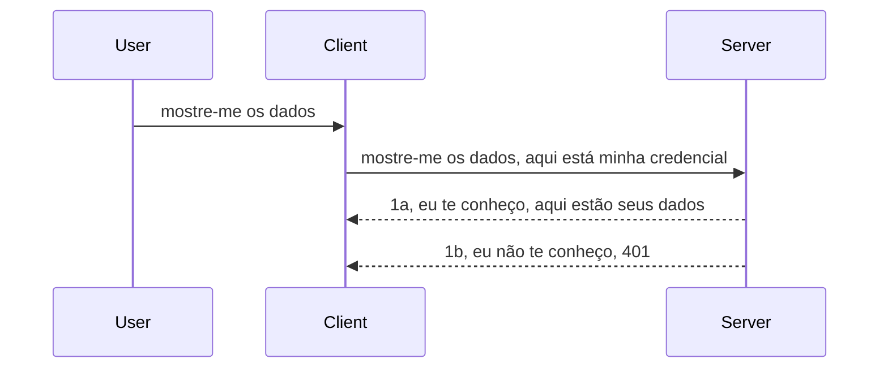

# Autenticação simples

Os SDKs MCP suportam o uso do OAuth 2.1 que, para ser justo, é um processo bem envolvido envolvendo conceitos como servidor de autenticação, servidor de recursos, envio de credenciais, obtenção de um código, troca do código por um token bearer até finalmente conseguir os dados do recurso. Se você não está acostumado com OAuth, que é uma ótima coisa para implementar, é uma boa ideia começar com um nível básico de autenticação e evoluir para uma segurança cada vez melhor. É por isso que este capítulo existe, para prepará-lo para autenticações mais avançadas.

## Autenticação, o que queremos dizer?

Auth é abreviação de autenticação e autorização. A ideia é que precisamos fazer duas coisas:

- **Autenticação**, que é o processo de descobrir se devemos deixar uma pessoa entrar em nossa casa, se ela tem o direito de estar "aqui", ou seja, ter acesso ao nosso servidor de recursos onde vivem as funcionalidades do nosso Servidor MCP.
- **Autorização**, é o processo de descobrir se um usuário deve ter acesso a esses recursos específicos que ele está pedindo, por exemplo, esses pedidos ou esses produtos, ou se ele pode ler o conteúdo mas não deletar, como outro exemplo.

## Credenciais: como dizemos ao sistema quem somos

Bem, a maioria dos desenvolvedores web pensa em termos de fornecer uma credencial para o servidor, geralmente um segredo que diz se podem ou não estar aqui "Autenticação". Essa credencial geralmente é uma versão codificada em base64 de nome de usuário e senha ou uma chave API que identifica de forma única um usuário específico.

Isso envolve enviá-la via um cabeçalho chamado "Authorization", assim:

```json
{ "Authorization": "secret123" }
```

Isso geralmente é chamado de autenticação básica. O fluxo geral então funciona da seguinte forma:


Agora que entendemos como funciona do ponto de vista do fluxo, como implementamos isso? Bem, a maioria dos servidores web tem um conceito chamado middleware, um pedaço de código que roda como parte da requisição que pode verificar credenciais, e se as credenciais forem válidas, deixa a requisição passar. Se a requisição não tem credenciais válidas, você recebe um erro de autenticação. Vamos ver como isso pode ser implementado:

**Python**

```python
class AuthMiddleware(BaseHTTPMiddleware):
    async def dispatch(self, request, call_next):

        has_header = request.headers.get("Authorization")
        if not has_header:
            print("-> Missing Authorization header!")
            return Response(status_code=401, content="Unauthorized")

        if not valid_token(has_header):
            print("-> Invalid token!")
            return Response(status_code=403, content="Forbidden")

        print("Valid token, proceeding...")
       
        response = await call_next(request)
        # adicione quaisquer cabeçalhos de cliente ou altere a resposta de alguma forma
        return response


starlette_app.add_middleware(CustomHeaderMiddleware)
```

Aqui temos: 

- Criado um middleware chamado `AuthMiddleware` onde seu método `dispatch` é invocado pelo servidor web.
- Adicionado o middleware ao servidor web:

    ```python
    starlette_app.add_middleware(AuthMiddleware)
    ```

- Escrito uma lógica de validação que verifica se o cabeçalho Authorization está presente e se o segredo enviado é válido:

    ```python
    has_header = request.headers.get("Authorization")
    if not has_header:
        print("-> Missing Authorization header!")
        return Response(status_code=401, content="Unauthorized")

    if not valid_token(has_header):
        print("-> Invalid token!")
        return Response(status_code=403, content="Forbidden")
    ```

    se o segredo estiver presente e válido, deixamos a requisição passar chamando `call_next` e retornamos a resposta.

    ```python
    response = await call_next(request)
    # adicione quaisquer cabeçalhos do cliente ou modifique a resposta de alguma forma
    return response
    ```

Como funciona é que, se um pedido web for feito ao servidor, o middleware será invocado e dado sua implementação, ele ou deixará a requisição passar ou terminará retornando um erro indicando que o cliente não tem permissão para continuar.

**TypeScript**

Aqui criamos um middleware com o popular framework Express e interceptamos a requisição antes dela chegar ao Servidor MCP. Aqui está o código para isso:

```typescript
function isValid(secret) {
    return secret === "secret123";
}

app.use((req, res, next) => {
    // 1. Cabeçalho de autorização presente?
    if(!req.headers["Authorization"]) {
        res.status(401).send('Unauthorized');
    }
    
    let token = req.headers["Authorization"];

    // 2. Verificar validade.
    if(!isValid(token)) {
        res.status(403).send('Forbidden');
    }

   
    console.log('Middleware executed');
    // 3. Passa a requisição para a próxima etapa no fluxo de requisição.
    next();
});
```

Neste código nós:

1. Verificamos se o cabeçalho Authorization está presente, se não, enviamos um erro 401.
2. Garantimos que a credencial/token seja válido, se não, enviamos um erro 403.
3. Finalmente, passamos a requisição no pipeline e retornamos o recurso solicitado.

## Exercício: Implementar autenticação

Vamos pegar nosso conhecimento e tentar implementar. Aqui está o plano:

Servidor

- Criar um servidor web e uma instância MCP.
- Implementar um middleware para o servidor.

Cliente

- Enviar requisição web com credencial via cabeçalho.

### -1- Criar um servidor web e uma instância MCP

Em nossa primeira etapa, precisamos criar a instância do servidor web e o Servidor MCP.

**Python**

Aqui criamos uma instância do servidor MCP, criamos um app starlette web e hospedamos ele com uvicorn.

```python
# criando servidor MCP

app = FastMCP(
    name="MCP Resource Server",
    instructions="Resource Server that validates tokens via Authorization Server introspection",
    host=settings["host"],
    port=settings["port"],
    debug=True
)

# criando aplicação web starlette
starlette_app = app.streamable_http_app()

# servindo aplicação via uvicorn
async def run(starlette_app):
    import uvicorn
    config = uvicorn.Config(
            starlette_app,
            host=app.settings.host,
            port=app.settings.port,
            log_level=app.settings.log_level.lower(),
        )
    server = uvicorn.Server(config)
    await server.serve()

run(starlette_app)
```

Neste código nós:

- Criamos o Servidor MCP.
- Construímos o app starlette web a partir do Servidor MCP, `app.streamable_http_app()`.
- Hospedamos e servimos o app web usando uvicorn `server.serve()`.

**TypeScript**

Aqui criamos uma instância do Servidor MCP.

```typescript
const server = new McpServer({
      name: "example-server",
      version: "1.0.0"
    });

    // ... configurar recursos do servidor, ferramentas e prompts ...
```

Essa criação do Servidor MCP precisará acontecer dentro da definição da rota POST /mcp, então vamos pegar o código acima e movê-lo assim:

```typescript
import express from "express";
import { randomUUID } from "node:crypto";
import { McpServer } from "@modelcontextprotocol/sdk/server/mcp.js";
import { StreamableHTTPServerTransport } from "@modelcontextprotocol/sdk/server/streamableHttp.js";
import { isInitializeRequest } from "@modelcontextprotocol/sdk/types.js"

const app = express();
app.use(express.json());

// Mapa para armazenar transportes por ID de sessão
const transports: { [sessionId: string]: StreamableHTTPServerTransport } = {};

// Lida com requisições POST para comunicação cliente-servidor
app.post('/mcp', async (req, res) => {
  // Verificar ID de sessão existente
  const sessionId = req.headers['mcp-session-id'] as string | undefined;
  let transport: StreamableHTTPServerTransport;

  if (sessionId && transports[sessionId]) {
    // Reutilizar transporte existente
    transport = transports[sessionId];
  } else if (!sessionId && isInitializeRequest(req.body)) {
    // Nova requisição de inicialização
    transport = new StreamableHTTPServerTransport({
      sessionIdGenerator: () => randomUUID(),
      onsessioninitialized: (sessionId) => {
        // Armazenar o transporte pelo ID da sessão
        transports[sessionId] = transport;
      },
      // A proteção contra DNS rebinding está desativada por padrão para compatibilidade retroativa. Se você estiver executando este servidor
      // localmente, certifique-se de definir:
      // enableDnsRebindingProtection: true,
      // allowedHosts: ['127.0.0.1'],
    });

    // Limpar transporte quando fechado
    transport.onclose = () => {
      if (transport.sessionId) {
        delete transports[transport.sessionId];
      }
    };
    const server = new McpServer({
      name: "example-server",
      version: "1.0.0"
    });

    // ... configurar recursos, ferramentas e prompts do servidor ...

    // Conectar ao servidor MCP
    await server.connect(transport);
  } else {
    // Requisição inválida
    res.status(400).json({
      jsonrpc: '2.0',
      error: {
        code: -32000,
        message: 'Bad Request: No valid session ID provided',
      },
      id: null,
    });
    return;
  }

  // Processar a requisição
  await transport.handleRequest(req, res, req.body);
});

// Manipulador reutilizável para requisições GET e DELETE
const handleSessionRequest = async (req: express.Request, res: express.Response) => {
  const sessionId = req.headers['mcp-session-id'] as string | undefined;
  if (!sessionId || !transports[sessionId]) {
    res.status(400).send('Invalid or missing session ID');
    return;
  }
  
  const transport = transports[sessionId];
  await transport.handleRequest(req, res);
};

// Lidar com requisições GET para notificações servidor-cliente via SSE
app.get('/mcp', handleSessionRequest);

// Lidar com requisições DELETE para encerramento de sessão
app.delete('/mcp', handleSessionRequest);

app.listen(3000);
```

Agora você vê como a criação do Servidor MCP foi movida para dentro de `app.post("/mcp")`.

Vamos passar para a próxima etapa que é criar o middleware para que possamos validar a credencial recebida.

### -2- Implementar um middleware para o servidor

Vamos à parte do middleware agora. Aqui vamos criar um middleware que busca por uma credencial no cabeçalho `Authorization` e a valida. Se for aceitável, a requisição segue para fazer o que precisa (por exemplo, listar ferramentas, ler um recurso ou qualquer funcionalidade MCP pedida pelo cliente).

**Python**

Para criar o middleware, precisamos criar uma classe que herda de `BaseHTTPMiddleware`. Há duas partes interessantes:

- A requisição `request`, da qual lemos as informações do cabeçalho.
- `call_next` o callback que precisamos invocar se o cliente trouxe uma credencial que aceitamos.

Primeiro, precisamos tratar o caso de o cabeçalho `Authorization` não estar presente:

```python
has_header = request.headers.get("Authorization")

# sem cabeçalho presente, falhe com 401, caso contrário prossiga.
if not has_header:
    print("-> Missing Authorization header!")
    return Response(status_code=401, content="Unauthorized")
```

Aqui enviamos uma mensagem 401 unauthorized pois o cliente está falhando na autenticação.

Em seguida, se uma credencial foi submetida, precisamos checar sua validade assim:

```python
 if not valid_token(has_header):
    print("-> Invalid token!")
    return Response(status_code=403, content="Forbidden")
```

Note que enviamos uma mensagem 403 forbidden acima. Vamos ver o middleware completo abaixo implementando tudo que mencionamos:

```python
class AuthMiddleware(BaseHTTPMiddleware):
    async def dispatch(self, request, call_next):

        has_header = request.headers.get("Authorization")
        if not has_header:
            print("-> Missing Authorization header!")
            return Response(status_code=401, content="Unauthorized")

        if not valid_token(has_header):
            print("-> Invalid token!")
            return Response(status_code=403, content="Forbidden")

        print("Valid token, proceeding...")
        print(f"-> Received {request.method} {request.url}")
        response = await call_next(request)
        response.headers['Custom'] = 'Example'
        return response

```

Ótimo, mas e a função `valid_token`? Aqui ela está abaixo:
:

```python
# NÃO use para produção - melhore isso !!
def valid_token(token: str) -> bool:
    # remova o prefixo "Bearer "
    if token.startswith("Bearer "):
        token = token[7:]
        return token == "secret-token"
    return False
```

Claro que isso deve melhorar.

IMPORTANTE: Nunca deve-se ter segredos assim no código. Idealmente deve-se buscar o valor para comparação de uma fonte de dados ou de um IDP (provedor de identidade) ou melhor ainda, deixar o IDP fazer a validação.

**TypeScript**

Para implementar isso com Express, precisamos chamar o método `use` que recebe funções middleware.

Precisamos:

- Interagir com a variável request para checar a credencial passada na propriedade `Authorization`.
- Validar a credencial, e se válida, deixar a requisição continuar e permitir que o pedido MCP do cliente faça o que deveria (ex: listar ferramentas, ler recurso ou outro relacionado ao MCP).

Aqui, checamos se o cabeçalho `Authorization` está presente, e se não estiver, interrompemos a requisição:

```typescript
if(!req.headers["authorization"]) {
    res.status(401).send('Unauthorized');
    return;
}
```

Se o cabeçalho não é enviado, recebe-se um 401.

Depois, verificamos se a credencial é válida, se não for, interrompemos novamente a requisição porém com uma mensagem de erro diferente:

```typescript
if(!isValid(token)) {
    res.status(403).send('Forbidden');
    return;
} 
```

Note que agora você recebe um erro 403.

Aqui o código completo:

```typescript
app.use((req, res, next) => {
    console.log('Request received:', req.method, req.url, req.headers);
    console.log('Headers:', req.headers["authorization"]);
    if(!req.headers["authorization"]) {
        res.status(401).send('Unauthorized');
        return;
    }
    
    let token = req.headers["authorization"];

    if(!isValid(token)) {
        res.status(403).send('Forbidden');
        return;
    }  

    console.log('Middleware executed');
    next();
});
```

Configuramos o servidor web para aceitar um middleware que verifica a credencial que o cliente espera nos enviar. E o cliente?

### -3- Enviar requisição web com credencial via cabeçalho

Precisamos garantir que o cliente está passando a credencial através do cabeçalho. Como vamos usar um cliente MCP para isso, precisamos descobrir como é feito.

**Python**

Para o cliente, precisamos passar um cabeçalho com nossa credencial assim:

```python
# NÃO codifique o valor diretamente, tenha-o no mínimo em uma variável de ambiente ou em um armazenamento mais seguro
token = "secret-token"

async with streamablehttp_client(
        url = f"http://localhost:{port}/mcp",
        headers = {"Authorization": f"Bearer {token}"}
    ) as (
        read_stream,
        write_stream,
        session_callback,
    ):
        async with ClientSession(
            read_stream,
            write_stream
        ) as session:
            await session.initialize()
      
            # TODO, o que você quer que seja feito no cliente, por exemplo listar ferramentas, chamar ferramentas etc.
```

Note que preenchemos a propriedade `headers` assim: `headers = {"Authorization": f"Bearer {token}"}`.

**TypeScript**

Podemos resolver isso em dois passos:

1. Preencher um objeto de configuração com nossa credencial.
2. Passar o objeto de configuração para o transporte.

```typescript

// NÃO codifique o valor diretamente como mostrado aqui. No mínimo, tenha-o como uma variável de ambiente e use algo como dotenv (em modo de desenvolvimento).
let token = "secret123"

// defina um objeto de opções de transporte do cliente
let options: StreamableHTTPClientTransportOptions = {
  sessionId: sessionId,
  requestInit: {
    headers: {
      "Authorization": "secret123"
    }
  }
};

// passe o objeto de opções para o transporte
async function main() {
   const transport = new StreamableHTTPClientTransport(
      new URL(serverUrl),
      options
   );
```

Aqui você vê acima como precisamos criar um objeto `options` e colocar nossos headers dentro da propriedade `requestInit`.

IMPORTANTE: Como melhorar a partir daqui? Bem, a implementação atual tem alguns problemas. Primeiramente, passar uma credencial assim é bem arriscado a menos que você tenha no mínimo HTTPS. Mesmo assim, a credencial pode ser roubada, então você precisa de um sistema onde possa facilmente revogar o token e adicionar verificações adicionais como de onde no mundo ele está vindo, se a requisição acontece com muita frequência (comportamento de bot), em resumo, há uma série de preocupações.

Deve ser dito que, para APIs muito simples onde você não quer que ninguém chame sua API sem estar autenticado, o que temos aqui é um bom começo.

Dito isso, vamos tentar endurecer um pouco a segurança usando um formato padronizado como JSON Web Token, também conhecido como JWT ou tokens "JOT".

## JSON Web Tokens, JWT

Então, estamos tentando melhorar as coisas a partir do uso de credenciais muito simples. Quais são as melhorias imediatas que obtemos adotando JWT?

- **Melhorias de segurança**. Na autenticação básica, você envia o nome de usuário e senha em um token codificado base64 (ou envia uma chave API) repetidamente, o que aumenta o risco. Com JWT, você envia seu nome de usuário e senha e recebe um token em troca, que também tem tempo de validade, ou seja, ele irá expirar. JWT permite usar controle de acesso refinado usando roles, escopos e permissões.
- **Statelessness e escalabilidade**. JWTs são autossuficientes, carregam todas as informações do usuário e eliminam a necessidade de armazenamento de sessão no servidor. O token também pode ser validado localmente.
- **Interoperabilidade e federação**. JWTs são centrais no Open ID Connect e usados com provedores de identidade conhecidos como Entra ID, Google Identity e Auth0. Também possibilitam o uso de single sign on e muito mais, tornando-o de nível empresarial.
- **Modularidade e flexibilidade**. JWTs também podem ser usados com API Gateways como Azure API Management, NGINX e mais. Suportam cenários de autenticação de usuários e comunicação servidor-para-serviço incluindo cenários de personificação e delegação.
- **Performance e cache**. JWTs podem ser cacheados após decodificação, o que reduz a necessidade de análise repetida. Isso ajuda especialmente em apps de alto tráfego, pois melhora o throughput e reduz a carga na infraestrutura escolhida.
- **Recursos avançados**. Também suportam introspecção (verificação da validade no servidor) e revogação (tornar um token inválido).

Com todos esses benefícios, vamos ver como levar nossa implementação para o próximo nível.

## Transformando autenticação básica em JWT

Então, as mudanças que precisamos fazer em alto nível são:

- **Aprender a construir um token JWT** e deixá-lo pronto para ser enviado do cliente para o servidor.
- **Validar um token JWT** e, se válido, permitir que o cliente tenha acesso aos nossos recursos.
- **Armazenamento seguro do token**. Como armazenamos esse token.
- **Proteger as rotas**. Precisamos proteger as rotas, no nosso caso, proteger rotas e funcionalidades específicas do MCP.
- **Adicionar tokens de refresh**. Garantir que criamos tokens de curta duração, mas tokens de refresh de longa duração que podem ser usados para obter novos tokens se expirarem. Garantir também um endpoint de refresh e uma estratégia de rotação.

### -1- Construir um token JWT

Primeiro, um token JWT tem as seguintes partes:

- **header**, o algoritmo usado e tipo do token.
- **payload**, claims, como sub (o usuário ou entidade que o token representa. Em um cenário de autenticação, tipicamente é o userid), exp (quando expira), role (o papel)
- **signature**, assinada com um segredo ou chave privada.

Para isso, precisaremos construir o header, payload e o token codificado.

**Python**

```python

import jwt
import jwt
from jwt.exceptions import ExpiredSignatureError, InvalidTokenError
import datetime

# Chave secreta usada para assinar o JWT
secret_key = 'your-secret-key'

header = {
    "alg": "HS256",
    "typ": "JWT"
}

# as informações do usuário, suas reivindicações e tempo de expiração
payload = {
    "sub": "1234567890",               # Assunto (ID do usuário)
    "name": "User Userson",                # Reivindicação personalizada
    "admin": True,                     # Reivindicação personalizada
    "iat": datetime.datetime.utcnow(),# Emitido em
    "exp": datetime.datetime.utcnow() + datetime.timedelta(hours=1)  # Expiração
}

# codificar isso
encoded_jwt = jwt.encode(payload, secret_key, algorithm="HS256", headers=header)
```

No código acima nós:

- Definimos um header usando HS256 como algoritmo e tipo como JWT.
- Construímos um payload que contém um subject ou user id, um nome de usuário, um role, quando foi emitido e quando irá expirar, implementando o aspecto de tempo limitado que mencionamos.

**TypeScript**

Aqui vamos precisar de algumas dependências que nos ajudarão a construir o token JWT.

Dependências

```sh

npm install jsonwebtoken
npm install --save-dev @types/jsonwebtoken
```

Agora que temos isso, vamos criar o header, payload e através disso criar o token codificado.

```typescript
import jwt from 'jsonwebtoken';

const secretKey = 'your-secret-key'; // Use variáveis de ambiente em produção

// Defina o payload
const payload = {
  sub: '1234567890',
  name: 'User usersson',
  admin: true,
  iat: Math.floor(Date.now() / 1000), // Emitido em
  exp: Math.floor(Date.now() / 1000) + 60 * 60 // Expira em 1 hora
};

// Defina o cabeçalho (opcional, jsonwebtoken define padrões)
const header = {
  alg: 'HS256',
  typ: 'JWT'
};

// Crie o token
const token = jwt.sign(payload, secretKey, {
  algorithm: 'HS256',
  header: header
});

console.log('JWT:', token);
```

Este token é:

Assinado usando HS256
Válido por 1 hora
Inclui claims como sub, name, admin, iat e exp.

### -2- Validar um token

Também precisaremos validar um token, isso é algo que devemos fazer no servidor para garantir que o que o cliente está nos enviando é de fato válido. Há muitas checagens que devemos fazer aqui, desde validar sua estrutura até sua validade. Você também é incentivado a adicionar outras checagens para ver se o usuário está no seu sistema e assim por diante.

Para validar um token, precisamos decodificá-lo para poder ler e começar a checar sua validade:

**Python**

```python

# Decodificar e verificar o JWT
try:
    decoded = jwt.decode(token, secret_key, algorithms=["HS256"])
    print("✅ Token is valid.")
    print("Decoded claims:")
    for key, value in decoded.items():
        print(f"  {key}: {value}")
except ExpiredSignatureError:
    print("❌ Token has expired.")
except InvalidTokenError as e:
    print(f"❌ Invalid token: {e}")

```

Neste código, chamamos `jwt.decode` usando o token, a chave secreta e o algoritmo escolhido como entrada. Note que usamos um bloco try-catch, pois uma validação falha gera um erro.

**TypeScript**

Aqui precisamos chamar `jwt.verify` para obter uma versão decodificada do token que podemos analisar melhor. Se essa chamada falhar, significa que a estrutura do token está incorreta ou não é mais válido.

```typescript

try {
  const decoded = jwt.verify(token, secretKey);
  console.log('Decoded Payload:', decoded);
} catch (err) {
  console.error('Token verification failed:', err);
}
```

NOTA: como mencionado anteriormente, devemos realizar verificações adicionais para garantir que esse token aponta para um usuário no nosso sistema e garantir que o usuário possui os direitos que alega ter.
A seguir, vamos analisar o controle de acesso baseado em função, também conhecido como RBAC.

## Adicionando controle de acesso baseado em função

A ideia é que queremos expressar que diferentes funções têm permissões diferentes. Por exemplo, assumimos que um administrador pode fazer tudo, que um usuário normal pode ler/escrever e que um convidado só pode ler. Portanto, aqui estão alguns níveis de permissão possíveis:

- Admin.Write
- User.Read
- Guest.Read

Vamos ver como podemos implementar esse controle com middleware. Middlewares podem ser adicionados por rota, bem como para todas as rotas.

**Python**

```python
from starlette.middleware.base import BaseHTTPMiddleware
from starlette.responses import JSONResponse
import jwt

# NÃO tenha o segredo no código, este é apenas para fins de demonstração. Leia-o de um local seguro.
SECRET_KEY = "your-secret-key" # coloque isso em uma variável de ambiente
REQUIRED_PERMISSION = "User.Read"

class JWTPermissionMiddleware(BaseHTTPMiddleware):
    async def dispatch(self, request, call_next):
        auth_header = request.headers.get("Authorization")
        if not auth_header or not auth_header.startswith("Bearer "):
            return JSONResponse({"error": "Missing or invalid Authorization header"}, status_code=401)

        token = auth_header.split(" ")[1]
        try:
            decoded = jwt.decode(token, SECRET_KEY, algorithms=["HS256"])
        except jwt.ExpiredSignatureError:
            return JSONResponse({"error": "Token expired"}, status_code=401)
        except jwt.InvalidTokenError:
            return JSONResponse({"error": "Invalid token"}, status_code=401)

        permissions = decoded.get("permissions", [])
        if REQUIRED_PERMISSION not in permissions:
            return JSONResponse({"error": "Permission denied"}, status_code=403)

        request.state.user = decoded
        return await call_next(request)


```

Existem algumas maneiras diferentes de adicionar o middleware como abaixo:

```python

# Alt 1: adicionar middleware enquanto constrói a aplicação starlette
middleware = [
    Middleware(JWTPermissionMiddleware)
]

app = Starlette(routes=routes, middleware=middleware)

# Alt 2: adicionar middleware depois que a aplicação starlette já está construída
starlette_app.add_middleware(JWTPermissionMiddleware)

# Alt 3: adicionar middleware por rota
routes = [
    Route(
        "/mcp",
        endpoint=..., # manipulador
        middleware=[Middleware(JWTPermissionMiddleware)]
    )
]
```

**TypeScript**

Podemos usar `app.use` e um middleware que será executado para todas as requisições.

```typescript
app.use((req, res, next) => {
    console.log('Request received:', req.method, req.url, req.headers);
    console.log('Headers:', req.headers["authorization"]);

    // 1. Verifique se o cabeçalho de autorização foi enviado

    if(!req.headers["authorization"]) {
        res.status(401).send('Unauthorized');
        return;
    }
    
    let token = req.headers["authorization"];

    // 2. Verifique se o token é válido
    if(!isValid(token)) {
        res.status(403).send('Forbidden');
        return;
    }  

    // 3. Verifique se o usuário do token existe em nosso sistema
    if(!isExistingUser(token)) {
        res.status(403).send('Forbidden');
        console.log("User does not exist");
        return;
    }
    console.log("User exists");

    // 4. Verifique se o token possui as permissões corretas
    if(!hasScopes(token, ["User.Read"])){
        res.status(403).send('Forbidden - insufficient scopes');
    }

    console.log("User has required scopes");

    console.log('Middleware executed');
    next();
});

```

Há várias coisas que podemos deixar para nosso middleware e que nosso middleware DEVE fazer, a saber:

1. Verificar se o cabeçalho de autorização está presente
2. Verificar se o token é válido, chamamos `isValid` que é um método que escrevemos para verificar a integridade e validade do token JWT.
3. Verificar se o usuário existe em nosso sistema, devemos checar isso.

   ```typescript
    // usuários no banco de dados
   const users = [
     "user1",
     "User usersson",
   ]

   function isExistingUser(token) {
     let decodedToken = verifyToken(token);

     // TODO, verificar se o usuário existe no banco de dados
     return users.includes(decodedToken?.name || "");
   }
   ```

   Acima, criamos uma lista muito simples de `users`, que obviamente deveria estar em um banco de dados.

4. Além disso, também devemos verificar se o token possui as permissões corretas.

   ```typescript
   if(!hasScopes(token, ["User.Read"])){
        res.status(403).send('Forbidden - insufficient scopes');
   }
   ```

   No código acima do middleware, verificamos que o token contém a permissão User.Read, caso contrário enviamos um erro 403. Abaixo está o método auxiliar `hasScopes`.

   ```typescript
   function hasScopes(scope: string, requiredScopes: string[]) {
     let decodedToken = verifyToken(scope);
    return requiredScopes.every(scope => decodedToken?.scopes.includes(scope));
  }
   ```

Have a think which additional checks you should be doing, but these are the absolute minimum of checks you should be doing.

Using Express as a web framework is a common choice. There are helpers library when you use JWT so you can write less code.

- `express-jwt`, helper library that provides a middleware that helps decode your token.
- `express-jwt-permissions`, this provides a middleware `guard` that helps check if a certain permission is on the token.

Here's what these libraries can look like when used:

```typescript
const express = require('express');
const jwt = require('express-jwt');
const guard = require('express-jwt-permissions')();

const app = express();
const secretKey = 'your-secret-key'; // put this in env variable

// Decode JWT and attach to req.user
app.use(jwt({ secret: secretKey, algorithms: ['HS256'] }));

// Check for User.Read permission
app.use(guard.check('User.Read'));

// multiple permissions
// app.use(guard.check(['User.Read', 'Admin.Access']));

app.get('/protected', (req, res) => {
  res.json({ message: `Welcome ${req.user.name}` });
});

// Error handler
app.use((err, req, res, next) => {
  if (err.code === 'permission_denied') {
    return res.status(403).send('Forbidden');
  }
  next(err);
});

```

Agora que você viu como middleware pode ser usado tanto para autenticação quanto para autorização, e quanto ao MCP, ele muda como fazemos auth? Vamos descobrir na próxima seção.

### -3- Adicionar RBAC ao MCP

Você viu até agora como pode adicionar RBAC via middleware, entretanto, para MCP não há uma maneira fácil de adicionar RBAC por recurso MCP, então o que fazemos? Bem, só precisamos adicionar um código como este que verifica neste caso se o cliente tem direito de chamar uma ferramenta específica:

Você tem algumas opções diferentes sobre como realizar RBAC por recurso, aqui estão algumas:

- Adicione uma verificação para cada ferramenta, recurso, prompt onde você precisa checar o nível de permissão.

   **python**

   ```python
   @tool()
   def delete_product(id: int):
      try:
          check_permissions(role="Admin.Write", request)
      catch:
        pass # cliente falhou na autorização, gerar erro de autorização
   ```

   **typescript**

   ```typescript
   server.registerTool(
    "delete-product",
    {
      title: Delete a product",
      description: "Deletes a product",
      inputSchema: { id: z.number() }
    },
    async ({ id }) => {
      
      try {
        checkPermissions("Admin.Write", request);
        // todo, enviar id para productService e entrada remota
      } catch(Exception e) {
        console.log("Authorization error, you're not allowed");  
      }

      return {
        content: [{ type: "text", text: `Deletected product with id ${id}` }]
      };
    }
   );
   ```


- Use uma abordagem avançada de servidor e os manipuladores de requisição para minimizar quantos locais você precisa realizar a verificação.

   **Python**

   ```python
   
   tool_permission = {
      "create_product": ["User.Write", "Admin.Write"],
      "delete_product": ["Admin.Write"]
   }

   def has_permission(user_permissions, required_permissions) -> bool:
      # user_permissions: lista de permissões que o usuário possui
      # required_permissions: lista de permissões necessárias para a ferramenta
      return any(perm in user_permissions for perm in required_permissions)

   @server.call_tool()
   async def handle_call_tool(
     name: str, arguments: dict[str, str] | None
   ) -> list[types.TextContent]:
    # Assuma que request.user.permissions é uma lista de permissões do usuário
     user_permissions = request.user.permissions
     required_permissions = tool_permission.get(name, [])
     if not has_permission(user_permissions, required_permissions):
        # Lance erro "Você não tem permissão para usar a ferramenta {name}"
        raise Exception(f"You don't have permission to call tool {name}")
     # continue e chame a ferramenta
     # ...
   ```   
   

   **TypeScript**

   ```typescript
   function hasPermission(userPermissions: string[], requiredPermissions: string[]): boolean {
       if (!Array.isArray(userPermissions) || !Array.isArray(requiredPermissions)) return false;
       // Retorna verdadeiro se o usuário tiver pelo menos uma permissão necessária
       
       return requiredPermissions.some(perm => userPermissions.includes(perm));
   }
  
   server.setRequestHandler(CallToolRequestSchema, async (request) => {
      const { params: { name } } = request;
  
      let permissions = request.user.permissions;
  
      if (!hasPermission(permissions, toolPermissions[name])) {
         return new Error(`You don't have permission to call ${name}`);
      }
  
      // continue..
   });
   ```

   Note que você precisará garantir que seu middleware atribua um token decodificado à propriedade user da requisição para que o código acima seja simples.

### Resumindo

Agora que discutimos como adicionar suporte para RBAC em geral e para MCP em particular, é hora de tentar implementar segurança por conta própria para garantir que você entendeu os conceitos apresentados.

## Tarefa 1: Construa um servidor mcp e cliente mcp usando autenticação básica

Aqui você aplicará o que aprendeu em termos de envio de credenciais através de cabeçalhos.

## Solução 1

[Solução 1](./code/basic/README.md)

## Tarefa 2: Atualize a solução da Tarefa 1 para usar JWT

Pegue a primeira solução, mas desta vez, vamos aprimorá-la.

Em vez de usar Basic Auth, vamos usar JWT.

## Solução 2

[Solução 2](./solution/jwt-solution/README.md)

## Desafio

Adicione RBAC por ferramenta conforme descrito na seção "Adicionar RBAC ao MCP".

## Resumo

Esperamos que você tenha aprendido muito neste capítulo, desde nenhuma segurança, até segurança básica, até JWT e como ele pode ser adicionado ao MCP.

Construímos uma base sólida com JWTs personalizados, mas conforme escalamos, estamos avançando para um modelo de identidade baseado em padrões. Adotar um IdP como Entra ou Keycloak nos permite delegar emissão de tokens, validação e gerenciamento de ciclo de vida a uma plataforma confiável — liberando-nos para focar na lógica do app e na experiência do usuário.

Para isso, temos um capítulo mais [avançado sobre Entra](../../05-AdvancedTopics/mcp-security-entra/README.md)

## O que vem a seguir

- Próximo: [Configurando Hosts MCP](../12-mcp-hosts/README.md)

---

<!-- CO-OP TRANSLATOR DISCLAIMER START -->
**Aviso Legal**:  
Este documento foi traduzido utilizando o serviço de tradução automática [Co-op Translator](https://github.com/Azure/co-op-translator). Embora nos esforcemos para garantir a precisão, esteja ciente de que traduções automáticas podem conter erros ou imprecisões. O documento original em seu idioma nativo deve ser considerado a fonte autorizada. Para informações críticas, recomenda-se a tradução profissional realizada por humanos. Não nos responsabilizamos por quaisquer mal-entendidos ou interpretações incorretas decorrentes do uso desta tradução.
<!-- CO-OP TRANSLATOR DISCLAIMER END -->