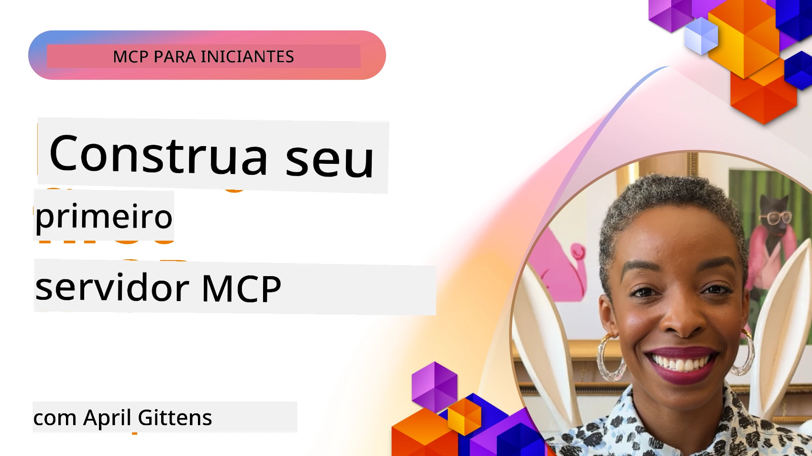

## Começando  

_(Clique na imagem acima para assistir ao vídeo desta aula)_

Esta seção consiste em várias aulas:

- **1 Seu primeiro servidor**, nesta primeira aula, você aprenderá a criar seu primeiro servidor e inspecioná-lo com a ferramenta inspector, uma forma valiosa de testar e depurar seu servidor, [para a aula](01-first-server/README.md)

- **2 Cliente**, nesta aula, você aprenderá a criar um cliente que pode se conectar ao seu servidor, [para a aula](02-client/README.md)

- **3 Cliente com LLM**, uma forma ainda melhor de criar um cliente é adicionando um LLM a ele para que ele possa "negociar" com seu servidor o que fazer, [para a aula](03-llm-client/README.md)

- **4 Consumindo um modo de Agente do servidor GitHub Copilot no Visual Studio Code**. Aqui, estamos vendo como executar nosso Servidor MCP dentro do Visual Studio Code, [para a aula](04-vscode/README.md)

- **5 Servidor de Transporte stdio** transporte stdio é o padrão recomendado para comunicação local entre servidor MCP e cliente, fornecendo comunicação segura baseada em subprocessos com isolamento de processo embutido [para a aula](05-stdio-server/README.md)

- **6 Streaming HTTP com MCP (HTTP Streamável)**. Aprenda sobre transporte moderno de streaming HTTP (a abordagem recomendada para servidores MCP remotos segundo [MCP Specification 2025-11-25](https://spec.modelcontextprotocol.io/specification/2025-11-25/basic/transports/#streamable-http)), notificações de progresso e como implementar servidores e clientes MCP escaláveis em tempo real usando HTTP Streamável. [para a aula](06-http-streaming/README.md)

- **7 Utilizando o Kit de Ferramentas de IA para VSCode** para consumir e testar seus Clientes e Servidores MCP [para a aula](07-aitk/README.md)

- **8 Testes**. Aqui focaremos especialmente em como podemos testar nosso servidor e cliente de diferentes formas, [para a aula](08-testing/README.md)

- **9 Implantação**. Este capítulo abordará diferentes formas de implantar suas soluções MCP, [para a aula](09-deployment/README.md)

- **10 Uso avançado do servidor**. Este capítulo cobre o uso avançado do servidor, [para a aula](./10-advanced/README.md)

- **11 Autenticação**. Este capítulo aborda como adicionar autenticação simples, desde Basic Auth até o uso de JWT e RBAC. É recomendado começar por aqui e depois olhar os Tópicos Avançados no Capítulo 5 e realizar reforços adicionais de segurança via recomendações no Capítulo 2, [para a aula](./11-simple-auth/README.md)

- **12 Hosts MCP**. Configure e use clientes populares de host MCP incluindo Claude Desktop, Cursor, Cline e Windsurf. Aprenda tipos de transporte e solução de problemas, [para a aula](./12-mcp-hosts/README.md)

- **13 Inspetor MCP**. Depure e teste seus servidores MCP interativamente usando a ferramenta Inspetor MCP. Aprenda a solucionar problemas em ferramentas, recursos e mensagens do protocolo, [para a aula](./13-mcp-inspector/README.md)

O Model Context Protocol (MCP) é um protocolo aberto que padroniza como aplicações fornecem contexto para LLMs. Pense no MCP como uma porta USB-C para aplicações de IA - ele oferece uma forma padronizada de conectar modelos de IA a diferentes fontes de dados e ferramentas.

## Objetivos de Aprendizagem

Ao final desta aula, você será capaz de:

- Configurar ambientes de desenvolvimento para MCP em C#, Java, Python, TypeScript e JavaScript
- Construir e implantar servidores MCP básicos com recursos personalizados (recursos, prompts e ferramentas)
- Criar aplicações host que se conectam a servidores MCP
- Testar e depurar implementações MCP
- Entender desafios comuns de configuração e suas soluções
- Conectar suas implementações MCP a serviços populares de LLM

## Configurando Seu Ambiente MCP

Antes de começar a trabalhar com MCP, é importante preparar seu ambiente de desenvolvimento e entender o fluxo de trabalho básico. Esta seção lhe guiará pelos passos iniciais para garantir um início tranquilo com MCP.

### Pré-requisitos

Antes de mergulhar no desenvolvimento MCP, certifique-se de que possui:

- **Ambiente de Desenvolvimento**: Para a linguagem escolhida (C#, Java, Python, TypeScript ou JavaScript)
- **IDE/Editor**: Visual Studio, Visual Studio Code, IntelliJ, Eclipse, PyCharm ou qualquer editor de código moderno
- **Gerenciadores de Pacotes**: NuGet, Maven/Gradle, pip, ou npm/yarn
- **Chaves de API**: Para quaisquer serviços de IA que planeja usar nas suas aplicações host

### SDKs Oficiais

Nos capítulos seguintes, você verá soluções construídas usando Python, TypeScript, Java e .NET. Aqui estão todos os SDKs oficialmente suportados.

O MCP fornece SDKs oficiais para várias linguagens (alinhados com a [MCP Specification 2025-11-25](https://spec.modelcontextprotocol.io/specification/2025-11-25/)):
- [SDK C#](https://github.com/modelcontextprotocol/csharp-sdk) - Mantido em colaboração com a Microsoft
- [SDK Java](https://github.com/modelcontextprotocol/java-sdk) - Mantido em colaboração com Spring AI
- [SDK TypeScript](https://github.com/modelcontextprotocol/typescript-sdk) - Implementação oficial em TypeScript
- [SDK Python](https://github.com/modelcontextprotocol/python-sdk) - Implementação oficial em Python (FastMCP)
- [SDK Kotlin](https://github.com/modelcontextprotocol/kotlin-sdk) - Implementação oficial em Kotlin
- [SDK Swift](https://github.com/modelcontextprotocol/swift-sdk) - Mantido em colaboração com Loopwork AI
- [SDK Rust](https://github.com/modelcontextprotocol/rust-sdk) - Implementação oficial em Rust
- [SDK Go](https://github.com/modelcontextprotocol/go-sdk) - Implementação oficial em Go

## Principais Conclusões

- Configurar um ambiente de desenvolvimento MCP é simples com SDKs específicos para cada linguagem
- Construir servidores MCP envolve criar e registrar ferramentas com esquemas claros
- Clientes MCP se conectam a servidores e modelos para aproveitar capacidades estendidas
- Testes e depuração são essenciais para implementações MCP confiáveis
- Opções de implantação vão desde desenvolvimento local até soluções na nuvem

## Praticando

Temos um conjunto de exemplos que complementa os exercícios que você verá em todos os capítulos desta seção. Além disso, cada capítulo também possui seus próprios exercícios e tarefas.

- [Calculadora Java](./samples/java/calculator/README.md)
- [Calculadora .Net](../../../03-GettingStarted/samples/csharp)
- [Calculadora JavaScript](./samples/javascript/README.md)
- [Calculadora TypeScript](./samples/typescript/README.md)
- [Calculadora Python](../../../03-GettingStarted/samples/python)

## Recursos Adicionais

- [Construa Agentes usando Model Context Protocol no Azure](https://learn.microsoft.com/azure/developer/ai/intro-agents-mcp)
- [MCP Remoto com Azure Container Apps (Node.js/TypeScript/JavaScript)](https://learn.microsoft.com/samples/azure-samples/mcp-container-ts/mcp-container-ts/)
- [Agente MCP OpenAI .NET](https://learn.microsoft.com/samples/azure-samples/openai-mcp-agent-dotnet/openai-mcp-agent-dotnet/)

## Próximos passos

Comece com a primeira aula: [Criando seu primeiro Servidor MCP](01-first-server/README.md)

Depois de concluir este módulo, continue para: [Módulo 4: Implementação Prática](../04-PracticalImplementation/README.md)

---

<!-- CO-OP TRANSLATOR DISCLAIMER START -->
**Aviso Legal**:
Este documento foi traduzido utilizando o serviço de tradução automática [Co-op Translator](https://github.com/Azure/co-op-translator). Embora nos esforcemos para garantir a precisão, esteja ciente de que traduções automatizadas podem conter erros ou imprecisões. O documento original em seu idioma nativo deve ser considerado a fonte autoritária. Para informações críticas, recomenda-se a tradução humana profissional. Não nos responsabilizamos por quaisquer mal-entendidos ou interpretações equivocadas decorrentes do uso desta tradução.
<!-- CO-OP TRANSLATOR DISCLAIMER END -->