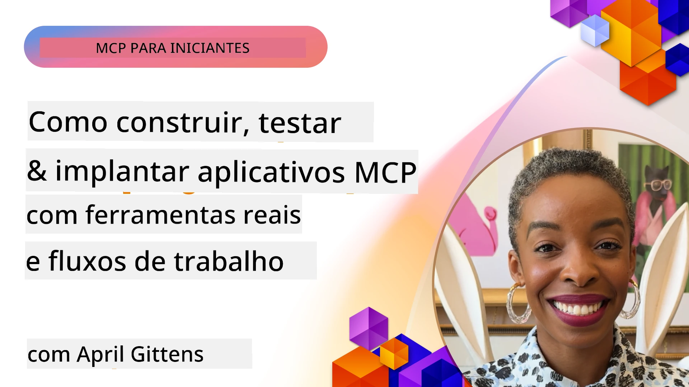
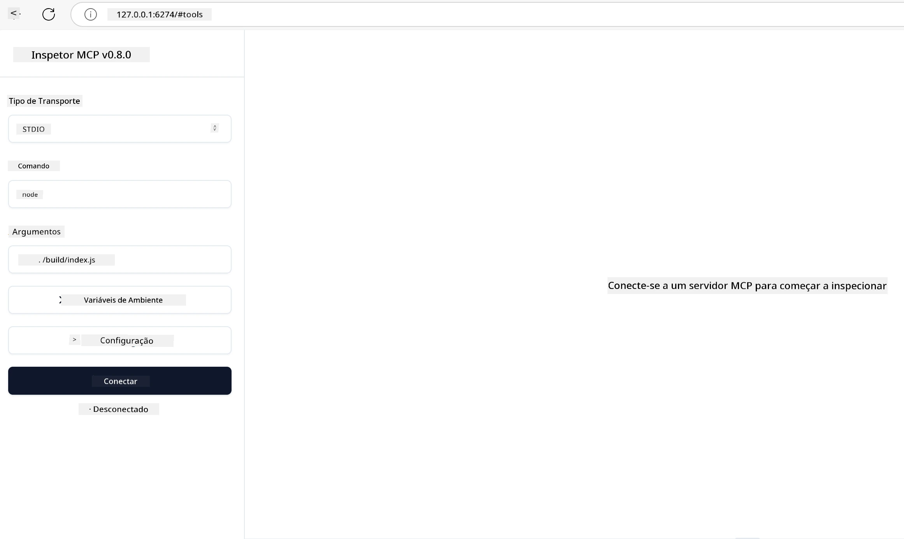

# Implementação Prática

[](https://youtu.be/vCN9-mKBDfQ)

_(Clique na imagem acima para assistir ao vídeo desta lição)_

A implementação prática é onde o poder do Protocolo de Contexto do Modelo (MCP) se torna tangível. Embora entender a teoria e a arquitetura por trás do MCP seja importante, o verdadeiro valor surge quando você aplica esses conceitos para construir, testar e implantar soluções que resolvem problemas do mundo real. Este capítulo faz a ponte entre o conhecimento conceitual e o desenvolvimento prático, guiando você pelo processo de dar vida às aplicações baseadas em MCP.

Seja desenvolvendo assistentes inteligentes, integrando IA em fluxos de trabalho empresariais ou criando ferramentas personalizadas para processamento de dados, o MCP oferece uma base flexível. Seu design independente de linguagem e SDKs oficiais para linguagens de programação populares o tornam acessível para uma ampla gama de desenvolvedores. Aproveitando esses SDKs, você pode prototipar rapidamente, iterar e escalar suas soluções em diferentes plataformas e ambientes.

Nas seções seguintes, você encontrará exemplos práticos, códigos de amostra e estratégias de implantação que demonstram como implementar MCP em C#, Java com Spring, TypeScript, JavaScript e Python. Você também aprenderá como depurar e testar seus servidores MCP, gerenciar APIs e implantar soluções na nuvem usando Azure. Esses recursos práticos foram projetados para acelerar seu aprendizado e ajudar você a construir com confiança aplicações MCP robustas e prontas para produção.

## Visão Geral

Esta lição foca em aspectos práticos da implementação do MCP em múltiplas linguagens de programação. Exploraremos como usar os SDKs MCP em C#, Java com Spring, TypeScript, JavaScript e Python para construir aplicações robustas, depurar e testar servidores MCP, e criar recursos, prompts e ferramentas reutilizáveis.

## Objetivos de Aprendizagem

Ao final desta lição, você será capaz de:

- Implementar soluções MCP usando SDKs oficiais em várias linguagens de programação
- Depurar e testar servidores MCP sistematicamente
- Criar e usar recursos do servidor (Recursos, Prompts e Ferramentas)
- Projetar fluxos de trabalho MCP eficazes para tarefas complexas
- Otimizar implementações MCP para desempenho e confiabilidade

## Recursos dos SDKs Oficiais

O Protocolo de Contexto do Modelo oferece SDKs oficiais para múltiplas linguagens (alinhados com a [Especificação MCP 2025-11-25](https://spec.modelcontextprotocol.io/specification/2025-11-25/)):

- [SDK C#](https://github.com/modelcontextprotocol/csharp-sdk)
- [SDK Java com Spring](https://github.com/modelcontextprotocol/java-sdk) **Nota:** requer dependência no [Project Reactor](https://projectreactor.io). (Veja a [discussão issue 246](https://github.com/orgs/modelcontextprotocol/discussions/246).)
- [SDK TypeScript](https://github.com/modelcontextprotocol/typescript-sdk)
- [SDK Python](https://github.com/modelcontextprotocol/python-sdk)
- [SDK Kotlin](https://github.com/modelcontextprotocol/kotlin-sdk)
- [SDK Go](https://github.com/modelcontextprotocol/go-sdk)

## Trabalhando com SDKs MCP

Esta seção fornece exemplos práticos de implementação do MCP em múltiplas linguagens de programação. Você pode encontrar códigos de amostra no diretório `samples` organizados por linguagem.

### Amostras Disponíveis

O repositório inclui [implementações de amostra](../../../04-PracticalImplementation/samples) nas seguintes linguagens:

- [C#](./samples/csharp/README.md)
- [Java com Spring](./samples/java/containerapp/README.md)
- [TypeScript](./samples/typescript/README.md)
- [JavaScript](./samples/javascript/README.md)
- [Python](./samples/python/README.md)

Cada amostra demonstra conceitos-chave do MCP e padrões de implementação para aquela linguagem e ecossistema específicos.

### Guias Práticos

Guias adicionais para implementação prática do MCP:

- [Paginação e Conjuntos de Resultados Grandes](./pagination/README.md) - Manipule paginação com cursor para ferramentas, recursos e grandes conjuntos de dados

## Recursos Centrais do Servidor

Servidores MCP podem implementar qualquer combinação destes recursos:

### Recursos

Recursos fornecem contexto e dados para o usuário ou modelo de IA usar:

- Repositórios de documentos
- Bases de conhecimento
- Fontes de dados estruturadas
- Sistemas de arquivos

### Prompts

Prompts são mensagens e fluxos de trabalho templateados para usuários:

- Modelos de conversação pré-definidos
- Padrões de interação guiada
- Estruturas de diálogo especializadas

### Ferramentas

Ferramentas são funções para o modelo de IA executar:

- Utilitários para processamento de dados
- Integrações com APIs externas
- Capacidades computacionais
- Funcionalidade de busca

## Implementações de Amostra: Implementação em C#

O repositório oficial do SDK C# contém várias implementações de amostra que demonstram diferentes aspectos do MCP:

- **Cliente MCP Básico**: Exemplo simples mostrando como criar um cliente MCP e chamar ferramentas
- **Servidor MCP Básico**: Implementação mínima de servidor com registro básico de ferramentas
- **Servidor MCP Avançado**: Servidor completo com registro de ferramentas, autenticação e tratamento de erros
- **Integração com ASP.NET**: Exemplos demonstrando integração com ASP.NET Core
- **Padrões de Implementação de Ferramentas**: Vários padrões para implementar ferramentas com diferentes níveis de complexidade

O SDK MCP C# está em preview e as APIs podem mudar. Continuaremos atualizando este blog conforme o SDK evoluir.

### Recursos Principais

- [Nuget ModelContextProtocol C# MCP](https://www.nuget.org/packages/ModelContextProtocol)
- Construindo seu [primeiro Servidor MCP](https://devblogs.microsoft.com/dotnet/build-a-model-context-protocol-mcp-server-in-csharp/).

Para amostras completas de implementação em C#, visite o [repositório oficial de amostras do SDK C#](https://github.com/modelcontextprotocol/csharp-sdk)

## Implementação de Amostra: Implementação Java com Spring

O SDK Java com Spring oferece opções robustas para implementação MCP com recursos de nível empresarial.

### Recursos Principais

- Integração com o Spring Framework
- Forte segurança de tipos
- Suporte a programação reativa
- Tratamento de erros abrangente

Para uma amostra completa de implementação em Java com Spring, veja o [exemplo Java com Spring](samples/java/containerapp/README.md) no diretório de amostras.

## Implementação de Amostra: Implementação JavaScript

O SDK JavaScript oferece uma abordagem leve e flexível para implementação MCP.

### Recursos Principais

- Suporte a Node.js e navegadores
- API baseada em Promises
- Integração fácil com Express e outros frameworks
- Suporte WebSocket para streaming

Para uma amostra completa de implementação em JavaScript, veja o [exemplo JavaScript](samples/javascript/README.md) no diretório de amostras.

## Implementação de Amostra: Implementação Python

O SDK Python oferece uma abordagem pythonica para implementação MCP com excelentes integrações com frameworks de ML.

### Recursos Principais

- Suporte async/await com asyncio
- Integração com FastAPI`
- Registro simples de ferramentas
- Integração nativa com bibliotecas populares de ML

Para uma amostra completa de implementação em Python, veja o [exemplo Python](samples/python/README.md) no diretório de amostras.

## Gestão de API

O Azure API Management é uma ótima resposta para como podemos proteger servidores MCP. A ideia é colocar uma instância do Azure API Management na frente do seu servidor MCP e deixar ela gerenciar recursos que você provavelmente vai querer como:

- limitação de taxa
- gerenciamento de tokens
- monitoramento
- balanceamento de carga
- segurança

### Exemplo Azure

Aqui está um exemplo Azure fazendo exatamente isso, i.e [criando um servidor MCP e protegendo-o com Azure API Management](https://github.com/Azure-Samples/remote-mcp-apim-functions-python).

Veja como o fluxo de autorização acontece na imagem abaixo:


Na imagem anterior, o seguinte acontece:

- Autenticação/Autorização é realizada usando Microsoft Entra.
- Azure API Management atua como um gateway e usa políticas para direcionar e gerenciar o tráfego.
- O Azure Monitor registra todas as requisições para análise futura.

#### Fluxo de autorização

Vamos observar o fluxo de autorização com mais detalhes:


#### Especificação de autorização MCP

Saiba mais sobre a [Especificação de Autorização MCP](https://spec.modelcontextprotocol.io/specification/2025-11-25/basic/authorization/)

## Implantar Servidor Remoto MCP no Azure

Vamos ver se conseguimos implantar o exemplo que mencionamos anteriormente:

1. Clone o repositório

    ```bash
    git clone https://github.com/Azure-Samples/remote-mcp-apim-functions-python.git
    cd remote-mcp-apim-functions-python
    ```

1. Registre o provedor de recursos `Microsoft.App`.

   - Se estiver usando Azure CLI, execute `az provider register --namespace Microsoft.App --wait`.
   - Se estiver usando Azure PowerShell, execute `Register-AzResourceProvider -ProviderNamespace Microsoft.App`. Depois execute `(Get-AzResourceProvider -ProviderNamespace Microsoft.App).RegistrationState` após algum tempo para verificar se o registro está completo.

1. Execute este comando [azd](https://aka.ms/azd) para provisionar o serviço de gerenciamento de API, aplicativo de função (com código) e todos os outros recursos Azure necessários

    ```shell
    azd up
    ```

    Este comando deve implantar todos os recursos na nuvem no Azure

### Testando seu servidor com MCP Inspector

1. Em uma **nova janela de terminal**, instale e execute o MCP Inspector

    ```shell
    npx @modelcontextprotocol/inspector
    ```

    Você deverá ver uma interface semelhante a:

    

1. CTRL clique para carregar o app MCP Inspector a partir da URL exibida pelo app (ex.: [http://127.0.0.1:6274/#resources](http://127.0.0.1:6274/#resources))
1. Defina o tipo de transporte para `SSE`
1. Defina a URL para o seu endpoint SSE do API Management em execução exibido após `azd up` e **Conecte-se**:

    ```shell
    https://<apim-servicename-from-azd-output>.azure-api.net/mcp/sse
    ```

1. **Listar Ferramentas**. Clique em uma ferramenta e **Execute a Ferramenta**.  

Se todos os passos funcionaram, agora você deve estar conectado ao servidor MCP e conseguiu chamar uma ferramenta.

## Servidores MCP para Azure

[Remote-mcp-functions](https://github.com/Azure-Samples/remote-mcp-functions-dotnet): Este conjunto de repositórios são templates de início rápido para construir e implantar servidores MCP remotos personalizados (Protocolo de Contexto do Modelo) usando Azure Functions com Python, C# .NET ou Node/TypeScript.

As amostras fornecem uma solução completa que permite aos desenvolvedores:

- Construir e executar localmente: Desenvolver e depurar um servidor MCP em uma máquina local
- Implantar no Azure: Implantar facilmente na nuvem com um simples comando azd up
- Conectar de clientes: Conectar ao servidor MCP de vários clientes incluindo modo agente Copilot do VS Code e a ferramenta MCP Inspector

### Recursos Principais

- Segurança por design: O servidor MCP é protegido usando chaves e HTTPS
- Opções de autenticação: Suporta OAuth usando autenticação incorporada e/ou API Management
- Isolamento de rede: Permite isolamento de rede usando Redes Virtuais Azure (VNET)
- Arquitetura serverless: Usa Azure Functions para execução escalável acionada por eventos
- Desenvolvimento local: Suporte abrangente para desenvolvimento e depuração local
- Implantação simples: Processo simplificado de implantação no Azure

O repositório inclui todos os arquivos de configuração necessários, código-fonte e definições de infraestrutura para iniciar rapidamente uma implementação MCP pronta para produção.

- [Azure Remote MCP Functions Python](https://github.com/Azure-Samples/remote-mcp-functions-python) - Implementação de amostra do MCP usando Azure Functions com Python

- [Azure Remote MCP Functions .NET](https://github.com/Azure-Samples/remote-mcp-functions-dotnet) - Implementação de amostra do MCP usando Azure Functions com C# .NET

- [Azure Remote MCP Functions Node/Typescript](https://github.com/Azure-Samples/remote-mcp-functions-typescript) - Implementação de amostra do MCP usando Azure Functions com Node/TypeScript.

## Principais Conclusões

- SDKs MCP fornecem ferramentas específicas por linguagem para implementar soluções MCP robustas
- O processo de depuração e teste é crítico para aplicações MCP confiáveis
- Modelos de prompt reutilizáveis permitem interações consistentes com IA
- Fluxos de trabalho bem projetados podem orquestrar tarefas complexas usando múltiplas ferramentas
- Implementar soluções MCP requer consideração de segurança, desempenho e tratamento de erros

## Exercício

Projete um fluxo de trabalho MCP prático que atenda a um problema do mundo real no seu domínio:

1. Identifique 3-4 ferramentas que seriam úteis para resolver esse problema
2. Crie um diagrama do fluxo de trabalho mostrando como essas ferramentas interagem
3. Implemente uma versão básica de uma das ferramentas usando sua linguagem preferida
4. Crie um template de prompt que ajude o modelo a usar sua ferramenta de forma eficaz

## Recursos Adicionais

---

## Próximos Passos

Próximo: [Tópicos Avançados](../05-AdvancedTopics/README.md)

---

<!-- CO-OP TRANSLATOR DISCLAIMER START -->
**Aviso Legal**:
Este documento foi traduzido usando o serviço de tradução por IA [Co-op Translator](https://github.com/Azure/co-op-translator). Embora nos esforcemos pela precisão, esteja ciente de que traduções automáticas podem conter erros ou imprecisões. O documento original em seu idioma nativo deve ser considerado a fonte autorizada. Para informações críticas, recomenda-se tradução humana profissional. Não nos responsabilizamos por quaisquer mal-entendidos ou interpretações incorretas decorrentes do uso desta tradução.
<!-- CO-OP TRANSLATOR DISCLAIMER END -->