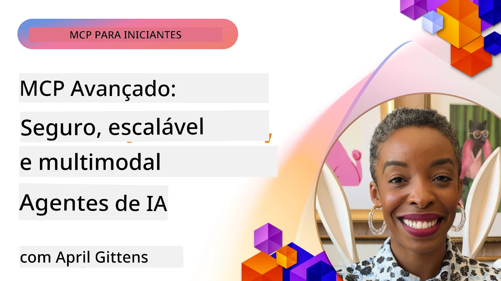

# Tópicos Avançados em MCP

_(Clique na imagem acima para assistir ao vídeo desta aula)_

Este capítulo aborda uma série de tópicos avançados na implementação do Protocolo de Contexto de Modelos (MCP), incluindo integração multimodal, escalabilidade, práticas recomendadas de segurança e integração empresarial. Esses tópicos são cruciais para construir aplicações MCP robustas e prontas para produção que possam atender às demandas dos sistemas modernos de IA.

## Visão Geral

Esta aula explora conceitos avançados na implementação do Protocolo de Contexto de Modelos, com foco em integração multimodal, escalabilidade, práticas recomendadas de segurança e integração empresarial. Esses tópicos são essenciais para construir aplicações MCP em nível de produção que possam lidar com requisitos complexos em ambientes empresariais.

## Objetivos de Aprendizagem

Ao final desta aula, você será capaz de:

- Implementar capacidades multimodais dentro dos frameworks MCP
- Projetar arquiteturas MCP escaláveis para cenários de alta demanda
- Aplicar práticas recomendadas de segurança alinhadas com os princípios de segurança do MCP
- Integrar MCP com sistemas e frameworks de IA empresariais
- Otimizar desempenho e confiabilidade em ambientes de produção

## Aulas e Projetos de Exemplo

| Link | Título | Descrição |
|------|-------|-------------|
| [5.1 Integration with Azure](./mcp-integration/README.md) | Integrar com Azure | Aprenda como integrar seu Servidor MCP na Azure |
| [5.2 Multi modal sample](./mcp-multi-modality/README.md) | Exemplos multimodais MCP  | Exemplos para áudio, imagem e respostas multimodais |
| [5.3 MCP OAuth2 sample](../../../05-AdvancedTopics/mcp-oauth2-demo) | Demonstração MCP OAuth2 | Aplicação mínima Spring Boot demonstrando OAuth2 com MCP, tanto como Servidor de Autorização quanto de Recursos. Demonstra emissão segura de tokens, endpoints protegidos, implantação no Azure Container Apps e integração com API Management. |
| [5.4 Root Contexts](./mcp-root-contexts/README.md) | Contextos raiz  | Saiba mais sobre contextos raiz e como implementá-los |
| [5.5 Routing](./mcp-routing/README.md) | Roteamento | Aprenda os diferentes tipos de roteamento |
| [5.6 Sampling](./mcp-sampling/README.md) | Amostragem | Aprenda como trabalhar com amostragem |
| [5.7 Scaling](./mcp-scaling/README.md) | Escalabilidade  | Aprenda sobre escalabilidade |
| [5.8 Security](./mcp-security/README.md) | Segurança  | Proteja seu Servidor MCP |
| [5.9 Web Search sample](./web-search-mcp/README.md) | Pesquisa Web MCP | Servidor e cliente MCP em Python integrando com SerpAPI para busca web, notícias, produtos e perguntas e respostas em tempo real. Demonstra orquestração de múltiplas ferramentas, integração com API externa e tratamento robusto de erros. |
| [5.10 Realtime Streaming](./mcp-realtimestreaming/README.md) | Streaming  | Streaming de dados em tempo real tornou-se essencial no mundo orientado por dados de hoje, onde empresas e aplicações precisam de acesso imediato à informação para tomar decisões rápidas.|
| [5.11 Realtime Web Search](./mcp-realtimesearch/README.md) | Pesquisa Web | Pesquisa web em tempo real e como o MCP transforma a pesquisa web em tempo real fornecendo uma abordagem padronizada para gerenciamento de contexto entre modelos de IA, motores de busca e aplicações.| 
| [5.12  Entra ID Authentication for Model Context Protocol Servers](./mcp-security-entra/README.md) | Autenticação Entra ID | Microsoft Entra ID oferece uma solução robusta de gerenciamento de identidade e acesso baseada em nuvem, ajudando a garantir que apenas usuários e aplicações autorizadas possam interagir com seu servidor MCP.|
| [5.13 Azure AI Foundry Agent Integration](./mcp-foundry-agent-integration/README.md) | Integração Azure AI Foundry | Aprenda como integrar servidores do Protocolo de Contexto de Modelos com agentes Azure AI Foundry, permitindo orquestração poderosa de ferramentas e capacidades empresariais de IA com conexões padronizadas a fontes externas de dados.|
| [5.14 Context Engineering](./mcp-contextengineering/README.md) | Engenharia de Contexto | A oportunidade futura das técnicas de engenharia de contexto para servidores MCP, incluindo otimização de contexto, gerenciamento dinâmico de contexto e estratégias para engenharia eficaz de prompts dentro dos frameworks MCP.|
| [5.15 MCP Custom Transport](./mcp-transport/README.md) | Transporte Personalizado | Aprenda como implementar mecanismos de transporte customizados para cenários especializados de comunicação MCP.|
| [5.16 Protocol Features Deep Dive](./mcp-protocol-features/README.md) | Recursos do Protocolo | Domine recursos avançados do protocolo incluindo notificações de progresso, cancelamento de requisições, modelos de recursos e padrões de tratamento de erros.|

> **Novidade na Especificação MCP 2025-11-25**: A especificação agora inclui suporte experimental para **Tasks** (operações de longa duração com monitoramento de progresso), **Anotações de Ferramentas** (metadados sobre comportamento da ferramenta para segurança), **URL Mode Elicitation** (solicitação de conteúdo específico de URL dos clientes) e aprimoramentos em **Roots** (para gerenciamento de contexto de workspace). Veja o [changelog da Especificação MCP](https://spec.modelcontextprotocol.io/) para detalhes completos.

## Referências Adicionais

Para informações mais atualizadas sobre tópicos avançados MCP, consulte:
- [Documentação MCP](https://modelcontextprotocol.io/)
- [Especificação MCP (2025-11-25)](https://spec.modelcontextprotocol.io/specification/2025-11-25/)
- [Repositório GitHub](https://github.com/modelcontextprotocol)
- [OWASP MCP Top 10](https://microsoft.github.io/mcp-azure-security-guide/mcp/) - Riscos e mitigação de segurança
- [Workshop MCP Security Summit (Sherpa)](https://azure-samples.github.io/sherpa/) - Treinamento prático em segurança

## Principais Aprendizados

- Implementações multimodais MCP ampliam as capacidades da IA além do processamento de texto
- Escalabilidade é essencial para implantações empresariais e pode ser resolvida via escalonamento horizontal e vertical
- Medidas de segurança abrangentes protegem dados e garantem controle adequado de acesso
- Integração empresarial com plataformas como Azure OpenAI e Microsoft AI Foundry potencializa as capacidades do MCP
- Implementações avançadas MCP se beneficiam de arquiteturas otimizadas e gerenciamento cuidadoso de recursos

## Exercício

Projete uma implementação MCP de nível empresarial para um caso de uso específico:

1. Identifique requisitos multimodais para seu caso de uso
2. Delimite controles de segurança necessários para proteger dados sensíveis
3. Projete uma arquitetura escalável que possa lidar com carga variável
4. Planeje pontos de integração com sistemas empresariais de IA
5. Documente possíveis gargalos de desempenho e estratégias de mitigação

## Recursos Adicionais

- [Documentação Azure OpenAI](https://learn.microsoft.com/en-us/azure/ai-services/openai/)
- [Documentação Microsoft AI Foundry](https://learn.microsoft.com/en-us/ai-services/)

---

## O que vem a seguir

Explore as aulas neste módulo começando por: [5.1 MCP Integration](./mcp-integration/README.md)

Após concluir este módulo, continue para: [Módulo 6: Contribuições da Comunidade](../06-CommunityContributions/README.md)

---

<!-- CO-OP TRANSLATOR DISCLAIMER START -->
**Aviso Legal**:  
Este documento foi traduzido utilizando o serviço de tradução por IA [Co-op Translator](https://github.com/Azure/co-op-translator). Embora nos esforcemos para garantir a precisão, favor estar ciente de que traduções automáticas podem conter erros ou imprecisões. O documento original em seu idioma nativo deve ser considerado a fonte autoritativa. Para informações críticas, recomenda-se tradução profissional realizada por humanos. Não nos responsabilizamos por quaisquer mal-entendidos ou interpretações incorretas decorrentes do uso desta tradução.
<!-- CO-OP TRANSLATOR DISCLAIMER END -->