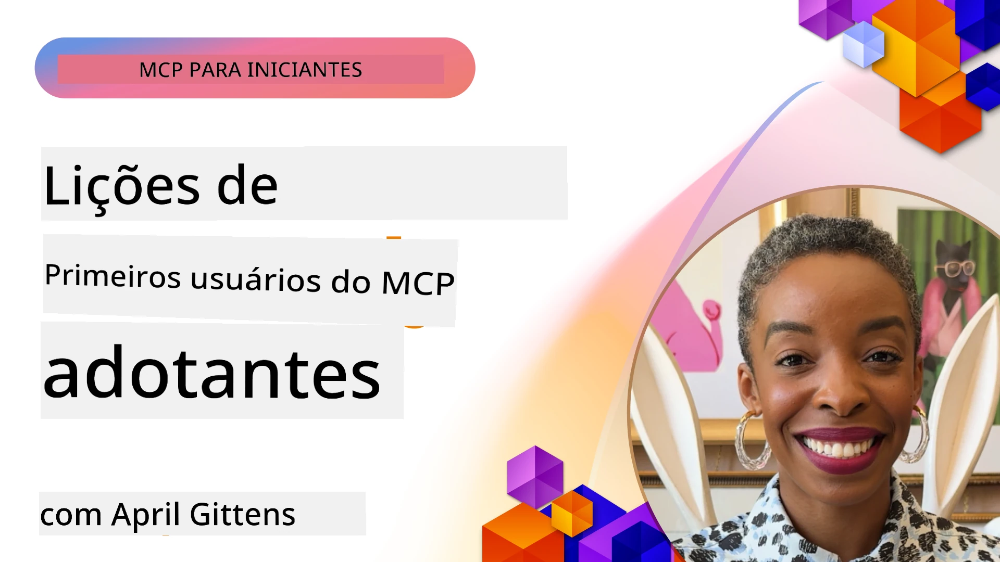

# 🌟 Lições dos Primeiros Usuários

[](https://youtu.be/jds7dSmNptE)

_(Clique na imagem acima para assistir ao vídeo desta lição)_

## 🎯 O Que Este Módulo Cobre

Este módulo explora como organizações reais e desenvolvedores estão aproveitando o Model Context Protocol (MCP) para resolver desafios reais e impulsionar a inovação. Por meio de estudos de caso detalhados, projetos práticos e exemplos concretos, você descobrirá como o MCP permite uma integração de IA segura e escalável que conecta modelos de linguagem, ferramentas e dados empresariais.

### 📚 Veja o MCP em Ação

Quer ver esses princípios aplicados em ferramentas prontas para produção? Confira nossos [**10 Servidores Microsoft MCP Que Estão Transformando a Produtividade dos Desenvolvedores**](microsoft-mcp-servers.md), que apresenta servidores MCP Microsoft reais que você pode usar hoje.

## Visão Geral

Esta lição explora como os primeiros usuários aproveitaram o Model Context Protocol (MCP) para resolver desafios do mundo real e impulsionar a inovação em vários setores. Através de estudos de caso detalhados e projetos práticos, você verá como o MCP permite uma integração de IA padronizada, segura e escalável — conectando grandes modelos de linguagem, ferramentas e dados empresariais em uma estrutura unificada. Você ganhará experiência prática no design e construção de soluções baseadas em MCP, aprenderá com padrões comprovados de implementação e descobrirá as melhores práticas para implantar MCP em ambientes de produção. A lição também destaca tendências emergentes, direções futuras e recursos open-source para ajudá-lo a se manter na vanguarda da tecnologia MCP e seu ecossistema em evolução.

## Objetivos de Aprendizagem

- Analisar implementações reais de MCP em diferentes setores
- Projetar e construir aplicações completas baseadas em MCP
- Explorar tendências emergentes e direções futuras na tecnologia MCP
- Aplicar melhores práticas em cenários reais de desenvolvimento

## Implementações Reais do MCP

### Estudo de Caso 1: Automação de Suporte ao Cliente Empresarial

Uma corporação multinacional implementou uma solução baseada em MCP para padronizar as interações de IA em seus sistemas de suporte ao cliente. Isso permitiu que eles:

- Criassem uma interface unificada para múltiplos provedores de LLM
- Mantivessem gerenciamento consistente de prompts entre departamentos
- Implementassem controles robustos de segurança e conformidade
- Alternassem facilmente entre diferentes modelos de IA conforme necessidades específicas

**Implementação Técnica:**

```python
# Implementação do servidor MCP em Python para suporte ao cliente
import logging
import asyncio
from modelcontextprotocol import create_server, ServerConfig
from modelcontextprotocol.server import MCPServer
from modelcontextprotocol.transports import create_http_transport
from modelcontextprotocol.resources import ResourceDefinition
from modelcontextprotocol.prompts import PromptDefinition
from modelcontextprotocol.tool import ToolDefinition

# Configurar registro de logs
logging.basicConfig(level=logging.INFO)

async def main():
    # Criar configuração do servidor
    config = ServerConfig(
        name="Enterprise Customer Support Server",
        version="1.0.0",
        description="MCP server for handling customer support inquiries"
    )
    
    # Inicializar servidor MCP
    server = create_server(config)
    
    # Registrar recursos da base de conhecimento
    server.resources.register(
        ResourceDefinition(
            name="customer_kb",
            description="Customer knowledge base documentation"
        ),
        lambda params: get_customer_documentation(params)
    )
    
    # Registrar modelos de prompt
    server.prompts.register(
        PromptDefinition(
            name="support_template",
            description="Templates for customer support responses"
        ),
        lambda params: get_support_templates(params)
    )
    
    # Registrar ferramentas de suporte
    server.tools.register(
        ToolDefinition(
            name="ticketing",
            description="Create and update support tickets"
        ),
        handle_ticketing_operations
    )
    
    # Iniciar servidor com transporte HTTP
    transport = create_http_transport(port=8080)
    await server.run(transport)

if __name__ == "__main__":
    asyncio.run(main())
```

**Resultados:** Redução de 30% nos custos de modelo, melhoria de 45% na consistência das respostas e conformidade aprimorada nas operações globais.

### Estudo de Caso 2: Assistente de Diagnóstico em Saúde

Um fornecedor de serviços de saúde desenvolveu uma infraestrutura MCP para integrar múltiplos modelos médicos de IA especializados, garantindo que dados sensíveis de pacientes permanecessem protegidos:

- Troca fluida entre modelos médicos generalistas e especialistas
- Controles rígidos de privacidade e trilhas de auditoria
- Integração com sistemas existentes de Prontuário Eletrônico (EHR)
- Engenharia de prompts consistente para terminologia médica

**Implementação Técnica:**

```csharp
// C# MCP host application implementation in healthcare application
using Microsoft.Extensions.DependencyInjection;
using ModelContextProtocol.SDK.Client;
using ModelContextProtocol.SDK.Security;
using ModelContextProtocol.SDK.Resources;

public class DiagnosticAssistant
{
    private readonly MCPHostClient _mcpClient;
    private readonly PatientContext _patientContext;
    
    public DiagnosticAssistant(PatientContext patientContext)
    {
        _patientContext = patientContext;
        
        // Configure MCP client with healthcare-specific settings
        var clientOptions = new ClientOptions
        {
            Name = "Healthcare Diagnostic Assistant",
            Version = "1.0.0",
            Security = new SecurityOptions
            {
                Encryption = EncryptionLevel.Medical,
                AuditEnabled = true
            }
        };
        
        _mcpClient = new MCPHostClientBuilder()
            .WithOptions(clientOptions)
            .WithTransport(new HttpTransport("https://healthcare-mcp.example.org"))
            .WithAuthentication(new HIPAACompliantAuthProvider())
            .Build();
    }
    
    public async Task<DiagnosticSuggestion> GetDiagnosticAssistance(
        string symptoms, string patientHistory)
    {
        // Create request with appropriate resources and tool access
        var resourceRequest = new ResourceRequest
        {
            Name = "patient_records",
            Parameters = new Dictionary<string, object>
            {
                ["patientId"] = _patientContext.PatientId,
                ["requestingProvider"] = _patientContext.ProviderId
            }
        };
        
        // Request diagnostic assistance using appropriate prompt
        var response = await _mcpClient.SendPromptRequestAsync(
            promptName: "diagnostic_assistance",
            parameters: new Dictionary<string, object>
            {
                ["symptoms"] = symptoms,
                patientHistory = patientHistory,
                relevantGuidelines = _patientContext.GetRelevantGuidelines()
            });
            
        return DiagnosticSuggestion.FromMCPResponse(response);
    }
}
```

**Resultados:** Melhorias nas sugestões de diagnóstico para médicos mantendo total conformidade com a HIPAA e redução significativa na troca de contexto entre sistemas.

### Estudo de Caso 3: Análise de Risco em Serviços Financeiros

Uma instituição financeira implementou MCP para padronizar seus processos de análise de risco entre diferentes departamentos:

- Criou uma interface unificada para modelos de risco de crédito, detecção de fraude e risco de investimento
- Implementou controles rígidos de acesso e versionamento de modelos
- Garantiu auditabilidade de todas as recomendações de IA
- Manteve formato consistente de dados em sistemas diversos

**Implementação Técnica:**

```java
// Servidor MCP Java para avaliação de risco financeiro
import org.mcp.server.*;
import org.mcp.security.*;

public class FinancialRiskMCPServer {
    public static void main(String[] args) {
        // Criar servidor MCP com recursos de conformidade financeira
        MCPServer server = new MCPServerBuilder()
            .withModelProviders(
                new ModelProvider("risk-assessment-primary", new AzureOpenAIProvider()),
                new ModelProvider("risk-assessment-audit", new LocalLlamaProvider())
            )
            .withPromptTemplateDirectory("./compliance/templates")
            .withAccessControls(new SOCCompliantAccessControl())
            .withDataEncryption(EncryptionStandard.FINANCIAL_GRADE)
            .withVersionControl(true)
            .withAuditLogging(new DatabaseAuditLogger())
            .build();
            
        server.addRequestValidator(new FinancialDataValidator());
        server.addResponseFilter(new PII_RedactionFilter());
        
        server.start(9000);
        
        System.out.println("Financial Risk MCP Server running on port 9000");
    }
}
```

**Resultados:** Conformidade regulatória aprimorada, ciclo de implantação de modelos 40% mais rápido e maior consistência na avaliação de risco entre departamentos.

### Estudo de Caso 4: Servidor MCP Playwright da Microsoft para Automação de Navegador

A Microsoft desenvolveu o [servidor MCP Playwright](https://github.com/microsoft/playwright-mcp) para permitir automação de navegador segura e padronizada através do Model Context Protocol. Este servidor pronto para produção permite que agentes de IA e LLMs interajam com navegadores web de forma controlada, auditável e extensível — habilitando casos de uso como testes automatizados de web, extração de dados e fluxos de trabalho de ponta a ponta.

> **🎯 Ferramenta Pronta para Produção**
> 
> Este estudo de caso apresenta um servidor MCP real que você pode usar hoje! Saiba mais sobre o Servidor MCP Playwright e outros 9 servidores MCP Microsoft prontos para produção em nosso [**Guia de Servidores MCP Microsoft**](microsoft-mcp-servers.md#8--playwright-mcp-server).

**Principais Recursos:**
- Expõe capacidades de automação de navegador (navegação, preenchimento de formulários, captura de tela, etc.) como ferramentas MCP
- Implementa controles de acesso rigorosos e sandbox para evitar ações não autorizadas
- Fornece logs detalhados de auditoria para todas as interações com o navegador
- Suporta integração com Azure OpenAI e outros provedores de LLM para automação orientada por agentes
- Potencializa o Agente de Codificação do GitHub Copilot com capacidades de navegação web

**Implementação Técnica:**

```typescript
// TypeScript: Registrando ferramentas de automação de navegador Playwright em um servidor MCP
import { createServer, ToolDefinition } from 'modelcontextprotocol';
import { launch } from 'playwright';

const server = createServer({
  name: 'Playwright MCP Server',
  version: '1.0.0',
  description: 'MCP server for browser automation using Playwright'
});

// Registrar uma ferramenta para navegar até uma URL e capturar uma captura de tela
server.tools.register(
  new ToolDefinition({
    name: 'navigate_and_screenshot',
    description: 'Navigate to a URL and capture a screenshot',
    parameters: {
      url: { type: 'string', description: 'The URL to visit' }
    }
  }),
  async ({ url }) => {
    const browser = await launch();
    const page = await browser.newPage();
    await page.goto(url);
    const screenshot = await page.screenshot();
    await browser.close();
    return { screenshot };
  }
);

// Iniciar o servidor MCP
server.listen(8080);
```

**Resultados:**

- Permitiu automação programática segura de navegadores para agentes de IA e LLMs
- Reduziu esforço manual de testes e melhorou a cobertura de testes para aplicações web
- Forneceu uma estrutura reutilizável e extensível para integração de ferramentas baseadas em navegador em ambientes empresariais
- Potentializou as capacidades de navegação web do GitHub Copilot

**Referências:**

- [Repositório GitHub do Servidor MCP Playwright](https://github.com/microsoft/playwright-mcp)
- [Soluções de IA e Automação da Microsoft](https://azure.microsoft.com/en-us/products/ai-services/)

### Estudo de Caso 5: Azure MCP – Model Context Protocol Empresarial como Serviço

O Azure MCP Server ([https://aka.ms/azmcp](https://aka.ms/azmcp)) é a implementação gerenciada e empresarial da Microsoft do Model Context Protocol, projetada para fornecer capacidades escaláveis, seguras e compatíveis de servidor MCP como um serviço na nuvem. O Azure MCP permite que organizações implantem, gerenciem e integrem rapidamente servidores MCP com serviços Azure de IA, dados e segurança, reduzindo a sobrecarga operacional e acelerando a adoção de IA.

> **🎯 Ferramenta Pronta para Produção**
> 
> Este é um servidor MCP real que você pode usar hoje! Saiba mais sobre o Azure AI Foundry MCP Server em nosso [**Guia de Servidores MCP Microsoft**](microsoft-mcp-servers.md).

- Hospedagem de servidor MCP totalmente gerenciada com escala, monitoramento e segurança integrados
- Integração nativa com Azure OpenAI, Azure AI Search e outros serviços Azure
- Autenticação e autorização empresarial via Microsoft Entra ID
- Suporte a ferramentas personalizadas, templates de prompt e conectores de recursos
- Conformidade com requisitos de segurança e regulatórios empresariais

**Implementação Técnica:**

```yaml
# Example: Azure MCP server deployment configuration (YAML)
apiVersion: mcp.microsoft.com/v1
kind: McpServer
metadata:
  name: enterprise-mcp-server
spec:
  modelProviders:
    - name: azure-openai
      type: AzureOpenAI
      endpoint: https://<your-openai-resource>.openai.azure.com/
      apiKeySecret: <your-azure-keyvault-secret>
  tools:
    - name: document_search
      type: AzureAISearch
      endpoint: https://<your-search-resource>.search.windows.net/
      apiKeySecret: <your-azure-keyvault-secret>
  authentication:
    type: EntraID
    tenantId: <your-tenant-id>
  monitoring:
    enabled: true
    logAnalyticsWorkspace: <your-log-analytics-id>
```

**Resultados:**  
- Redução do tempo para valor em projetos de IA empresarial ao fornecer uma plataforma pronta para uso e compatível de servidor MCP  
- Integração simplificada de LLMs, ferramentas e fontes de dados empresariais  
- Segurança aprimorada, observabilidade e eficiência operacional para cargas de trabalho MCP  
- Qualidade de código melhorada com práticas recomendadas do Azure SDK e padrões atuais de autenticação  

**Referências:**  
- [Documentação Azure MCP](https://aka.ms/azmcp)  
- [Repositório GitHub do Azure MCP Server](https://github.com/Azure/azure-mcp)  
- [Serviços Azure AI](https://azure.microsoft.com/en-us/products/ai-services/)  
- [Centro Microsoft MCP](https://mcp.azure.com)

## Estudo de Caso 6: NLWeb  
MCP (Model Context Protocol) é um protocolo emergente para chatbots e assistentes de IA interagirem com ferramentas. Cada instância NLWeb é também um servidor MCP, que suporta um método principal, ask, usado para perguntar a um site uma questão em linguagem natural. A resposta retornada utiliza schema.org, um vocabulário amplamente usado para descrever dados web. Grosso modo, MCP é para NLWeb como Http é para HTML. NLWeb combina protocolos, formatos Schema.org e exemplo de código para ajudar sites a criar rapidamente esses endpoints, beneficiando tanto humanos via interfaces conversacionais quanto máquinas via interação natural agente a agente.

Existem dois componentes distintos no NLWeb.  
- Um protocolo, muito simples para começar, para interface com um site em linguagem natural e um formato, aproveitando json e schema.org para a resposta retornada. Veja a documentação sobre a REST API para mais detalhes.  
- Uma implementação direta de (1) que aproveita marcação existente, para sites que podem ser abstraídos como listas de itens (produtos, receitas, atrações, avaliações, etc.). Juntamente com um conjunto de widgets de interface de usuário, os sites podem facilmente fornecer interfaces conversacionais para seu conteúdo. Veja a documentação sobre Vida de uma consulta de chat para mais detalhes sobre como isso funciona.

**Referências:**  
- [Documentação Azure MCP](https://aka.ms/azmcp)  
- [NLWeb](https://github.com/microsoft/NlWeb)

### Estudo de Caso 7: Azure AI Foundry MCP Server – Integração de Agentes de IA Empresariais

Os servidores Azure AI Foundry MCP demonstram como o MCP pode ser usado para orquestrar e gerenciar agentes e fluxos de trabalho de IA em ambientes empresariais. Integrando MCP com Azure AI Foundry, as organizações podem padronizar as interações de agentes, aproveitar o gerenciamento de fluxos de trabalho do Foundry e garantir implantações seguras e escaláveis.

> **🎯 Ferramenta Pronta para Produção**
> 
> Este é um servidor MCP real que você pode usar hoje! Saiba mais sobre o Azure AI Foundry MCP Server em nosso [**Guia de Servidores MCP Microsoft**](microsoft-mcp-servers.md#9--azure-ai-foundry-mcp-server).

**Principais Recursos:**
- Acesso abrangente ao ecossistema de IA da Azure, incluindo catálogos de modelos e gerenciamento de implantação
- Indexação de conhecimento com Azure AI Search para aplicações RAG
- Ferramentas de avaliação para desempenho de modelo de IA e garantia de qualidade
- Integração com Azure AI Foundry Catalog e Labs para modelos de pesquisa avançada
- Gerenciamento e avaliação de agentes para cenários produtivos

**Resultados:**
- Prototipagem rápida e monitoramento robusto de fluxos de trabalho de agentes de IA
- Integração fluida com serviços Azure AI para cenários avançados
- Interface unificada para construção, implantação e monitoramento de pipelines de agentes
- Segurança, conformidade e eficiência operacional aprimoradas para empresas
- Aceleração da adoção de IA mantendo controle sobre processos complexos orientados a agentes

**Referências:**
- [Repositório GitHub do Azure AI Foundry MCP Server](https://github.com/azure-ai-foundry/mcp-foundry)
- [Integração de Agentes Azure AI com MCP (Blog Microsoft Foundry)](https://devblogs.microsoft.com/foundry/integrating-azure-ai-agents-mcp/)

### Estudo de Caso 8: Foundry MCP Playground – Experimentação e Protótipos

O Foundry MCP Playground oferece um ambiente pronto para uso para experimentação com servidores MCP e integrações Azure AI Foundry. Desenvolvedores podem rapidamente prototipar, testar e avaliar modelos de IA e fluxos de trabalho de agentes usando recursos do Azure AI Foundry Catalog e Labs. O playground facilita a configuração, fornece projetos de exemplo e suporta desenvolvimento colaborativo, tornando fácil explorar melhores práticas e novos cenários com sobrecarga mínima. É especialmente útil para equipes que buscam validar ideias, compartilhar experimentos e acelerar o aprendizado sem necessidade de infraestrutura complexa. Ao baixar a barreira de entrada, o playground fomenta a inovação e contribuições da comunidade no ecossistema MCP e Azure AI Foundry.

**Referências:**

- [Repositório GitHub Foundry MCP Playground](https://github.com/azure-ai-foundry/foundry-mcp-playground)

### Estudo de Caso 9: Microsoft Learn Docs MCP Server – Acesso a Documentação com IA

O Microsoft Learn Docs MCP Server é um serviço hospedado na nuvem que fornece assistentes de IA com acesso em tempo real à documentação oficial da Microsoft através do Model Context Protocol. Este servidor pronto para produção conecta-se ao abrangente ecossistema Microsoft Learn e permite busca semântica em todas as fontes oficiais Microsoft.

> **🎯 Ferramenta Pronta para Produção**
> 
> Este é um servidor MCP real que você pode usar hoje! Saiba mais sobre o Microsoft Learn Docs MCP Server em nosso [**Guia de Servidores MCP Microsoft**](microsoft-mcp-servers.md#1--microsoft-learn-docs-mcp-server).

**Principais Recursos:**
- Acesso em tempo real à documentação oficial Microsoft, documentação Azure e documentação Microsoft 365
- Capacidades avançadas de busca semântica que compreendem contexto e intenção
- Informação sempre atualizada conforme conteúdos do Microsoft Learn são publicados
- Cobertura abrangente pelo Microsoft Learn, documentação Azure e fontes Microsoft 365
- Retorna até 10 fragmentos de conteúdo de alta qualidade com títulos de artigos e URLs

**Por Que é Crucial:**
- Resolve o problema do "conhecimento de IA desatualizado" para tecnologias Microsoft
- Garante que assistentes de IA tenham acesso às últimas funcionalidades de .NET, C#, Azure e Microsoft 365
- Fornece informação autoritativa e oficial para geração precisa de código
- Essencial para desenvolvedores que trabalham com tecnologias Microsoft em rápida evolução

**Resultados:**
- Precisão dramaticamente melhorada na geração de código por IA para tecnologias Microsoft
- Redução do tempo gasto buscando documentação atualizada e melhores práticas
- Produtividade do desenvolvedor aprimorada com recuperação de documentação consciente do contexto
- Integração fluida aos fluxos de trabalho de desenvolvimento sem sair do IDE

**Referências:**
- [Repositório GitHub Microsoft Learn Docs MCP Server](https://github.com/MicrosoftDocs/mcp)
- [Documentação Microsoft Learn](https://learn.microsoft.com/)

## Projetos Práticos

### Projeto 1: Construir um Servidor MCP Multi-Provedor

**Objetivo:** Criar um servidor MCP que possa direcionar solicitações para múltiplos provedores de modelo de IA com base em critérios específicos.

**Requisitos:**

- Suporte para pelo menos três provedores diferentes de modelo (ex.: OpenAI, Anthropic, modelos locais)
- Implementar um mecanismo de roteamento baseado em metadados da solicitação
- Criar um sistema de configuração para gerenciar credenciais de provedores
- Adicionar cache para otimizar desempenho e custos
- Construir um painel simples para monitoramento de uso

**Passos de Implementação:**

1. Configurar a infraestrutura básica do servidor MCP  
2. Implementar adaptadores de provedores para cada serviço de modelo de IA  
3. Criar a lógica de roteamento baseada nos atributos da solicitação  
4. Adicionar mecanismos de cache para solicitações frequentes  
5. Desenvolver o painel de monitoramento  
6. Testar com diversos padrões de solicitação  

**Tecnologias:** Escolha entre Python (.NET/Java/Python de acordo com sua preferência), Redis para cache e um framework web simples para o painel.

### Projeto 2: Sistema Empresarial de Gerenciamento de Prompts
**Objetivo:** Desenvolver um sistema baseado em MCP para gerenciar, versionar e implantar modelos de prompt em toda a organização.

**Requisitos:**

- Criar um repositório centralizado para modelos de prompt
- Implementar versionamento e fluxos de trabalho de aprovação
- Construir capacidades de teste de modelos com entradas de amostra
- Desenvolver controles de acesso baseados em função
- Criar uma API para recuperação e implantação de modelos

**Passos de Implementação:**

1. Projetar o esquema do banco de dados para armazenamento dos modelos
2. Criar a API principal para operações CRUD dos modelos
3. Implementar o sistema de versionamento
4. Construir o fluxo de trabalho de aprovação
5. Desenvolver a estrutura de testes
6. Criar uma interface web simples para gerenciamento
7. Integrar com um servidor MCP

**Tecnologias:** Sua escolha de framework backend, banco de dados SQL ou NoSQL, e um framework frontend para a interface de gerenciamento.

### Projeto 3: Plataforma de Geração de Conteúdo Baseada em MCP

**Objetivo:** Construir uma plataforma de geração de conteúdo que utilize MCP para fornecer resultados consistentes em diferentes tipos de conteúdo.

**Requisitos:**

- Suportar múltiplos formatos de conteúdo (postagens em blogs, redes sociais, textos de marketing)
- Implementar geração baseada em modelos com opções de personalização
- Criar um sistema de revisão de conteúdo e feedback
- Rastrear métricas de desempenho do conteúdo
- Suportar versionamento e iteração de conteúdo

**Passos de Implementação:**

1. Configurar a infraestrutura do cliente MCP
2. Criar modelos para diferentes tipos de conteúdo
3. Construir o pipeline de geração de conteúdo
4. Implementar o sistema de revisão
5. Desenvolver o sistema de rastreamento de métricas
6. Criar uma interface de usuário para gerenciamento de modelos e geração de conteúdo

**Tecnologias:** Sua linguagem de programação preferida, framework web e sistema de banco de dados.

## Direções Futuras para a Tecnologia MCP

### Tendências Emergentes

1. **MCP Multimodal**
   - Expansão do MCP para padronizar interações com modelos de imagem, áudio e vídeo
   - Desenvolvimento de capacidades de raciocínio cruzado entre modalidades
   - Formatos padronizados de prompt para diferentes modalidades

2. **Infraestrutura MCP Federada**
   - Redes MCP distribuídas que podem compartilhar recursos entre organizações
   - Protocolos padronizados para compartilhamento seguro de modelos
   - Técnicas de computação que preservam a privacidade

3. **Mercados MCP**
   - Ecossistemas para compartilhamento e monetização de modelos e plugins MCP
   - Processos de garantia de qualidade e certificação
   - Integração com mercados de modelos

4. **MCP para Computação de Borda**
   - Adaptação dos padrões MCP para dispositivos de borda com recursos limitados
   - Protocolos otimizados para ambientes de baixa largura de banda
   - Implementações MCP especializadas para ecossistemas IoT

5. **Estruturas Regulatórias**
   - Desenvolvimento de extensões MCP para conformidade regulatória
   - Trilhas de auditoria padronizadas e interfaces de explicabilidade
   - Integração com estruturas emergentes de governança de IA

### Soluções MCP da Microsoft

A Microsoft e o Azure desenvolveram diversos repositórios open-source para ajudar desenvolvedores a implementar o MCP em vários cenários:

#### Organização Microsoft

1. [playwright-mcp](https://github.com/microsoft/playwright-mcp) - Um servidor MCP Playwright para automação e teste de navegadores
2. [files-mcp-server](https://github.com/microsoft/files-mcp-server) - Implementação de servidor MCP para OneDrive para testes locais e contribuição da comunidade
3. [NLWeb](https://github.com/microsoft/NlWeb) - NLWeb é uma coleção de protocolos abertos e ferramentas open source associadas. Seu foco principal é estabelecer uma camada fundamental para a Web de IA

#### Organização Azure-Samples

1. [mcp](https://github.com/Azure-Samples/mcp) - Links para exemplos, ferramentas e recursos para construir e integrar servidores MCP no Azure usando múltiplas linguagens
2. [mcp-auth-servers](https://github.com/Azure-Samples/mcp-auth-servers) - Servidores MCP de referência demonstrando autenticação com a especificação atual do Model Context Protocol
3. [remote-mcp-functions](https://github.com/Azure-Samples/remote-mcp-functions) - Página inicial para implementações de Servidor MCP Remoto em Azure Functions com links para repositórios específicos por linguagem
4. [remote-mcp-functions-python](https://github.com/Azure-Samples/remote-mcp-functions-python) - Template de início rápido para construir e implantar servidores MCP remotos personalizados usando Azure Functions com Python
5. [remote-mcp-functions-dotnet](https://github.com/Azure-Samples/remote-mcp-functions-dotnet) - Template de início rápido para construir e implantar servidores MCP remotos personalizados usando Azure Functions com .NET/C#
6. [remote-mcp-functions-typescript](https://github.com/Azure-Samples/remote-mcp-functions-typescript) - Template de início rápido para construir e implantar servidores MCP remotos personalizados usando Azure Functions com TypeScript
7. [remote-mcp-apim-functions-python](https://github.com/Azure-Samples/remote-mcp-apim-functions-python) - Gerenciamento de API Azure como Gateway de IA para servidores MCP remotos usando Python
8. [AI-Gateway](https://github.com/Azure-Samples/AI-Gateway) - Experimentos APIM ❤️ IA incluindo capacidades MCP, integrando com Azure OpenAI e AI Foundry

Esses repositórios fornecem várias implementações, modelos e recursos para trabalhar com o Model Context Protocol em diferentes linguagens de programação e serviços Azure. Cobrindo desde implementações básicas de servidores até autenticação, implantação em nuvem e cenários de integração empresarial.

#### Diretório de Recursos MCP

O [diretório de Recursos MCP](https://github.com/microsoft/mcp/tree/main/Resources) no repositório oficial Microsoft MCP oferece uma coleção selecionada de recursos de amostra, modelos de prompt e definições de ferramentas para uso com servidores Model Context Protocol. Este diretório é projetado para ajudar desenvolvedores a começarem rapidamente com MCP, oferecendo blocos reutilizáveis e exemplos de melhores práticas para:

- **Modelos de Prompt:** Modelos prontos para uso para tarefas e cenários comuns de IA, que podem ser adaptados para suas próprias implementações de servidor MCP.
- **Definições de Ferramentas:** Exemplos de esquemas e metadados de ferramentas para padronizar integração e invocação de ferramentas em diferentes servidores MCP.
- **Amostras de Recursos:** Definições de recursos para conexão com fontes de dados, APIs e serviços externos dentro do framework MCP.
- **Implementações de Referência:** Exemplos práticos que demonstram como estruturar e organizar recursos, prompts e ferramentas em projetos reais MCP.

Esses recursos aceleram o desenvolvimento, promovem padronização e ajudam a garantir melhores práticas ao construir e implantar soluções baseadas em MCP.

#### Diretório de Recursos MCP

- [Recursos MCP (Prompts de Amostra, Ferramentas e Definições de Recursos)](https://github.com/microsoft/mcp/tree/main/Resources)

### Oportunidades de Pesquisa

- Técnicas eficientes de otimização de prompt dentro de frameworks MCP
- Modelos de segurança para implantações MCP multitenant
- Benchmarking de desempenho entre diferentes implementações MCP
- Métodos formais de verificação para servidores MCP

## Conclusão

O Model Context Protocol (MCP) está moldando rapidamente o futuro da integração padronizada, segura e interoperável de IA entre indústrias. Através dos estudos de caso e projetos práticos nesta lição, você viu como os primeiros adotantes — incluindo Microsoft e Azure — estão utilizando o MCP para resolver desafios do mundo real, acelerar a adoção de IA e assegurar conformidade, segurança e escalabilidade. A abordagem modular do MCP permite que organizações conectem grandes modelos de linguagem, ferramentas e dados empresariais em uma estrutura unificada e auditável. À medida que o MCP continua a evoluir, manter-se engajado com a comunidade, explorar recursos open-source e aplicar as melhores práticas será fundamental para construir soluções de IA robustas e preparadas para o futuro.

## Recursos Adicionais

- [Repositório MCP Foundry no GitHub](https://github.com/azure-ai-foundry/mcp-foundry)
- [Foundry MCP Playground](https://github.com/azure-ai-foundry/foundry-mcp-playground)
- [Integrando Agentes Azure AI com MCP (Blog Microsoft Foundry)](https://devblogs.microsoft.com/foundry/integrating-azure-ai-agents-mcp/)
- [Repositório MCP no GitHub (Microsoft)](https://github.com/microsoft/mcp)
- [Diretório de Recursos MCP (Prompts de Amostra, Ferramentas e Definições de Recursos)](https://github.com/microsoft/mcp/tree/main/Resources)
- [Comunidade & Documentação MCP](https://modelcontextprotocol.io/introduction)
- [Especificação MCP (2025-11-25)](https://spec.modelcontextprotocol.io/specification/2025-11-25/)
- [Documentação Azure MCP](https://aka.ms/azmcp)
- [OWASP MCP Top 10](https://microsoft.github.io/mcp-azure-security-guide/mcp/) - Melhores práticas de segurança
- [Repositório Playwright MCP Server no GitHub](https://github.com/microsoft/playwright-mcp)
- [Files MCP Server (OneDrive)](https://github.com/microsoft/files-mcp-server)
- [Azure-Samples MCP](https://github.com/Azure-Samples/mcp)
- [MCP Auth Servers (Azure-Samples)](https://github.com/Azure-Samples/mcp-auth-servers)
- [Remote MCP Functions (Azure-Samples)](https://github.com/Azure-Samples/remote-mcp-functions)
- [Remote MCP Functions Python (Azure-Samples)](https://github.com/Azure-Samples/remote-mcp-functions-python)
- [Remote MCP Functions .NET (Azure-Samples)](https://github.com/Azure-Samples/remote-mcp-functions-dotnet)
- [Remote MCP Functions TypeScript (Azure-Samples)](https://github.com/Azure-Samples/remote-mcp-functions-typescript)
- [Remote MCP APIM Functions Python (Azure-Samples)](https://github.com/Azure-Samples/remote-mcp-apim-functions-python)
- [AI-Gateway (Azure-Samples)](https://github.com/Azure-Samples/AI-Gateway)
- [Soluções Microsoft de IA e Automação](https://azure.microsoft.com/en-us/products/ai-services/)

## Exercícios

1. Analise um dos estudos de caso e proponha uma abordagem alternativa de implementação.  
2. Escolha uma das ideias de projeto e crie uma especificação técnica detalhada.  
3. Pesquise uma indústria não abordada nos estudos de caso e descreva como o MCP poderia solucionar seus desafios específicos.  
4. Explore uma das direções futuras e crie um conceito para uma nova extensão MCP que a suporte.

## Próximos Passos

Explore mais: [Microsoft MCP Servers](./microsoft-mcp-servers.md)

Continue para: [Módulo 8: Melhores Práticas](../08-BestPractices/README.md)

---

<!-- CO-OP TRANSLATOR DISCLAIMER START -->
**Aviso Legal**:
Este documento foi traduzido usando o serviço de tradução por IA [Co-op Translator](https://github.com/Azure/co-op-translator). Embora nos esforcemos pela precisão, esteja ciente de que traduções automatizadas podem conter erros ou imprecisões. O documento original em seu idioma nativo deve ser considerado a fonte autorizada. Para informações críticas, recomenda-se a tradução profissional humana. Não nos responsabilizamos por quaisquer mal-entendidos ou interpretações equivocadas decorrentes do uso desta tradução.
<!-- CO-OP TRANSLATOR DISCLAIMER END -->