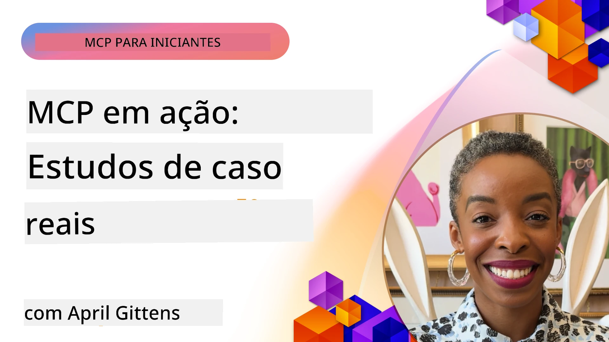

# MCP em Ação: Estudos de Caso do Mundo Real

_(Clique na imagem acima para assistir ao vídeo desta lição)_

O Model Context Protocol (MCP) está transformando a forma como aplicações de IA interagem com dados, ferramentas e serviços. Esta seção apresenta estudos de caso do mundo real que demonstram aplicações práticas do MCP em diversos cenários empresariais.

## Visão Geral

Esta seção exibe exemplos concretos de implementações do MCP, destacando como organizações estão aproveitando este protocolo para resolver desafios complexos de negócios. Ao examinar esses estudos de caso, você obterá insights sobre a versatilidade, escalabilidade e benefícios práticos do MCP em cenários reais.

## Principais Objetivos de Aprendizagem

Ao explorar estes estudos de caso, você irá:

- Entender como o MCP pode ser aplicado para resolver problemas específicos de negócios
- Conhecer diferentes padrões de integração e abordagens arquitetônicas
- Reconhecer boas práticas para implementar MCP em ambientes empresariais
- Obter insights sobre os desafios e soluções encontrados em implementações reais
- Identificar oportunidades para aplicar padrões semelhantes em seus próprios projetos

## Estudos de Caso em Destaque

### 1. [Azure AI Travel Agents – Implementação de Referência](./travelagentsample.md)

Este estudo de caso examina a solução de referência abrangente da Microsoft que demonstra como construir uma aplicação de planejamento de viagens com múltiplos agentes e inteligência artificial usando MCP, Azure OpenAI e Azure AI Search. O projeto apresenta:

- Orquestração multi-agente através do MCP
- Integração de dados empresariais com Azure AI Search
- Arquitetura segura e escalável usando serviços Azure
- Ferramentas extensíveis com componentes MCP reutilizáveis
- Experiência conversacional para o usuário respaldada pelo Azure OpenAI

A arquitetura e detalhes da implementação fornecem insights valiosos para construir sistemas complexos multi-agente com MCP como camada de coordenação.

### 2. [Atualizando Itens do Azure DevOps a partir de Dados do YouTube](./UpdateADOItemsFromYT.md)

Este estudo de caso demonstra uma aplicação prática do MCP para automatizar processos de fluxo de trabalho. Mostra como ferramentas MCP podem ser usadas para:

- Extrair dados de plataformas online (YouTube)
- Atualizar itens de trabalho em sistemas Azure DevOps
- Criar fluxos de trabalho de automação repetíveis
- Integrar dados entre sistemas distintos

Este exemplo ilustra como implementações MCP relativamente simples podem promover ganhos significativos de eficiência automatizando tarefas rotineiras e melhorando a consistência dos dados entre sistemas.

### 3. [Recuperação de Documentação em Tempo Real com MCP](./docs-mcp/README.md)

Este estudo de caso guia você na conexão de um cliente de console Python a um servidor Model Context Protocol (MCP) para recuperar e registrar documentação Microsoft contextual e em tempo real. Você aprenderá a:

- Conectar-se a um servidor MCP usando cliente Python e o SDK oficial MCP
- Usar clientes HTTP streaming para recuperação eficiente de dados em tempo real
- Chamar ferramentas de documentação no servidor e registrar respostas diretamente no console
- Integrar documentação Microsoft atualizada ao seu fluxo de trabalho sem sair do terminal

O capítulo inclui uma tarefa prática, um exemplo mínimo de código funcional e links para recursos adicionais para aprofundamento. Veja o passo a passo completo e o código no capítulo vinculado para entender como o MCP pode transformar o acesso à documentação e a produtividade do desenvolvedor em ambientes baseados em console.

### 4. [Aplicativo Web Interativo Gerador de Plano de Estudos com MCP](./docs-mcp/README.md)

Este estudo de caso demonstra como construir uma aplicação web interativa usando Chainlit e o Model Context Protocol (MCP) para gerar planos de estudo personalizados para qualquer tema. Usuários podem especificar um assunto (como "certificação AI-900") e uma duração de estudo (ex: 8 semanas), e o app fornecerá uma divisão semanal do conteúdo recomendado. Chainlit permite uma interface de chat conversacional, tornando a experiência envolvente e adaptativa.

- Aplicativo web conversacional alimentado pelo Chainlit
- Solicitações do usuário para tópico e duração
- Recomendações semanais de conteúdo usando MCP
- Respostas adaptativas em tempo real na interface de chat

O projeto ilustra como IA conversacional e MCP podem ser combinados para criar ferramentas educacionais dinâmicas e orientadas pelo usuário em um ambiente web moderno.

### 5. [Documentação Dentro do Editor com Servidor MCP no VS Code](./docs-mcp/README.md)

Este estudo de caso demonstra como levar a documentação Microsoft Learn diretamente para seu ambiente VS Code usando o servidor MCP — sem precisar alternar abas do navegador! Você verá como:

- Pesquisar e ler docs instantaneamente dentro do VS Code usando o painel MCP ou a paleta de comandos
- Referenciar documentação e inserir links diretamente em arquivos README ou markdown de cursos
- Usar GitHub Copilot e MCP juntos para fluxos de trabalho de documentação e código integrados e impulsionados por IA
- Validar e aprimorar sua documentação com feedback em tempo real e precisão proveniente da Microsoft
- Integrar MCP com fluxos de trabalho GitHub para validação contínua da documentação

A implementação inclui:

- Exemplo de configuração `.vscode/mcp.json` para configuração fácil
- Guias ilustrados por capturas de tela da experiência dentro do editor
- Dicas para combinar Copilot e MCP para máxima produtividade

Este cenário é ideal para autores de cursos, redatores técnicos e desenvolvedores que desejam manter o foco no editor enquanto trabalham com docs, Copilot e ferramentas de validação — tudo alimentado pelo MCP.

### 6. [Criação de Servidor APIM MCP](./apimsample.md)

Este estudo de caso oferece um guia passo a passo sobre como criar um servidor MCP usando Azure API Management (APIM). Cobre:

- Configuração de um servidor MCP no Azure API Management
- Exposição de operações de API como ferramentas MCP
- Configuração de políticas para controle de taxa e segurança
- Testes do servidor MCP usando Visual Studio Code e GitHub Copilot

Este exemplo ilustra como aproveitar as capacidades do Azure para criar um servidor MCP robusto, que pode ser utilizado em diversas aplicações, aprimorando a integração de sistemas de IA com APIs empresariais.

### 7. [Registro GitHub MCP — Acelerando a Integração Agentic](https://github.com/mcp)

Este estudo de caso examina como o Registro MCP do GitHub, lançado em setembro de 2025, soluciona um desafio crítico no ecossistema de IA: a descoberta e implantação fragmentadas dos servidores Model Context Protocol (MCP).

#### Visão Geral
O **Registro MCP** resolve a dor crescente dos servidores MCP dispersos entre repositórios e registros, o que anteriormente tornava a integração lenta e sujeita a erros. Esses servidores permitem que agentes de IA interajam com sistemas externos como APIs, bancos de dados e fontes de documentação.

#### Declaração do Problema
Desenvolvedores criando fluxos agentic enfrentavam vários desafios:
- **Má descobribilidade** de servidores MCP em diferentes plataformas
- **Perguntas redundantes de configuração** espalhadas em fóruns e documentos
- **Riscos de segurança** oriundos de fontes não verificadas e não confiáveis
- **Falta de padronização** na qualidade e compatibilidade dos servidores

#### Arquitetura da Solução
O Registro MCP do GitHub centraliza servidores MCP confiáveis com recursos chave:
- **Instalação com um clique** via VS Code para configuração simplificada
- **Classificação signal-over-noise** por estrelas, atividade e validação comunitária
- **Integração direta** com GitHub Copilot e outras ferramentas compatíveis MCP
- **Modelo aberto de contribuição** permitindo participação da comunidade e parceiros empresariais

#### Impacto nos Negócios
O registro entregou melhorias mensuráveis:
- **Onboarding mais rápido** para desenvolvedores usando ferramentas como o Microsoft Learn MCP Server, que transmite documentação oficial diretamente para agentes
- **Produtividade aprimorada** por meio de servidores especializados como `github-mcp-server`, que possibilitam automações naturais em linguagem GitHub (criação de PR, reinício de CI, análise de código)
- **Maior confiança no ecossistema** via listagens curadas e padrões transparentes de configuração

#### Valor Estratégico
Para profissionais especializados em gerenciamento do ciclo de vida de agentes e fluxos de trabalho reprodutíveis, o Registro MCP fornece:
- **Capacidades modulares para implantação de agentes** com componentes padronizados
- **Pipelines de avaliação com suporte do registro** para testes e validação consistentes
- **Interoperabilidade entre ferramentas** para integração fluida em diferentes plataformas de IA

Este estudo de caso demonstra que o Registro MCP é mais que um diretório — é uma plataforma fundamental para integração escalável de modelos e implantação de sistemas agentic no mundo real.

## Conclusão

Estes sete estudos de caso abrangentes demonstram a notável versatilidade e as aplicações práticas do Model Context Protocol em diversos cenários reais. Desde sistemas complexos de planejamento de viagens multi-agente e gerenciamento empresarial de API até fluxos de trabalho simplificados de documentação e o revolucionário Registro MCP do GitHub, estes exemplos mostram como o MCP oferece uma forma padronizada e escalável de conectar sistemas de IA com as ferramentas, dados e serviços necessários para entregar valor excepcional.

Os estudos de caso abrangem múltiplas dimensões de implementação do MCP:
- **Integração Empresarial**: Azure API Management e automação Azure DevOps
- **Orquestração Multi-Agente**: Planejamento de viagens com agentes de IA coordenados
- **Produtividade do Desenvolvedor**: Integração VS Code e acesso em tempo real a documentação
- **Desenvolvimento do Ecossistema**: Registro MCP do GitHub como plataforma fundamental
- **Aplicações Educacionais**: Geradores interativos de planos de estudo e interfaces conversacionais

Ao estudar essas implementações, você obtém insights críticos sobre:
- **Padrões arquiteturais** para diferentes escalas e casos de uso
- **Estratégias de implementação** que equilibram funcionalidade e manutenção
- **Considerações de segurança e escalabilidade** para implantações de produção
- **Boas práticas** para desenvolvimento de servidores MCP e integração de clientes
- **Pensamento de ecossistema** para construir soluções interconectadas movidas a IA

Esses exemplos demonstram coletivamente que o MCP não é apenas um framework teórico, mas um protocolo maduro e pronto para produção que permite soluções práticas para desafios complexos de negócios. Seja construindo ferramentas simples de automação ou sistemas multi-agente sofisticados, os padrões e abordagens ilustrados aqui fornecem uma base sólida para seus próprios projetos MCP.

## Recursos Adicionais

- [Repositório GitHub Azure AI Travel Agents](https://github.com/Azure-Samples/azure-ai-travel-agents)
- [Ferramenta MCP Azure DevOps](https://github.com/microsoft/azure-devops-mcp)
- [Ferramenta MCP Playwright](https://github.com/microsoft/playwright-mcp)
- [Servidor MCP Microsoft Docs](https://github.com/MicrosoftDocs/mcp)
- [Registro GitHub MCP — Acelerando a Integração Agentic](https://github.com/mcp)
- [Exemplos da Comunidade MCP](https://github.com/microsoft/mcp)

## O que vem a seguir

- Anterior: [Módulo 8: Melhores Práticas](../08-BestPractices/README.md)
- Próximo: [Módulo 10: Otimizando Fluxos de Trabalho de IA: Construindo um Servidor MCP com AI Toolkit](../10-StreamliningAIWorkflowsBuildingAnMCPServerWithAIToolkit/README.md)

---

<!-- CO-OP TRANSLATOR DISCLAIMER START -->
**Aviso Legal**:  
Este documento foi traduzido utilizando o serviço de tradução por IA [Co-op Translator](https://github.com/Azure/co-op-translator). Embora nos esforcemos para garantir a precisão, esteja ciente de que traduções automáticas podem conter erros ou imprecisões. O documento original em seu idioma nativo deve ser considerado a fonte autorizada. Para informações críticas, recomenda-se tradução profissional feita por humanos. Não nos responsabilizamos por quaisquer mal-entendidos ou interpretações incorretas decorrentes do uso desta tradução.
<!-- CO-OP TRANSLATOR DISCLAIMER END -->