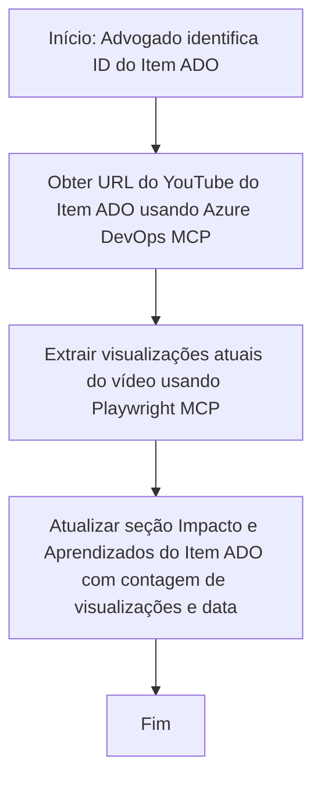

# Estudo de Caso: Atualizando Itens do Azure DevOps com Dados do YouTube usando MCP

> **Aviso:** Existem ferramentas e relatórios online que podem automatizar o processo de atualização dos itens do Azure DevOps com dados de plataformas como o YouTube. O cenário a seguir é fornecido puramente como um exemplo de caso de uso para ilustrar como as ferramentas MCP podem ser aplicadas para tarefas de automação e integração.

## Visão Geral

Este estudo de caso demonstra um exemplo de como o Model Context Protocol (MCP) e suas ferramentas podem ser usados para automatizar o processo de atualização dos itens de trabalho do Azure DevOps (ADO) com informações provenientes de plataformas online, como o YouTube. O cenário descrito é apenas uma ilustração das capacidades mais amplas dessas ferramentas, que podem ser adaptadas para muitas necessidades similares de automação.

Neste exemplo, um Advocate acompanha sessões online usando itens ADO, onde cada item inclui uma URL de vídeo do YouTube. Ao utilizar as ferramentas MCP, o Advocate pode manter os itens ADO atualizados com as métricas mais recentes dos vídeos, como o número de visualizações, de maneira repetível e automatizada. Essa abordagem pode ser generalizada para outros casos em que informações de fontes online precisam ser integradas ao ADO ou a outros sistemas.

## Cenário

Um Advocate é responsável por acompanhar o impacto das sessões online e engajamentos comunitários. Cada sessão é registrada como um item de trabalho ADO no projeto 'DevRel', e o item contém um campo para a URL do vídeo no YouTube. Para relatar com precisão o alcance da sessão, o Advocate precisa atualizar o item ADO com o número atual de visualizações do vídeo e a data em que essa informação foi obtida.

## Ferramentas Utilizadas

- [Azure DevOps MCP](https://github.com/microsoft/azure-devops-mcp): Permite acesso programático e atualizações nos itens de trabalho ADO via MCP.
- [Playwright MCP](https://github.com/microsoft/playwright-mcp): Automatiza ações no navegador para extrair dados ao vivo de páginas web, como estatísticas de vídeos no YouTube.

## Fluxo de Trabalho Passo a Passo

1. **Identificar o Item ADO**: Comece com o ID do item de trabalho ADO (por exemplo, 1234) no projeto 'DevRel'.
2. **Recuperar a URL do YouTube**: Use a ferramenta Azure DevOps MCP para obter a URL do YouTube a partir do item de trabalho.
3. **Extrair Visualizações do Vídeo**: Use a ferramenta Playwright MCP para navegar até a URL do YouTube e extrair o número atual de visualizações.
4. **Atualizar o Item ADO**: Grave a contagem mais recente de visualizações e a data da obtenção no campo 'Impacto e Aprendizados' do item de trabalho ADO usando a ferramenta Azure DevOps MCP.

## Exemplo de Prompt

```bash
- Work with the ADO Item ID: 1234
- The project is '2025-Awesome'
- Get the YouTube URL for the ADO item
- Use Playwright to get the current views from the YouTube video
- Update the ADO item with the current video views and the updated date of the information
```

## Diagrama de Fluxo Mermaid


## Implementação Técnica

- **Orquestração MCP**: O fluxo de trabalho é orquestrado por um servidor MCP, que coordena o uso das ferramentas Azure DevOps MCP e Playwright MCP.
- **Automação**: O processo pode ser acionado manualmente ou agendado para rodar em intervalos regulares para manter os itens ADO atualizados.
- **Extensibilidade**: O mesmo padrão pode ser estendido para atualizar itens ADO com outras métricas online (ex.: curtidas, comentários) ou de outras plataformas.

## Resultados e Impacto

- **Eficiência**: Reduz o esforço manual dos Advocates ao automatizar a obtenção e atualização das métricas dos vídeos.
- **Precisão**: Garante que os itens ADO reflitam os dados mais atuais disponíveis a partir de fontes online.
- **Repetibilidade**: Fornece um fluxo de trabalho reutilizável para cenários similares envolvendo outras fontes de dados ou métricas.

## Referências

- [Azure DevOps MCP](https://github.com/microsoft/azure-devops-mcp)
- [Playwright MCP](https://github.com/microsoft/playwright-mcp)
- [Model Context Protocol (MCP)](https://modelcontextprotocol.io/)

## Próximos Passos

- Voltar para: [Visão Geral dos Estudos de Caso](./README.md)
- Próximo: [Recuperação de Documentação em Tempo Real com MCP](./docs-mcp/README.md)

---

<!-- CO-OP TRANSLATOR DISCLAIMER START -->
**Aviso Legal**:  
Este documento foi traduzido usando o serviço de tradução por IA [Co-op Translator](https://github.com/Azure/co-op-translator). Embora nos esforcemos para garantir a precisão, esteja ciente de que traduções automatizadas podem conter erros ou imprecisões. O documento original em seu idioma nativo deve ser considerado a fonte autoritativa. Para informações críticas, recomenda-se tradução profissional humana. Não nos responsabilizamos por quaisquer mal-entendidos ou interpretações incorretas decorrentes do uso desta tradução.
<!-- CO-OP TRANSLATOR DISCLAIMER END -->