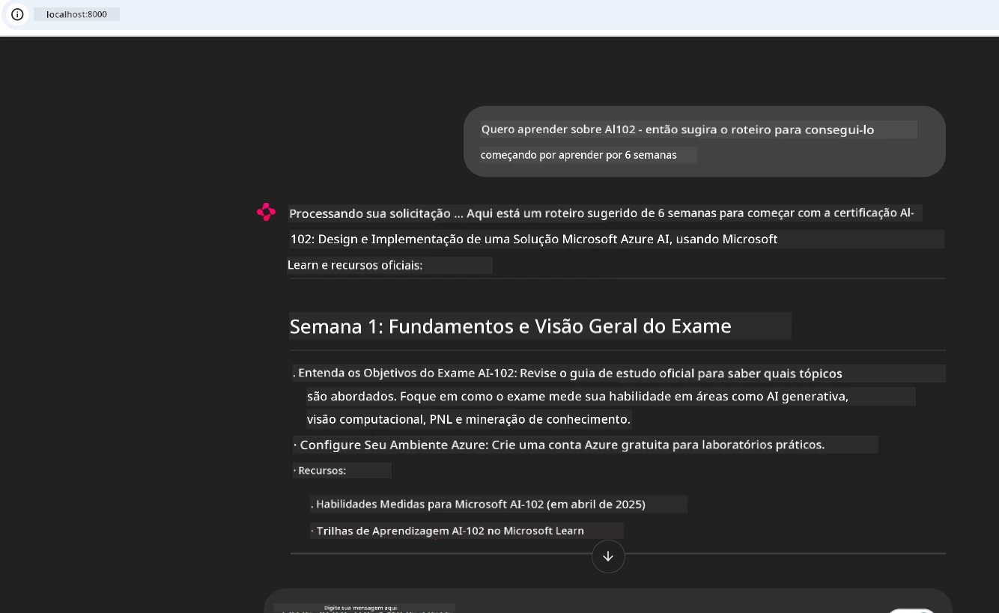
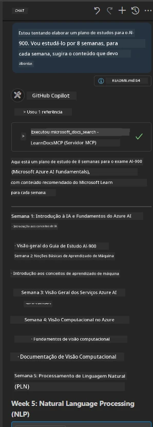

# Estudo de Caso: Conectando ao Servidor MCP do Microsoft Learn Docs a partir de um Cliente

Você já se pegou alternando entre sites de documentação, Stack Overflow e inúmeras abas de motores de busca, tudo enquanto tenta resolver um problema no seu código? Talvez você mantenha um segundo monitor só para as docs, ou esteja constantemente alternando entre seu IDE e um navegador. Não seria melhor se você pudesse trazer a documentação diretamente para seu fluxo de trabalho — integrada aos seus aplicativos, seu IDE ou até mesmo suas próprias ferramentas personalizadas? Neste estudo de caso, vamos explorar como fazer exatamente isso conectando-se diretamente ao servidor MCP do Microsoft Learn Docs a partir do seu próprio aplicativo cliente.

## Visão Geral

O desenvolvimento moderno é mais do que apenas escrever código — trata-se de encontrar a informação certa no momento certo. A documentação está em toda parte, mas raramente onde você mais precisa: dentro das suas ferramentas e fluxos de trabalho. Ao integrar a recuperação da documentação diretamente em seus aplicativos, você pode economizar tempo, reduzir a troca de contexto e aumentar a produtividade. Nesta seção, mostraremos como conectar um cliente ao servidor MCP do Microsoft Learn Docs, para que você possa acessar documentação em tempo real e consciente do contexto sem nunca sair do seu app.

Vamos passar pelo processo de estabelecer uma conexão, enviar uma solicitação e lidar eficientemente com respostas em streaming. Essa abordagem não só agiliza seu fluxo de trabalho como também abre a porta para construir ferramentas de desenvolvimento mais inteligentes e úteis.

## Objetivos de Aprendizagem

Por que estamos fazendo isso? Porque as melhores experiências para desenvolvedores são aquelas que eliminam atritos. Imagine um mundo onde seu editor de código, chatbot ou aplicativo web possa responder instantaneamente às suas perguntas de documentação, usando o conteúdo mais recente do Microsoft Learn. Ao final deste capítulo, você saberá como:

- Compreender os conceitos básicos da comunicação servidor-cliente MCP para documentação
- Implementar um aplicativo de console ou web para conectar-se ao servidor MCP do Microsoft Learn Docs
- Usar clientes HTTP com streaming para recuperação de documentação em tempo real
- Registrar e interpretar respostas de documentação em seu aplicativo

Você verá como essas habilidades podem ajudá-lo a construir ferramentas que não são apenas reativas, mas verdadeiramente interativas e conscientes do contexto.

## Cenário 1 - Recuperação de Documentação em Tempo Real com MCP

Neste cenário, vamos mostrar como conectar um cliente ao servidor MCP do Microsoft Learn Docs, para que você possa acessar documentação em tempo real e consciente do contexto sem nunca sair do seu app.

Vamos colocar isso em prática. Sua tarefa é escrever um aplicativo que se conecte ao servidor MCP do Microsoft Learn Docs, invoque a ferramenta `microsoft_docs_search` e registre a resposta streaming no console.

### Por que essa abordagem?  
Porque é a base para construir integrações mais avançadas — seja para alimentar um chatbot, uma extensão do IDE ou um painel web.

Você encontrará o código e as instruções para este cenário na pasta [`solution`](./solution/README.md) dentro deste estudo de caso. Os passos irão guiá-lo na configuração da conexão:  
- Usar o SDK oficial MCP e cliente HTTP com streaming para conexão  
- Chamar a ferramenta `microsoft_docs_search` com um parâmetro de consulta para recuperar a documentação  
- Implementar o registro apropriado e tratamento de erros  
- Criar uma interface de console interativa para permitir aos usuários inserir múltiplas consultas de pesquisa  

Este cenário demonstra como:  
- Conectar-se ao servidor Docs MCP  
- Enviar uma consulta  
- Analisar e imprimir os resultados  

Veja como executar a solução pode parecer:

```
Prompt> What is Azure Key Vault?
Answer> Azure Key Vault is a cloud service for securely storing and accessing secrets. ...
```
  
Abaixo está uma solução de amostra mínima. O código completo e os detalhes estão disponíveis na pasta de solução.

<details>  
<summary>Python</summary>

```python
import asyncio
from mcp.client.streamable_http import streamablehttp_client
from mcp import ClientSession

async def main():
    async with streamablehttp_client("https://learn.microsoft.com/api/mcp") as (read_stream, write_stream, _):
        async with ClientSession(read_stream, write_stream) as session:
            await session.initialize()
            result = await session.call_tool("microsoft_docs_search", {"query": "Azure Functions best practices"})
            print(result.content)

if __name__ == "__main__":
    asyncio.run(main())
```
  
- Para a implementação completa e logs, veja [`scenario1.py`](../../../../09-CaseStudy/docs-mcp/solution/python/scenario1.py).  
- Para instruções de instalação e uso, veja o arquivo [`README.md`](./solution/python/README.md) na mesma pasta.  
</details>  


## Cenário 2 - Gerador de Plano de Estudo Interativo com MCP em Aplicativo Web

Neste cenário, você aprenderá como integrar o Docs MCP em um projeto de desenvolvimento web. O objetivo é permitir que usuários pesquisem a documentação do Microsoft Learn diretamente de uma interface web, tornando a documentação instantaneamente acessível dentro do seu app ou site.

Você verá como:  
- Configurar um aplicativo web  
- Conectar-se ao servidor Docs MCP  
- Lidar com a entrada do usuário e exibir resultados  

Veja como executar a solução pode parecer:

```
User> I want to learn about AI102 - so suggest the roadmap to get it started from learn for 6 weeks

Assistant> Here’s a detailed 6-week roadmap to start your preparation for the AI-102: Designing and Implementing a Microsoft Azure AI Solution certification, using official Microsoft resources and focusing on exam skills areas:

---
## Week 1: Introduction & Fundamentals
- **Understand the Exam**: Review the [AI-102 exam skills outline](https://learn.microsoft.com/en-us/credentials/certifications/exams/ai-102/).
- **Set up Azure**: Sign up for a free Azure account if you don't have one.
- **Learning Path**: [Introduction to Azure AI services](https://learn.microsoft.com/en-us/training/modules/intro-to-azure-ai/)
- **Focus**: Get familiar with Azure portal, AI capabilities, and necessary tools.

....more weeks of the roadmap...

Let me know if you want module-specific recommendations or need more customized weekly tasks!
```
  
Abaixo está uma solução de amostra mínima. O código completo e os detalhes estão disponíveis na pasta de solução.



<details>  
<summary>Python (Chainlit)</summary>

Chainlit é uma estrutura para construir aplicativos web de IA conversacional. Ela torna fácil criar chatbots interativos e assistentes que podem chamar ferramentas MCP e exibir resultados em tempo real. É ideal para prototipagem rápida e interfaces amigáveis ao usuário.

```python
import chainlit as cl
import requests

MCP_URL = "https://learn.microsoft.com/api/mcp"

@cl.on_message
def handle_message(message):
    query = {"question": message}
    response = requests.post(MCP_URL, json=query)
    if response.ok:
        result = response.json()
        cl.Message(content=result.get("answer", "No answer found.")).send()
    else:
        cl.Message(content="Error: " + response.text).send()
```
  
- Para a implementação completa, veja [`scenario2.py`](../../../../09-CaseStudy/docs-mcp/solution/python/scenario2.py).  
- Para instruções de configuração e execução, veja o [`README.md`](./solution/python/README.md).  
</details>  


## Cenário 3: Docs no Editor com Servidor MCP no VS Code

Se você quer ter o Microsoft Learn Docs diretamente dentro do seu VS Code (em vez de alternar abas do navegador), você pode usar o servidor MCP no seu editor. Isso permite:  
- Pesquisar e ler docs no VS Code sem sair do seu ambiente de desenvolvimento.  
- Referenciar documentação e inserir links diretamente em seus arquivos README ou cursos.  
- Aproveitar o GitHub Copilot e MCP juntos para um fluxo de trabalho de documentação movido por IA e integrado.  

**Você verá como:**  
- Adicionar um arquivo `.vscode/mcp.json` válido na raiz do seu workspace (veja exemplo abaixo).  
- Abrir o painel MCP ou usar a paleta de comandos no VS Code para pesquisar e inserir docs.  
- Referenciar a documentação diretamente em seus arquivos markdown enquanto trabalha.  
- Combinar esse fluxo com o GitHub Copilot para ainda mais produtividade.  

Aqui está um exemplo de como configurar o servidor MCP no VS Code:

```json
{
  "servers": {
    "LearnDocsMCP": {
      "url": "https://learn.microsoft.com/api/mcp"
    }
  }
}
```
  
</details>

> Para um passo a passo detalhado com screenshots e guia passo-a-passo, veja [`README.md`](./solution/scenario3/README.md).



Essa abordagem é ideal para quem está construindo cursos técnicos, escrevendo documentação ou desenvolvendo código com necessidades frequentes de referência.

## Principais Conclusões

Integrar documentação diretamente em suas ferramentas não é apenas uma conveniência — é um divisor de águas para produtividade. Ao conectar-se ao servidor MCP do Microsoft Learn Docs a partir do seu cliente, você pode:

- Eliminar a troca de contexto entre seu código e a documentação  
- Recuperar docs atualizados e conscientes do contexto em tempo real  
- Construir ferramentas de desenvolvimento mais inteligentes e interativas  

Essas habilidades ajudarão você a criar soluções que são não só eficientes, mas também agradáveis de usar.

## Recursos Adicionais

Para aprofundar seu entendimento, explore esses recursos oficiais:

- [Microsoft Learn Docs MCP Server (GitHub)](https://github.com/MicrosoftDocs/mcp)  
- [Comece com Azure MCP Server (mcp-python)](https://learn.microsoft.com/en-us/azure/developer/azure-mcp-server/get-started#create-the-python-app)  
- [O que é o Azure MCP Server?](https://learn.microsoft.com/en-us/azure/developer/azure-mcp-server/)  
- [Introdução ao Model Context Protocol (MCP)](https://modelcontextprotocol.io/introduction)  
- [Adicionar plugins de um Servidor MCP (Python)](https://learn.microsoft.com/en-us/semantic-kernel/concepts/plugins/adding-mcp-plugins)  

## O Que Vem a Seguir

- Voltar para: [Visão Geral dos Estudos de Caso](../README.md)  
- Continuar para: [Módulo 10: Otimizando Fluxos de Trabalho de IA com AI Toolkit](../../10-StreamliningAIWorkflowsBuildingAnMCPServerWithAIToolkit/README.md)

---

<!-- CO-OP TRANSLATOR DISCLAIMER START -->
**Aviso Legal**:
Este documento foi traduzido utilizando o serviço de tradução por IA [Co-op Translator](https://github.com/Azure/co-op-translator). Embora nos esforcemos para garantir a precisão, esteja ciente de que traduções automáticas podem conter erros ou imprecisões. O documento original em seu idioma nativo deve ser considerado a fonte autorizada. Para informações críticas, recomenda-se a tradução profissional feita por humanos. Não nos responsabilizamos por quaisquer mal-entendidos ou interpretações equivocadas decorrentes do uso desta tradução.
<!-- CO-OP TRANSLATOR DISCLAIMER END -->