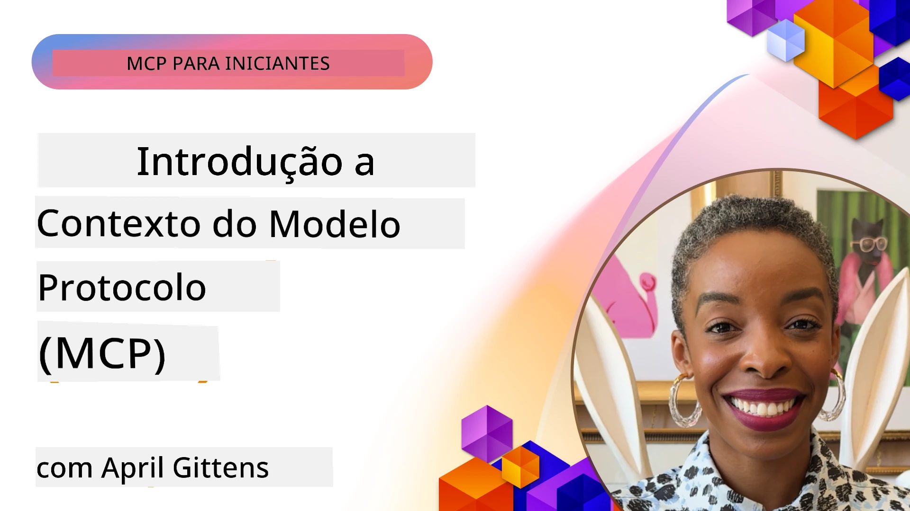
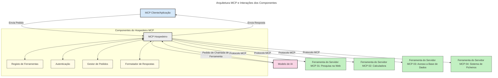

# Introdução ao Protocolo de Contexto de Modelo (MCP): Por Que É Importante para Aplicações de IA Escaláveis

[](https://youtu.be/agBbdiOPLQA)

_(Clique na imagem acima para ver o vídeo desta lição)_

As aplicações de IA generativa são um grande avanço, pois muitas vezes permitem ao utilizador interagir com a aplicação utilizando comandos em linguagem natural. No entanto, à medida que se investe mais tempo e recursos nestas aplicações, queremos assegurar que é fácil integrar funcionalidades e recursos de modo a que seja simples de expandir, que a aplicação possa suportar mais do que um modelo em uso, e gerir diversas complexidades dos modelos. Em resumo, criar aplicações de IA generativa é fácil no início, mas à medida que crescem e se tornam mais complexas, é necessário começar a definir uma arquitetura e provavelmente será necessário recorrer a um padrão para garantir que as aplicações são construídas de forma consistente. É aqui que o MCP entra para organizar e fornecer um padrão.

---

## **🔍 O Que É o Protocolo de Contexto de Modelo (MCP)?**

O **Protocolo de Contexto de Modelo (MCP)** é uma **interface aberta e padronizada** que permite que Grandes Modelos de Linguagem (LLMs) interajam sem problemas com ferramentas externas, APIs e fontes de dados. Fornece uma arquitetura consistente para ampliar a funcionalidade dos modelos de IA para além dos seus dados de treino, possibilitando sistemas de IA mais inteligentes, escaláveis e responsivos.

---

## **🎯 Por Que a Padronização na IA É Importante**

À medida que as aplicações de IA generativa se tornam mais complexas, é essencial adotar padrões que garantam **escalabilidade, extensibilidade, manutenção** e **evitem o aprisionamento a fornecedores específicos**. O MCP responde a estas necessidades ao:

- Unificar as integrações entre modelos e ferramentas
- Reduzir soluções frágeis e únicas personalizadas
- Permitir que múltiplos modelos de diferentes fornecedores coexistam num único ecossistema

**Nota:** Embora o MCP se apresente como um padrão aberto, não há planos para padronizar o MCP através de quaisquer organismos de normalização existentes como IEEE, IETF, W3C, ISO ou qualquer outro organismo de normalização.

---

## **📚 Objetivos de Aprendizagem**

Ao final deste artigo, será capaz de:

- Definir o **Protocolo de Contexto de Modelo (MCP)** e os seus casos de uso
- Compreender como o MCP padroniza a comunicação entre modelo e ferramenta
- Identificar os principais componentes da arquitetura MCP
- Explorar aplicações reais do MCP em contextos empresariais e de desenvolvimento

---

## **💡 Por Que o Protocolo de Contexto de Modelo (MCP) É um Marco**

### **🔗 O MCP Resolve a Fragmentação nas Interações de IA**

Antes do MCP, integrar modelos com ferramentas requeria:

- Código personalizado para cada par ferramenta-modelo
- APIs não padronizadas para cada fornecedor
- Quebras frequentes devido a atualizações
- Má escalabilidade com o aumento das ferramentas

### **✅ Benefícios da Padronização MCP**

| **Benefício**            | **Descrição**                                                                 |
|--------------------------|-------------------------------------------------------------------------------|
| Interoperabilidade       | LLMs funcionam sem problemas com ferramentas de diferentes fornecedores       |
| Consistência             | Comportamento uniforme em plataformas e ferramentas                            |
| Reutilização             | Ferramentas desenvolvidas uma vez podem ser usadas em vários projetos e sistemas |
| Desenvolvimento Acelerado| Reduz o tempo de desenvolvimento usando interfaces padronizadas e plug-and-play|

---

## **🧱 Visão Geral da Arquitetura MCP a Alto Nível**

O MCP segue um **modelo cliente-servidor**, onde:

- **Hosts MCP** executam os modelos de IA
- **Clientes MCP** iniciam pedidos
- **Servidores MCP** fornecem contexto, ferramentas e capacidades

### **Componentes-Chave:**

- **Recursos** – Dados estáticos ou dinâmicos para os modelos  
- **Prompts** – Fluxos de trabalho pré-definidos para geração guiada  
- **Ferramentas** – Funções executáveis como pesquisa, cálculos  
- **Amostragem** – Comportamento agente via interações recursivas  
- **Elicitação** – Pedidos iniciados pelo servidor para input do utilizador  
- **Roots** – Limites no sistema de ficheiros para controlo de acesso do servidor

### **Arquitetura do Protocolo:**

O MCP usa uma arquitetura em duas camadas:
- **Camada de Dados**: Comunicação baseada em JSON-RPC 2.0 com gestão de ciclo de vida e primitivas
- **Camada de Transporte**: Canais de comunicação STDIO (local) e HTTP transmissível com SSE (remoto)

---

## Como Funcionam os Servidores MCP

Os servidores MCP operam da seguinte forma:

- **Fluxo de Pedido**:
    1. Um pedido é iniciado por um utilizador final ou software que age em seu nome.
    2. O **Cliente MCP** envia o pedido a um **Host MCP**, que gere o runtime do Modelo AI.
    3. O **Modelo AI** recebe o prompt do utilizador e pode solicitar acesso a ferramentas ou dados externos via uma ou mais chamadas às ferramentas.
    4. O **Host MCP**, não o modelo diretamente, comunica com o(s) **Servidor(es) MCP** apropriado(s) usando o protocolo padronizado.
- **Funcionalidade do Host MCP**:
    - **Registo de Ferramentas**: Mantém um catálogo das ferramentas disponíveis e suas capacidades.
    - **Autenticação**: Verifica permissões para acesso a ferramentas.
    - **Gestor de Pedidos**: Processa pedidos de ferramentas recebidos do modelo.
    - **Formatador de Respostas**: Estrutura as saídas das ferramentas num formato que o modelo compreenda.
- **Execução do Servidor MCP**:
    - O **Host MCP** encaminha chamadas das ferramentas para um ou vários **Servidores MCP**, cada um expondo funções especializadas (ex: pesquisa, cálculos, consultas a bases de dados).
    - Os **Servidores MCP** realizam as operações respetivas e retornam os resultados ao **Host MCP** num formato consistente.
    - O **Host MCP** formata e encaminha esses resultados para o **Modelo AI**.
- **Concretização da Resposta**:
    - O **Modelo AI** incorpora as saídas das ferramentas na resposta final.
    - O **Host MCP** envia esta resposta de volta ao **Cliente MCP**, que a entrega ao utilizador final ou software que chamou.
    


## 👨‍💻 Como Construir um Servidor MCP (Com Exemplos)

Os servidores MCP permitem expandir as capacidades dos LLMs fornecendo dados e funcionalidades.

Pronto para experimentar? Aqui estão SDKs específicos de linguagens e/ou stacks com exemplos de criação de servidores MCP simples em diferentes linguagens/stacks:

- **SDK Python**: https://github.com/modelcontextprotocol/python-sdk

- **SDK TypeScript**: https://github.com/modelcontextprotocol/typescript-sdk

- **SDK Java**: https://github.com/modelcontextprotocol/java-sdk

- **SDK C#/.NET**: https://github.com/modelcontextprotocol/csharp-sdk


## 🌍 Casos de Uso Reais para MCP

O MCP permite uma grande variedade de aplicações ao estender as capacidades da IA:

| **Aplicação**                | **Descrição**                                                                 |
|-----------------------------|--------------------------------------------------------------------------------|
| Integração de Dados Empresariais | Conectar LLMs a bases de dados, CRM ou ferramentas internas                  |
| Sistemas de IA Agentes       | Permitir agentes autónomos com acesso a ferramentas e fluxos de decisão        |
| Aplicações Multimodais       | Combinar ferramentas de texto, imagem e áudio numa única aplicação AI unificada|
| Integração de Dados em Tempo Real | Incorporar dados ao vivo em interações de AI para resultados mais precisos e atuais |


### 🧠 MCP = Padrão Universal para Interações de IA

O Protocolo de Contexto de Modelo (MCP) atua como um padrão universal para interações de IA, tal como o USB-C padronizou ligações físicas para dispositivos. No mundo da IA, o MCP fornece uma interface consistente, permitindo que modelos (clientes) integrem-se sem problemas com ferramentas externas e fornecedores de dados (servidores). Isto elimina a necessidade de protocolos diversos e personalizados para cada API ou fonte de dados.

Sob o MCP, uma ferramenta compatível (referida como servidor MCP) segue um padrão unificado. Estes servidores podem listar as ferramentas ou ações que oferecem e executar essas ações quando solicitadas por um agente de IA. Plataformas de agentes de IA que suportam MCP são capazes de descobrir ferramentas disponíveis nos servidores e invocá-las através deste protocolo padrão.

### 💡 Facilita o acesso ao conhecimento

Para além de oferecer ferramentas, o MCP facilita também o acesso ao conhecimento. Permite aplicações fornecerem contexto a grandes modelos de linguagem (LLMs) ligando-os a várias fontes de dados. Por exemplo, um servidor MCP pode representar o repositório de documentos de uma empresa, permitindo que agentes recuperem informação relevante sob demanda. Outro servidor pode tratar ações específicas como envio de emails ou atualização de registos. Para o agente, estas são simplesmente ferramentas que pode usar — algumas ferramentas devolvem dados (contexto de conhecimento), enquanto outras executam ações. O MCP gere eficientemente ambos.

Um agente que se liga a um servidor MCP aprende automaticamente as capacidades disponíveis do servidor e os dados acessíveis através de um formato padrão. Esta padronização permite a disponibilidade dinâmica de ferramentas. Por exemplo, adicionar um novo servidor MCP ao sistema de um agente torna imediatamente as suas funções utilizáveis sem necessidade de mais personalização das instruções do agente.

Esta integração simplificada alinha-se com o fluxo representado no diagrama seguinte, onde servidores fornecem tanto ferramentas como conhecimento, assegurando colaboração contínua entre sistemas.

### 👉 Exemplo: Solução Escalável para Agentes

```mermaid
---
title: Solução de Agente Escalável com MCP
description: Um diagrama que ilustra como um utilizador interage com um LLM que se liga a múltiplos servidores MCP, com cada servidor a fornecer tanto conhecimento como ferramentas, criando uma arquitetura de sistema de IA escalável
---
graph TD
    User -->|Prompt| LLM
    LLM -->|Resposta| User
    LLM -->|MCP| ServerA
    LLM -->|MCP| ServerB
    ServerA -->|Ligador universal| ServerB
    ServerA --> KnowledgeA
    ServerA --> ToolsA
    ServerB --> KnowledgeB
    ServerB --> ToolsB

    subgraph Server A
        KnowledgeA[Conhecimento]
        ToolsA[Ferramentas]
    end

    subgraph Server B
        KnowledgeB[Conhecimento]
        ToolsB[Ferramentas]
    end
```O Universal Connector permite que servidores MCP comuniquem e partilhem capacidades entre si, permitindo que o ServerA delegue tarefas no ServerB ou aceda às suas ferramentas e conhecimento. Isto federar ferramentas e dados através dos servidores, suportando arquiteturas de agentes escaláveis e modulares. Porque o MCP padroniza a exposição de ferramentas, os agentes podem descobrir dinamicamente e encaminhar pedidos entre servidores sem integrações codificadas.

Federação de ferramentas e conhecimento: Ferramentas e dados podem ser acedidos entre servidores, permitindo arquiteturas de agentes mais escaláveis e modulares.

### 🔄 Cenários Avançados MCP com Integração de LLM no Lado Cliente

Para além da arquitetura básica MCP, existem cenários avançados onde tanto cliente como servidor contêm LLMs, permitindo interações mais sofisticadas. No diagrama seguinte, a **Aplicação Cliente** pode ser um IDE com várias ferramentas MCP disponíveis para uso pelo LLM:

```mermaid
---
title: Cenários Avançados MCP com Integração Cliente-Servidor LLM
description: Um diagrama de sequência que mostra o fluxo detalhado de interação entre utilizador, aplicação cliente, LLM cliente, múltiplos servidores MCP, e LLM servidor, ilustrando descoberta de ferramentas, interação do utilizador, chamada direta de ferramentas e fases de negociação de funcionalidades
---
sequenceDiagram
    autonumber
    actor User as 👤 Utilizador
    participant ClientApp as 🖥️ App Cliente
    participant ClientLLM as 🧠 LLM Cliente
    participant Server1 as 🔧 Servidor MCP 1
    participant Server2 as 📚 Servidor MCP 2
    participant ServerLLM as 🤖 LLM Servidor
    
    %% Discovery Phase
    rect rgb(220, 240, 255)
        Note over ClientApp, Server2: FASE DE DESCOBERTA DE FERRAMENTAS
        ClientApp->>+Server1: Pedir ferramentas/recursos disponíveis
        Server1-->>-ClientApp: Devolver lista de ferramentas (JSON)
        ClientApp->>+Server2: Pedir ferramentas/recursos disponíveis
        Server2-->>-ClientApp: Devolver lista de ferramentas (JSON)
        Note right of ClientApp: Armazenar catálogo<br/>de ferramentas combinado localmente
    end
    
    %% User Interaction
    rect rgb(255, 240, 220)
        Note over User, ClientLLM: FASE DE INTERAÇÃO DO UTILIZADOR
        User->>+ClientApp: Introduzir prompt em linguagem natural
        ClientApp->>+ClientLLM: Encaminhar prompt + catálogo de ferramentas
        ClientLLM->>-ClientLLM: Analisar prompt & selecionar ferramentas
    end
    
    %% Scenario A: Direct Tool Calling
    alt Chamada Direta de Ferramentas
        rect rgb(220, 255, 220)
            Note over ClientApp, Server1: CENÁRIO A: CHAMADA DIRETA DE FERRAMENTAS
            ClientLLM->>+ClientApp: Solicitar execução de ferramenta
            ClientApp->>+Server1: Executar ferramenta específica
            Server1-->>-ClientApp: Devolver resultados
            ClientApp->>+ClientLLM: Processar resultados
            ClientLLM-->>-ClientApp: Gerar resposta
            ClientApp-->>-User: Mostrar resposta final
        end
    
    %% Scenario B: Feature Negotiation (VS Code style)
    else Negociação de Funcionalidades (estilo VS Code)
        rect rgb(255, 220, 220)
            Note over ClientApp, ServerLLM: CENÁRIO B: NEGOCIAÇÃO DE FUNCIONALIDADES
            ClientLLM->>+ClientApp: Identificar capacidades necessárias
            ClientApp->>+Server2: Negociar funcionalidades/capacidades
            Server2->>+ServerLLM: Pedir contexto adicional
            ServerLLM-->>-Server2: Fornecer contexto
            Server2-->>-ClientApp: Devolver funcionalidades disponíveis
            ClientApp->>+Server2: Chamar ferramentas negociadas
            Server2-->>-ClientApp: Devolver resultados
            ClientApp->>+ClientLLM: Processar resultados
            ClientLLM-->>-ClientApp: Gerar resposta
            ClientApp-->>-User: Mostrar resposta final
        end
    end
```
## 🔐 Benefícios Práticos do MCP

Aqui estão os benefícios práticos de usar MCP:

- **Atualização**: Modelos podem aceder a informação atualizada além dos seus dados de treino
- **Extensão de Capacidades**: Modelos podem utilizar ferramentas especializadas para tarefas para as quais não foram treinados
- **Redução de Alucinações**: Fontes de dados externas fornecem fundamentação factual
- **Privacidade**: Dados sensíveis podem permanecer em ambientes seguros em vez de estarem embutidos em prompts

## 📌 Principais Conclusões

Segue-se um resumo das principais conclusões do uso do MCP:

- O **MCP** padroniza como modelos de IA interagem com ferramentas e dados
- Promove **extensibilidade, consistência e interoperabilidade**
- O MCP ajuda a **reduzir o tempo de desenvolvimento, melhorar a fiabilidade e ampliar as capacidades dos modelos**
- A arquitetura cliente-servidor **permite aplicações AI flexíveis e extensíveis**

## 🧠 Exercício

Pense numa aplicação de IA que tenha interesse em desenvolver.

- Quais **ferramentas externas ou dados** poderiam potenciar as suas capacidades?
- Como poderia o MCP tornar a integração **mais simples e fiável?**

## Recursos Adicionais

- [Repositório MCP no GitHub](https://github.com/modelcontextprotocol)


## O que vem a seguir

Seguinte: [Capítulo 1: Conceitos Básicos](../01-CoreConcepts/README.md)

---

<!-- CO-OP TRANSLATOR DISCLAIMER START -->
**Aviso Legal**:  
Este documento foi traduzido utilizando o serviço de tradução por IA [Co-op Translator](https://github.com/Azure/co-op-translator). Embora nos esforcemos por garantir a precisão, esteja ciente de que traduções automatizadas podem conter erros ou imprecisões. O documento original na sua língua nativa deve ser considerado a fonte autoritativa. Para informações críticas, recomenda-se tradução profissional humana. Não nos responsabilizamos por quaisquer mal-entendidos ou interpretações incorretas decorrentes da utilização desta tradução.
<!-- CO-OP TRANSLATOR DISCLAIMER END -->